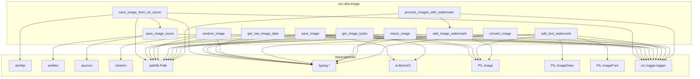

### **Системные инструкции для обработки кода проекта `hypotez`**

=========================================================================================

Описание функциональности и правил для генерации, анализа и улучшения кода. Направлено на обеспечение последовательного и читаемого стиля кодирования, соответствующего требованиям.

---

### **Основные принципы**

#### **1. Общие указания**:
- Соблюдай четкий и понятный стиль кодирования.
- Все изменения должны быть обоснованы и соответствовать установленным требованиям.

#### **2. Комментарии**:
- Используй `#` для внутренних комментариев.
- Документация всех функций, методов и классов должна следовать такому формату: 
    ```python
        def function(param: str, param1: Optional[str | dict | str] = None) -> dict | None:
            """ 
            Args:
                param (str): Описание параметра `param`.
                param1 (Optional[str | dict | str], optional): Описание параметра `param1`. По умолчанию `None`.
    
            Returns:
                dict | None: Описание возвращаемого значения. Возвращает словарь или `None`.
    
            Raises:
                SomeError: Описание ситуации, в которой возникает исключение `SomeError`.

            Ехаmple:
                >>> function('param', 'param1')
                {'param': 'param1'}
            """
    ```
- Комментарии и документация должны быть четкими, лаконичными и точными.

#### **3. Форматирование кода**:
- Используй одинарные кавычки. `a:str = 'value'`, `print('Hello World!')`;
- Добавляй пробелы вокруг операторов. Например, `x = 5`;
- Все параметры должны быть аннотированы типами. `def function(param: str, param1: Optional[str | dict | str] = None) -> dict | None:`;
- Не используй `Union`. Вместо этого используй `|`.

#### **4. Логирование**:
- Для логгирования Всегда Используй модуль `logger` из `src.logger.logger`.
- Ошибки должны логироваться с использованием `logger.error`.
Пример:
    ```python
        try:
            ...
        except Exception as ex:
            logger.error('Error while processing data', ех, exc_info=True)
    ```
#### **5 Не используй `Union[]` в коде. Вместо него используй `|`
Например:
```python
x: str | int ...
```


---

### **Основные требования**:

#### **1. Формат ответов в Markdown**:
- Все ответы должны быть выполнены в формате **Markdown**.

#### **2. Формат комментариев**:
- Используй указанный стиль для комментариев и документации в коде.
- Пример:

```python
from typing import Generator, Optional, List
from pathlib import Path


def read_text_file(
    file_path: str | Path,
    as_list: bool = False,
    extensions: Optional[List[str]] = None,
    chunk_size: int = 8192,
) -> Generator[str, None, None] | str | None:
    """
    Считывает содержимое файла (или файлов из каталога) с использованием генератора для экономии памяти.

    Args:
        file_path (str | Path): Путь к файлу или каталогу.
        as_list (bool): Если `True`, возвращает генератор строк.
        extensions (Optional[List[str]]): Список расширений файлов для чтения из каталога.
        chunk_size (int): Размер чанков для чтения файла в байтах.

    Returns:
        Generator[str, None, None] | str | None: Генератор строк, объединенная строка или `None` в случае ошибки.

    Raises:
        Exception: Если возникает ошибка при чтении файла.

    Example:
        >>> from pathlib import Path
        >>> file_path = Path('example.txt')
        >>> content = read_text_file(file_path)
        >>> if content:
        ...    print(f'File content: {content[:100]}...')
        File content: Example text...
    """
    ...
```
- Всегда делай подробные объяснения в комментариях. Избегай расплывчатых терминов, 
- таких как *«получить»* или *«делать»*
-  . Вместо этого используйте точные термины, такие как *«извлечь»*, *«проверить»*, *«выполнить»*.
- Вместо: *«получаем»*, *«возвращаем»*, *«преобразовываем»* используй имя объекта *«функция получае»*, *«переменная возвращает»*, *«код преобразовывает»* 
- Комментарии должны непосредственно предшествовать описываемому блоку кода и объяснять его назначение.

#### **3. Пробелы вокруг операторов присваивания**:
- Всегда добавляйте пробелы вокруг оператора `=`, чтобы повысить читаемость.
- Примеры:
  - **Неправильно**: `x=5`
  - **Правильно**: `x = 5`

#### **4. Использование `j_loads` или `j_loads_ns`**:
- Для чтения JSON или конфигурационных файлов замените стандартное использование `open` и `json.load` на `j_loads` или `j_loads_ns`.
- Пример:

```python
# Неправильно:
with open('config.json', 'r', encoding='utf-8') as f:
    data = json.load(f)

# Правильно:
data = j_loads('config.json')
```

#### **5. Сохранение комментариев**:
- Все существующие комментарии, начинающиеся с `#`, должны быть сохранены без изменений в разделе «Улучшенный код».
- Если комментарий кажется устаревшим или неясным, не изменяйте его. Вместо этого отметьте его в разделе «Изменения».

#### **6. Обработка `...` в коде**:
- Оставляйте `...` как указатели в коде без изменений.
- Не документируйте строки с `...`.
```

#### **7. Аннотации**
Для всех переменных должны быть определены аннотации типа. 
Для всех функций все входные и выходные параметры аннотириваны
Для все параметров должны быть аннотации типа.


### **8. webdriver**
В коде используется webdriver. Он импртируется из модуля `webdriver` проекта `hypotez`
```python
from src.webdirver import Driver, Chrome, Firefox, Playwright, ...
driver = Driver(Firefox)

Пoсле чего может использоваться как

close_banner = {
  "attribute": null,
  "by": "XPATH",
  "selector": "//button[@id = 'closeXButton']",
  "if_list": "first",
  "use_mouse": false,
  "mandatory": false,
  "timeout": 0,
  "timeout_for_event": "presence_of_element_located",
  "event": "click()",
  "locator_description": "Закрываю pop-up окно, если оно не появилось - не страшно (`mandatory`:`false`)"
}

result = driver.execute_locator(close_banner)
```

## Анализ кода `hypotez/src/utils/image.py`

### 1. Блок-схема

```mermaid
graph TD
    A[Начало] --> B{Функция: save_image_from_url_async};
    B --> C{Загрузка изображения из URL};
    C -- Успешно --> D{Функция: save_image_async};
    C -- Ошибка --> E[Логирование ошибки];
    D --> F{Сохранение изображения асинхронно};
    F -- Успешно --> G[Возврат пути к файлу];
    F -- Ошибка --> H[Логирование ошибки];
    A --> I{Функция: save_image};
    I --> J{Сохранение изображения синхронно};
    J -- Успешно --> K[Возврат пути к файлу];
    J -- Ошибка --> L[Логирование ошибки];
    A --> M{Функция: get_image_bytes};
    M --> N{Чтение изображения и возврат байтов};
    N -- Успешно --> O[Возврат байтов изображения];
    N -- Ошибка --> P[Логирование ошибки];
    A --> Q{Функция: get_raw_image_data};
    Q --> R{Чтение raw-данных из файла};
    R -- Успешно --> S[Возврат raw-данных];
    R -- Ошибка --> T[Логирование ошибки];
    A --> U{Функция: random_image};
    U --> V{Поиск случайного изображения в директории};
    V -- Найдено --> W[Возврат пути к случайному изображению];
    V -- Не найдено --> X[Логирование предупреждения];
    A --> Y{Функция: add_text_watermark};
    Y --> Z{Добавление текстового водяного знака};
    Z -- Успешно --> AA[Возврат пути к изображению с водяным знаком];
    Z -- Ошибка --> BB[Логирование ошибки];
    A --> CC{Функция: add_image_watermark};
    CC --> DD{Добавление графического водяного знака};
    DD -- Успешно --> EE[Возврат пути к изображению с водяным знаком];
    DD -- Ошибка --> FF[Логирование ошибки];
    A --> GG{Функция: resize_image};
    GG --> HH{Изменение размера изображения};
    HH -- Успешно --> II[Возврат пути к измененному изображению];
    HH -- Ошибка --> JJ[Логирование ошибки];
    A --> KK{Функция: convert_image};
    KK --> LL{Конвертация изображения в другой формат};
    LL -- Успешно --> MM[Возврат пути к сконвертированному изображению];
    LL -- Ошибка --> NN[Логирование ошибки];
    A --> OO{Функция: process_images_with_watermark};
    OO --> PP{Обработка всех изображений в папке с добавлением водяного знака};
    PP --> QQ[Сохранение в "output" директорию];
    QQ --> RR[Конец];
    E --> RR;
    H --> RR;
    L --> RR;
    P --> RR;
    T --> RR;
    X --> RR;
    BB --> RR;
    FF --> RR;
    JJ --> RR;
    NN --> RR;
```

### 2. Диаграмма


```mermaid
graph TD
    subgraph src.utils.image
        A[save_image_from_url_async] --> B(save_image_async);
        C[save_image]
        D[get_image_bytes]
        E[get_raw_image_data]
        F[random_image]
        G[add_text_watermark]
        H[add_image_watermark]
        I[resize_image]
        J[convert_image]
        K[process_images_with_watermark] --> H
    end

    subgraph dependencies
        L[aiohttp]
        M[aiofiles]
        N[asyncio]
        O[random]
        P[pathlib.Path]
        Q[typing.*]
        R[io.BytesIO]
        S[PIL.Image]
        T[PIL.ImageDraw]
        U[PIL.ImageFont]
        V[src.logger.logger]
    end
    A --> L
    B --> M
    B --> N
    F --> O
    A --> P
    C --> P
    D --> P
    E --> P
    F --> P
    G --> P
    H --> P
    I --> P
    J --> P
    K --> P
    A --> Q
    C --> Q
    D --> Q
    E --> Q
    F --> Q
    G --> Q
    H --> Q
    I --> Q
    J --> Q
    C --> R
    D --> R
    C --> S
    D --> S
    G --> S
    H --> S
    G --> T
    G --> U
    A --> V
    B --> V
    C --> V
    D --> V
    E --> V
    F --> V
    G --> V
    H --> V
    I --> V
    J --> V
    K --> V
```

**Объяснение зависимостей:**

*   `aiohttp`: Используется в `save_image_from_url_async` для асинхронной загрузки изображений из сети.
*   `aiofiles`: Применяется в `save_image_async` для асинхронной записи данных в файл.
*   `asyncio`: Необходим для поддержки асинхронных операций, таких как скачивание и сохранение изображений.
*   `random`: Используется в функции `random_image` для случайного выбора изображения из списка.
*   `pathlib.Path`: Применяется для удобной работы с путями к файлам и директориям.
*   `typing.*`: Используется для аннотации типов, что улучшает читаемость и поддержку кода.
*   `io.BytesIO`: Используется для работы с данными изображения в памяти, без необходимости сохранения во временный файл.
*   `PIL.Image`: Основной модуль из библиотеки Pillow для работы с изображениями (открытие, сохранение, изменение размера, конвертация).
*   `PIL.ImageDraw`: Используется для добавления графических элементов (например, водяных знаков) на изображение.
*   `PIL.ImageFont`: Применяется для работы со шрифтами при добавлении текстовых водяных знаков.
*   `src.logger.logger`: Используется для логирования ошибок и предупреждений.

### 3. Объяснение

**Импорты:**

*   `aiohttp`: Асинхронная HTTP-клиентская/серверная библиотека. Используется для асинхронной загрузки изображений из URL.
*   `aiofiles`: Асинхронная библиотека для работы с файлами. Используется для асинхронного сохранения изображений на диск.
*   `asyncio`: Библиотека для написания конкурентного кода с использованием синтаксиса async/await.
*   `random`: Модуль для генерации случайных чисел. Используется для выбора случайного изображения из списка.
*   `pathlib.Path`: Модуль для представления путей к файлам и директориям в виде объектов.
*   `typing`: Модуль для аннотации типов, что помогает в статической проверке типов и улучшает читаемость кода.
*   `io.BytesIO`: Класс для работы с байтами в памяти как с файлом. Используется для обработки изображений без сохранения на диск.
*   `PIL (Pillow)`: Библиотека для работы с изображениями. Используется для открытия, сохранения, изменения размера, конвертации и добавления водяных знаков.
*   `src.logger.logger`: Кастомный модуль для логирования событий в приложении.

**Классы:**

*   `ImageError(Exception)`: Пользовательское исключение для ошибок, связанных с обработкой изображений.

**Функции:**

*   `save_image_from_url_async(image_url: str, filename: Union[str, Path]) -> Optional[str]`:
    *   **Аргументы:**
        *   `image_url` (str): URL изображения для скачивания.
        *   `filename` (Union[str, Path]): Имя файла для сохранения изображения.
    *   **Возвращаемое значение:**
        *   `Optional[str]`: Путь к сохраненному файлу или `None` в случае неудачи.
    *   **Назначение:** Асинхронно скачивает изображение из URL и сохраняет его локально.
    *   **Пример:**
        ```python
        image_path = await save_image_from_url_async("https://example.com/image.jpg", "image.png")
        if image_path:
            print(f"Изображение сохранено: {image_path}")
        ```
*   `save_image(image_data: bytes, file_name: str | Path, format: str = 'PNG') -> Optional[str]`:
    *   **Аргументы:**
        *   `image_data` (bytes): Бинарные данные изображения.
        *   `file_name` (Union[str, Path]): Имя файла для сохранения изображения.
        *   `format` (str): Формат изображения (по умолчанию 'PNG').
    *   **Возвращаемое значение:**
        *   `Optional[str]`: Путь к сохраненному файлу или `None` в случае неудачи.
    *   **Назначение:** Сохраняет бинарные данные изображения в файл.
    *   **Пример:**
        ```python
        image_path = save_image(image_data, "image.png")
        if image_path:
            print(f"Изображение сохранено: {image_path}")
        ```

*   `save_image_async(image_data: bytes, file_name: str | Path, format: str = 'PNG') -> Optional[str]`:
    *   **Аргументы:**
        *   `image_data` (bytes): Бинарные данные изображения.
        *   `file_name` (Union[str, Path]): Имя файла для сохранения изображения.
        *   `format` (str): Формат изображения (по умолчанию 'PNG').
    *   **Возвращаемое значение:**
        *   `Optional[str]`: Путь к сохраненному файлу или `None` в случае неудачи.
    *   **Назначение:** Асинхронно сохраняет бинарные данные изображения в файл.
    *   **Пример:**
        ```python
        image_path = await save_image_async(image_data, "image.png")
        if image_path:
            print(f"Изображение сохранено: {image_path}")
        ```

*   `get_image_bytes(image_path: Path, raw: bool = True) -> Optional[BytesIO | bytes]`:
    *   **Аргументы:**
        *   `image_path` (Path): Путь к файлу изображения.
        *   `raw` (bool): Если `True`, возвращает объект `BytesIO`, иначе возвращает `bytes`.
    *   **Возвращаемое значение:**
        *   `Optional[BytesIO | bytes]`: Байты изображения в формате JPEG или `None` в случае ошибки.
    *   **Назначение:** Читает изображение с использованием Pillow и возвращает его байты в формате JPEG.
    *   **Пример:**
        ```python
        image_bytes = get_image_bytes(Path("image.png"))
        if image_bytes:
            print(f"Байты изображения: {image_bytes[:100]}...")
        ```

*   `get_raw_image_data(file_name: Union[str, Path]) -> Optional[bytes]`:
    *   **Аргументы:**
        *   `file_name` (Union[str, Path]): Имя файла для чтения.
    *   **Возвращаемое значение:**
        *   `Optional[bytes]`: Бинарные данные файла или `None`, если файл не существует или произошла ошибка.
    *   **Назначение:** Возвращает бинарные данные файла.
    *   **Пример:**
        ```python
        raw_data = get_raw_image_data("image.png")
        if raw_data:
            print(f"Raw data: {raw_data[:100]}...")
        ```

*   `random_image(root_path: Union[str, Path]) -> Optional[str]`:
    *   **Аргументы:**
        *   `root_path` (Union[str, Path]): Директория для поиска изображений.
    *   **Возвращаемое значение:**
        *   `Optional[str]`: Путь к случайному изображению или `None`, если изображения не найдены.
    *   **Назначение:** Рекурсивно ищет случайное изображение в указанной директории.
    *   **Пример:**
        ```python
        random_image_path = random_image("images")
        if random_image_path:
            print(f"Случайное изображение: {random_image_path}")
        ```

*   `add_text_watermark(image_path: str | Path, watermark_text: str, output_path: Optional[str | Path] = None) -> Optional[str]`:
    *   **Аргументы:**
        *   `image_path` (Union[str, Path]): Путь к изображению.
        *   `watermark_text` (str): Текст водяного знака.
        *   `output_path` (Optional[Union[str, Path]]): Путь для сохранения изображения с водяным знаком.
    *   **Возвращаемое значение:**
        *   `Optional[str]`: Путь к изображению с водяным знаком или `None` в случае ошибки.
    *   **Назначение:** Добавляет текстовый водяной знак к изображению.
    *   **Пример:**
        ```python
        watermarked_image_path = add_text_watermark("image.png", "Watermark", "watermarked_image.png")
        if watermarked_image_path:
            print(f"Изображение с водяным знаком: {watermarked_image_path}")
        ```

*   `add_image_watermark(input_image_path: Path, watermark_image_path: Path, output_image_path: Optional[Path] = None) -> Optional[Path]`:
    *   **Аргументы:**
        *   `input_image_path` (Path): Путь к основному изображению.
        *   `watermark_image_path` (Path): Путь к изображению водяного знака.
        *   `output_image_path` (Optional[Path]): Путь для сохранения изображения с водяным знаком.
    *   **Возвращаемое значение:**
        *   `Optional[Path]`: Путь к изображению с водяным знаком или `None` в случае ошибки.
    *   **Назначение:** Добавляет графический водяной знак к изображению.
    *   **Пример:**
        ```python
        watermarked_image_path = add_image_watermark(Path("image.png"), Path("watermark.png"), Path("watermarked_image.png"))
        if watermarked_image_path:
            print(f"Изображение с водяным знаком: {watermarked_image_path}")
        ```

*   `resize_image(image_path: Union[str, Path], size: Tuple[int, int], output_path: Optional[Union[str, Path]] = None) -> Optional[str]`:
    *   **Аргументы:**
        *   `image_path` (Union[str, Path]): Путь к изображению.
        *   `size` (Tuple[int, int]): Новый размер изображения (ширина, высота).
        *   `output_path` (Optional[Union[str, Path]]): Путь для сохранения измененного изображения.
    *   **Возвращаемое значение:**
        *   `Optional[str]`: Путь к измененному изображению или `None` в случае ошибки.
    *   **Назначение:** Изменяет размер изображения.
    *   **Пример:**
        ```python
        resized_image_path = resize_image("image.png", (800, 600), "resized_image.png")
        if resized_image_path:
            print(f"Измененное изображение: {resized_image_path}")
        ```

*   `convert_image(image_path: Union[str, Path], format: str, output_path: Optional[Union[str, Path]] = None) -> Optional[str]`:
    *   **Аргументы:**
        *   `image_path` (Union[str, Path]): Путь к изображению.
        *   `format` (str): Формат для конвертации (например, "JPEG", "PNG").
        *   `output_path` (Optional[Union[str, Path]]): Путь для сохранения конвертированного изображения.
    *   **Возвращаемое значение:**
        *   `Optional[str]`: Путь к конвертированному изображению или `None` в случае ошибки.
    *   **Назначение:** Конвертирует изображение в указанный формат.
    *   **Пример:**
        ```python
        converted_image_path = convert_image("image.png", "JPEG", "converted_image.jpg")
        if converted_image_path:
            print(f"Конвертированное изображение: {converted_image_path}")
        ```

*   `process_images_with_watermark(folder_path: Path, watermark_path: Path) -> None`:
    *   **Аргументы:**
        *   `folder_path` (Path): Путь к папке с изображениями.
        *   `watermark_path` (Path): Путь к изображению водяного знака.
    *   **Возвращаемое значение:**
        *   `None`
    *   **Назначение:** Обрабатывает все изображения в указанной папке, добавляя водяной знак и сохраняя их в подпапке "output".
    *   **Пример:**
        ```python
        process_images_with_watermark(Path("images"), Path("watermark.png"))
        ```

**Переменные:**

*   В основном используются для хранения путей к файлам, данных изображений и настроек.

**Потенциальные ошибки и области для улучшения:**

*   Обработка исключений: В некоторых функциях исключения логируются, но не обрабатываются.  Рекомендуется добавить `raise ImageError from ex` после логирования, чтобы вызывающий код мог обработать ошибку.  Однако, эта рекомендация закомментирована в текущем коде.
*   Асинхронность: Функция `save_image_async` содержит закомментированный код, который использует `BytesIO` и Pillow. Следует решить, какую версию функции использовать, и удалить ненужный код.
*   Водяные знаки: Размеры водяных знаков задаются константами.  Можно добавить параметры для настройки размера и положения водяного знака.

**Взаимосвязи с другими частями проекта:**

*   `src.logger.logger`: Используется для логирования ошибок и предупреждений во всех функциях. Это позволяет централизованно собирать информацию о работе модуля.
*   Этот модуль может быть использован другими частями проекта, которым требуется обработка изображений, например, для создания превью, добавления водяных знаков или конвертации форматов.