### **Системные инструкции для обработки кода проекта `hypotez`**

=========================================================================================

Описание функциональности и правил для генерации, анализа и улучшения кода. Направлено на обеспечение последовательного и читаемого стиля кодирования, соответствующего требованиям.

---

### **Основные принципы**

#### **1. Общие указания**:
- Соблюдай четкий и понятный стиль кодирования.
- Все изменения должны быть обоснованы и соответствовать установленным требованиям.

#### **2. Комментарии**:
- Используй `#` для внутренних комментариев.
- Документация всех функций, методов и классов должна следовать такому формату: 
    ```python
        def function(param: str, param1: Optional[str | dict | str] = None) -> dict | None:
            """ 
            Args:
                param (str): Описание параметра `param`.
                param1 (Optional[str | dict | str], optional): Описание параметра `param1`. По умолчанию `None`.
    
            Returns:
                dict | None: Описание возващаемого значения. Возвращает словарь или `None`.
    
            Raises:
                SomeError: Описание ситуации, в которой возникает исключение `SomeError`.

            Ехаmple:
                >>> function('param', 'param1')
                {'param': 'param1'}
            """
    ```
- Комментарии и документация должны быть четкими, лаконичными и точными.

#### **3. Форматирование кода**:
- Используй одинарные кавычки. `a:str = 'value'`, `print('Hello World!')`;
- Добавляй пробелы вокруг операторов. Например, `x = 5`;
- Все параметры должны быть аннотированы типами. `def function(param: str, param1: Optional[str | dict | str] = None) -> dict | None:`;
- Не используй `Union`. Вместо этого используй `|`.

#### **4. Логирование**:
- Для логгирования Всегда Используй модуль `logger` из `src.logger.logger`.
- Ошибки должны логироваться с использованием `logger.error`.
Пример:
    ```python
        try:
            ...
        except Exception as ex:
            logger.error('Error while processing data', ех, exc_info=True)
    ```
#### **5 Не используй `Union[]` в коде. Вместо него используй `|`
Например:
```python
x: str | int ...
```


---

### **Основные требования**:

#### **1. Формат ответов в Markdown**:
- Все ответы должны быть выполнены в формате **Markdown**.

#### **2. Формат комментариев**:
- Используй указанный стиль для комментариев и документации в коде.
- Пример:

```python
from typing import Generator, Optional, List
from pathlib import Path


def read_text_file(
    file_path: str | Path,
    as_list: bool = False,
    extensions: Optional[List[str]] = None,
    chunk_size: int = 8192,
) -> Generator[str, None, None] | str | None:
    """
    Считывает содержимое файла (или файлов из каталога) с использованием генератора для экономии памяти.

    Args:
        file_path (str | Path): Путь к файлу или каталогу.
        as_list (bool): Если `True`, возвращает генератор строк.
        extensions (Optional[List[str]]): Список расширений файлов для чтения из каталога.
        chunk_size (int): Размер чанков для чтения файла в байтах.

    Returns:
        Generator[str, None, None] | str | None: Генератор строк, объединенная строка или `None` в случае ошибки.

    Raises:
        Exception: Если возникает ошибка при чтении файла.

    Example:
        >>> from pathlib import Path
        >>> file_path = Path('example.txt')
        >>> content = read_text_file(file_path)
        >>> if content:
        ...    print(f'File content: {content[:100]}...')
        File content: Example text...
    """
    ...
```
- Всегда делай подробные объяснения в комментариях. Избегай расплывчатых терминов, 
- таких как *«получить»* или *«делать»*. Вместо этого используйте точные термины, такие как *«извлечь»*, *«проверить»*, *«выполнить»*.
- Вместо: *«получаем»*, *«возвращаем»*, *«преобразовываем»* используй имя объекта *«функция получае»*, *«переменная возвращает»*, *«код преобразовывает»* 
- Комментарии должны непосредственно предшествовать описываемому блоку кода и объяснять его назначение.

#### **3. Пробелы вокруг операторов присваивания**:
- Всегда добавляйте пробелы вокруг оператора `=`, чтобы повысить читаемость.
- Примеры:
  - **Неправильно**: `x=5`
  - **Правильно**: `x = 5`

#### **4. Использование `j_loads` или `j_loads_ns`**:
- Для чтения JSON или конфигурационных файлов замените стандартное использование `open` и `json.load` на `j_loads` или `j_loads_ns`.
- Пример:

```python
# Неправильно:
with open('config.json', 'r', encoding='utf-8') as f:
    data = json.load(f)

# Правильно:
data = j_loads('config.json')
```

#### **5. Сохранение комментариев**:
- Все существующие комментарии, начинающиеся с `#`, должны быть сохранены без изменений в разделе «Улучшенный код».
- Если комментарий кажется устаревшим или неясным, не изменяйте его. Вместо этого отметьте его в разделе «Изменения».

#### **6. Обработка `...` в коде**:
- Оставляйте `...` как указатели в коде без изменений.
- Не документируйте строки с `...`.
```

#### **7. Аннотации**
Для всех переменных должны быть определены аннотации типа. 
Для всех функций все входные и выходные параметры аннотириваны
Для все параметров должны быть аннотации типа.


### **8. webdriver**
В коде используется webdriver. Он импртируется из модуля `webdriver` проекта `hypotez`
```python
from src.webdirver import Driver, Chrome, Firefox, Playwright, ...
driver = Driver(Firefox)

Пoсле чего может использоваться как

close_banner = {
  "attribute": null,
  "by": "XPATH",
  "selector": "//button[@id = 'closeXButton']",
  "if_list": "first",
  "use_mouse": false,
  "mandatory": false,
  "timeout": 0,
  "timeout_for_event": "presence_of_element_located",
  "event": "click()",
  "locator_description": "Закрываю pop-up окно, если оно не появилось - не страшно (`mandatory`:`false`)"
}

result = driver.execute_locator(close_banner)
```

## Анализ кода `hypotez/src/utils/jjson.py`

### 1. Блок-схема

```mermaid
graph LR
    A[Начало: j_dumps или j_loads/j_loads_ns] --> B{Определение типа входных данных}
    B --> C{Обработка в зависимости от типа данных}
    C -- dict, SimpleNamespace, list --> D[Преобразование SimpleNamespace в dict]
    C -- str --> E[Попытка исправить JSON строку]
    C -- Path --> F{Определение типа файла}
    F -- Директория --> G[Рекурсивный вызов j_loads для каждого файла JSON]
    F -- Файл JSON --> H[Чтение текста из файла]
    E --> H
    D --> H
    H --> I{Обработка существующих данных (для j_dumps в режиме append)}
    I -- Существуют данные --> J[Слияние новых данных с существующими]
    I -- Нет данных --> K[Запись данных в файл (для j_dumps) или возврат данных]
    J --> K
    K --> L[Конец]
```

### 2. Диаграмма

```mermaid
graph TD
    A[<code>jjson.py</code>] --> B[import json]
    A --> C[import os]
    A --> D[import re]
    A --> E[import codecs]
    A --> F[import datetime from datetime]
    A --> G[import Path from pathlib]
    A --> H[import Any, Dict, List, Optional, Union from typing]
    A --> I[import SimpleNamespace from types]
    A --> J[import OrderedDict from collections]
    A --> K[import logger from src.logger.logger]
    A --> L[import dict2ns from .convertors.dict]

    B --> |JSON operations| A
    C --> |OS-related functions| A
    D --> |Regular expression operations| A
    E --> |Encoding and decoding operations| A
    F --> |Date and time operations| A
    G --> |Path manipulation| A
    H --> |Type hinting| A
    I --> |Namespace management| A
    J --> |Ordered dictionary| A
    K --> |Logging operations| A
    L --> |dict to namespace converter| A
```



**Объяснение зависимостей:**

-   `json`: Используется для кодирования и декодирования данных JSON.
-   `os`:  Предоставляет функции для взаимодействия с операционной системой (например, для работы с путями).
-   `re`: Модуль для работы с регулярными выражениями, может использоваться для обработки строк.
-   `codecs`:  Используется для кодирования и декодирования текста, особенно для работы с различными кодировками.
-   `datetime`:  Предоставляет классы для работы с датой и временем.
-   `pathlib`:  Предоставляет способ представления путей файловой системы в виде объектов.
-   `typing`:  Используется для аннотации типов, что улучшает читаемость и помогает в отладке.
-   `types`:  Содержит определения встроенных типов, включая `SimpleNamespace`.
-   `collections`:  Предоставляет специализированные типы контейнеров, такие как `OrderedDict`.
-   `src.logger.logger`:  Модуль для логирования, позволяющий записывать информацию о работе программы в файл или другое хранилище.
-   `.convertors.dict`:  Модуль, содержащий функцию `dict2ns`, которая преобразует словарь в объект `SimpleNamespace`.

### 3. Объяснение

**Импорты:**

-   `json`: Используется для работы с JSON-данными, включая кодирование Python-объектов в JSON-строки и декодирование JSON-строк в Python-объекты.
-   `os`: Предоставляет функции для взаимодействия с операционной системой, такие как работа с файловой системой и переменными окружения.
-   `re`: Используется для работы с регулярными выражениями, например, для поиска и замены текста в строках.
-   `codecs`: Предоставляет инструменты для кодирования и декодирования данных, например, для работы с различными кодировками символов.
-   `datetime`: Предоставляет классы для работы с датами и временем.
-   `pathlib`: Модуль для работы с путями файловой системы в объектно-ориентированном стиле.
-   `typing`: Модуль для аннотации типов, используется для указания типов переменных, аргументов функций и возвращаемых значений.
-   `types.SimpleNamespace`: Класс, позволяющий создавать объекты с атрибутами, доступными по имени.
-   `collections.OrderedDict`:  Класс, представляющий собой словарь, в котором ключи сохраняют порядок добавления.
-   `src.logger.logger`:  Пользовательский модуль логирования, используемый для записи информации о работе программы.
-   `.convertors.dict.dict2ns`:  Функция для преобразования словаря в объект `SimpleNamespace`.

**Классы:**

-   `Config`:
    -   Атрибуты:
        -   `MODE_WRITE`: Режим записи файла (`"w"`).
        -   `MODE_APPEND_START`: Режим добавления в начало файла (`"a+"`).
        -   `MODE_APPEND_END`: Режим добавления в конец файла (`"+a"`).
    -   Роль: Класс `Config` содержит константы, определяющие режимы записи файлов.

**Функции:**

-   `_convert_to_dict(value: Any) -> Any`:
    -   Аргументы:
        -   `value`: Значение любого типа.
    -   Возвращаемое значение: Значение, преобразованное в словарь, если это возможно.
    -   Назначение: Рекурсивно преобразует объекты `SimpleNamespace` и списки в словари.
    -   Пример:

    ```python
    from types import SimpleNamespace

    data = SimpleNamespace(a=1, b=SimpleNamespace(c=2, d=[3, 4]))
    result = _convert_to_dict(data)
    print(result)  # Вывод: {'a': 1, 'b': {'c': 2, 'd': [3, 4]}}
    ```

-   `_read_existing_data(path: Path, exc_info: bool = True) -> dict`:

    -   Аргументы:
        -   `path`: Путь к файлу.
        -   `exc_info`:  Флаг, определяющий, нужно ли логировать информацию об исключениях.
    -   Возвращаемое значение: Словарь, содержащий данные из файла, или пустой словарь в случае ошибки.
    -   Назначение: Читает существующие JSON-данные из файла.

-   `_merge_data(data: Dict, existing_data: Dict, mode: str) -> Dict`:

    -   Аргументы:
        -   `data`: Новые данные для записи.
        -   `existing_data`: Существующие данные.
        -   `mode`: Режим слияния данных.
    -   Возвращаемое значение: Словарь, содержащий объединенные данные.
    -   Назначение: Объединяет новые данные с существующими в зависимости от режима.

-   `j_dumps(data: Union[Dict, SimpleNamespace, List[Dict], List[SimpleNamespace]], file_path: Optional[Path] = None, ensure_ascii: bool = False, mode: str = Config.MODE_WRITE, exc_info: bool = True) -> Optional[Dict]`:

    -   Аргументы:
        -   `data`: Данные для записи (словарь, `SimpleNamespace` или список словарей/`SimpleNamespace`).
        -   `file_path`: Путь к файлу (опционально).
        -   `ensure_ascii`:  Флаг, определяющий, нужно ли экранировать не-ASCII символы.
        -   `mode`: Режим записи файла.
        -   `exc_info`:  Флаг, определяющий, нужно ли логировать информацию об исключениях.
    -   Возвращаемое значение: Словарь, содержащий записанные данные, или `None` в случае ошибки.
    -   Назначение: Записывает JSON-данные в файл или возвращает их в виде словаря.

-   `_decode_strings(data: Any) -> Any`:

    -   Аргументы:
        -   `data`: Данные для декодирования.
    -   Возвращаемое значение: Декодированные данные.
    -   Назначение: Рекурсивно декодирует строки в структуре данных.

-   `_string_to_dict(json_string: str) -> dict`:

    -   Аргументы:
        -   `json_string`: JSON-строка.
    -   Возвращаемое значение: Словарь, полученный из JSON-строки.
    -   Назначение: Преобразует JSON-строку в словарь.

-   `j_loads(jjson: Union[dict, SimpleNamespace, str, Path, list], ordered: bool = True) -> Union[dict, list]`:

    -   Аргументы:
        -   `jjson`: Путь к файлу/директории, JSON-строка или JSON-объект.
        -   `ordered`: Флаг, определяющий, нужно ли использовать `OrderedDict`.
    -   Возвращаемое значение: Обработанные данные (словарь или список словарей).
    -   Назначение: Загружает JSON-данные из файла, директории, строки или объекта.

-   `j_loads_ns(jjson: Union[Path, SimpleNamespace, Dict, str], ordered: bool = True) -> Union[SimpleNamespace, List[SimpleNamespace], Dict]`:

    -   Аргументы:
        -   `jjson`: Путь к файлу, `SimpleNamespace`, словарь или строка.
        -   `ordered`: Флаг, определяющий, нужно ли использовать `OrderedDict`.
    -   Возвращаемое значение: `SimpleNamespace`, список `SimpleNamespace` или словарь.
    -   Назначение: Загружает JSON-данные и преобразует их в `SimpleNamespace`.

**Переменные:**

-   `Config.MODE_WRITE`, `Config.MODE_APPEND_START`, `Config.MODE_APPEND_END`: Константы, определяющие режимы записи файлов.

**Потенциальные ошибки и области для улучшения:**

-   Обработка исключений:  В некоторых функциях обработка исключений может быть улучшена, например, добавление более конкретных типов исключений.
-   Поддержка CSV: Закомментированный код для обработки CSV-файлов может быть восстановлен и улучшен.
-   Документация:  Добавить doctest примеры во все функции.

**Взаимосвязи с другими частями проекта:**

-   `src.logger.logger`: Используется для логирования ошибок и других событий.
-   `.convertors.dict.dict2ns`: Используется для преобразования словарей в объекты `SimpleNamespace`.