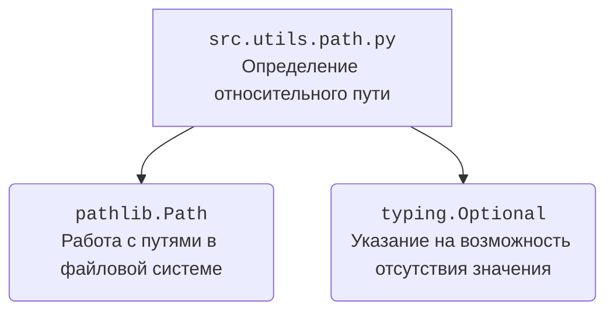

### **Системные инструкции для обработки кода проекта `hypotez`**

=========================================================================================

Описание функциональности и правил для генерации, анализа и улучшения кода. Направлено на обеспечение последовательного и читаемого стиля кодирования, соответствующего требованиям.

---

### **Основные принципы**

#### **1. Общие указания**:
- Соблюдай четкий и понятный стиль кодирования.
- Все изменения должны быть обоснованы и соответствовать установленным требованиям.

#### **2. Комментарии**:
- Используй `#` для внутренних комментариев.
- Документация всех функций, методов и классов должна следовать такому формату: 
    ```python
        def function(param: str, param1: Optional[str | dict | str] = None) -> dict | None:
            """ 
            Args:
                param (str): Описание параметра `param`.
                param1 (Optional[str | dict | str], optional): Описание параметра `param1`. По умолчанию `None`.
    
            Returns:
                dict | None: Описание возвращаемого значения. Возвращает словарь или `None`.
    
            Raises:
                SomeError: Описание ситуации, в которой возникает исключение `SomeError`.

            Ехаmple:
                >>> function('param', 'param1')
                {'param': 'param1'}
            """
    ```
- Комментарии и документация должны быть четкими, лаконичными и точными.

#### **3. Форматирование кода**:
- Используй одинарные кавычки. `a:str = 'value'`, `print('Hello World!')`;
- Добавляй пробелы вокруг операторов. Например, `x = 5`;
- Все параметры должны быть аннотированы типами. `def function(param: str, param1: Optional[str | dict | str] = None) -> dict | None:`;
- Не используй `Union`. Вместо этого используй `|`.

#### **4. Логирование**:
- Для логгирования Всегда Используй модуль `logger` из `src.logger.logger`.
- Ошибки должны логироваться с использованием `logger.error`.
Пример:
    ```python
        try:
            ...
        except Exception as ex:
            logger.error('Error while processing data', ех, exc_info=True)
    ```
#### **5 Не используй `Union[]` в коде. Вместо него используй `|`
Например:
```python
x: str | int ...
```


---

### **Основные требования**:

#### **1. Формат ответов в Markdown**:
- Все ответы должны быть выполнены в формате **Markdown**.

#### **2. Формат комментариев**:
- Используй указанный стиль для комментариев и документации в коде.
- Пример:

```python
from typing import Generator, Optional, List
from pathlib import Path


def read_text_file(
    file_path: str | Path,
    as_list: bool = False,
    extensions: Optional[List[str]] = None,
    chunk_size: int = 8192,
) -> Generator[str, None, None] | str | None:
    """
    Считывает содержимое файла (или файлов из каталога) с использованием генератора для экономии памяти.

    Args:
        file_path (str | Path): Путь к файлу или каталогу.
        as_list (bool): Если `True`, возвращает генератор строк.
        extensions (Optional[List[str]]): Список расширений файлов для чтения из каталога.
        chunk_size (int): Размер чанков для чтения файла в байтах.

    Returns:
        Generator[str, None, None] | str | None: Генератор строк, объединенная строка или `None` в случае ошибки.

    Raises:
        Exception: Если возникает ошибка при чтении файла.

    Example:
        >>> from pathlib import Path
        >>> file_path = Path('example.txt')
        >>> content = read_text_file(file_path)
        >>> if content:
        ...    print(f'File content: {content[:100]}...')
        File content: Example text...
    """
    ...
```
- Всегда делай подробные объяснения в комментариях. Избегай расплывчатых терминов, 
- таких как *«получить»* или *«делать»*. Вместо этого используйте точные термины, такие как *«извлечь»*, *«проверить»*, *«выполнить»*.
- Вместо: *«получаем»*, *«возвращаем»*, *«преобразовываем»* используй имя объекта *«функция получае»*, *«переменная возвращает»*, *«код преобразовывает»* 
- Комментарии должны непосредственно предшествовать описываемому блоку кода и объяснять его назначение.

#### **3. Пробелы вокруг операторов присваивания**:
- Всегда добавляйте пробелы вокруг оператора `=`, чтобы повысить читаемость.
- Примеры:
  - **Неправильно**: `x=5`
  - **Правильно**: `x = 5`

#### **4. Использование `j_loads` или `j_loads_ns`**:
- Для чтения JSON или конфигурационных файлов замените стандартное использование `open` и `json.load` на `j_loads` или `j_loads_ns`.
- Пример:

```python
# Неправильно:
with open('config.json', 'r', encoding='utf-8') as f:
    data = json.load(f)

# Правильно:
data = j_loads('config.json')
```

#### **5. Сохранение комментариев**:
- Все существующие комментарии, начинающиеся с `#`, должны быть сохранены без изменений в разделе «Улучшенный код».
- Если комментарий кажется устаревшим или неясным, не изменяйте его. Вместо этого отметьте его в разделе «Изменения».

#### **6. Обработка `...` в коде**:
- Оставляйте `...` как указатели в коде без изменений.
- Не документируйте строки с `...`.
```

#### **7. Аннотации**
Для всех переменных должны быть определены аннотации типа. 
Для всех функций все входные и выходные параметры аннотириваны
Для все параметров должны быть аннотации типа.


### **8. webdriver**
В коде используется webdriver. Он импртируется из модуля `webdriver` проекта `hypotez`
```python
from src.webdirver import Driver, Chrome, Firefox, Playwright, ...
driver = Driver(Firefox)

Пoсле чего может использоваться как

close_banner = {
  "attribute": null,
  "by": "XPATH",
  "selector": "//button[@id = 'closeXButton']",
  "if_list": "first",
  "use_mouse": false,
  "mandatory": false,
  "timeout": 0,
  "timeout_for_event": "presence_of_element_located",
  "event": "click()",
  "locator_description": "Закрываю pop-up окно, если оно не появилось - не страшно (`mandatory`:`false`)"
}

result = driver.execute_locator(close_banner)
```

### **Анализ кода `hypotez/src/utils/path.py`**

#### **1. Блок-схема**

```mermaid
graph TD
    A[Начало: Принимает full_path: str, relative_from: str] --> B{Проверяет, есть ли relative_from в full_path?};
    B -- Да --> C[Получает индекс relative_from в full_path];
    C --> D[Формирует относительный путь от найденного индекса];
    D --> E[Возвращает relative_path.as_posix(): str];
    B -- Нет --> F[Возвращает None];
    E --> G[Конец];
    F --> G;
```

Пример:

1.  `full_path` = "/home/user/project/src/module/file.py", `relative_from` = "src"
    *   Проверяет, есть ли "src" в `full_path`.
    *   Находит индекс "src" (равен 3).
    *   Формирует относительный путь: "src/module/file.py".
    *   Возвращает "src/module/file.py".

2.  `full_path` = "/home/user/project/src/module/file.py", `relative_from` = "config"
    *   Проверяет, есть ли "config" в `full_path`.
    *   Не находит "config".
    *   Возвращает `None`.

#### **2. Диаграмма зависимостей**


```mermaid
flowchart TD
    A[<code>src.utils.path.py</code><br>Определение относительного пути] --> B(<code>pathlib.Path</code><br>Работа с путями в файловой системе)
    A --> C(<code>typing.Optional</code><br>Указание на возможность отсутствия значения)
```

Объяснение:

*   `pathlib.Path`: Используется для представления путей к файлам и директориям, а также для манипулирования этими путями. Модуль `pathlib` предоставляет классы для работы с файловой системой, позволяя создавать, читать, изменять и удалять файлы и директории.
*   `typing.Optional`: Используется для указания, что переменная или возвращаемое значение может быть типа `str` или `None`. Это позволяет явно указать, что функция может не вернуть значение в определенных случаях.

#### **3. Объяснение**

*   **Импорты**:
    *   `pathlib.Path`: Используется для представления и манипулирования путями к файлам и директориям.
    *   `typing.Optional`: Используется для указания, что функция может вернуть `str` или `None`.

*   **Функции**:
    *   `get_relative_path(full_path: str, relative_from: str) -> Optional[str]`:
        *   Аргументы:
            *   `full_path` (str): Полный путь к файлу или директории.
            *   `relative_from` (str): Сегмент пути, относительно которого нужно получить путь.
        *   Возвращаемое значение:
            *   `Optional[str]`: Относительный путь в виде строки, начиная с сегмента `relative_from`, или `None`, если сегмент не найден.
        *   Назначение:
            Функция `get_relative_path` преобразует полные пути в относительные, начиная с указанного сегмента. Это полезно для стандартизации путей в проекте и упрощения работы с файловой системой.

*   **Переменные**:
    *   `path`: Объект `Path`, представляющий полный путь.
    *   `parts`: Кортеж, содержащий сегменты пути.
    *   `start_index`: Индекс сегмента `relative_from` в списке сегментов пути.
    *   `relative_path`: Объект `Path`, представляющий относительный путь.

Потенциальные ошибки и области для улучшения:

*   Обработка ошибок: В текущей реализации отсутствует явная обработка ошибок, например, если `full_path` не является корректным путем.
*   Производительность: Для очень больших путей можно рассмотреть альтернативные способы поиска сегмента `relative_from`, чтобы избежать полного перебора `parts`.

Взаимосвязь с другими частями проекта:

Этот модуль может быть использован в других частях проекта для стандартизации путей и упрощения работы с файловой системой. Например, он может использоваться для загрузки конфигурационных файлов или для определения путей к ресурсам проекта.