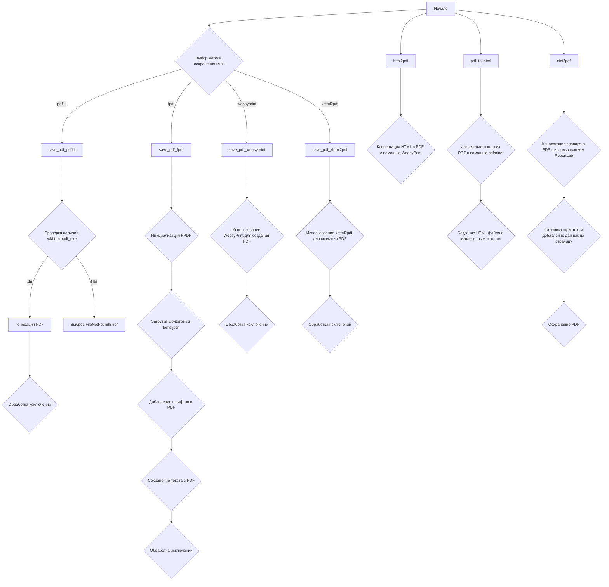
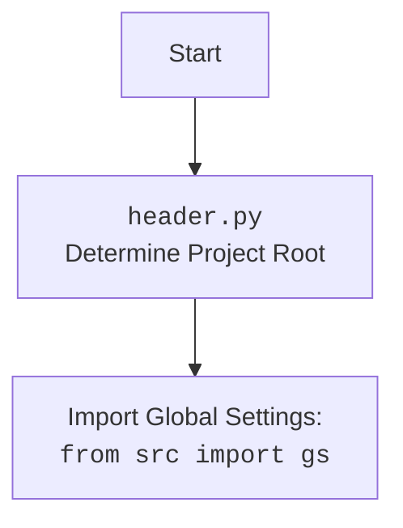

### **Системные инструкции для обработки кода проекта `hypotez`**

=========================================================================================

Описание функциональности и правил для генерации, анализа и улучшения кода. Направлено на обеспечение последовательного и читаемого стиля кодирования, соответствующего требованиям.

---

### **Основные принципы**

#### **1. Общие указания**:
- Соблюдай четкий и понятный стиль кодирования.
- Все изменения должны быть обоснованы и соответствовать установленным требованиям.

#### **2. Комментарии**:
- Используй `#` для внутренних комментариев.
- Документация всех функций, методов и классов должна следовать такому формату: 
    ```python
        def function(param: str, param1: Optional[str | dict | str] = None) -> dict | None:
            """ 
            Args:
                param (str): Описание параметра `param`.
                param1 (Optional[str | dict | str], optional): Описание параметра `param1`. По умолчанию `None`.
    
            Returns:
                dict | None: Описание возвращаемого значения. Возвращает словарь или `None`.
    
            Raises:
                SomeError: Описание ситуации, в которой возникает исключение `SomeError`.

            Ехаmple:
                >>> function('param', 'param1')
                {'param': 'param1'}
            """
    ```
- Комментарии и документация должны быть четкими, лаконичными и точными.

#### **3. Форматирование кода**:
- Используй одинарные кавычки. `a:str = 'value'`, `print('Hello World!')`;
- Добавляй пробелы вокруг операторов. Например, `x = 5`;
- Все параметры должны быть аннотированы типами. `def function(param: str, param1: Optional[str | dict | str] = None) -> dict | None:`;
- Не используй `Union`. Вместо этого используй `|`.

#### **4. Логирование**:
- Для логгирования Всегда Используй модуль `logger` из `src.logger.logger`.
- Ошибки должны логироваться с использованием `logger.error`.
Пример:
    ```python
        try:
            ...
        except Exception as ex:
            logger.error('Error while processing data', ех, exc_info=True)
    ```
#### **5 Не используй `Union[]` в коде. Вместо него используй `|`
Например:
```python
x: str | int ...
```


---

### **Основные требования**:

#### **1. Формат ответов в Markdown**:
- Все ответы должны быть выполнены в формате **Markdown**.

#### **2. Формат комментариев**:
- Используй указанный стиль для комментариев и документации в коде.
- Пример:

```python
from typing import Generator, Optional, List
from pathlib import Path


def read_text_file(
    file_path: str | Path,
    as_list: bool = False,
    extensions: Optional[List[str]] = None,
    chunk_size: int = 8192,
) -> Generator[str, None, None] | str | None:
    """
    Считывает содержимое файла (или файлов из каталога) с использованием генератора для экономии памяти.

    Args:
        file_path (str | Path): Путь к файлу или каталогу.
        as_list (bool): Если `True`, возвращает генератор строк.
        extensions (Optional[List[str]]): Список расширений файлов для чтения из каталога.
        chunk_size (int): Размер чанков для чтения файла в байтах.

    Returns:
        Generator[str, None, None] | str | None: Генератор строк, объединенная строка или `None` в случае ошибки.

    Raises:
        Exception: Если возникает ошибка при чтении файла.

    Example:
        >>> from pathlib import Path
        >>> file_path = Path('example.txt')
        >>> content = read_text_file(file_path)
        >>> if content:
        ...    print(f'File content: {content[:100]}...')
        File content: Example text...
    """
    ...
```
- Всегда делай подробные объяснения в комментариях. Избегай расплывчатых терминов, 
- таких как *«получить»* или *«делать»*
-  . Вместо этого используйте точные термины, такие как *«извлечь»*, *«проверить»*, *«выполнить»*.
- Вместо: *«получаем»*, *«возвращаем»*, *«преобразовываем»* используй имя объекта *«функция получае»*, *«переменная возвращает»*, *«код преобразовывает»* 
- Комментарии должны непосредственно предшествовать описываемому блоку кода и объяснять его назначение.

#### **3. Пробелы вокруг операторов присваивания**:
- Всегда добавляйте пробелы вокруг оператора `=`, чтобы повысить читаемость.
- Примеры:
  - **Неправильно**: `x=5`
  - **Правильно**: `x = 5`

#### **4. Использование `j_loads` или `j_loads_ns`**:
- Для чтения JSON или конфигурационных файлов замените стандартное использование `open` и `json.load` на `j_loads` или `j_loads_ns`.
- Пример:

```python
# Неправильно:
with open('config.json', 'r', encoding='utf-8') as f:
    data = json.load(f)

# Правильно:
data = j_loads('config.json')
```

#### **5. Сохранение комментариев**:
- Все существующие комментарии, начинающиеся с `#`, должны быть сохранены без изменений в разделе «Улучшенный код».
- Если комментарий кажется устаревшим или неясным, не изменяйте его. Вместо этого отметьте его в разделе «Изменения».

#### **6. Обработка `...` в коде**:
- Оставляйте `...` как указатели в коде без изменений.
- Не документируйте строки с `...`.
```

#### **7. Аннотации**
Для всех переменных должны быть определены аннотации типа. 
Для всех функций все входные и выходные параметры аннотириваны
Для все параметров должны быть аннотации типа.


### **8. webdriver**
В коде используется webdriver. Он импртируется из модуля `webdriver` проекта `hypotez`
```python
from src.webdirver import Driver, Chrome, Firefox, Playwright, ...
driver = Driver(Firefox)

Пoсле чего может использоваться как

close_banner = {
  "attribute": null,
  "by": "XPATH",
  "selector": "//button[@id = 'closeXButton']",
  "if_list": "first",
  "use_mouse": false,
  "mandatory": false,
  "timeout": 0,
  "timeout_for_event": "presence_of_element_located",
  "event": "click()",
  "locator_description": "Закрываю pop-up окно, если оно не появилось - не страшно (`mandatory`:`false`)"
}

result = driver.execute_locator(close_banner)
```

## Анализ кода `hypotez/src/utils/pdf.py`

### 1. Блок-схема



### 2. Диаграмма

```mermaid
graph TD
    subgraph src.utils.pdf
        PDFUtils
        save_pdf_pdfkit
        save_pdf_fpdf
        save_pdf_weasyprint
        save_pdf_xhtml2pdf
        html2pdf
        pdf_to_html
        dict2pdf
    end

    subgraph header
        header[header.py]
        __root__
    end

    subgraph src.logger
        logger[logger.py]
    end

    subgraph src.utils
        printer[printer.py]
        pprint
    end
    
    PDFUtils --> logger
    PDFUtils --> printer
    PDFUtils --> header
    
    save_pdf_pdfkit --> pdfkit
    save_pdf_fpdf --> FPDF
    save_pdf_fpdf --> json
    save_pdf_weasyprint --> weasyprint
    save_pdf_xhtml2pdf --> xhtml2pdf
    pdf_to_html --> pdfminer
    dict2pdf --> reportlab

    pdfkit --> os
    pdfkit --> sys
    FPDF --> os
    weasyprint --> os
    xhtml2pdf --> os
    pdfminer --> os
    reportlab --> os
    

    style src.utils.pdf fill:#f9f,stroke:#333,stroke-width:2px
    style header fill:#ccf,stroke:#333,stroke-width:2px
    style src.logger fill:#ccf,stroke:#333,stroke-width:2px
    style src.utils fill:#ccf,stroke:#333,stroke-width:2px
```

Дополнительный блок `mermaid` flowchart, объясняющий `header.py`:



### 3. Объяснение

#### Импорты:

-   `sys`, `os`: Стандартные модули Python для работы с системными функциями и операционной системой.
-   `json`: Модуль для работы с JSON-данными, используется в `save_pdf_fpdf` для чтения конфигурации шрифтов.
-   `pathlib.Path`: Класс для представления путей к файлам и каталогам.
-   `typing.Any`: Используется для аннотации типов, когда тип переменной может быть любым.
-   `pdfkit`: Библиотека для преобразования HTML в PDF с использованием wkhtmltopdf.
-   `reportlab.pdfgen.canvas`: Библиотека для создания PDF-файлов, используется в `dict2pdf` для сохранения словаря в PDF.
-   `header`: Пользовательский модуль, предположительно, для определения корневой директории проекта.
-   `src.logger.logger`: Пользовательский модуль для логирования.
-   `src.utils.printer`: Пользовательский модуль для "красивой" печати данных.

#### Класс `PDFUtils`:

-   **Роль**: Предоставляет статические методы для преобразования HTML-контента или файлов в PDF с использованием различных библиотек.
-   **Атрибуты**: Отсутствуют.
-   **Методы**:
    -   `save_pdf_pdfkit(data: str | Path, pdf_file: str | Path) -> bool`: Сохраняет HTML-контент или файл в PDF с использованием `pdfkit`.
        -   Аргументы:
            -   `data`: HTML-контент или путь к HTML-файлу.
            -   `pdf_file`: Путь к сохраняемому PDF-файлу.
        -   Возвращаемое значение: `True`, если PDF успешно сохранен, иначе `False`.
        -   Пример:
            ```python
            PDFUtils.save_pdf_pdfkit("<h1>Hello</h1>", "hello.pdf")
            ```
    -   `save_pdf_fpdf(data: str, pdf_file: str | Path) -> bool`: Сохраняет текст в PDF с использованием библиотеки `FPDF`.
        -   Аргументы:
            -   `data`: Текст для сохранения в PDF.
            -   `pdf_file`: Путь к сохраняемому PDF-файлу.
        -   Возвращаемое значение: `True`, если PDF успешно сохранен, иначе `False`.
        -   Пример:
            ```python
            PDFUtils.save_pdf_fpdf("Hello", "hello.pdf")
            ```
    -   `save_pdf_weasyprint(data: str | Path, pdf_file: str | Path) -> bool`: Сохраняет HTML-контент или файл в PDF с использованием библиотеки `WeasyPrint`.
        -   Аргументы:
            -   `data`: HTML-контент или путь к HTML-файлу.
            -   `pdf_file`: Путь к сохраняемому PDF-файлу.
        -   Возвращаемое значение: `True`, если PDF успешно сохранен, иначе `False`.
        -   Пример:
            ```python
            PDFUtils.save_pdf_weasyprint("<h1>Hello</h1>", "hello.pdf")
            ```
    -   `save_pdf_xhtml2pdf(data: str | Path, pdf_file: str | Path) -> bool`: Сохраняет HTML-контент или файл в PDF с использованием библиотеки `xhtml2pdf`.
        -   Аргументы:
            -   `data`: HTML-контент или путь к HTML-файлу.
            -   `pdf_file`: Путь к сохраняемому PDF-файлу.
        -   Возвращаемое значение: `True`, если PDF успешно сохранен, иначе `False`.
        -   Пример:
            ```python
            PDFUtils.save_pdf_xhtml2pdf("<h1>Hello</h1>", "hello.pdf")
            ```
    -   `html2pdf(html_str: str, pdf_file: str | Path) -> bool | None`: Конвертирует HTML-контент в PDF с использованием `WeasyPrint`.
    -   `pdf_to_html(pdf_file: str | Path, html_file: str | Path) -> bool`: Конвертирует PDF-файл в HTML-файл с использованием `pdfminer`.
        -   Аргументы:
            -   `pdf_file`: Путь к исходному PDF-файлу.
            -   `html_file`: Путь к сохраняемому HTML-файлу.
        -   Возвращаемое значение: `True`, если конвертация прошла успешно, иначе `False`.
        -   Пример:
            ```python
            PDFUtils.pdf_to_html("input.pdf", "output.html")
            ```
    -   `dict2pdf(data: Any, file_path: str | Path) -> None`: Сохраняет данные словаря в PDF-файл с использованием `reportlab`.
        -   Аргументы:
            -   `data`: Словарь для конвертации в PDF.
            -   `file_path`: Путь к выходному PDF-файлу.
        -   Пример:
            ```python
            data = {"name": "John", "age": 30}
            PDFUtils.dict2pdf(data, "data.pdf")
            ```

#### Функции:

-   Все методы в классе `PDFUtils` являются статическими и выполняют преобразование в PDF с использованием различных библиотек.

#### Переменные:

-   `wkhtmltopdf_exe`: Путь к исполняемому файлу `wkhtmltopdf.exe`.
-   `fonts_file_path`: Путь к файлу `fonts.json`, содержащему информацию о шрифтах для `FPDF`.
-   `fonts`: Словарь, загружаемый из `fonts.json`, содержащий информацию о шрифтах.

#### Потенциальные ошибки и области для улучшения:

-   Обработка исключений в `save_pdf_pdfkit`, `save_pdf_fpdf` и `save_pdf_xhtml2pdf` содержит `...`, что указывает на незавершенную обработку ошибок. Необходимо конкретизировать обработку исключений и логирование.
-   В `save_pdf_xhtml2pdf` происходит двойное преобразование кодировки (`data.encode('utf-8').decode('utf-8')`), что может быть избыточным.
-   Отсутствуют аннотации типов в некоторых местах кода.
-   Не все методы имеют DocString.
-   Использование `print` вместо `logger.info` или `logger.error` в функциях `html2pdf` и `pdf_to_html`.
-   Метод `dict2pdf` не обрабатывает вложенные словари или списки, что ограничивает его применимость.

#### Взаимосвязи с другими частями проекта:

-   Использует `header` для определения корневой директории проекта, что позволяет находить исполняемый файл `wkhtmltopdf.exe` и файл конфигурации шрифтов `fonts.json`.
-   Использует `src.logger.logger` для логирования ошибок и информации о процессе преобразования PDF.
-   Использует `src.utils.printer` для "красивой" печати данных.