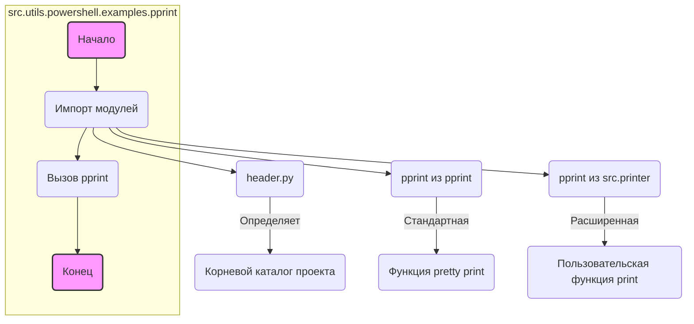
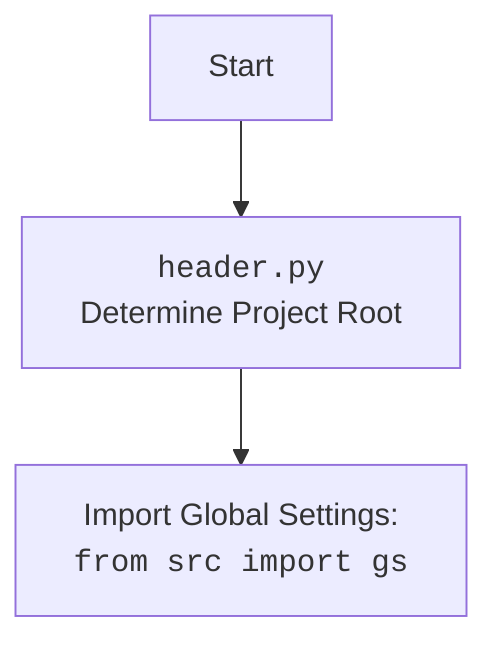

### **Анализ кода проекта `hypotez`**

=========================================================================================

#### **1. Блок-схема**

```mermaid
flowchart LR
    A[Начало] --> B{Импорт модулей: header, pprint из pprint, pprint из src.printer}
    B -- Успешно --> C{Вызов функции pprint с аргументом "Hello, world!"}
    C --> D[Завершение]
```

*   **Начало**: Начало выполнения скрипта.
*   **Импорт модулей**: Импортируются необходимые модули: `header` (описание ниже), `pprint` из стандартной библиотеки `pprint` (переименован в `pretty_print`) и `pprint` из `src.printer`.
*   **Вызов функции pprint**: Функция `pprint` вызывается с аргументом `"Hello, world!"`. Важно отметить, что используется функция `pprint` из `src.printer`, а не из стандартной библиотеки.
*   **Завершение**: Завершение выполнения скрипта.

#### **2. Диаграмма**





**Объяснение зависимостей:**

*   `src.utils.powershell.examples.pprint`: Основной модуль примера, демонстрирующий использование функции `pprint`.
*   `header.py`: Модуль, определяющий корневой каталог проекта.  Предположительно, используется для определения путей к другим модулям проекта.
*   `pprint (из стандартной библиотеки)`:  Стандартный модуль Python для "pretty printing" структур данных.  В данном коде импортируется как `pretty_print`, но не используется напрямую.
*   `src.printer`: Пользовательский модуль, предоставляющий расширенную функциональность "pretty printing", включая возможность стилизации текста (цвет, фон, стиль шрифта).  Этот модуль используется для вывода сообщения `"Hello, world!"`.

#### **3. Объяснение**

**Импорты:**

*   `import header`: Импортирует модуль `header.py`. Этот модуль, вероятно, содержит логику для определения корневой директории проекта.
*   `from pprint import pprint as pretty_print`: Импортирует функцию `pprint` из стандартной библиотеки `pprint` и переименовывает её в `pretty_print`. Однако в дальнейшем коде она не используется.
*   `from src.printer import pprint`: Импортирует функцию `pprint` из модуля `src.printer`.  Этот модуль предоставляет кастомизированную функцию печати с возможностью добавления стилей (цвет, фон и т.д.).

**Функции:**

*   `pprint("Hello, world!")`: Вызывает функцию `pprint` (из модуля `src.printer`) для печати строки `"Hello, world!"`.  В результате будет выведено стилизованное сообщение в консоль.

**Переменные:**

*   В явном виде переменные не используются, но строка `"Hello, world!"` является строковым литералом, передаваемым в функцию `pprint`.

**Потенциальные ошибки и области для улучшения:**

1.  **Неиспользуемый импорт**: Импорт `pprint as pretty_print` из стандартной библиотеки `pprint` не используется в коде.  Это может быть удалено для улучшения читаемости.
2.  **Отсутствие документации**: В начале файла отсутствуют детализированные docstrings, объясняющие назначение модуля и его функции.  Следует добавить описание модуля, а также документировать используемые функции (хотя здесь только один вызов функции).
3.  **Зависимость от `header.py`**: Необходимо убедиться, что модуль `header.py` корректно определяет корневую директорию проекта, чтобы избежать проблем с импортом других модулей. Без содержимого `header.py` сложно оценить его надежность.
4.  **Многократное повторение docstring**: Строки с `"""\n\t:platform: Windows, Unix\n\t:synopsis:\n\n"""` многократно повторяются и, вероятно, являются артефактами редактирования.  Они должны быть удалены.

**Взаимосвязи с другими частями проекта:**

*   Модуль `src.printer` предоставляет общую функциональность для стилизованного вывода в консоль, которая может использоваться в других частях проекта.
*   Модуль `header`, вероятно, используется для унификации путей к файлам и модулям внутри проекта.  Это позволяет избежать жестко заданных путей и упрощает перенос проекта в другую среду.

В целом, код выполняет простую задачу вывода сообщения в консоль с использованием кастомизированной функции печати.  Для улучшения качества кода необходимо удалить неиспользуемые импорты, добавить документацию и проверить логику определения корневой директории проекта.