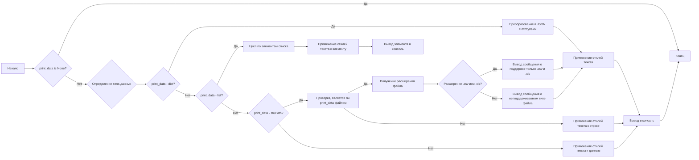

### **Системные инструкции для обработки кода проекта `hypotez`**

=========================================================================================

Описание функциональности и правил для генерации, анализа и улучшения кода. Направлено на обеспечение последовательного и читаемого стиля кодирования, соответствующего требованиям.

---

### **Основные принципы**

#### **1. Общие указания**:
- Соблюдай четкий и понятный стиль кодирования.
- Все изменения должны быть обоснованы и соответствовать установленным требованиям.

#### **2. Комментарии**:
- Используй `#` для внутренних комментариев.
- Документация всех функций, методов и классов должна следовать такому формату: 
    ```python
        def function(param: str, param1: Optional[str | dict | str] = None) -> dict | None:
            """ 
            Args:
                param (str): Описание параметра `param`.
                param1 (Optional[str | dict | str], optional): Описание параметра `param1`. По умолчанию `None`.
    
            Returns:
                dict | None: Описание возвращаемого значения. Возвращает словарь или `None`.
    
            Raises:
                SomeError: Описание ситуации, в которой возникает исключение `SomeError`.

            Ехаmple:
                >>> function('param', 'param1')
                {'param': 'param1'}
            """
    ```
- Комментарии и документация должны быть четкими, лаконичными и точными.

#### **3. Форматирование кода**:
- Используй одинарные кавычки. `a:str = 'value'`, `print('Hello World!')`;
- Добавляй пробелы вокруг операторов. Например, `x = 5`;
- Все параметры должны быть аннотированы типами. `def function(param: str, param1: Optional[str | dict | str] = None) -> dict | None:`;
- Не используй `Union`. Вместо этого используй `|`.

#### **4. Логирование**:
- Для логгирования Всегда Используй модуль `logger` из `src.logger.logger`.
- Ошибки должны логироваться с использованием `logger.error`.
Пример:
    ```python
        try:
            ...
        except Exception as ex:
            logger.error('Error while processing data', ех, exc_info=True)
    ```
#### **5 Не используй `Union[]` в коде. Вместо него используй `|`
Например:
```python
x: str | int ...
```


---

### **Основные требования**:

#### **1. Формат ответов в Markdown**:
- Все ответы должны быть выполнены в формате **Markdown**.

#### **2. Формат комментариев**:
- Используй указанный стиль для комментариев и документации в коде.
- Пример:

```python
from typing import Generator, Optional, List
from pathlib import Path


def read_text_file(
    file_path: str | Path,
    as_list: bool = False,
    extensions: Optional[List[str]] = None,
    chunk_size: int = 8192,
) -> Generator[str, None, None] | str | None:
    """
    Считывает содержимое файла (или файлов из каталога) с использованием генератора для экономии памяти.

    Args:
        file_path (str | Path): Путь к файлу или каталогу.
        as_list (bool): Если `True`, возвращает генератор строк.
        extensions (Optional[List[str]]): Список расширений файлов для чтения из каталога.
        chunk_size (int): Размер чанков для чтения файла в байтах.

    Returns:
        Generator[str, None, None] | str | None: Генератор строк, объединенная строка или `None` в случае ошибки.

    Raises:
        Exception: Если возникает ошибка при чтении файла.

    Example:
        >>> from pathlib import Path
        >>> file_path = Path('example.txt')
        >>> content = read_text_file(file_path)
        >>> if content:
        ...    print(f'File content: {content[:100]}...')
        File content: Example text...
    """
    ...
```
- Всегда делай подробные объяснения в комментариях. Избегай расплывчатых терминов, 
- таких как *«получить»* или *«делать»*. Вместо этого используйте точные термины, такие как *«извлечь»*, *«проверить»*, *«выполнить»*.
- Вместо: *«получаем»*, *«возвращаем»*, *«преобразовываем»* используй имя объекта *«функция получае»*, *«переменная возвращает»*, *«код преобразовывает»* 
- Комментарии должны непосредственно предшествовать описываемому блоку кода и объяснять его назначение.

#### **3. Пробелы вокруг операторов присваивания**:
- Всегда добавляйте пробелы вокруг оператора `=`, чтобы повысить читаемость.
- Примеры:
  - **Неправильно**: `x=5`
  - **Правильно**: `x = 5`

#### **4. Использование `j_loads` или `j_loads_ns`**:
- Для чтения JSON или конфигурационных файлов замените стандартное использование `open` и `json.load` на `j_loads` или `j_loads_ns`.
- Пример:

```python
# Неправильно:
with open('config.json', 'r', encoding='utf-8') as f:
    data = json.load(f)

# Правильно:
data = j_loads('config.json')
```

#### **5. Сохранение комментариев**:
- Все существующие комментарии, начинающиеся с `#`, должны быть сохранены без изменений в разделе «Улучшенный код».
- Если комментарий кажется устаревшим или неясным, не изменяйте его. Вместо этого отметьте его в разделе «Изменения».

#### **6. Обработка `...` в коде**:
- Оставляйте `...` как указатели в коде без изменений.
- Не документируйте строки с `...`.
```

#### **7. Аннотации**
Для всех переменных должны быть определены аннотации типа. 
Для всех функций все входные и выходные параметры аннотириваны
Для все параметров должны быть аннотации типа.


### **8. webdriver**
В коде используется webdriver. Он импртируется из модуля `webdriver` проекта `hypotez`
```python
from src.webdirver import Driver, Chrome, Firefox, Playwright, ...
driver = Driver(Firefox)

Пoсле чего может использоваться как

close_banner = {
  "attribute": null,
  "by": "XPATH",
  "selector": "//button[@id = 'closeXButton']",
  "if_list": "first",
  "use_mouse": false,
  "mandatory": false,
  "timeout": 0,
  "timeout_for_event": "presence_of_element_located",
  "event": "click()",
  "locator_description": "Закрываю pop-up окно, если оно не появилось - не страшно (`mandatory`:`false`)"
}

result = driver.execute_locator(close_banner)
```

### **Анализ кода `hypotez/src/utils/printer.py`**

#### **1. Блок-схема**



**Примеры для каждого логического блока:**

-   **A (Начало):** Начало выполнения функции `pprint`.
-   **B (print\_data is None?):** Если `print_data` равно `None`, функция завершает работу.
    *   Пример: `pprint(None)`
-   **C (Определение типа данных):** Определение типа переданных данных для дальнейшей обработки.
-   **D (print\_data - dict?):** Проверка, является ли `print_data` словарем.
    *   Пример: `pprint({"name": "Alice", "age": 30})`
-   **F (Преобразование в JSON с отступами):** Если `print_data` является словарем, он преобразуется в JSON-формат с отступами для удобочитаемости.
-   **G (Применение стилей текста):** Применение заданных стилей текста (цвет, фон, стиль шрифта) к данным.
-   **H (Вывод в консоль):** Вывод стилизованных данных в консоль.
-   **I (print\_data - list?):** Проверка, является ли `print_data` списком.
    *   Пример: `pprint(["apple", "banana", "cherry"])`
-   **J (Цикл по элементам списка):** Перебор элементов списка для их отдельной обработки.
-   **K (Применение стилей текста к элементу):** Применение стилей текста к каждому элементу списка.
-   **L (Вывод элемента в консоль):** Вывод стилизованного элемента списка в консоль.
-   **M (print\_data - str/Path?):** Проверка, является ли `print_data` строкой или путем к файлу.
    *   Пример: `pprint("text example")`, `pprint(Path("example.txt"))`
-   **N (Проверка, является ли print\_data файлом):** Проверка, является ли `print_data` существующим файлом.
-   **O (Получение расширения файла):** Получение расширения файла для определения его типа.
-   **P (Расширение .csv или .xls?):** Проверка, является ли расширение файла `.csv` или `.xls`.
-   **Q (Вывод сообщения о поддержке только .csv и .xls):** Если расширение файла `.csv` или `.xls`, выводится сообщение о поддержке только этих типов файлов.
-   **R (Вывод сообщения о неподдерживаемом типе файла):** Если расширение файла не `.csv` и не `.xls`, выводится сообщение о неподдерживаемом типе файла.
-   **S (Применение стилей текста к строке):** Применение стилей текста к строке.
-   **T (Применение стилей текста к данным):** Применение стилей текста к данным, если они не являются ни словарем, ни списком, ни файлом.
-   **E (Конец):** Завершение выполнения функции `pprint`.

#### 2. Диаграмма

```mermaid
graph TD
    A[pprint] --> B{print_data is None}
    B -- True --> I[return]
    B -- False --> C{type(print_data)}
    C --> D{isinstance(print_data, dict)}
    D -- True --> E[json.dumps(print_data, indent=4)]
    E --> H[_color_text(..., text_color)]
    D -- False --> F{isinstance(print_data, list)}
    F -- True --> G[for item in print_data]
    G --> H
    F -- False --> J{isinstance(print_data, (str, Path)) and Path(print_data).is_file()}
    J -- True --> K[ext = Path(print_data).suffix.lower()]
    K --> L{ext in ['.csv', '.xls']}
    L -- True --> M[print(_color_text("File reading supported...", text_color))]
    L -- False --> N[print(_color_text("Unsupported file type.", text_color))]
    J -- False --> O[print(_color_text(str(print_data), text_color))]
    H --> P[print(_color_text(..., text_color, bg_color, font_style))]
    P --> I
    M --> I
    N --> I
    O --> I

```

**Объяснение зависимостей:**

-   **`pprint`**: Основная функция, принимающая данные для печати и стили.
-   **`print_data`**: Данные любого типа, переданные для печати.
-   **`json.dumps`**: Используется для преобразования словарей в JSON-формат с отступами.
-   **`Path`**: Используется для работы с путями к файлам и определения расширения файла.
-   **`_color_text`**: Вспомогательная функция, применяющая стили текста.
-   **`text_color`**: Цвет текста для печати.
-    **`bg_color`**: Цвет фона для печати.
-   **`font_style`**: Стиль шрифта для печати.

#### 3. Объяснение

**Импорты:**

-   `json`: Используется для работы с JSON-форматом, в частности, для преобразования словарей в JSON-строку с отступами с помощью `json.dumps`.
-   `csv`: Импортирован, но не используется в коде. Возможно, планировалось использовать для обработки CSV-файлов.
-   `pandas`: Импортирован, но не используется в коде. Возможно, планировалось использовать для обработки данных в формате DataFrame.
-   `pathlib.Path`: Используется для работы с путями к файлам и директориям. Позволяет определять, является ли переданный путь файлом, и получать расширение файла.
-   `typing.Any`: Используется для указания типа переменной, которая может принимать значения любого типа.
-   `pprint.pprint as pretty_print`: Импортирует функцию `pprint` из модуля `pprint` и переименовывает её в `pretty_print`. Однако, она не используется в коде.

**Переменные:**

-   `RESET`: ANSI escape code для сброса всех стилей текста.
-   `TEXT_COLORS`: Словарь, содержащий ANSI escape codes для различных цветов текста.
-   `BG_COLORS`: Словарь, содержащий ANSI escape codes для различных цветов фона.
-   `FONT_STYLES`: Словарь, содержащий ANSI escape codes для различных стилей шрифта (например, bold, underline).

**Функции:**

-   `_color_text(text: str, text_color: str = "", bg_color: str = "", font_style: str = "") -> str`:
    -   Аргументы:
        -   `text` (str): Текст, к которому применяются стили.
        -   `text_color` (str): Цвет текста. По умолчанию - пустая строка (нет цвета).
        -   `bg_color` (str): Цвет фона. По умолчанию - пустая строка (нет фона).
        -   `font_style` (str): Стиль шрифта. По умолчанию - пустая строка (нет стиля).
    -   Возвращаемое значение:
        -   `str`: Стилизованный текст с применением ANSI escape codes.
    -   Назначение: Применяет стили текста (цвет, фон, стиль шрифта) к переданному тексту с использованием ANSI escape codes.
    -   Пример:
        ```python
        _color_text("Hello, World!", text_color="green", font_style="bold")
        ```
-   `pprint(print_data: Any = None, text_color: str = "white", bg_color: str = "", font_style: str = "") -> None`:
    -   Аргументы:
        -   `print_data` (Any): Данные для печати. Может быть `None`, `dict`, `list`, `str` или `Path`.
        -   `text_color` (str): Цвет текста. По умолчанию - "white".
        -   `bg_color` (str): Цвет фона. По умолчанию - "" (нет фона).
        -   `font_style` (str): Стиль шрифта. По умолчанию - "" (нет стиля).
    -   Возвращаемое значение: `None`.
    -   Назначение: Печатает данные в консоль с применением стилей текста. Поддерживает различные типы данных, включая словари (форматируются как JSON), списки (каждый элемент печатается на новой строке) и строки/пути к файлам. Для файлов поддерживается только проверка расширения `.csv` и `.xls`.
    -   Пример:
        ```python
        pprint({"name": "Alice", "age": 30}, text_color="green")
        pprint(["apple", "banana", "cherry"], text_color="blue", font_style="bold")
        pprint("text example", text_color="yellow", bg_color="bg_red", font_style="underline")
        ```

**Переменные:**

- `RESET`: Строка, содержащая ANSI-код для сброса форматирования текста.
- `TEXT_COLORS`: Словарь, содержащий ANSI-коды для установки цвета текста.
- `BG_COLORS`: Словарь, содержащий ANSI-коды для установки цвета фона текста.
- `FONT_STYLES`: Словарь, содержащий ANSI-коды для установки стиля шрифта (например, полужирный, подчеркнутый).

**Потенциальные ошибки и области для улучшения:**

1.  **Неиспользуемые импорты**: Импортированные модули `csv` и `pandas` не используются в коде. Их следует удалить, чтобы избежать ненужных зависимостей.
2.  **Ограниченная поддержка файлов**: Поддерживается только проверка расширения файлов `.csv` и `.xls`. Для более полной поддержки файлов можно добавить чтение и форматирование содержимого этих файлов.  В данный момент код не читает содержимое файлов, а лишь сообщает о поддержке/неподдержке формата.
3.  **Обработка исключений**: Обработка исключений в блоке `try...except` просто выводит сообщение об ошибке.  Было бы полезно логировать ошибки с использованием модуля `logger` из `src.logger.logger` для последующего анализа и отладки.
4.  **Отсутствие документации для переменных**: Отсутствует документация для переменных `RESET`, `TEXT_COLORS`, `BG_COLORS` и `FONT_STYLES`.  Следует добавить описание каждой переменной для улучшения читаемости кода.
5.  **Использование `pretty_print`**: Импортирована функция `pretty_print` из модуля `pprint`, но она не используется в коде. Следует удалить неиспользуемый импорт или заменить `json.dumps` на `pretty_print` для форматирования JSON.
6. **Типизация**: В коде не везде присутствует аннотация типов, например при определении констант.

**Взаимосвязи с другими частями проекта:**

-   Этот модуль предоставляет утилиты для стилизации и печати текста, которые могут использоваться в других частях проекта для улучшения читаемости выводимых сообщений и данных. Например, его можно использовать для логирования, вывода отладочной информации или форматирования результатов выполнения задач.