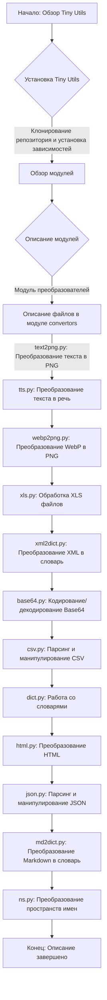
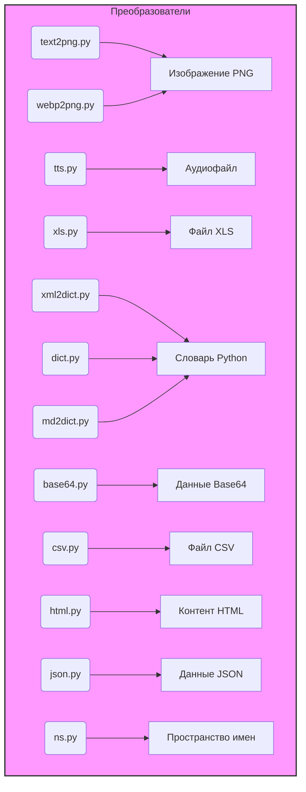

### **Проект `hypotez`**
### **Роль `code explainer`**

## ИНСТРУКЦИЯ:

Анализируй предоставленный код подробно и объясни его функциональность. Ответ должен включать три раздела:

1. **Блок-схема**: Опиши рабочий процесс в виде пошаговой блок-схемы, включая примеры для каждого логического блока, и проиллюстрируй поток данных между функциями, классами или методами.
2. **Диаграмма**: Напиши код для диаграммы в формате `mermaid`, проанализируй и объясни все зависимости,
    которые импортируются при создании диаграммы.
    **ВАЖНО!** Убедитесь, что все имена переменных, используемые в диаграмме `mermaid`,
    имеют осмысленные и описательные имена. Имена переменных вроде `A`, `B`, `C`, и т.д., не допускаются!

    **Дополнительно**: Если в коде есть импорт `import header`, добавьте блок `mermaid` flowchart, объясняющий `header.py`:\
    ```mermaid
    flowchart TD
        Start --> Header[<code>header.py</code><br> Determine Project Root]

        Header --> import[Import Global Settings: <br><code>from src import gs</code>]
    ```

3. **Объяснение**: Предоставь подробные объяснения для:
   - **Импорты**: Их назначение и взаимосвязь с другими пакетами `src.`.
   - **Классы**: Их роль, атрибуты, методы и взаимодействие с другими компонентами проекта.
   - **Функции**: Их аргументы, возвращаемые значения, назначение и примеры.
   - **Переменные**: Их типы и использование.
   - Выдели потенциальные ошибки или области для улучшения.

Дополнительно, постройте цепочку взаимосвязей с другими частями проекта (если применимо).

Это обеспечивает всесторонний и структурированный анализ кода.
## Формат ответа: `.md` (markdown) UTF-8 RU

## Твое поведение при анализе кода:
- всегда смотри системную инструкцию для обработки кода проекта `hypotez`;
- анализируй расположение файла в проекте. Это поможет понять его назначение и взаимосвязь с другими файлами. Расположение файла ты найдешь в самой превой строке кода, начинающейся с `## \\file /...`;
- запоминай предоставленный код и анализируй его связь с другими частями проекта `hypotez`;

**КОНЕЦ ИНСТРУКЦИИ**

## \file hypotez/src/utils/readme.ru.md
# -*- coding: utf-8 -*-
#! .pyenv/bin/python3

## Tiny Utils

### Обзор

**Tiny Utils** — это библиотека утилит, предоставляющая набор лёгких вспомогательных функций для различных общих задач. Библиотека включает в себя утилиты для преобразования форматов данных, обработки текста и файлов, строковых операций, форматирования дат и времени, обработки изображений и др. Она организована в несколько модулей для удобного доступа к конкретным функциональным возможностям.

### Оглавление

- [Tiny Utils](#tiny-utils)
  - [Оглавление](#оглавление)
  - [Установка](#установка)
  - [Обзор модулей](#обзор-модулей)
  - [Описание модулей](#описание-модулей)
    - [Преобразователи](#преобразователи)
      - [Файлы:](#файлы)
    - [Утилиты для строк](#утилиты-для-строк)
    - [Утилиты для работы с файлами](#утилиты-для-работы-с-файлами)
    - [Утилиты для работы с датами и временем](#утилиты-для-работы-с-датами-и-временем)
    - [Утилиты для работы с FTP](#утилиты-для-работы-с-ftp)
    - [Утилиты для работы с изображениями](#утилиты-для-работы-с-изображениями)
    - [Утилиты для работы с PDF](#утилиты-для-работы-с-pdf)
    - [Утилиты для работы с принтером](#утилиты-для-работы-с-принтером)
  - [Примеры использования](#примеры-использования)
    - [Преобразование текста в изображение PNG](#преобразование-текста-в-изображение-png)
    - [Преобразование XML в словарь](#преобразование-xml-в-словарь)
    - [Парсинг и манипуляции с JSON](#парсинг-и-манипуляции-с-json)
  - [Участие в разработке](#участие-в-разработке)
  - [Лицензия](#лицензия)

### Установка

Для использования **Tiny Utils** клонируйте репозиторий и установите необходимые зависимости, как указано в файле `requirements.txt`.

```bash
git clone https://github.com/hypo69/tiny-utils.git
cd tiny_utils
pip install -r requirements.txt
```

### Обзор модулей

Библиотека содержит несколько подмодулей, каждый из которых обрабатывает определённую задачу:

- **Преобразователи**: Модули для преобразования форматов данных, таких как текст в изображение, WebP в PNG, JSON, XML, кодирование Base64 и др.
- **Утилиты для строк**: Инструменты для продвинутой работы со строками.
- **Утилиты для работы с файлами**: Функции для обработки и манипулирования файлами.
- **Утилиты для работы с датами и временем**: Инструменты для форматирования дат и времени.
- **Утилиты для работы с FTP**: Функции для работы с FTP-серверами.
- **Утилиты для работы с изображениями**: Базовые функции обработки изображений.
- **Утилиты для работы с PDF**: Утилиты для обработки и преобразования файлов PDF.
- **Утилиты для работы с принтером**: Функции для отправки данных на принтер.

### Описание модулей

#### Преобразователи

Модуль `convertors` содержит утилиты для преобразования данных между форматами. Эти модули могут обрабатывать различные типы данных, от CSV до JSON и текста до изображений.

##### Файлы:

- `text2png.py`: Преобразует данные текста в изображение PNG.
- `tts.py`: Преобразует текст в речь и сохраняет его в виде аудиофайла.
- `webp2png.py`: Преобразует изображения из формата WebP в PNG.
- `xls.py`: Обрабатывает преобразования и манипуляции с файлами XLS.
- `xml2dict.py`: Преобразует данные XML в словарь Python.
- `base64.py`: Кодирует или декодирует данные с использованием кодирования Base64.
- `csv.py`: Предоставляет инструменты для парсинга и манипулирования CSV.
- `dict.py`: Утилиты для обработки словарей Python.
- `html.py`: Преобразует контент HTML в различные форматы.
- `json.py`: Утилиты для парсинга и манипулирования JSON.
- `md2dict.py`: Преобразует контент Markdown в словарь.
- `ns.py`: Специализированные утилиты для преобразования имён пространств.

### Утилиты для строк
... (и так далее для других разделов)

---

### 1. Блок-схема:



**Примеры для логических блоков:**

- **A**: Начало обзора библиотеки `Tiny Utils`. Описание общей цели и функциональности библиотеки.
- **B**: Установка библиотеки. Инструкции по клонированию репозитория и установке зависимостей из `requirements.txt`.
- **C**: Обзор модулей. Краткое описание основных модулей библиотеки, таких как преобразователи, утилиты для строк, файлов, дат и времени и т.д.
- **D**: Описание модулей. Подробное описание каждого модуля, включая его назначение и основные функции.
- **E**: Описание файлов в модуле `convertors`. Перечисление файлов, входящих в модуль преобразователей, и их функций.
- **F**: Описание файлов, отвечающих за преобразование форматов данных.
- **Q**: Завершение описания библиотеки `Tiny Utils` и ее модулей.

### 2. Диаграмма:



**Объяснение зависимостей:**

- **convertors**: Описывает модуль, включающий в себя файлы для преобразования данных между форматами.
- **text2png.py**: Преобразует текст в изображение PNG.
- **tts.py**: Преобразует текст в речь и сохраняет в аудиофайл.
- **webp2png.py**: Преобразует изображения WebP в PNG.
- **xls.py**: Обрабатывает файлы XLS.
- **xml2dict.py**: Преобразует XML в словарь Python.
- **base64.py**: Кодирует или декодирует данные в формате Base64.
- **csv.py**: Предоставляет инструменты для парсинга и обработки CSV.
- **dict.py**: Утилиты для работы со словарями Python.
- **html.py**: Преобразует HTML контент в различные форматы.
- **json.py**: Утилиты для парсинга и обработки JSON.
- **md2dict.py**: Преобразует контент Markdown в словарь.
- **ns.py**: Специализированные утилиты для преобразования пространств имен.
- Стрелки показывают, какой файл (модуль) отвечает за преобразование в конкретный формат данных.

### 3. Объяснение:

- **Общее назначение**:
  - Документ `readme.ru.md` предоставляет общее описание библиотеки `Tiny Utils`, предназначенной для выполнения различных задач, таких как преобразование данных, обработка строк и файлов, работа с датами и изображениями. Документ содержит информацию об установке библиотеки, обзоре модулей, их описании и примерах использования.

- **Импорты**:
  - В представленном тексте нет явных импортов, так как это файл документации, а не код Python.

- **Классы**:
  - В тексте нет описания классов, так как это файл документации, а не код Python.

- **Функции**:
  - В тексте нет описания функций, так как это файл документации, а не код Python.

- **Переменные**:
  - В тексте нет описания переменных, так как это файл документации, а не код Python.

- **Потенциальные ошибки и области для улучшения**:
  - В файле документации отсутствуют примеры кода для каждого модуля, что затрудняет быстрое понимание их использования.
  - Отсутствуют подробные описания каждого метода в модулях, что также усложняет понимание функциональности библиотеки.
  - Желательно добавить информацию о зависимостях каждого модуля.

- **Взаимосвязь с другими частями проекта**:
  - Файл `readme.ru.md` описывает структуру и функциональность библиотеки `Tiny Utils`, которая может использоваться в различных частях проекта `hypotez` для упрощения задач, связанных с обработкой данных, файлов и строк. Например, модуль `convertors` может быть использован для преобразования данных из одного формата в другой, что может быть полезно при интеграции с различными источниками данных.