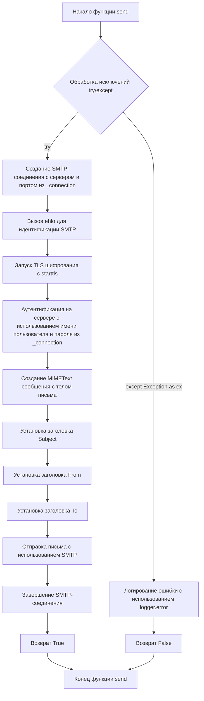
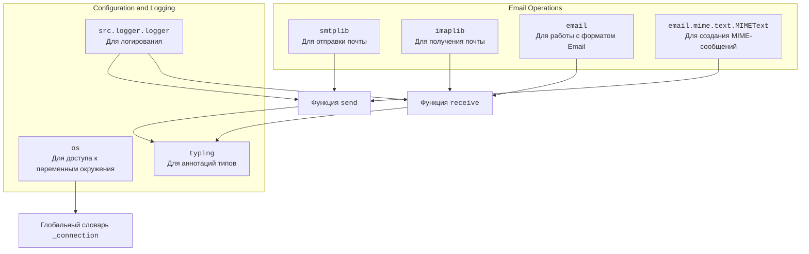

### **Системные инструкции для обработки кода проекта `hypotez`**

=========================================================================================

Описание функциональности и правил для генерации, анализа и улучшения кода. Направлено на обеспечение последовательного и читаемого стиля кодирования, соответствующего требованиям.

---

### **Основные принципы**

#### **1. Общие указания**:
- Соблюдай четкий и понятный стиль кодирования.
- Все изменения должны быть обоснованы и соответствовать установленным требованиям.

#### **2. Комментарии**:
- Используй `#` для внутренних комментариев.
- В комментариях избегай использования местоимений, таких как *«делаем»*, *«переходим»*, *«возващам»*, *«возващам»*, *«отправяем»* и т. д.. Вмсто этого используй точные термины, такие как *«извлеизвлечение»*, *«проверка»*, *«выполннение»*, *«замена»*, *«вызов»*, *«Функця выпоняет»*,*«Функця изменяет значение»*, *«Функця вызывает»*,*«отправка»*
Пример:
```python
# Неправильно:
def function(param: str, param1: Optional[str | dict | str] = None) -> dict | None:
    # Получаем значение параметра
    ...
# Правильно:

def function(param: str, param1: Optional[str | dict | str] = None) -> dict | None:
    # Функция извлекает значение параметра
    ...
# Неправильно:
if not process_directory.exists():
    logger.error(f"Директория не существует: {process_directory}")
    continue  # Переходим к следующей директории, если текущая не существует

if not process_directory.is_dir():
    logger.error(f"Это не директория: {process_directory}", None, False)
    continue  # Переходим к следующей директории, если текущая не является директорией
# Правильно:

if not process_directory.exists():
    logger.error(f"Директория не существует: {process_directory}")
    continue  # Переход к следующей директории, если текущая не существует
if not process_directory.is_dir():
    logger.error(f"Это не директория: {process_directory}", None, False)
    continue  # Переходим к следующей директории, если текущая не является директорией

```
- Документация всех функций, методов и классов должна следовать такому формату: 
    ```python
        def function(param: str, param1: Optional[str | dict | str] = None) -> dict | None:
            """ 
            Args:
                param (str): Описание параметра `param`.
                param1 (Optional[str | dict | str], optional): Описание параметра `param1`. По умолчанию `None`.
    
            Returns:
                dict | None: Описание возвращаемого значения. Возвращает словарь или `None`.
    
            Raises:
                SomeError: Описание ситуации, в которой возникает исключение `SomeError`.

            Ехаmple:
                >>> function('param', 'param1')
                {'param': 'param1'}
            """
    ```
- Комментарии и документация должны быть четкими, лаконичными и точными.


### **3. Заголовок файла**:
Обязательно оставляй строки 
```python
## \file path/to/file
# -*- coding: utf-8 -*-
#! .pyenv/bin/python3
```
и
```
"""
...
```rst
 .. module:: src.utils.string.html_simplification
 ```
"""
```
если они есть. Если нет - добавляй.
Пример:
## \file /src/utils/string/html_simplification.py
# -*- coding: utf-8 -*-
#! .pyenv/bin/python3

"""
Модуль для очистки HTML-тегов из текста и упрощения HTML-кода.
===============================================================
Модуль минимизирует HTML-код, удаляет теги и атрибуты, а также обрабатывает
специальные случаи, такие как скрипты, стили и комментарии.
Использует BeautifulSoup для надежного парсинга HTML.

Зависимости:
    - beautifulsoup4 (pip install beautifulsoup4)
    - lxml (опционально, для более быстрого парсинга: pip install lxml)

 .. module:: src.utils.string.html_simplification
"""

#### **4. Форматирование кода**:
- Используй одинарные кавычки. `a:str = 'value'`, `print('Hello World!')`;
- Добавляй пробелы вокруг операторов. Например, `x = 5`;
- Все параметры должны быть аннотированы типами. `def function(param: str, param1: Optional[str | dict | str] = None) -> dict | None:`;
- Не используй `Union`. Вместо этого используй `|`.
- Не используй термин `Product`, только `товар`

#### **5. Логирование**:
- Для логгирования Всегда Используй модуль `logger` из `src.logger.logger`.
- Ошибки должны логироваться с использованием `logger.error`.
Пример:
    ```python
        try:
            ...
        except Exception as ex:
            logger.error('Error while processing data', ех, exc_info=True)
    ```
#### **6. Не используй `Union[]` в коде. Вместо него используй `|`
Например:
```python
x: str | int ...
```

#### **7. Не используй глобальные переменные. Если есть надобность - то поределяй их в классе `Config`.
Пример:

- Неправильно:
```python

state:int = 'global'

def func():
    print(state)

```
- Правильно:
```python

class Config:
    state:int = 'global'

def func():
    print(Config.state)

```

#### **8. Не используй `self` в методах класса. Вместо него используй `cls`.
#### **9. Всегда объявляй переменные вначале функции. Не объявляй их в середине функции.
Пример:
```python
def func():
    # Неправильно
    if condition:
        x = 5
        y = 10
    else:
        x = 20
        y = 30
    # Правильно
    x = None
    y = None
    if condition:
        x = 5
        y = 10
    else:
        x = 20
        y = 30
```
---

### **Основные требования**:

#### **1. Формат ответов в Markdown**:
- Все ответы должны быть выполнены в формате **Markdown**.

#### **2. Формат комментариев**:
- Используй указанный стиль для комментариев и документации в коде.
- Пример:

```python
from typing import Generator, Optional, List
from pathlib import Path


def read_text_file(
    file_path: str | Path,
    as_list: bool = False,
    extensions: Optional[List[str]] = None,
    chunk_size: int = 8192,
) -> Generator[str, None, None] | str | None:
    """
    Считывает содержимое файла (или файлов из каталога) с использованием генератора для экономии памяти.

    Args:
        file_path (str | Path): Путь к файлу или каталогу.
        as_list (bool): Если `True`, возвращает генератор строк.
        extensions (Optional[List[str]]): Список расширений файлов для чтения из каталога.
        chunk_size (int): Размер чанков для чтения файла в байтах.

    Returns:
        Generator[str, None, None] | str | None: Генератор строк, объединенная строка или `None` в случае ошибки.

    Raises:
        Exception: Если возникает ошибка при чтении файла.

    Example:
        >>> from pathlib import Path
        >>> file_path = Path('example.txt')
        >>> content = read_text_file(file_path)
        >>> if content:
        ...    print(f'File content: {content[:100]}...')
        File content: Example text...
    """
    ...
```
- Всегда делай подробные объяснения в комментариях. Избегай расплывчатых терминов, 
- таких как *«получить»* или *«делать»*
-  . Вместо этого используйте точные термины, такие как *«извлечь»*, *«проверить»*, *«выполнить»*.
- Вместо: *«получаем»*, *«возвращаем»*, *«преобразовываем»* используй имя объекта *«функция получае»*, *«переменная возвращает»*, *«код преобразовывает»* 
- Комментарии должны непосредственно предшествовать описываемому блоку кода и объяснять его назначение.

#### **3. Пробелы вокруг операторов присваивания**:
- Всегда добавляйте пробелы вокруг оператора `=`, чтобы повысить читаемость.
- Примеры:
  - **Неправильно**: `x=5`
  - **Правильно**: `x = 5`

#### **4. Использование `j_loads` или `j_loads_ns`**:
- Для чтения JSON или конфигурационных файлов замените стандартное использование `open` и `json.load` на `j_loads` или `j_loads_ns`.
- Пример:

```python
# Неправильно:
with open('config.json', 'r', encoding='utf-8') as f:
    data = json.load(f)

# Правильно:
data = j_loads('config.json')
```

#### **5. Сохранение комментариев**:
- Все существующие комментарии, начинающиеся с `#`, должны быть сохранены без изменений в разделе «Улучшенный код».
- Если комментарий кажется устаревшим или неясным, не изменяйте его. Вместо этого отметьте его в разделе «Изменения».

#### **6. Обработка `...` в коде**:
- Оставляйте `...` как указатели в коде без изменений.
- Не документируйте строки с `...`.
```

#### **7. Аннотации**
Для всех переменных должны быть определены аннотации типа. 
Для всех функций все входные и выходные параметры аннотириваны
Для все параметров должны быть аннотации типа.


### **8. webdriver**
В коде используется webdriver. Он импртируется из модуля `webdriver` проекта `hypotez`
```python
from src.webdirver import Driver, Chrome, Firefox, Playwright, ...
driver = Driver(Firefox)

Пoсле чего может использоваться как

close_banner = {
  "attribute": null,
  "by": "XPATH",
  "selector": "//button[@id = 'closeXButton']",
  "if_list": "first",
  "use_mouse": false,
  "mandatory": false,
  "timeout": 0,
  "timeout_for_event": "presence_of_element_located",
  "event": "click()",
  "locator_description": "Закрываю pop-up окно, если оно не появилось - не страшно (`mandatory`:`false`)"
}

result = driver.execute_locator(close_banner)

#### **9. Не используй `Union[]` в коде. Вместо него используй `|`
Например:
```python
x: str | int ...
```

#### **10. print - это моя встроенная функция.
from src.utils.printer import pprint as print


Вот она:

\file /src/utils/printer.py
-- coding: utf-8 --

#! .pyenv/bin/python3

"""
.. module::  src.utils
:platform: Windows, Unix
:synopsis: Utility functions for pretty printing and text styling.

This module provides functions to print data in a human-readable format with optional text styling, including color, background, and font styles.
"""

import json
import csv
import pandas as pd
from pathlib import Path
from typing import Any
from pprint import pprint as pretty_print

ANSI escape codes

RESET = "\033[0m"

TEXT_COLORS = {
"red": "\033[31m",
"green": "\033[32m",
"blue": "\033[34m",
"yellow": "\033[33m",
"white": "\033[37m",
"cyan": "\033[36m",
"magenta": "\033[35m",
"light_gray": "\033[37m",
"dark_gray": "\033[90m",
"light_red": "\033[91m",
"light_green": "\033[92m",
"light_blue": "\033[94m",
"light_yellow": "\033[93m",
}

Background colors mapping

BG_COLORS = {
"bg_red": "\033[41m",
"bg_green": "\033[42m",
"bg_blue": "\033[44m",
"bg_yellow": "\033[43m",
"bg_white": "\033[47m",
"bg_cyan": "\033[46m",
"bg_magenta": "\033[45m",
"bg_light_gray": "\033[47m",
"bg_dark_gray": "\033[100m",
"bg_light_red": "\033[101m",
"bg_light_green": "\033[102m",
"bg_light_blue": "\033[104m",
"bg_light_yellow": "\033[103m",
}

FONT_STYLES = {
"bold": "\033[1m",
"underline": "\033[4m",
}

def _color_text(text: str, text_color: str = "", bg_color: str = "", font_style: str = "") -> str:
"""Apply color, background, and font styling to the text.

This helper function applies the provided color and font styles to the given text using ANSI escape codes.

:param text: The text to be styled.
:param text_color: The color to apply to the text. Default is an empty string, meaning no color.
:param bg_color: The background color to apply. Default is an empty string, meaning no background color.
:param font_style: The font style to apply to the text. Default is an empty string, meaning no font style.
:return: The styled text as a string.

:example:
    >>> _color_text("Hello, World!", text_color="green", font_style="bold")
    '\033[1m\033[32mHello, World!\033[0m'
"""
return f"{font_style}{text_color}{bg_color}{text}{RESET}"


def pprint(print_data: Any = None, text_color: str = "white", bg_color: str = "", font_style: str = "") -> None:
"""Pretty prints the given data with optional color, background, and font style.

This function formats the input data based on its type and prints it to the console. The data is printed with optional 
text color, background color, and font style based on the specified parameters. The function can handle dictionaries, 
lists, strings, and file paths.

:param print_data: The data to be printed. Can be of type ``None``, ``dict``, ``list``, ``str``, or ``Path``.
:param text_color: The color to apply to the text. Default is 'white'. See :ref:`TEXT_COLORS`.
:param bg_color: The background color to apply to the text. Default is '' (no background color). See :ref:`BG_COLORS`.
:param font_style: The font style to apply to the text. Default is '' (no font style). See :ref:`FONT_STYLES`.
:return: None

:raises: Exception if the data type is unsupported or an error occurs during printing.

:example:
    >>> pprint({"name": "Alice", "age": 30}, text_color="green")
    \033[32m{
        "name": "Alice",
        "age": 30
    }\033[0m

    >>> pprint(["apple", "banana", "cherry"], text_color="blue", font_style="bold")
    \033[34m\033[1mapple\033[0m
    \033[34m\033[1mbanana\033[0m
    \033[34m\033[1mcherry\033[0m

    >>> pprint("text example", text_color="yellow", bg_color="bg_red", font_style="underline")
    \033[4m\033[33m\033[41mtext example\033[0m
"""
if not print_data:
    return
if isinstance(text_color, str):
    text_color = TEXT_COLORS.get(text_color.lower(), TEXT_COLORS["white"])
if isinstance(bg_color, str):
    bg_color = BG_COLORS.get(bg_color.lower(), "")
if isinstance(font_style, str):
    font_style = FONT_STYLES.get(font_style.lower(), "")


try:
    if isinstance(print_data, dict):
        print(_color_text(json.dumps(print_data, indent=4), text_color))
    elif isinstance(print_data, list):
        for item in print_data:
            print(_color_text(str(item), text_color))
    elif isinstance(print_data, (str, Path)) and Path(print_data).is_file():
        ext = Path(print_data).suffix.lower()
        if ext in ['.csv', '.xls']:
            print(_color_text("File reading supported for .csv, .xls only.", text_color))
        else:
            print(_color_text("Unsupported file type.", text_color))
    else:
        print(_color_text(str(print_data), text_color))
except Exception as ex:
    print(_color_text(f"Error: {ex}", text_color=TEXT_COLORS["red"]))
IGNORE_WHEN_COPYING_START
content_copy
download
Use code with caution.
IGNORE_WHEN_COPYING_END

if name == 'main':
pprint({"name": "Alice", "age": 30}, text_color="green")
```

## \file /src/utils/smtp.py
# -*- coding: utf-8 -*-

#! .pyenv/bin/python3

"""
.. module:: src.utils 
	:platform: Windows, Unix
	:synopsis: SMTP Email Interface

"""

""" This module provides functionality to send and receive emails using an SMTP or IMAP server.
It includes functions to send emails using SMTP and retrieve emails using IMAP.

Functions:
    - `send(subject: str = '', body: str = '', to: str = 'one.last.bit@gmail.com') -> bool`
      Sends an email using the SMTP server specified in the `_connection` dictionary.  Returns `True` on success, `False` on failure.  Includes error logging.
    
    - `receive(imap_server: str, user: str, password: str, folder: str = 'inbox') -> Optional[List[Dict[str, str]]]`
      Retrieves emails from an IMAP server and returns them as a list of dictionaries.  Returns `None` on error. Includes error logging.


** Important Considerations for Security and Robustness **:

    - **_connection Dictionary:** Do *not* hardcode credentials in this file.  Move the `_connection` dictionary to environment variables (e.g., using `os.environ`). This is crucial for security.  Avoid storing passwords directly in source code.

    - **Error Handling:** The code includes robust error handling, logging exceptions with details (subject, body, etc.).  This is very helpful for debugging.

    - **Email Parsing:** The `receive` function handles various email formats gracefully, preventing potential issues.

    - **MIME Handling:**  The code correctly uses `MIMEText` for constructing the email message, crucial for sending basic text emails.


"""

import smtplib
import imaplib
import email
import os
from email.mime.text import MIMEText
from typing import List, Dict, Optional

from src.logger.logger import logger

# --- Configuration ---
# DO NOT HARDCODE CREDENTIALS HERE!  Use environment variables instead.
_connection: Dict[str, str | int | None] = {
    'server': os.environ.get('SMTP_SERVER', 'smtp.example.com'),
    'port': int(os.environ.get('SMTP_PORT', 587)),
    'user': os.environ.get('SMTP_USER'),
    'password': os.environ.get('SMTP_PASSWORD'),
    'receiver': os.environ.get('SMTP_RECEIVER', 'one.last.bit@gmail.com')
}


def send(subject: str = '', body: str = '', to: str = 'one.last.bit@gmail.com') -> bool:
    """Отправляет электронное письмо. Возвращает `True` в случае успеха, `False` в противном случае. Логирует ошибки."""
    try:
        # Функция создает SMTP-соединение
        smtp = smtplib.SMTP(_connection['server'], _connection['port'])
        smtp.ehlo()
        smtp.starttls()
        smtp.login(_connection['user'], _connection['password'])

        message = MIMEText(body)
        message["Subject"] = subject
        message["From"] = _connection['user']
        message["To"] = to

        smtp.sendmail(_connection['user'], to, message.as_string())
        smtp.quit()
        return True

    except Exception as ex:
        logger.error(f"Error sending email. Subject: {subject}. Body: {body}. Error: {ex}", exc_info=True)
        return False


def receive(imap_server: str, user: str, password: str, folder: str = 'inbox') -> Optional[List[Dict[str, str]]]:
    """Извлекает электронные письма. Возвращает список словарей электронной почты в случае успеха, `None` в противном случае. Логирует ошибки."""
    try:
        mail = imaplib.IMAP4_SSL(imap_server)
        mail.login(user, password)
        mail.select(folder)

        status, data = mail.search(None, 'ALL')
        email_ids = data[0].split()

        emails: List[Dict[str, str]] = []
        for email_id in email_ids:
            status, data = mail.fetch(email_id, '(RFC822)')
            raw_email = data[0][1]
            msg = email.message_from_bytes(raw_email)

            email_data: Dict[str, str] = {
                'subject': msg['subject'],
                'from': msg['from'],
                'body': msg.get_payload(decode=True, _charset="utf-8").decode("utf-8", "ignore")  # Декодирует и обрабатывает возможные ошибки
            }
            emails.append(email_data)

        mail.close()
        mail.logout()
        return emails

    except Exception as ex:
        logger.error(f"Error occurred while retrieving emails: {ex}", exc_info=True)
        return None
```

### 1. Блок-схема:

#### Функция `send`:



*   **Пример блока C:** `smtp = smtplib.SMTP(_connection['server'], _connection['port'])` – устанавливает связь с SMTP-сервером.
*   **Пример блока F:** `smtp.login(_connection['user'], _connection['password'])` – выполняет вход на SMTP-сервер, используя предоставленные учетные данные.
*   **Пример блока N:** `logger.error(f"Error sending email. Subject: {subject}. Body: {body}. Error: {ex}", exc_info=True)` – логирует возникшее исключение.

#### Функция `receive`:

```mermaid
graph TD
    A[Начало функции receive] --> B{Обработка исключений try/except}
    B -- try --> C[Создание IMAP4_SSL соединения с сервером]
    C --> D[Аутентификация на сервере с использованием имени пользователя и пароля]
    D --> E[Выбор почтовой папки (по умолчанию 'inbox')]
    E --> F[Поиск всех писем в выбранной папке]
    F --> G[Разделение полученных ID писем]
    G --> H[Инициализация списка emails]
    H --> I{Цикл по email_ids}
    I -- для каждого email_id --> J[Получение (fetch) содержимого письма по ID в формате RFC822]
    J --> K[Преобразование (parse) raw_email в объект сообщения email]
    K --> L[Создание словаря email_data с извлечением subject, from, body]
    L --> M[Добавление email_data в список emails]
    I -- конец цикла --> N[Закрытие IMAP соединения]
    N --> O[Выход из системы (logout)]
    O --> P[Возврат списка emails]
    B -- except Exception as ex --> Q[Логирование ошибки с использованием logger.error]
    Q --> R[Возврат None]
    P --> S[Конец функции receive]
    R --> S
```

*   **Пример блока C:** `mail = imaplib.IMAP4_SSL(imap_server)` – создает защищенное SSL соединение с IMAP-сервером.
*   **Пример блока F:** `status, data = mail.search(None, 'ALL')` – ищет все письма в выбранной папке.
*   **Пример блока L:** `email_data = {'subject': msg['subject'], 'from': msg['from'], 'body': msg.get_payload(decode=True, _charset="utf-8").decode("utf-8", "ignore")}` – создает словарь, содержащий тему, отправителя и тело письма.
*   **Пример блока Q:** `logger.error(f"Error occurred while retrieving emails: {ex}", exc_info=True)` – логирует возникшее исключение.

### 2. Диаграмма:



**Объяснение зависимостей:**

*   `smtplib`: Используется для установления соединения с SMTP-сервером и отправки электронных писем.
*   `imaplib`: Используется для установления соединения с IMAP-сервером и получения электронных писем.
*   `email`: Используется для парсинга и обработки структуры электронных писем, включая заголовки и тело сообщения.
*   `email.mime.text.MIMEText`: Класс, используемый для создания MIME-объектов, представляющих текст электронного письма.
*   `os`: Используется для доступа к переменным окружения, чтобы получить учетные данные (логин, пароль) и другие параметры подключения (сервер, порт) без жесткого кодирования их в коде.
*   `src.logger.logger`: Используется для логирования ошибок и других важных событий, возникающих в процессе отправки и получения электронных писем.
*   `typing`: Используется для статической типизации, что позволяет улучшить читаемость и поддерживаемость кода за счет указания типов данных аргументов и возвращаемых значений функций.

### 3. Объяснение:

#### Импорты:

*   `smtplib`: Библиотека для отправки электронной почты по протоколу SMTP.
*   `imaplib`: Библиотека для получения электронной почты по протоколу IMAP.
*   `email`: Пакет для работы с сообщениями электронной почты, включая парсинг и создание.
*   `os`: Модуль для взаимодействия с операционной системой, используется для доступа к переменным окружения.
*   `email.mime.text.MIMEText`: Класс для создания текстовых MIME-объектов, используется для создания тела письма.
*   `typing`: Модуль для аннотации типов, используется для статической проверки типов.
*   `src.logger.logger`: Модуль логирования, специфичный для проекта `hypotez`, используется для записи информации об ошибках и событиях.

#### Классы:

В данном коде классы не определены.

#### Функции:

*   `send(subject: str = '', body: str = '', to: str = 'one.last.bit@gmail.com') -> bool`:
    *   Аргументы:
        *   `subject` (str): Тема письма. По умолчанию ''.
        *   `body` (str): Тело письма. По умолчанию ''.
        *   `to` (str): Адрес получателя. По умолчанию 'one.last.bit@gmail.com'.
    *   Возвращаемое значение:
        *   `bool`: `True`, если письмо отправлено успешно, `False` в противном случае.
    *   Назначение:
        *   Отправляет электронное письмо с использованием SMTP.
    *   Пример:
        ```python
        if send(subject='Тест', body='Это тестовое письмо', to='test@example.com'):
            print('Письмо отправлено успешно')
        else:
            print('Ошибка при отправке письма')
        ```
*   `receive(imap_server: str, user: str, password: str, folder: str = 'inbox') -> Optional[List[Dict[str, str]]]`:
    *   Аргументы:
        *   `imap_server` (str): Адрес IMAP-сервера.
        *   `user` (str): Имя пользователя для входа на IMAP-сервер.
        *   `password` (str): Пароль для входа на IMAP-сервер.
        *   `folder` (str): Папка для получения писем. По умолчанию 'inbox'.
    *   Возвращаемое значение:
        *   `Optional[List[Dict[str, str]]]`: Список словарей, представляющих электронные письма (тема, отправитель, тело), или `None` в случае ошибки.
    *   Назначение:
        *   Получает электронные письма с IMAP-сервера.
    *   Пример:
        ```python
        emails = receive(imap_server='imap.example.com', user='test@example.com', password='password')
        if emails:
            for email in emails:
                print(f"Тема: {email['subject']}")
                print(f"Отправитель: {email['from']}")
                print(f"Тело: {email['body']}")
        else:
            print('Ошибка при получении писем')
        ```

#### Переменные:

*   `_connection` (Dict[str, str | int | None]): Словарь, содержащий параметры подключения к SMTP-серверу.
    *   `server` (str): Адрес SMTP-сервера (получается из переменной окружения `SMTP_SERVER`, по умолчанию 'smtp.example.com').
    *   `port` (int): Порт SMTP-сервера (получается из переменной окружения `SMTP_PORT`, по умолчанию 587).
    *   `user` (str | None): Имя пользователя для SMTP-сервера (получается из переменной окружения `SMTP_USER`).
    *   `password` (str | None): Пароль для SMTP-сервера (получается из переменной окружения `SMTP_PASSWORD`).
    *   `receiver` (str): Адрес получателя по умолчанию (получается из переменной окружения `SMTP_RECEIVER`, по умолчанию 'one.last.bit@gmail.com').
*   `emails` (List[Dict[str, str]]): Список, содержащий информацию о полученных письмах. Каждый элемент списка – словарь с ключами 'subject', 'from' и 'body'.
*   `email_data` (Dict[str, str]): Словарь, содержащий информацию об отдельном письме (тема, отправитель, тело).

#### Потенциальные ошибки и области для улучшения:

1.  **Безопасность:**
    *   Крайне важно не хранить учетные данные непосредственно в коде. Использование переменных окружения – это шаг в правильном направлении, но необходимо убедиться, что эти переменные окружения настроены безопасно.
2.  **Обработка исключений:**