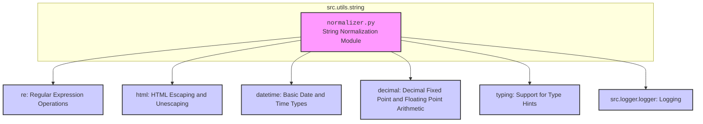

### **Системные инструкции для обработки кода проекта `hypotez`**

=========================================================================================

Описание функциональности и правил для генерации, анализа и улучшения кода. Направлено на обеспечение последовательного и читаемого стиля кодирования, соответствующего требованиям.

---

### **Основные принципы**

#### **1. Общие указания**:
- Соблюдай четкий и понятный стиль кодирования.
- Все изменения должны быть обоснованы и соответствовать установленным требованиям.

#### **2. Комментарии**:
- Используй `#` для внутренних комментариев.
- Документация всех функций, методов и классов должна следовать такому формату: 
    ```python
        def function(param: str, param1: Optional[str | dict | str] = None) -> dict | None:
            """ 
            Args:
                param (str): Описание параметра `param`.
                param1 (Optional[str | dict | str], optional): Описание параметра `param1`. По умолчанию `None`.
    
            Returns:
                dict | None: Описание возвращаемого значения. Возвращает словарь или `None`.
    
            Raises:
                SomeError: Описание ситуации, в которой возникает исключение `SomeError`.

            Ехаmple:
                >>> function('param', 'param1')
                {'param': 'param1'}
            """
    ```
- Комментарии и документация должны быть четкими, лаконичными и точными.

#### **3. Форматирование кода**:
- Используй одинарные кавычки. `a:str = 'value'`, `print('Hello World!')`;
- Добавляй пробелы вокруг операторов. Например, `x = 5`;
- Все параметры должны быть аннотированы типами. `def function(param: str, param1: Optional[str | dict | str] = None) -> dict | None:`;
- Не используй `Union`. Вместо этого используй `|`.

#### **4. Логирование**:
- Для логгирования Всегда Используй модуль `logger` из `src.logger.logger`.
- Ошибки должны логироваться с использованием `logger.error`.
Пример:
    ```python
        try:
            ...
        except Exception as ex:
            logger.error('Error while processing data', ех, exc_info=True)
    ```
#### **5 Не используй `Union[]` в коде. Вместо него используй `|`
Например:
```python
x: str | int ...
```


---

### **Основные требования**:

#### **1. Формат ответов в Markdown**:
- Все ответы должны быть выполнены в формате **Markdown**.

#### **2. Формат комментариев**:
- Используй указанный стиль для комментариев и документации в коде.
- Пример:

```python
from typing import Generator, Optional, List
from pathlib import Path


def read_text_file(
    file_path: str | Path,
    as_list: bool = False,
    extensions: Optional[List[str]] = None,
    chunk_size: int = 8192,
) -> Generator[str, None, None] | str | None:
    """
    Считывает содержимое файла (или файлов из каталога) с использованием генератора для экономии памяти.

    Args:
        file_path (str | Path): Путь к файлу или каталогу.
        as_list (bool): Если `True`, возвращает генератор строк.
        extensions (Optional[List[str]]): Список расширений файлов для чтения из каталога.
        chunk_size (int): Размер чанков для чтения файла в байтах.

    Returns:
        Generator[str, None, None] | str | None: Генератор строк, объединенная строка или `None` в случае ошибки.

    Raises:
        Exception: Если возникает ошибка при чтении файла.

    Example:
        >>> from pathlib import Path
        >>> file_path = Path('example.txt')
        >>> content = read_text_file(file_path)
        >>> if content:
        ...    print(f'File content: {content[:100]}...')
        File content: Example text...
    """
    ...
```
- Всегда делай подробные объяснения в комментариях. Избегай расплывчатых терминов, 
- таких как *«получить»* или *«делать»*
-  . Вместо этого используйте точные термины, такие как *«извлечь»*, *«проверить»*, *«выполнить»*.
- Вместо: *«получаем»*, *«возвращаем»*, *«преобразовываем»* используй имя объекта *«функция получае»*, *«переменная возвращает»*, *«код преобразовывает»* 
- Комментарии должны непосредственно предшествовать описываемому блоку кода и объяснять его назначение.

#### **3. Пробелы вокруг операторов присваивания**:
- Всегда добавляйте пробелы вокруг оператора `=`, чтобы повысить читаемость.
- Примеры:
  - **Неправильно**: `x=5`
  - **Правильно**: `x = 5`

#### **4. Использование `j_loads` или `j_loads_ns`**:
- Для чтения JSON или конфигурационных файлов замените стандартное использование `open` и `json.load` на `j_loads` или `j_loads_ns`.
- Пример:

```python
# Неправильно:
with open('config.json', 'r', encoding='utf-8') as f:
    data = json.load(f)

# Правильно:
data = j_loads('config.json')
```

#### **5. Сохранение комментариев**:
- Все существующие комментарии, начинающиеся с `#`, должны быть сохранены без изменений в разделе «Улучшенный код».
- Если комментарий кажется устаревшим или неясным, не изменяйте его. Вместо этого отметьте его в разделе «Изменения».

#### **6. Обработка `...` в коде**:
- Оставляйте `...` как указатели в коде без изменений.
- Не документируйте строки с `...`.
```

#### **7. Аннотации**
Для всех переменных должны быть определены аннотации типа. 
Для всех функций все входные и выходные параметры аннотириваны
Для все параметров должны быть аннотации типа.


### **8. webdriver**
В коде используется webdriver. Он импртируется из модуля `webdriver` проекта `hypotez`
```python
from src.webdirver import Driver, Chrome, Firefox, Playwright, ...
driver = Driver(Firefox)

Пoсле чего может использоваться как

close_banner = {
  "attribute": null,
  "by": "XPATH",
  "selector": "//button[@id = 'closeXButton']",
  "if_list": "first",
  "use_mouse": false,
  "mandatory": false,
  "timeout": 0,
  "timeout_for_event": "presence_of_element_located",
  "event": "click()",
  "locator_description": "Закрываю pop-up окно, если оно не появилось - не страшно (`mandatory`:`false`)"
}

result = driver.execute_locator(close_banner)
```

### **Анализ кода `hypotez/src/utils/string/normalizer.py`**

#### **1. Блок-схема**

```mermaid
graph TD
    A[Начало] --> B{Тип данных?};
    B -- Строка/Список строк --> C[normalize_string];
    B -- Число --> D[normalize_int или normalize_float];
    B -- Булево значение --> E[normalize_boolean];
    B -- Дата --> F[normalize_sql_date];
    B -- SKU --> G[normalize_sku];
    B -- Другое --> H[Конец с исходным значением];

    C --> C1{Список строк?};
    C1 -- Да --> C2[Объединение в строку];
    C1 -- Нет --> C2;
    C2 --> C3[remove_html_tags];
    C3 --> C4[remove_line_breaks];
    C4 --> C5[remove_special_characters];
    C5 --> C6[Удаление лишних пробелов];
    C6 --> C7[Кодировка в UTF-8];
    C7 --> I[Конец с нормализованной строкой];

    D --> D1{Целое число?};
    D1 -- Да --> J[Преобразование в int];
    D1 -- Нет --> K[Преобразование во float, затем в int];
    K --> L[Конец с нормализованным int];

    E --> E1{Явное булево значение?};
    E1 -- Да --> M[Возврат значения];
    E1 -- Нет --> N[Преобразование в строку, приведение к нижнему регистру];
    N --> O{Строковое представление "true"?};
    O -- Да --> P[Возврат True];
    O -- Нет --> Q{Строковое представление "false"?};
    Q -- Да --> R[Возврат False];
    Q -- Нет --> S[Конец с исходным значением];

    F --> F1{Строка?};
    F1 -- Да --> F2[Парсинг даты из строки];
    F1 -- Нет --> F3{Объект datetime?};
    F3 -- Да --> F4[Преобразование в формат SQL];
    F3 -- Нет --> H;
    F2 --> F4;
    F4 --> T[Конец с нормализованной датой];
    
    G --> G1[Удаление Hebrew keywords];
    G1 --> G2[Удаление non-alphanumeric characters, кроме hyphens];
    G2 --> U[Конец с нормализованным SKU];

    style A fill:#f9f,stroke:#333,stroke-width:2px
    style I fill:#ccf,stroke:#333,stroke-width:2px
    style L fill:#ccf,stroke:#333,stroke-width:2px
    style P fill:#ccf,stroke:#333,stroke-width:2px
    style R fill:#ccf,stroke:#333,stroke-width:2px
    style T fill:#ccf,stroke:#333,stroke-width:2px
    style U fill:#ccf,stroke:#333,stroke-width:2px
    style H fill:#f9f,stroke:#333,stroke-width:2px
    style M fill:#ccf,stroke:#333,stroke-width:2px
    style F2 fill:#ccf,stroke:#333,stroke-width:2px
```

#### **2. Диаграмма**



**Объяснение зависимостей:**

-   `re`: Модуль регулярных выражений используется для удаления HTML-тегов, специальных символов и нормализации SKU.
-   `html`: Модуль `html` используется для экранирования и деэкранирования HTML-сущностей. В данном коде не используется, но импортирован. Возможно, планировалось использование в будущем.
-   `datetime`: Модуль `datetime` используется для нормализации даты в SQL-формат.
-   `decimal`: Модуль `decimal` используется для точного представления десятичных чисел при нормализации чисел.
-   `typing`: Модуль `typing` используется для аннотации типов.
-   `src.logger.logger`: Модуль логирования используется для записи ошибок и отладочной информации.

#### **3. Объяснение**

**Импорты:**

-   `re`: Используется для работы с регулярными выражениями, например, для удаления HTML-тегов и специальных символов.
-   `html`: Используется для экранирования и деэкранирования HTML-сущностей. В данном коде не используется, но импортирован. Возможно, планировалось использование в будущем.
-   `datetime`: Используется для работы с датами и временем, в частности, для нормализации даты в SQL-формат.
-   `decimal`: Используется для работы с десятичными числами с фиксированной точностью. Это позволяет избежать проблем с округлением, которые могут возникнуть при использовании `float`.
-   `typing`: Используется для статической типизации, что позволяет улучшить читаемость и надежность кода.
-   `src.logger.logger`: Используется для логирования ошибок и отладочной информации. Это позволяет упростить отладку и мониторинг работы кода.

**Функции:**

-   `normalize_boolean(input_data: Any) -> bool`:
    -   Аргумент: `input_data` - данные любого типа, которые могут быть преобразованы в булево значение.
    -   Возвращает: булево значение.
    -   Назначение: Преобразует входные данные в булево значение. Поддерживает различные представления булевых значений, такие как строки (`'true'`, `'false'`, `'yes'`, `'no'`, `'1'`, `'0'`), числа (1, 0) и булевы значения (`True`, `False`).
    -   Пример: `normalize_boolean('yes')` вернет `True`.
    -   В случае ошибки логирует ошибку и возвращает исходное значение.
-   `normalize_string(input_data: str | list) -> str`:
    -   Аргумент: `input_data` - строка или список строк.
    -   Возвращает: нормализованная строка в кодировке UTF-8.
    -   Назначение: Нормализует строку, удаляя HTML-теги, разрывы строк, специальные символы и лишние пробелы. Если входные данные - список строк, объединяет их в одну строку.
    -   Пример: `normalize_string(['Hello', ' World! '])` вернет `'Hello World!'`.
    -   В случае ошибки логирует ошибку и возвращает исходное значение в кодировке UTF-8.
-   `normalize_int(input_data: Union[str, int, float, Decimal]) -> int`:
    -   Аргумент: `input_data` - строка, целое число, число с плавающей точкой или Decimal.
    -   Возвращает: целое число.
    -   Назначение: Преобразует входные данные в целое число. Поддерживает различные типы данных, включая строки, числа с плавающей точкой и Decimal.
    -   Пример: `normalize_int('42')` вернет `42`.
    -   В случае ошибки логирует ошибку и возвращает исходное значение.
-   `normalize_float(value: Any) -> float | None`:
    -   Аргумент: `value` - значение любого типа.
    -   Возвращает: число с плавающей точкой или список чисел с плавающей точкой, или None, если преобразование не удалось.
    -   Назначение: Преобразует входное значение в число с плавающей точкой. Если входное значение является списком или кортежем, преобразует каждый элемент списка в число с плавающей точкой.
    -   Пример: `normalize_float("3.14")` вернет `3.14`.
    -   В случае ошибки логирует предупреждение и возвращает исходное значение.
-   `normalize_sql_date(input_data: str) -> str`:
    -   Аргумент: `input_data` - строка, представляющая дату.
    -   Возвращает: нормализованная дата в формате SQL (YYYY-MM-DD) или исходное значение, если преобразование не удалось.
    -   Назначение: Преобразует входную строку в дату в формате SQL (YYYY-MM-DD). Поддерживает различные форматы даты.
    -   Пример: `normalize_sql_date('12/06/2024')` вернет `'2024-12-06'`.
    -   В случае ошибки логирует ошибку и возвращает исходное значение.
-   `simplify_string(input_str: str) -> str`:
    -   Аргумент: `input_str` - строка для упрощения.
    -   Возвращает: упрощенная строка, содержащая только буквы, цифры и символы подчеркивания.
    -   Назначение: Упрощает строку, удаляя все символы, кроме букв, цифр и пробелов, заменяя пробелы символами подчеркивания и удаляя повторяющиеся символы подчеркивания.
    -   Пример: `simplify_string("It's a test string with 'single quotes', numbers 123 and symbols!")` вернет `'Its_a_test_string_with_single_quotes_numbers_123_and_symbols'`.
-   `remove_line_breaks(input_str: str) -> str`:
    -   Аргумент: `input_str` - входная строка.
    -   Возвращает: строка без разрывов строк.
    -   Назначение: Удаляет разрывы строк (`\n` и `\r`) из входной строки и удаляет лишние пробелы в начале и конце строки.
-   `remove_html_tags(input_html: str) -> str`:
    -   Аргумент: `input_html` - входная HTML-строка.
    -   Возвращает: строка без HTML-тегов.
    -   Назначение: Удаляет все HTML-теги из входной строки.
-   `remove_special_characters(input_str: str | list, chars: list[str] = None) -> str | list`:
    -   Аргументы: `input_str` - входная строка или список строк, `chars` (optional) - список символов для удаления. По умолчанию `None`.
    -   Возвращает: строка или список строк без указанных специальных символов.
    -   Назначение: Удаляет указанные специальные символы из входной строки или списка строк. Если список символов не указан, удаляет символы `#`.
-   `normalize_sku(input_str: str) -> str`:
    -   Аргумент: `input_str` - строка, содержащая SKU.
    -   Возвращает: нормализованная строка SKU.
    -   Назначение: Нормализует SKU, удаляя определенные ключевые слова на иврите и все не-буквенно-цифровые символы, за исключением дефисов.

**Переменные:**

-   `original_input`: Используется для сохранения исходного значения входных данных. В случае ошибки при обработке данных, функция возвращает исходное значение.
-   `logger`: Экземпляр логгера из `src.logger.logger`. Используется для логирования ошибок и отладочной информации.

**Потенциальные ошибки и области для улучшения:**

-   В некоторых функциях, таких как `normalize_float`, в случае ошибки логируется только предупреждение (`logger.warning`). Возможно, стоит логировать ошибку (`logger.error`) в зависимости от серьезности ситуации.
-   В функции `remove_special_characters` по умолчанию удаляется только символ `#`. Возможно, стоит добавить возможность указания других символов по умолчанию через конфигурацию.
-   В коде используется `Union[str, int, float, Decimal]`. Лучше использовать `str | int | float | Decimal`.

**Взаимосвязь с другими частями проекта:**

-   Модуль `normalizer.py` использует модуль `src.logger.logger` для логирования ошибок и отладочной информации.
-   Функции `normalize_string`, `normalize_int`, `normalize_float`, `normalize_boolean`, `normalize_sql_date`, `simplify_string`, `remove_line_breaks`, `remove_html_tags`, `remove_special_characters`, `normalize_sku` могут быть использованы в других частях проекта для нормализации данных, например, при обработке данных из внешних источников (файлов, баз данных, API).