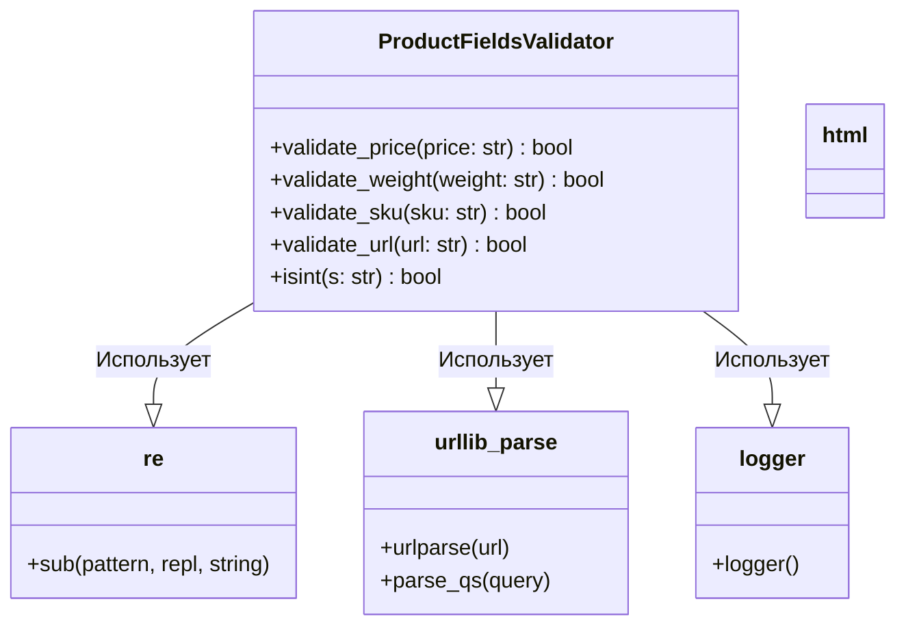

### **Системные инструкции для обработки кода проекта `hypotez`**

=========================================================================================

Описание функциональности и правил для генерации, анализа и улучшения кода. Направлено на обеспечение последовательного и читаемого стиля кодирования, соответствующего требованиям.

---

### **Основные принципы**

#### **1. Общие указания**:
- Соблюдай четкий и понятный стиль кодирования.
- Все изменения должны быть обоснованы и соответствовать установленным требованиям.

#### **2. Комментарии**:
- Используй `#` для внутренних комментариев.
- Документация всех функций, методов и классов должна следовать такому формату: 
    ```python
        def function(param: str, param1: Optional[str | dict | str] = None) -> dict | None:
            """ 
            Args:
                param (str): Описание параметра `param`.
                param1 (Optional[str | dict | str], optional): Описание параметра `param1`. По умолчанию `None`.
    
            Returns:
                dict | None: Описание возвращаемого значения. Возвращает словарь или `None`.
    
            Raises:
                SomeError: Описание ситуации, в которой возникает исключение `SomeError`.

            Ехаmple:
                >>> function('param', 'param1')
                {'param': 'param1'}
            """
    ```
- Комментарии и документация должны быть четкими, лаконичными и точными.

#### **3. Форматирование кода**:
- Используй одинарные кавычки. `a:str = 'value'`, `print('Hello World!')`;
- Добавляй пробелы вокруг операторов. Например, `x = 5`;
- Все параметры должны быть аннотированы типами. `def function(param: str, param1: Optional[str | dict | str] = None) -> dict | None:`;
- Не используй `Union`. Вместо этого используй `|`.

#### **4. Логирование**:
- Для логгирования Всегда Используй модуль `logger` из `src.logger.logger`.
- Ошибки должны логироваться с использованием `logger.error`.
Пример:
    ```python
        try:
            ...
        except Exception as ex:
            logger.error('Error while processing data', ех, exc_info=True)
    ```
#### **5 Не используй `Union[]` в коде. Вместо него используй `|`
Например:
```python
x: str | int ...
```


---

### **Основные требования**:

#### **1. Формат ответов в Markdown**:
- Все ответы должны быть выполнены в формате **Markdown**.

#### **2. Формат комментариев**:
- Используй указанный стиль для комментариев и документации в коде.
- Пример:

```python
from typing import Generator, Optional, List
from pathlib import Path


def read_text_file(
    file_path: str | Path,
    as_list: bool = False,
    extensions: Optional[List[str]] = None,
    chunk_size: int = 8192,
) -> Generator[str, None, None] | str | None:
    """
    Считывает содержимое файла (или файлов из каталога) с использованием генератора для экономии памяти.

    Args:
        file_path (str | Path): Путь к файлу или каталогу.
        as_list (bool): Если `True`, возвращает генератор строк.
        extensions (Optional[List[str]]): Список расширений файлов для чтения из каталога.
        chunk_size (int): Размер чанков для чтения файла в байтах.

    Returns:
        Generator[str, None, None] | str | None: Генератор строк, объединенная строка или `None` в случае ошибки.

    Raises:
        Exception: Если возникает ошибка при чтении файла.

    Example:
        >>> from pathlib import Path
        >>> file_path = Path('example.txt')
        >>> content = read_text_file(file_path)
        >>> if content:
        ...    print(f'File content: {content[:100]}...')
        File content: Example text...
    """
    ...
```
- Всегда делай подробные объяснения в комментариях. Избегай расплывчатых терминов, 
- таких как *«получить»* или *«делать»*
-  . Вместо этого используйте точные термины, такие как *«извлечь»*, *«проверить»*, *«выполнить»*.
- Вместо: *«получаем»*, *«возвращаем»*, *«преобразовываем»* используй имя объекта *«функция получае»*, *«переменная возвращает»*, *«код преобразовывает»* 
- Комментарии должны непосредственно предшествовать описываемому блоку кода и объяснять его назначение.

#### **3. Пробелы вокруг операторов присваивания**:
- Всегда добавляйте пробелы вокруг оператора `=`, чтобы повысить читаемость.
- Примеры:
  - **Неправильно**: `x=5`
  - **Правильно**: `x = 5`

#### **4. Использование `j_loads` или `j_loads_ns`**:
- Для чтения JSON или конфигурационных файлов замените стандартное использование `open` и `json.load` на `j_loads` или `j_loads_ns`.
- Пример:

```python
# Неправильно:
with open('config.json', 'r', encoding='utf-8') as f:
    data = json.load(f)

# Правильно:
data = j_loads('config.json')
```

#### **5. Сохранение комментариев**:
- Все существующие комментарии, начинающиеся с `#`, должны быть сохранены без изменений в разделе «Улучшенный код».
- Если комментарий кажется устаревшим или неясным, не изменяйте его. Вместо этого отметьте его в разделе «Изменения».

#### **6. Обработка `...` в коде**:
- Оставляйте `...` как указатели в коде без изменений.
- Не документируйте строки с `...`.
```

#### **7. Аннотации**
Для всех переменных должны быть определены аннотации типа. 
Для всех функций все входные и выходные параметры аннотириваны
Для все параметров должны быть аннотации типа.


### **8. webdriver**
В коде используется webdriver. Он импртируется из модуля `webdriver` проекта `hypotez`
```python
from src.webdirver import Driver, Chrome, Firefox, Playwright, ...
driver = Driver(Firefox)

Пoсле чего может использоваться как

close_banner = {
  "attribute": null,
  "by": "XPATH",
  "selector": "//button[@id = 'closeXButton']",
  "if_list": "first",
  "use_mouse": false,
  "mandatory": false,
  "timeout": 0,
  "timeout_for_event": "presence_of_element_located",
  "event": "click()",
  "locator_description": "Закрываю pop-up окно, если оно не появилось - не страшно (`mandatory`:`false`)"
}

result = driver.execute_locator(close_banner)
```

### **Анализ кода `hypotez/src/utils/string/validator.py`**

#### **1. Блок-схема**

```mermaid
graph LR
    A[Начало] --> B{Функция валидации вызвана?};
    B -- Да --> C{Входные данные присутствуют?};
    C -- Да --> D[Очистка и обработка данных];
    D --> E{Проверка на соответствие условиям?};
    E -- Да --> F[Вернуть True];
    E -- Нет --> G[Вернуть None/False];
    C -- Нет --> G;
    B -- Нет --> H[Конец];
    F --> H;
    G --> H;
    
    subgraph validate_price
    D[Очистка и обработка данных] --> D1[Удаление лишних символов из цены (Ptrn.clear_price.sub)]
    D1 --> D2[Замена запятой на точку]
    D2 --> D3[Преобразование в float]
    end
    
    subgraph validate_weight
    D[Очистка и обработка данных] --> D4[Удаление лишних символов из веса (Ptrn.clear_number.sub)]
    D4 --> D5[Замена запятой на точку]
    D5 --> D6[Преобразование в float]
    end

    subgraph validate_sku
    D[Очистка и обработка данных] --> D7[Удаление специальных символов (StringFormatter.remove_special_characters)]
    D7 --> D8[Удаление переносов строк (StringFormatter.remove_line_breaks)]
    D8 --> D9[Удаление пробелов в начале и конце строки (strip)]
    D9 --> D10[Проверка длины строки (len(sku) < 3)]
    end
    
    subgraph validate_url
    D[Очистка и обработка данных] --> D11[Удаление пробелов в начале и конце строки (strip)]
    D11 --> D12[Проверка наличия 'http' в начале URL]
    D12 --> D13[Добавление 'http://' если отсутствует]
    D13 --> D14[Разбор URL (urlparse)]
    D14 --> D15[Проверка netloc и scheme]
    end
    
    subgraph isint
    D[Очистка и обработка данных] --> D16[Преобразование в int]
    end
```

#### **2. Диаграмма**



**Объяснение зависимостей:**

-   `ProductFieldsValidator` использует модуль `re` для работы с регулярными выражениями, например, для очистки цен и других числовых значений от лишних символов.
-   `ProductFieldsValidator` использует модуль `urllib.parse` для разбора URL-адресов и извлечения компонентов, таких как схема и домен.
-   `ProductFieldsValidator` использует модуль `logger` для логирования событий и ошибок.
-   `ProductFieldsValidator` использует модуль `html`
#### **3. Объяснение**

**Импорты:**

*   `re`: Используется для работы с регулярными выражениями. Например, для удаления лишних символов из цены или веса.
*   `html`: Предоставляет инструменты для работы с HTML, такие как экранирование и удаление HTML-тегов.
*   `urllib.parse`: Используется для разбора URL-адресов, чтобы проверить их структуру и компоненты.
    *   `urlparse`: Разбивает URL на компоненты, такие как схема, домен, путь и параметры.
    *   `parse_qs`: Разбирает строку запроса URL в словарь.
*   `typing.Union`: Позволяет указывать, что переменная или параметр функции может иметь один из нескольких типов.
*   `src.logger.logger`:  Используется для логирования различных событий и ошибок внутри модуля.

**Классы:**

*   `ProductFieldsValidator`:
    *   **Роль**: Предоставляет статические методы для валидации различных полей продукта, таких как цена, вес, артикул и URL.
    *   **Атрибуты**: Отсутствуют.
    *   **Методы**:
        *   `validate_price(price: str) -> bool`: Проверяет, является ли строка `price` корректной ценой. Удаляет лишние символы, заменяет запятую на точку и пытается преобразовать в `float`.
        *   `validate_weight(weight: str) -> bool`: Проверяет, является ли строка `weight` корректным весом. Аналогично `validate_price`, удаляет лишние символы и пытается преобразовать в `float`.
        *   `validate_sku(sku: str) -> bool`: Проверяет, является ли строка `sku` корректным артикулом. Удаляет специальные символы, переносы строк и проверяет длину строки.
        *   `validate_url(url: str) -> bool`: Проверяет, является ли строка `url` корректным URL-адресом. Добавляет "http://", если отсутствует, и проверяет структуру URL.
        *   `isint(s: str) -> bool`: Проверяет, можно ли строку `s` преобразовать в целое число.

**Функции:**

*   `validate_price(price: str) -> bool`:
    *   **Аргументы**:
        *   `price` (str): Строка, представляющая цену продукта.
    *   **Возвращаемое значение**:
        *   `bool`: `True`, если `price` является корректной ценой, иначе `None`.
    *   **Назначение**: Проверяет, является ли строка корректной ценой, удаляя лишние символы и преобразуя в `float`.
    *   **Пример**:
        ```python
        ProductFieldsValidator.validate_price("123,45")  # Возвращает True
        ProductFieldsValidator.validate_price("abc")     # Возвращает None
        ```
*   `validate_weight(weight: str) -> bool`:
    *   **Аргументы**:
        *   `weight` (str): Строка, представляющая вес продукта.
    *   **Возвращаемое значение**:
        *   `bool`: `True`, если `weight` является корректным весом, иначе `None`.
    *   **Назначение**: Проверяет, является ли строка корректным весом, удаляя лишние символы и преобразуя в `float`.
    *   **Пример**:
        ```python
        ProductFieldsValidator.validate_weight("1.5 kg") # Возвращает True
        ProductFieldsValidator.validate_weight("xyz")    # Возвращает None
        ```
*   `validate_sku(sku: str) -> bool`:
    *   **Аргументы**:
        *   `sku` (str): Строка, представляющая артикул продукта.
    *   **Возвращаемое значение**:
        *   `bool`: `True`, если `sku` является корректным артикулом, иначе `None`.
    *   **Назначение**: Проверяет, является ли строка корректным артикулом, удаляя специальные символы и проверяя длину строки.
    *   **Пример**:
        ```python
        ProductFieldsValidator.validate_sku("ABC-123")   # Возвращает True
        ProductFieldsValidator.validate_sku("A")        # Возвращает None
        ```
*   `validate_url(url: str) -> bool`:
    *   **Аргументы**:
        *   `url` (str): Строка, представляющая URL-адрес продукта.
    *   **Возвращаемое значение**:
        *   `bool`: `True`, если `url` является корректным URL-адресом, иначе `None`.
    *   **Назначение**: Проверяет, является ли строка корректным URL-адресом, добавляя "http://", если необходимо, и проверяя структуру URL.
    *   **Пример**:
        ```python
        ProductFieldsValidator.validate_url("example.com") # Возвращает True
        ProductFieldsValidator.validate_url("invalid")     # Возвращает None
        ```
*   `isint(s: str) -> bool`:
    *   **Аргументы**:
        *   `s` (str): Строка, которую нужно проверить на возможность преобразования в целое число.
    *   **Возвращаемое значение**:
        *   `bool`: `True`, если `s` можно преобразовать в целое число, иначе `None`.
    *   **Назначение**: Проверяет, является ли строка целым числом.
    *   **Пример**:
        ```python
        ProductFieldsValidator.isint("123")   # Возвращает True
        ProductFieldsValidator.isint("1.23")  # Возвращает None
        ```

**Переменные:**

*   `price` (str):  Входной параметр для `validate_price`, строка, представляющая цену.
*   `weight` (str): Входной параметр для `validate_weight`, строка, представляющая вес.
*   `sku` (str): Входной параметр для `validate_sku`, строка, представляющая артикул.
*   `url` (str): Входной параметр для `validate_url`, строка, представляющая URL.
*   `s` (str): Входной параметр для `isint`, строка, которую нужно проверить.

**Потенциальные ошибки и области для улучшения:**

*   В функциях `validate_price` и `validate_weight` отсутствует явный возврат `False` в случае ошибки, возвращается `None`. Лучше явно возвращать `False`.
*   Отсутствует обработка исключений, связанных с регулярными выражениями.
*   В `validate_url` происходит добавление "http://", если его нет. Возможно, стоит добавить проверку на "https://" и не добавлять "http://", если есть "https://".
*   Везде отсутствует логирование ошибок. Если валидация не проходит, желательно записывать это в лог.
*   Отсутствуют аннотации типа для переменных внутри функций.

**Взаимосвязи с другими частями проекта:**

*   Этот модуль используется для валидации данных, полученных из других частей проекта, например, из веб-страниц или API.
*   Использует `src.logger.logger` для логирования, что позволяет отслеживать ошибки и ход выполнения программы.
*   Может быть использован в модулях, связанных с обработкой данных о продуктах, таких как каталоги, списки и т.д.

```mermaid
flowchart TD
    Start --> A[src.logger.logger]
    A --> B[ProductFieldsValidator]
    B --> End
    style Start fill:#f9f,stroke:#333,stroke-width:2px
    style End fill:#f9f,stroke:#333,stroke-width:2px