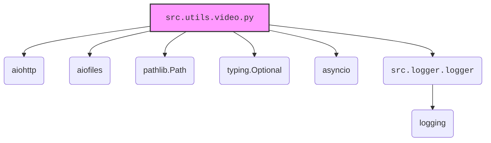

### **Системные инструкции для обработки кода проекта `hypotez`**

=========================================================================================

Описание функциональности и правил для генерации, анализа и улучшения кода. Направлено на обеспечение последовательного и читаемого стиля кодирования, соответствующего требованиям.

---

### **Основные принципы**

#### **1. Общие указания**:
- Соблюдай четкий и понятный стиль кодирования.
- Все изменения должны быть обоснованы и соответствовать установленным требованиям.

#### **2. Комментарии**:
- Используй `#` для внутренних комментариев.
- Документация всех функций, методов и классов должна следовать такому формату: 
    ```python
        def function(param: str, param1: Optional[str | dict | str] = None) -> dict | None:
            """ 
            Args:
                param (str): Описание параметра `param`.
                param1 (Optional[str | dict | str], optional): Описание параметра `param1`. По умолчанию `None`.
    
            Returns:
                dict | None: Описание возвращаемого значения. Возвращает словарь или `None`.
    
            Raises:
                SomeError: Описание ситуации, в которой возникает исключение `SomeError`.

            Ехаmple:
                >>> function('param', 'param1')
                {'param': 'param1'}
            """
    ```
- Комментарии и документация должны быть четкими, лаконичными и точными.

#### **3. Форматирование кода**:
- Используй одинарные кавычки. `a:str = 'value'`, `print('Hello World!')`;
- Добавляй пробелы вокруг операторов. Например, `x = 5`;
- Все параметры должны быть аннотированы типами. `def function(param: str, param1: Optional[str | dict | str] = None) -> dict | None:`;
- Не используй `Union`. Вместо этого используй `|`.

#### **4. Логирование**:
- Для логгирования Всегда Используй модуль `logger` из `src.logger.logger`.
- Ошибки должны логироваться с использованием `logger.error`.
Пример:
    ```python
        try:
            ...
        except Exception as ex:
            logger.error('Error while processing data', ех, exc_info=True)
    ```
#### **5 Не используй `Union[]` в коде. Вместо него используй `|`
Например:
```python
x: str | int ...
```


---

### **Основные требования**:

#### **1. Формат ответов в Markdown**:
- Все ответы должны быть выполнены в формате **Markdown**.

#### **2. Формат комментариев**:
- Используй указанный стиль для комментариев и документации в коде.
- Пример:

```python
from typing import Generator, Optional, List
from pathlib import Path


def read_text_file(
    file_path: str | Path,
    as_list: bool = False,
    extensions: Optional[List[str]] = None,
    chunk_size: int = 8192,
) -> Generator[str, None, None] | str | None:
    """
    Считывает содержимое файла (или файлов из каталога) с использованием генератора для экономии памяти.

    Args:
        file_path (str | Path): Путь к файлу или каталогу.
        as_list (bool): Если `True`, возвращает генератор строк.
        extensions (Optional[List[str]]): Список расширений файлов для чтения из каталога.
        chunk_size (int): Размер чанков для чтения файла в байтах.

    Returns:
        Generator[str, None, None] | str | None: Генератор строк, объединенная строка или `None` в случае ошибки.

    Raises:
        Exception: Если возникает ошибка при чтении файла.

    Example:
        >>> from pathlib import Path
        >>> file_path = Path('example.txt')
        >>> content = read_text_file(file_path)
        >>> if content:
        ...    print(f'File content: {content[:100]}...')
        File content: Example text...
    """
    ...
```
- Всегда делай подробные объяснения в комментариях. Избегай расплывчатых терминов, 
- таких как *«получить»* или *«делать»*. Вместо этого используйте точные термины, такие как *«извлечь»*, *«проверить»*, *«выполнить»*.
- Вместо: *«получаем»*, *«возвращаем»*, *«преобразовываем»* используй имя объекта *«функция получае»*, *«переменная возвращает»*, *«код преобразовывает»* 
- Комментарии должны непосредственно предшествовать описываемому блоку кода и объяснять его назначение.

#### **3. Пробелы вокруг операторов присваивания**:
- Всегда добавляйте пробелы вокруг оператора `=`, чтобы повысить читаемость.
- Примеры:
  - **Неправильно**: `x=5`
  - **Правильно**: `x = 5`

#### **4. Использование `j_loads` или `j_loads_ns`**:
- Для чтения JSON или конфигурационных файлов замените стандартное использование `open` и `json.load` на `j_loads` или `j_loads_ns`.
- Пример:

```python
# Неправильно:
with open('config.json', 'r', encoding='utf-8') as f:
    data = json.load(f)

# Правильно:
data = j_loads('config.json')
```

#### **5. Сохранение комментариев**:
- Все существующие комментарии, начинающиеся с `#`, должны быть сохранены без изменений в разделе «Улучшенный код».
- Если комментарий кажется устаревшим или неясным, не изменяйте его. Вместо этого отметьте его в разделе «Изменения».

#### **6. Обработка `...` в коде**:
- Оставляйте `...` как указатели в коде без изменений.
- Не документируйте строки с `...`.
```

#### **7. Аннотации**
Для всех переменных должны быть определены аннотации типа. 
Для всех функций все входные и выходные параметры аннотириваны
Для все параметров должны быть аннотации типа.


### **8. webdriver**
В коде используется webdriver. Он импртируется из модуля `webdriver` проекта `hypotez`
```python
from src.webdirver import Driver, Chrome, Firefox, Playwright, ...
driver = Driver(Firefox)

Пoсле чего может использоваться как

close_banner = {
  "attribute": null,
  "by": "XPATH",
  "selector": "//button[@id = 'closeXButton']",
  "if_list": "first",
  "use_mouse": false,
  "mandatory": false,
  "timeout": 0,
  "timeout_for_event": "presence_of_element_located",
  "event": "click()",
  "locator_description": "Закрываю pop-up окно, если оно не появилось - не страшно (`mandatory`:`false`)"
}

result = driver.execute_locator(close_banner)
```

### Анализ кода `hypotez/src/utils/video.py`

#### 1. Блок-схема:

```mermaid
graph TD
    A[Начало] --> B{save_video_from_url(url, save_path)};
    B -- Да --> C[Создание асинхронной сессии aiohttp.ClientSession];
    C --> D{Получение видео по URL (session.get(url))};
    D -- Успех --> E[Проверка HTTP статуса (response.raise_for_status())];
    E -- Успех --> F[Создание родительских директорий (save_path.parent.mkdir)];
    F --> G[Открытие файла для записи (aiofiles.open(save_path, "wb"))];
    G --> H{Чтение файла по частям (response.content.read(8192))};
    H -- Данные есть --> I[Запись части в файл (file.write(chunk))];
    I --> H;
    H -- Нет данных --> J[Закрытие файла];
    J --> K{Проверка существования файла (save_path.exists())};
    K -- Да --> L{Проверка размера файла (save_path.stat().st_size > 0)};
    L -- Да --> M[Возврат пути к файлу (save_path)];
    L -- Нет --> N[Логирование ошибки (logger.error) и возврат None];
    K -- Нет --> N;
    D -- Ошибка --> O[Логирование ошибки сети (logger.error) и возврат None];
    E -- Ошибка --> O;
    G -- Ошибка --> P[Логирование ошибки сохранения (logger.error) и возврат None];
    N --> Q[Конец];
    O --> Q;
    P --> Q;
    M --> Q;
    B -- Нет --> Q;

    subgraph save_video_from_url
    C
    D
    E
    F
    G
    H
    I
    J
    K
    L
    M
    N
    O
    P
    end

    subgraph get_video_data
    AA[Начало] --> BB{get_video_data(file_name)};
    BB -- Да --> CC{Проверка существования файла (file_path.exists())};
    CC -- Да --> DD[Открытие файла для чтения (open(file_path, "rb"))];
    DD --> EE[Чтение данных из файла (file.read())];
    EE --> FF[Возврат данных файла];
    DD -- Ошибка --> GG[Логирование ошибки чтения (logger.error) и возврат None];
    CC -- Нет --> HH[Логирование ошибки (logger.error) и возврат None];
    BB -- Нет --> HH;
    GG --> II[Конец];
    HH --> II;
    FF --> II;
    end
```

#### 2. Диаграмма зависимостей:



**Объяснение зависимостей:**

-   `aiohttp`: Используется для асинхронных HTTP-запросов, что необходимо для скачивания видео из интернета.
-   `aiofiles`: Используется для асинхронной работы с файлами, в частности, для записи скачанного видео на диск.
-   `pathlib.Path`: Используется для работы с путями к файлам и директориям, что упрощает операции создания директорий и проверки существования файлов.
-   `typing.Optional`: Используется для указания, что функция может возвращать значение определенного типа или `None`.
-   `asyncio`: Используется для поддержки асинхронного программирования, необходимого для асинхронного скачивания и сохранения видео.
-   `src.logger.logger`: Используется для логирования ошибок и других событий, происходящих в процессе скачивания и сохранения видео.

#### 3. Объяснение кода:

**Импорты:**

-   `aiohttp`: Асинхронная HTTP клиентская библиотека. Используется для выполнения HTTP-запросов к URL видео.
-   `aiofiles`: Асинхронная файловая библиотека. Используется для записи скачанного видео в файл.
-   `pathlib.Path`: Предоставляет способ представления путей к файлам и директориям. Используется для работы с путями сохранения видео.
-   `typing.Optional`: Используется для обозначения, что переменная может быть `None`.
-   `asyncio`: Используется для асинхронного выполнения операций.
-   `src.logger.logger`: Модуль логирования для записи информации об ошибках и событиях.

**Функции:**

-   `save_video_from_url(url: str, save_path: str) -> Optional[Path]`:
    -   **Аргументы:**
        -   `url` (str): URL видео для скачивания.
        -   `save_path` (str): Путь для сохранения скачанного видео.
    -   **Возвращаемое значение:**
        -   `Optional[Path]`: Путь к сохраненному файлу или `None` в случае ошибки.
    -   **Назначение:**
        -   Асинхронно скачивает видео по указанному URL и сохраняет его по указанному пути.
        -   Обрабатывает возможные сетевые ошибки (например, `aiohttp.ClientError`) и ошибки файловой системы.
        -   Проверяет, был ли файл успешно сохранен и не является ли он пустым.
        -   Использует `logger.error` для записи информации об ошибках.
    -   **Пример:**
        ```python
        import asyncio
        async def main():
            url = "https://example.com/video.mp4"
            save_path = "local_video.mp4"
            result = await save_video_from_url(url, save_path)
            if result:
                print(f"Видео сохранено в {result}")
        asyncio.run(main())
        ```

-   `get_video_data(file_name: str) -> Optional[bytes]`:
    -   **Аргументы:**
        -   `file_name` (str): Путь к видеофайлу для чтения.
    -   **Возвращаемое значение:**
        -   `Optional[bytes]`: Бинарные данные файла, если он существует, или `None` в случае ошибки.
    -   **Назначение:**
        -   Считывает бинарные данные видеофайла.
        -   Проверяет существование файла перед чтением.
        -   Обрабатывает ошибки файловой системы.
        -   Использует `logger.error` для записи информации об ошибках.
    -   **Пример:**
        ```python
        data = get_video_data("local_video.mp4")
        if data:
            print(data[:10])  # Вывод первых 10 байт
        ```

**Переменные:**

-   `url` (str): URL видео для скачивания (в `main()`).
-   `save_path` (str): Путь для сохранения скачанного видео (в `main()`).
-   `result` (Optional[Path]): Результат выполнения `save_video_from_url()` (в `main()`).
-   `file_path` (pathlib.Path): Представление пути к файлу (в `get_video_data()`).

**Потенциальные ошибки и области для улучшения:**

-   Не хватает обработки случаев, когда видеофайл слишком большой. Можно добавить ограничение на размер скачиваемого файла.
-   Отсутствует механизм для возобновления скачивания файла в случае обрыва соединения.
-   В `save_video_from_url` отсутствует прогресс-бар или другая индикация процесса скачивания.

**Взаимосвязи с другими частями проекта:**

-   `src.logger.logger`: Используется для логирования ошибок и событий, что позволяет отслеживать состояние операций скачивания и сохранения видео.