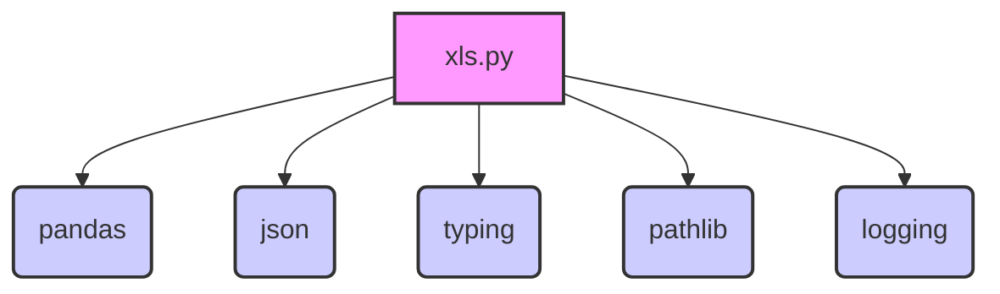

### **Системные инструкции для обработки кода проекта `hypotez`**

=========================================================================================

Описание функциональности и правил для генерации, анализа и улучшения кода. Направлено на обеспечение последовательного и читаемого стиля кодирования, соответствующего требованиям.

---

### **Основные принципы**

#### **1. Общие указания**:
- Соблюдай четкий и понятный стиль кодирования.
- Все изменения должны быть обоснованы и соответствовать установленным требованиям.

#### **2. Комментарии**:
- Используй `#` для внутренних комментариев.
- Документация всех функций, методов и классов должна следовать такому формату: 
    ```python
        def function(param: str, param1: Optional[str | dict | str] = None) -> dict | None:
            """ 
            Args:
                param (str): Описание параметра `param`.
                param1 (Optional[str | dict | str], optional): Описание параметра `param1`. По умолчанию `None`.
    
            Returns:
                dict | None: Описание возвращаемого значения. Возвращает словарь или `None`.
    
            Raises:
                SomeError: Описание ситуации, в которой возникает исключение `SomeError`.

            Ехаmple:
                >>> function('param', 'param1')
                {'param': 'param1'}
            """
    ```
- Комментарии и документация должны быть четкими, лаконичными и точными.

#### **3. Форматирование кода**:
- Используй одинарные кавычки. `a:str = 'value'`, `print('Hello World!')`;
- Добавляй пробелы вокруг операторов. Например, `x = 5`;
- Все параметры должны быть аннотированы типами. `def function(param: str, param1: Optional[str | dict | str] = None) -> dict | None:`;
- Не используй `Union`. Вместо этого используй `|`.

#### **4. Логирование**:
- Для логгирования Всегда Используй модуль `logger` из `src.logger.logger`.
- Ошибки должны логироваться с использованием `logger.error`.
Пример:
    ```python
        try:
            ...
        except Exception as ex:
            logger.error('Error while processing data', ех, exc_info=True)
    ```
#### **5 Не используй `Union[]` в коде. Вместо него используй `|`
Например:
```python
x: str | int ...
```


---

### **Основные требования**:

#### **1. Формат ответов в Markdown**:
- Все ответы должны быть выполнены в формате **Markdown**.

#### **2. Формат комментариев**:
- Используй указанный стиль для комментариев и документации в коде.
- Пример:

```python
from typing import Generator, Optional, List
from pathlib import Path


def read_text_file(
    file_path: str | Path,
    as_list: bool = False,
    extensions: Optional[List[str]] = None,
    chunk_size: int = 8192,
) -> Generator[str, None, None] | str | None:
    """
    Считывает содержимое файла (или файлов из каталога) с использованием генератора для экономии памяти.

    Args:
        file_path (str | Path): Путь к файлу или каталогу.
        as_list (bool): Если `True`, возвращает генератор строк.
        extensions (Optional[List[str]]): Список расширений файлов для чтения из каталога.
        chunk_size (int): Размер чанков для чтения файла в байтах.

    Returns:
        Generator[str, None, None] | str | None: Генератор строк, объединенная строка или `None` в случае ошибки.

    Raises:
        Exception: Если возникает ошибка при чтении файла.

    Example:
        >>> from pathlib import Path
        >>> file_path = Path('example.txt')
        >>> content = read_text_file(file_path)
        >>> if content:
        ...    print(f'File content: {content[:100]}...')
        File content: Example text...
    """
    ...
```
- Всегда делай подробные объяснения в комментариях. Избегай расплывчатых терминов, 
- таких как *«получить»* или *«делать»*. Вместо этого используйте точные термины, такие как *«извлечь»*, *«проверить»*, *«выполнить»*.
- Вместо: *«получаем»*, *«возвращаем»*, *«преобразовываем»* используй имя объекта *«функция получае»*, *«переменная возвращает»*, *«код преобразовывает»* 
- Комментарии должны непосредственно предшествовать описываемому блоку кода и объяснять его назначение.

#### **3. Пробелы вокруг операторов присваивания**:
- Всегда добавляйте пробелы вокруг оператора `=`, чтобы повысить читаемость.
- Примеры:
  - **Неправильно**: `x=5`
  - **Правильно**: `x = 5`

#### **4. Использование `j_loads` или `j_loads_ns`**:
- Для чтения JSON или конфигурационных файлов замените стандартное использование `open` и `json.load` на `j_loads` или `j_loads_ns`.
- Пример:

```python
# Неправильно:
with open('config.json', 'r', encoding='utf-8') as f:
    data = json.load(f)

# Правильно:
data = j_loads('config.json')
```

#### **5. Сохранение комментариев**:
- Все существующие комментарии, начинающиеся с `#`, должны быть сохранены без изменений в разделе «Улучшенный код».
- Если комментарий кажется устаревшим или неясным, не изменяйте его. Вместо этого отметьте его в разделе «Изменения».

#### **6. Обработка `...` в коде**:
- Оставляйте `...` как указатели в коде без изменений.
- Не документируйте строки с `...`.
```

#### **7. Аннотации**
Для всех переменных должны быть определены аннотации типа. 
Для всех функций все входные и выходные параметры аннотириваны
Для все параметров должны быть аннотации типа.


### **8. webdriver**
В коде используется webdriver. Он импртируется из модуля `webdriver` проекта `hypotez`
```python
from src.webdirver import Driver, Chrome, Firefox, Playwright, ...
driver = Driver(Firefox)

Пoсле чего может использоваться как

close_banner = {
  "attribute": null,
  "by": "XPATH",
  "selector": "//button[@id = 'closeXButton']",
  "if_list": "first",
  "use_mouse": false,
  "mandatory": false,
  "timeout": 0,
  "timeout_for_event": "presence_of_element_located",
  "event": "click()",
  "locator_description": "Закрываю pop-up окно, если оно не появилось - не страшно (`mandatory`:`false`)"
}

result = driver.execute_locator(close_banner)
```

### **Анализ кода `hypotez/src/utils/xls.py`**

#### **1. Блок-схема**

```mermaid
graph LR
    A[Начало: Вызов read_xls_as_dict(xls_file, json_file, sheet_name)] --> B{Проверка: Существует ли xls_file?};
    B -- Да --> C[Чтение xls_file с помощью pandas.ExcelFile];
    B -- Нет --> E[Логирование ошибки: "Excel file not found"] --> F(Возврат: False);
    C --> D{sheet_name указан?};
    D -- Нет --> G[Итерация по листам Excel];
    G --> H[Чтение каждого листа в DataFrame];
    H --> I[Преобразование DataFrame в dict (orient='records')];
    I --> J[Добавление dict в data_dict];
    J --> K{Все листы обработаны?};
    K -- Нет --> G;
    K -- Да --> L{json_file указан?};
    D -- Да --> M[Чтение конкретного листа в DataFrame];
	M --> NN[Преобразование DataFrame в dict (orient='records')];
    NN --> L{json_file указан?};
    L -- Да --> O[Запись data_dict в json_file];
    O --> P(Возврат: data_dict);
    L -- Нет --> P;
    F --> P;
    P --> Z[Конец: Возврат data_dict или False];

    A1[Начало: Вызов save_xls_file(data, file_path)] --> B1[Создание ExcelWriter для file_path];
    B1 --> C1[Итерация по листам и их данным в data];
    C1 --> D1[Создание DataFrame из данных листа];
    D1 --> E1[Запись DataFrame в Excel файл];
    E1 --> F1{Все листы обработаны?};
    F1 -- Нет --> C1;
    F1 -- Да --> G1(Возврат: True);
    B1 --> H1{Произошла ошибка при записи?};
    H1 -- Да --> I1[Логирование ошибки: "Error saving Excel file"] --> J1(Возврат: False);
    H1 -- Нет --> G1;
    G1 --> Z1[Конец: Возврат True или False];
    J1 --> Z1
```

#### **2. Диаграмма**



**Объяснение зависимостей:**

*   `pandas`: Используется для чтения и записи данных в формате Excel. Модуль `pandas` предоставляет структуру данных `DataFrame`, которая удобна для работы с табличными данными.
*   `json`: Используется для работы с JSON-форматом, в частности, для сохранения данных в файл JSON.
*   `typing`: Используется для аннотации типов, что улучшает читаемость и помогает в отладке кода.
*   `pathlib`: Используется для работы с путями к файлам и директориям.
*   `logging`: Используется для логирования ошибок и отладочной информации.

#### **3. Объяснение**

**Импорты:**

*   `pandas as pd`: Библиотека для анализа и манипуляции данными, предоставляет структуру DataFrame для работы с табличными данными.
*   `json`: Модуль для работы с данными в формате JSON.
*   `typing`: Модуль для аннотации типов, используется `List`, `Dict`, `Union`.
*   `pathlib`: Модуль для работы с файловыми путями.
*   `logging`: Модуль для логирования событий и ошибок.

**Функции:**

*   `read_xls_as_dict(xls_file: str, json_file: str = None, sheet_name: Union[str, int] = None) -> Union[Dict, List[Dict], bool]`:
    *   Аргументы:
        *   `xls_file` (str): Путь к Excel-файлу.
        *   `json_file` (str, optional): Путь для сохранения JSON-файла. Defaults to `None`.
        *   `sheet_name` (Union[str, int], optional): Имя или индекс листа для чтения. Defaults to `None`.
    *   Возвращаемое значение:
        *   `Union[Dict, List[Dict], bool]`: Словарь, содержащий данные из Excel-файла, `False` в случае ошибки.
    *   Назначение: Читает Excel-файл, преобразует его в JSON-формат и, при необходимости, сохраняет в файл.
    *   Пример:
        ```python
        data = read_xls_as_dict('input.xlsx', 'output.json', 'Sheet1')
        if data:
            print(data)
        ```
    *   Логика:
        1.  Проверяет существование файла `xls_file`. Если файл не существует, логирует ошибку и возвращает `False`.
        2.  Использует `pandas.ExcelFile` для открытия Excel-файла.
        3.  Если `sheet_name` не указан, читает все листы в Excel-файле и сохраняет данные каждого листа в словарь `data_dict`.
        4.  Если `sheet_name` указан, читает только указанный лист.
        5.  Если `json_file` указан, сохраняет `data_dict` в JSON-файл.
        6.  Возвращает `data_dict`.
*   `save_xls_file(data: Dict[str, List[Dict]], file_path: str) -> bool`:
    *   Аргументы:
        *   `data` (Dict[str, List[Dict]]): Данные для сохранения в Excel-файл. Ключи словаря - названия листов, значения - списки словарей (строки).
        *   `file_path` (str): Путь для сохранения Excel-файла.
    *   Возвращаемое значение:
        *   `bool`: `True` в случае успешного сохранения, `False` в случае ошибки.
    *   Назначение: Сохраняет JSON-данные в Excel-файл.
    *   Пример:
        ```python
        data_to_save = {'Sheet1': [{'column1': 'value1', 'column2': 'value2'}]}
        success = save_xls_file(data_to_save, 'output.xlsx')
        if success:
            print("Successfully saved to output.xlsx")
        ```
    *   Логика:
        1.  Создает `ExcelWriter` для указанного `file_path`.
        2.  Итерируется по листам и их данным в словаре `data`.
        3.  Создает DataFrame из данных листа.
        4.  Записывает DataFrame в Excel-файл.
        5.  Возвращает `True` в случае успеха, `False` в случае ошибки.

**Переменные:**

*   `xls_file_path` (Path): Объект `Path` для хранения пути к Excel-файлу.
*   `xls` (pd.ExcelFile): Объект `ExcelFile` для чтения Excel-файла.
*   `data_dict` (Dict): Словарь для хранения данных из Excel-файла.
*   `df` (pd.DataFrame): Объект `DataFrame` для хранения данных из листа Excel.
*   `writer` (pd.ExcelWriter): Объект `ExcelWriter` для записи данных в Excel-файл.
*   `sheet_name` (str): Имя листа Excel.
*   `rows` (List[Dict]): Список строк данных для записи в Excel.
*   `e` (Exception): Переменная для хранения объекта исключения.

**Потенциальные ошибки и области для улучшения:**

*   Не обрабатываются специфические исключения при работе с Excel-файлами (например, `xlrd.XLRDError`).
*   В функции `read_xls_as_dict` возвращается `False` при любой ошибке обработки листа, что может быть слишком строгим. Лучше продолжать обработку остальных листов.
*   Отсутствует обработка пустых файлов.
*   Логирование можно улучшить, добавив больше контекстной информации.
*   Использовать `logger` из `src.logger.logger`

**Взаимосвязи с другими частями проекта:**

*   Этот модуль является утилитой и не имеет прямых зависимостей от других частей проекта, кроме стандартных библиотек Python и библиотеки `pandas`. Он предоставляет функциональность для работы с Excel-файлами, которая может быть использована другими модулями проекта.