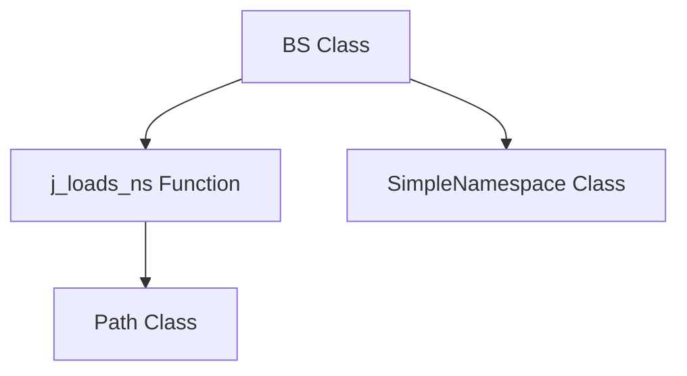

### **Системные инструкции для обработки кода проекта `hypotez`**

=========================================================================================

Описание функциональности и правил для генерации, анализа и улучшения кода. Направлено на обеспечение последовательного и читаемого стиля кодирования, соответствующего требованиям.

---

### **Основные принципы**

#### **1. Общие указания**:
- Соблюдай четкий и понятный стиль кодирования.
- Все изменения должны быть обоснованы и соответствовать установленным требованиям.

#### **2. Комментарии**:
- Используй `#` для внутренних комментариев.
- Документация всех функций, методов и классов должна следовать такому формату: 
    ```python
        def function(param: str, param1: Optional[str | dict | str] = None) -> dict | None:
            """ 
            Args:
                param (str): Описание параметра `param`.
                param1 (Optional[str | dict | str], optional): Описание параметра `param1`. По умолчанию `None`.
    
            Returns:
                dict | None: Описание возвращаемого значения. Возвращает словарь или `None`.
    
            Raises:
                SomeError: Описание ситуации, в которой возникает исключение `SomeError`.

            Ехаmple:
                >>> function('param', 'param1')
                {'param': 'param1'}
            """
    ```
- Комментарии и документация должны быть четкими, лаконичными и точными.

#### **3. Форматирование кода**:
- Используй одинарные кавычки. `a:str = 'value'`, `print('Hello World!')`;
- Добавляй пробелы вокруг операторов. Например, `x = 5`;
- Все параметры должны быть аннотированы типами. `def function(param: str, param1: Optional[str | dict | str] = None) -> dict | None:`;
- Не используй `Union`. Вместо этого используй `|`.

#### **4. Логирование**:
- Для логгирования Всегда Используй модуль `logger` из `src.logger.logger`.
- Ошибки должны логироваться с использованием `logger.error`.
Пример:
    ```python
        try:
            ...
        except Exception as ex:
            logger.error('Error while processing data', ех, exc_info=True)
    ```
#### **5 Не используй `Union[]` в коде. Вместо него используй `|`
Например:
```python
x: str | int ...
```


---

### **Основные требования**:

#### **1. Формат ответов в Markdown**:
- Все ответы должны быть выполнены в формате **Markdown**.

#### **2. Формат комментариев**:
- Используй указанный стиль для комментариев и документации в коде.
- Пример:

```python
from typing import Generator, Optional, List
from pathlib import Path


def read_text_file(
    file_path: str | Path,
    as_list: bool = False,
    extensions: Optional[List[str]] = None,
    chunk_size: int = 8192,
) -> Generator[str, None, None] | str | None:
    """
    Считывает содержимое файла (или файлов из каталога) с использованием генератора для экономии памяти.

    Args:
        file_path (str | Path): Путь к файлу или каталогу.
        as_list (bool): Если `True`, возвращает генератор строк.
        extensions (Optional[List[str]]): Список расширений файлов для чтения из каталога.
        chunk_size (int): Размер чанков для чтения файла в байтах.

    Returns:
        Generator[str, None, None] | str | None: Генератор строк, объединенная строка или `None` в случае ошибки.

    Raises:
        Exception: Если возникает ошибка при чтении файла.

    Example:
        >>> from pathlib import Path
        >>> file_path = Path('example.txt')
        >>> content = read_text_file(file_path)
        >>> if content:
        ...    print(f'File content: {content[:100]}...')
        File content: Example text...
    """
    ...
```
- Всегда делай подробные объяснения в комментариях. Избегай расплывчатых терминов, 
- таких как *«получить»* или *«делать»*. Вместо этого используйте точные термины, такие как *«извлечь»*, *«проверить»*, *«выполнить»*.
- Вместо: *«получаем»*, *«возвращаем»*, *«преобразовываем»* используй имя объекта *«функция получае»*, *«переменная возвращает»*, *«код преобразовывает»* 
- Комментарии должны непосредственно предшествовать описываемому блоку кода и объяснять его назначение.

#### **3. Пробелы вокруг операторов присваивания**:
- Всегда добавляйте пробелы вокруг оператора `=`, чтобы повысить читаемость.
- Примеры:
  - **Неправильно**: `x=5`
  - **Правильно**: `x = 5`

#### **4. Использование `j_loads` или `j_loads_ns`**:
- Для чтения JSON или конфигурационных файлов замените стандартное использование `open` и `json.load` на `j_loads` или `j_loads_ns`.
- Пример:

```python
# Неправильно:
with open('config.json', 'r', encoding='utf-8') as f:
    data = json.load(f)

# Правильно:
data = j_loads('config.json')
```

#### **5. Сохранение комментариев**:
- Все существующие комментарии, начинающиеся с `#`, должны быть сохранены без изменений в разделе «Улучшенный код».
- Если комментарий кажется устаревшим или неясным, не изменяйте его. Вместо этого отметьте его в разделе «Изменения».

#### **6. Обработка `...` в коде**:
- Оставляйте `...` как указатели в коде без изменений.
- Не документируйте строки с `...`.
```

#### **7. Аннотации**
Для всех переменных должны быть определены аннотации типа. 
Для всех функций все входные и выходные параметры аннотириваны
Для все параметров должны быть аннотации типа.


### **8. webdriver**
В коде используется webdriver. Он импртируется из модуля `webdriver` проекта `hypotez`
```python
from src.webdirver import Driver, Chrome, Firefox, Playwright, ...
driver = Driver(Firefox)

Пoсле чего может использоваться как

close_banner = {
  "attribute": null,
  "by": "XPATH",
  "selector": "//button[@id = 'closeXButton']",
  "if_list": "first",
  "use_mouse": false,
  "mandatory": false,
  "timeout": 0,
  "timeout_for_event": "presence_of_element_located",
  "event": "click()",
  "locator_description": "Закрываю pop-up окно, если оно не появилось - не страшно (`mandatory`:`false`)"
}

result = driver.execute_locator(close_banner)
```

### **Анализ `README.md` для модуля `src.webdriver.bs`**

#### 1. **Блок-схема**

```mermaid
graph TD
    A[Начало: Инициализация BS] --> B{Загрузка конфигурации из bs.json};
    B -- Успешно --> C{Получение HTML контента (URL/File)};
    B -- Ошибка --> E[Логирование ошибки конфигурации];
    C -- Успешно --> D{Выполнение локатора (XPath/CSS)};
    C -- Ошибка --> F[Логирование ошибки получения контента];
    D -- Найден элемент --> G[Возврат элемента/ов];
    D -- Не найден элемент --> H[Логирование предупреждения];
    G --> I[Конец: Возврат результата];
    H --> I;
    E --> I;
    F --> I;
```

**Примеры для логических блоков:**

- **A (Начало: Инициализация BS)**:
  ```python
  from src.webdriver.bs import BS
  parser = BS(url='https://example.com')
  ```

- **B (Загрузка конфигурации из bs.json)**:
  ```python
  from src.utils.jjson import j_loads_ns
  from pathlib import Path
  settings_path = Path('path/to/bs.json')
  settings = j_loads_ns(settings_path)
  ```

- **C (Получение HTML контента (URL/File))**:
  ```python
  parser.get_url('https://example.com')
  ```
  или
  ```python
  parser.get_url('file://path/to/your/file.html')
  ```

- **D (Выполнение локатора (XPath/CSS))**:
  ```python
  from types import SimpleNamespace
  locator = SimpleNamespace(by='ID', attribute='element_id', selector='//*[@id="element_id"]')
  elements = parser.execute_locator(locator)
  ```

- **E (Логирование ошибки конфигурации)**:
  ```python
  # Пример, если bs.json не найден или имеет неверный формат
  import logging
  logger = logging.getLogger(__name__)
  try:
      settings = j_loads_ns(settings_path)
  except FileNotFoundError:
      logger.error(f'Configuration file not found: {settings_path}')
  ```

- **F (Логирование ошибки получения контента)**:
  ```python
  # Пример, если не удалось получить HTML
  try:
      parser.get_url('https://example.com')
  except Exception as e:
      logger.error(f'Failed to fetch URL: {e}')
  ```

- **G (Возврат элемента/ов)**:
  ```python
  print(elements) # elements - найденные элементы
  ```

- **H (Логирование предупреждения)**:
  ```python
  # Пример, если элемент не найден по локатору
  if not elements:
      logger.warning(f'No elements found for locator: {locator}')
  ```

- **I (Конец: Возврат результата)**: Завершение работы и возврат найденных элементов или `None`.

#### 2. **Диаграмма зависимостей**



**Объяснение:**

- `BS`: Главный класс модуля, который использует `BeautifulSoup` для парсинга HTML и `XPath` для поиска элементов.
- `j_loads_ns`: Функция из `src.utils.jjson`, предназначенная для загрузки JSON-файлов и преобразования их в объект `SimpleNamespace`, что упрощает доступ к данным конфигурации.
- `SimpleNamespace`: Класс из модуля `types`, используется для создания объектов, атрибуты которых доступны по имени. Это позволяет удобно работать с конфигурационными данными, полученными из `bs.json`.
- `Path`: Класс из модуля `pathlib`, используется для представления путей к файлам и директориям. В данном случае, он используется для указания пути к конфигурационному файлу `bs.json`.

#### 3. **Объяснение**

**Импорты:**

- `src.webdriver.bs`: Основной модуль, содержащий класс `BS` для парсинга HTML с использованием `BeautifulSoup` и `XPath`.
- `types.SimpleNamespace`: Используется для создания объектов, атрибуты которых доступны по имени. Это упрощает доступ к конфигурационным данным.
- `src.utils.jjson.j_loads_ns`: Функция для загрузки JSON-файлов конфигурации и преобразования их в объекты `SimpleNamespace`.
- `pathlib.Path`: Используется для работы с путями к файлам и директориям.

**Классы:**

- `BS`:
  - **Роль**: Предоставляет функциональность для парсинга HTML и извлечения элементов с использованием `BeautifulSoup` и `XPath`.
  - **Атрибуты**:
    - Зависят от реализации (отсутствуют в предоставленном `README.md`).
  - **Методы**:
    - `get_url(url)`: Получает HTML-контент из указанного URL или файла.
    - `execute_locator(locator)`: Выполняет поиск элементов на странице с использованием указанного локатора. Локатор содержит информацию о типе поиска (например, `ID`, `CSS`, `XPATH`) и значении локатора.
  - **Взаимодействие**: Используется для получения и обработки HTML-контента, а также для поиска элементов на странице.

**Функции:**

- `j_loads_ns(settings_path: Path)`:
  - **Аргументы**:
    - `settings_path` (`Path`): Путь к файлу конфигурации `bs.json`.
  - **Возвращаемое значение**: Объект `SimpleNamespace`, содержащий конфигурационные данные.
  - **Назначение**: Загружает JSON-файл и преобразует его в объект `SimpleNamespace` для удобного доступа к конфигурационным параметрам.
  - **Пример**:
    ```python
    from pathlib import Path
    from src.utils.jjson import j_loads_ns
    settings_path = Path('path/to/bs.json')
    settings = j_loads_ns(settings_path)
    print(settings.default_url)
    ```

**Переменные:**

- `settings_path` (`Path`): Путь к конфигурационному файлу `bs.json`.
- `settings` (`SimpleNamespace`): Объект, содержащий конфигурационные данные, загруженные из `bs.json`.
- `locator` (`SimpleNamespace`): Объект, содержащий параметры локатора для поиска элементов на странице.
- `elements` (список элементов BeautifulSoup): Результат выполнения локатора, то есть найденные элементы на странице.
- `parser` (`BS`): Экземпляр класса `BS`, используемый для парсинга HTML и извлечения элементов.

**Потенциальные ошибки и области для улучшения:**

1. **Отсутствие обработки исключений**: В примерах кода отсутствует явная обработка исключений, что может привести к неожиданному завершению программы в случае ошибок, таких как недоступность URL или неверный формат `bs.json`.
2. **Жестко заданные пути**: Использование жестко заданных путей к файлам (например, `'path/to/bs.json'`) делает код менее гибким. Рекомендуется использовать относительные пути или переменные окружения.
3. **Недостаточная документация**: Отсутствует документация по структуре и ожидаемым значениям в `bs.json`. Следует добавить примеры и описание каждого поля.
4. **Отсутствие проверок входных данных**: В методе `execute_locator` класса `BS` не предусмотрены проверки типов и значений параметров локатора, что может привести к ошибкам во время выполнения.

**Цепочка взаимосвязей с другими частями проекта:**

- Модуль `src.webdriver.bs` зависит от модуля `src.utils.jjson` для загрузки конфигурационных файлов.
- Он также использует модуль `src.logger` для логирования ошибок и предупреждений.
- Класс `BS` может быть использован в других модулях проекта, где требуется парсинг HTML и извлечение элементов с использованием `BeautifulSoup` и `XPath`, например, в модулях, отвечающих за автоматизацию тестирования веб-приложений или сбор данных с веб-страниц.