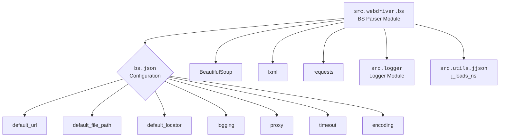

### **Системные инструкции для обработки кода проекта `hypotez`**

=========================================================================================

Описание функциональности и правил для генерации, анализа и улучшения кода. Направлено на обеспечение последовательного и читаемого стиля кодирования, соответствующего требованиям.

---

### **Основные принципы**

#### **1. Общие указания**:
- Соблюдай четкий и понятный стиль кодирования.
- Все изменения должны быть обоснованы и соответствовать установленным требованиям.

#### **2. Комментарии**:
- Используй `#` для внутренних комментариев.
- Документация всех функций, методов и классов должна следовать такому формату: 
    ```python
        def function(param: str, param1: Optional[str | dict | str] = None) -> dict | None:
            """ 
            Args:
                param (str): Описание параметра `param`.
                param1 (Optional[str | dict | str], optional): Описание параметра `param1`. По умолчанию `None`.
    
            Returns:
                dict | None: Описание возвращаемого значения. Возвращает словарь или `None`.
    
            Raises:
                SomeError: Описание ситуации, в которой возникает исключение `SomeError`.

            Ехаmple:
                >>> function('param', 'param1')
                {'param': 'param1'}
            """
    ```
- Комментарии и документация должны быть четкими, лаконичными и точными.

#### **3. Форматирование кода**:
- Используй одинарные кавычки. `a:str = 'value'`, `print('Hello World!')`;
- Добавляй пробелы вокруг операторов. Например, `x = 5`;
- Все параметры должны быть аннотированы типами. `def function(param: str, param1: Optional[str | dict | str] = None) -> dict | None:`;
- Не используй `Union`. Вместо этого используй `|`.

#### **4. Логирование**:
- Для логгирования Всегда Используй модуль `logger` из `src.logger.logger`.
- Ошибки должны логироваться с использованием `logger.error`.
Пример:
    ```python
        try:
            ...
        except Exception as ex:
            logger.error('Error while processing data', ех, exc_info=True)
    ```
#### **5 Не используй `Union[]` в коде. Вместо него используй `|`
Например:
```python
x: str | int ...
```


---

### **Основные требования**:

#### **1. Формат ответов в Markdown**:
- Все ответы должны быть выполнены в формате **Markdown**.

#### **2. Формат комментариев**:
- Используй указанный стиль для комментариев и документации в коде.
- Пример:

```python
from typing import Generator, Optional, List
from pathlib import Path


def read_text_file(
    file_path: str | Path,
    as_list: bool = False,
    extensions: Optional[List[str]] = None,
    chunk_size: int = 8192,
) -> Generator[str, None, None] | str | None:
    """
    Считывает содержимое файла (или файлов из каталога) с использованием генератора для экономии памяти.

    Args:
        file_path (str | Path): Путь к файлу или каталогу.
        as_list (bool): Если `True`, возвращает генератор строк.
        extensions (Optional[List[str]]): Список расширений файлов для чтения из каталога.
        chunk_size (int): Размер чанков для чтения файла в байтах.

    Returns:
        Generator[str, None, None] | str | None: Генератор строк, объединенная строка или `None` в случае ошибки.

    Raises:
        Exception: Если возникает ошибка при чтении файла.

    Example:
        >>> from pathlib import Path
        >>> file_path = Path('example.txt')
        >>> content = read_text_file(file_path)
        >>> if content:
        ...    print(f'File content: {content[:100]}...')
        File content: Example text...
    """
    ...
```
- Всегда делай подробные объяснения в комментариях. Избегай расплывчатых терминов, 
- таких как *«получить»* или *«делать»*. Вместо этого используйте точные термины, такие как *«извлечь»*, *«проверить»*, *«выполнить»*.
- Вместо: *«получаем»*, *«возвращаем»*, *«преобразовываем»* используй имя объекта *«функция получае»*, *«переменная возвращает»*, *«код преобразовывает»* 
- Комментарии должны непосредственно предшествовать описываемому блоку кода и объяснять его назначение.

#### **3. Пробелы вокруг операторов присваивания**:
- Всегда добавляйте пробелы вокруг оператора `=`, чтобы повысить читаемость.
- Примеры:
  - **Неправильно**: `x=5`
  - **Правильно**: `x = 5`

#### **4. Использование `j_loads` или `j_loads_ns`**:
- Для чтения JSON или конфигурационных файлов замените стандартное использование `open` и `json.load` на `j_loads` или `j_loads_ns`.
- Пример:

```python
# Неправильно:
with open('config.json', 'r', encoding='utf-8') as f:
    data = json.load(f)

# Правильно:
data = j_loads('config.json')
```

#### **5. Сохранение комментариев**:
- Все существующие комментарии, начинающиеся с `#`, должны быть сохранены без изменений в разделе «Улучшенный код».
- Если комментарий кажется устаревшим или неясным, не изменяйте его. Вместо этого отметьте его в разделе «Изменения».

#### **6. Обработка `...` в коде**:
- Оставляйте `...` как указатели в коде без изменений.
- Не документируйте строки с `...`.
```

#### **7. Аннотации**
Для всех переменных должны быть определены аннотации типа. 
Для всех функций все входные и выходные параметры аннотириваны
Для все параметров должны быть аннотации типа.


### **8. webdriver**
В коде используется webdriver. Он импртируется из модуля `webdriver` проекта `hypotez`
```python
from src.webdirver import Driver, Chrome, Firefox, Playwright, ...
driver = Driver(Firefox)

Пoсле чего может использоваться как

close_banner = {
  "attribute": null,
  "by": "XPATH",
  "selector": "//button[@id = 'closeXButton']",
  "if_list": "first",
  "use_mouse": false,
  "mandatory": false,
  "timeout": 0,
  "timeout_for_event": "presence_of_element_located",
  "event": "click()",
  "locator_description": "Закрываю pop-up окно, если оно не появилось - не страшно (`mandatory`:`false`)"
}

result = driver.execute_locator(close_banner)
```

## Анализ кода `hypotez/src/webdriver/bs/readme.ru.md`

### 1. Блок-схема

```mermaid
graph LR
    A[Начало] --> B{Загрузка HTML контента};
    B --> C{Парсинг HTML (BeautifulSoup, XPath)};
    C --> D{Определение пользовательских локаторов};
    D --> E{Логирование и обработка ошибок};
    E --> F{Конфигурация (bs.json)};
    F --> G[Инициализация и использование парсера BS];
    G --> H[Загрузка HTML из файла (пример)];
    G --> I[Загрузка HTML из URL (пример)];
    H --> J[Выполнение локатора и вывод элементов];
    I --> K[Выполнение локатора и вывод элементов];
    J --> L[Логирование (ошибки, предупреждения, информация)];
    K --> L;
    L --> M[Конец];
```

**Примеры для каждого блока:**

- **Загрузка HTML контента:** Загрузка HTML из файла `file://path/to/your/file.html` или URL `https://example.com`.
- **Парсинг HTML (BeautifulSoup, XPath):** Использование `BeautifulSoup` для создания дерева DOM и `XPath` для навигации и выбора элементов.
- **Определение пользовательских локаторов:** Определение XPath-выражений для точного выбора нужных элементов, например, `//*[@id="element_id"]`.
- **Логирование и обработка ошибок:** Запись ошибок и предупреждений в лог-файл, например, `Ошибка при инициализации парсера BS: <детали ошибки>`.
- **Конфигурация (bs.json):** Чтение параметров из файла конфигурации `bs.json`, таких как `default_url`, `default_locator`, `timeout`, `encoding`.
- **Инициализация и использование парсера BS:** Создание экземпляра класса `BS` и вызов методов `get_url` и `execute_locator`.
- **Загрузка HTML из файла (пример):** Использование `parser.get_url('file://path/to/your/file.html')` для загрузки HTML из локального файла.
- **Загрузка HTML из URL (пример):** Использование `parser.get_url('https://example.com')` для загрузки HTML из веб-адреса.
- **Выполнение локатора и вывод элементов:** Вызов `parser.execute_locator(locator)` для извлечения элементов и вывод результатов.
- **Логирование (ошибки, предупреждения, информация):** Запись информации о работе парсера в лог, например, уровень логирования `INFO`, путь к лог-файлу `logs/bs.log`.

### 2. Диаграмма



**Объяснение зависимостей:**

- `src.webdriver.bs`: Основной модуль парсера `BS`, который использует другие модули и библиотеки для своей работы.
- `bs.json`: Файл конфигурации, содержащий настройки парсера, такие как URL по умолчанию, пути к файлам, параметры локатора и настройки логирования.
- `BeautifulSoup`: Библиотека Python для парсинга HTML и XML.
- `lxml`: Библиотека для быстрой и гибкой обработки XML и HTML. Используется `BeautifulSoup` для улучшения производительности парсинга.
- `requests`: Библиотека Python для выполнения HTTP-запросов. Используется для загрузки HTML-контента из URL-адресов.
- `src.logger`: Модуль логирования из проекта `hypotez`, используемый для записи информации о работе парсера, ошибок и предупреждений.
- `src.utils.jjson`: Модуль для загрузки JSON-конфигураций, используется функция `j_loads_ns` для загрузки настроек из файла `bs.json` в пространство имен.

### 3. Объяснение

#### Импорты:

- Отсутствуют импорты в предоставленном фрагменте, так как это описание модуля, а не код. Однако, в примерах использования упоминаются:
    - `from src.webdriver.bs import BS`: Импортирует класс `BS` из модуля `src.webdriver.bs`, который является основным парсером.
    - `from types import SimpleNamespace`: Импортирует `SimpleNamespace` для удобного доступа к атрибутам конфигурации.
    - `from src.utils.jjson import j_loads_ns`: Импортирует функцию `j_loads_ns` для загрузки конфигурации из JSON-файла.
    - `from pathlib import Path`: Импортирует класс `Path` для работы с путями к файлам.

#### Классы:

- `BS`: Основной класс парсера.
    - **Роль:** Предоставляет методы для загрузки HTML-контента из файлов или URL-адресов, парсинга и извлечения элементов с помощью XPath-локаторов.
    - **Атрибуты:** Содержит конфигурацию, экземпляр `BeautifulSoup` и логгер.
    - **Методы:**
        - `__init__`: Инициализирует парсер, загружает конфигурацию и настраивает логирование.
        - `get_url`: Загружает HTML-контент из URL-адреса.
        - `execute_locator`: Выполняет XPath-локатор и возвращает найденные элементы.

#### Функции:

- `j_loads_ns(settings_path: Path) -> SimpleNamespace`: Функция загружает JSON-файл и преобразует его содержимое в `SimpleNamespace`, обеспечивая удобный доступ к параметрам конфигурации.
    - **Аргументы:**
        - `settings_path` (`Path`): Путь к файлу конфигурации `bs.json`.
    - **Возвращаемое значение:** `SimpleNamespace` с параметрами конфигурации.
    - **Назначение:** Загрузка и обработка конфигурации из JSON-файла.
    - **Пример:**
      ```python
      settings_path = Path('path/to/bs.json')
      settings = j_loads_ns(settings_path)
      print(settings.default_url)
      ```

#### Переменные:

- `default_url` (`str`): URL по умолчанию для загрузки HTML-контента.
- `default_file_path` (`str`): Путь к файлу по умолчанию для загрузки HTML-контента.
- `default_locator` (`dict`): Локатор по умолчанию для извлечения элементов.
- `logging` (`dict`): Настройки логирования.
- `proxy` (`dict`): Настройки прокси-сервера.
- `timeout` (`int`): Максимальное время ожидания для запросов (в секундах).
- `encoding` (`str`): Кодировка, используемая при чтении файлов или запросах.

#### Потенциальные ошибки и области для улучшения:

- **Обработка исключений:** Важно обеспечить надежную обработку исключений при загрузке HTML-контента, парсинге и выполнении локаторов. Это позволит избежать сбоев в работе парсера и предоставит полезную информацию для отладки.
- **Валидация конфигурации:** Добавить валидацию конфигурационного файла `bs.json` для проверки корректности значений и соответствия ожидаемым типам данных. Это поможет выявить проблемы с конфигурацией на ранних этапах.
- **Кеширование:** Реализовать кеширование загруженного HTML-контента для повышения производительности при повторных запросах к одному и тому же URL или файлу.
- **Асинхронность:** Рассмотреть возможность использования асинхронных запросов для загрузки HTML-контента, чтобы не блокировать основной поток выполнения.
- **Повторное использование сессий:** Использовать сессии `requests` для повышения производительности при множественных запросах к одному и тому же домену.

#### Взаимосвязи с другими частями проекта:

- Модуль `src.webdriver.bs` является частью системы автоматизации веб-тестов `hypotez`. Он используется для парсинга HTML-контента на веб-страницах и извлечения необходимых данных для дальнейшей обработки и анализа.
- Он интегрируется с модулем `src.logger` для обеспечения логирования и отладки.
- Он использует модуль `src.utils.jjson` для загрузки конфигурации из JSON-файла.
- Он может использоваться вместе с другими модулями `webdriver` для управления браузером и выполнения действий на веб-страницах.