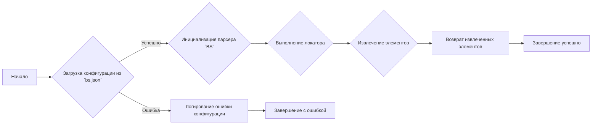
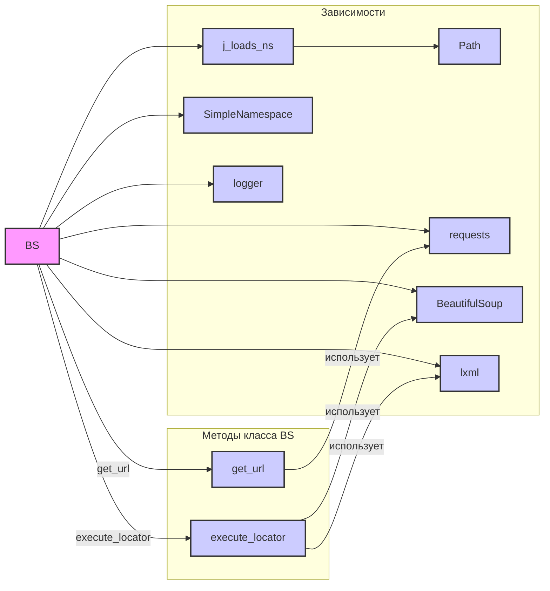

## Проект `hypotez`
# Роль `code explainer`

## Анализ кода модуля `src.webdriver.bs`

### 1. Блок-схема



**Примеры для каждого логического блока:**

- **A (Начало)**: Начало работы скрипта, использующего парсер `BS`.
- **B (Загрузка конфигурации из `bs.json`)**:
  - *Успешно*: Конфигурация успешно загружена, например:
    ```json
    {
      "default_url": "https://example.com",
      "default_locator": {
        "by": "ID",
        "attribute": "element_id",
        "selector": "//*[@id='element_id']"
      }
    }
    ```
  - *Ошибка*: Не удалось загрузить или распарсить `bs.json`.
- **C (Инициализация парсера `BS`)**:
  - Пример: `parser = BS(url=settings.default_url)`
- **D (Выполнение локатора)**:
  - Пример: `elements = parser.execute_locator(locator)`
- **F (Извлечение элементов)**:
  - Извлечение элементов на основе XPath-селектора из HTML-контента.
- **G (Возврат извлеченных элементов)**:
  - Возврат списка найденных элементов или пустой список, если ничего не найдено.
- **E (Логирование ошибки конфигурации)**:
  - Запись в лог информации об ошибке, например: `Ошибка в файле bs.json: Отсутствует обязательное поле 'default_url'`
- **H (Завершение с ошибкой)**:
  - Завершение работы скрипта из-за ошибки конфигурации.
- **I (Завершение успешно)**:
  - Успешное завершение работы скрипта после извлечения элементов.

### 2. Диаграмма



**Объяснение зависимостей:**

- **BS**: Основной класс, предоставляющий функциональность парсера.
- **j_loads_ns**: Функция для загрузки JSON-конфигурации в виде пространства имен. Импортируется из `src.utils.jjson`.
- **SimpleNamespace**: Используется для представления конфигурации в виде атрибутов объекта.  Импортируется из `types`.
- **Path**: Используется для работы с путями к файлам. Импортируется из `pathlib`.
- **logger**: Используется для логирования информации, ошибок и предупреждений. Импортируется из `src.logger`.
- **requests**: Используется для выполнения HTTP-запросов для загрузки HTML-контента из URL.
- **BeautifulSoup**: Используется для парсинга HTML-контента.
- **lxml**: Используется как бэкенд для BeautifulSoup для более быстрой обработки XML и HTML.

### 3. Объяснение

#### Импорты:

- `from src.webdriver.bs import BS`: Импортирует класс `BS` из модуля `src.webdriver.bs`, который предоставляет функциональность парсера.
- `from types import SimpleNamespace`: Импортирует класс `SimpleNamespace` из модуля `types`, который позволяет создавать объекты с атрибутами, доступными через точечную нотацию.
- `from src.utils.jjson import j_loads_ns`: Импортирует функцию `j_loads_ns` из модуля `src.utils.jjson`, которая загружает JSON-файл и преобразует его в пространство имен (namespace), что упрощает доступ к конфигурационным параметрам.
- `from pathlib import Path`: Импортирует класс `Path` из модуля `pathlib`, который предоставляет объектно-ориентированный способ работы с путями к файлам и директориям.

#### Классы:

- **BS**:
  - **Роль**: Предоставляет функциональность для парсинга HTML-контента с использованием BeautifulSoup и XPath.
  - **Атрибуты**:
    - `default_url` (str): URL по умолчанию для загрузки HTML-контента.
    - `default_file_path` (str): Путь к файлу по умолчанию для загрузки HTML-контента.
    - `default_locator` (dict): Локатор по умолчанию для извлечения элементов.
    - `logging` (dict): Настройки логирования.
    - `proxy` (dict): Настройки прокси-сервера.
    - `timeout` (int): Максимальное время ожидания для запросов (в секундах).
    - `encoding` (str): Кодировка, используемая при чтении файлов или запросах.
  - **Методы**:
    - `__init__(self, url=None, file_path=None, config_path='bs.json')`: Конструктор класса, инициализирует парсер с заданными параметрами.
    - `get_url(self, url)`: Загружает HTML-контент из заданного URL.
    - `get_file(self, file_path)`: Загружает HTML-контент из заданного файла.
    - `execute_locator(self, locator)`: Извлекает элементы из HTML-контента с использованием заданного локатора.

#### Функции:

- **j_loads_ns(settings_path)**:
  - **Аргументы**:
    - `settings_path` (Path): Путь к файлу конфигурации `bs.json`.
  - **Возвращаемое значение**:
    - `SimpleNamespace`: Объект, представляющий конфигурацию, загруженную из `bs.json`.
  - **Назначение**: Загружает конфигурацию из JSON-файла и преобразует её в пространство имен, что позволяет удобно обращаться к параметрам конфигурации через атрибуты объекта.
  - **Пример**:
    ```python
    settings_path = Path('path/to/bs.json')
    settings = j_loads_ns(settings_path)
    print(settings.default_url)
    ```

#### Переменные:

- `settings_path` (Path): Путь к файлу конфигурации `bs.json`.
- `settings` (SimpleNamespace): Объект, представляющий конфигурацию, загруженную из `bs.json`.
- `parser` (BS): Экземпляр класса `BS`, используемый для парсинга HTML-контента.
- `locator` (SimpleNamespace): Объект, представляющий локатор для извлечения элементов.
- `elements` (list): Список извлеченных элементов из HTML-контента.

#### Потенциальные ошибки и области для улучшения:

- **Обработка исключений**: В коде не хватает обработки исключений при загрузке HTML-контента из URL или файла. Следует добавить блоки `try...except` для обработки возможных ошибок, таких как `requests.exceptions.RequestException` или `FileNotFoundError`.
- **Валидация конфигурации**: Отсутствует валидация конфигурационных параметров, загруженных из `bs.json`. Необходимо добавить проверку типов и значений параметров, чтобы избежать ошибок при инициализации и использовании парсера.
- **Логирование**: Можно добавить более подробное логирование, чтобы упростить отладку и отслеживание ошибок. Например, можно логировать URL и локаторы, используемые при парсинге HTML-контента.
- **Поддержка различных типов локаторов**: В текущей реализации поддерживаются только XPath-локаторы. Можно расширить функциональность парсера, добавив поддержку других типов локаторов, таких как CSS-селекторы.

#### Взаимосвязи с другими частями проекта:

- **src.utils.jjson**: Используется для загрузки конфигурации из JSON-файла.
- **src.logger**: Используется для логирования ошибок и предупреждений.
- **src.webdriver**: Этот модуль является частью подсистемы webdriver, предназначенной для автоматизации работы с веб-браузерами. Он предоставляет инструменты для загрузки HTML-контента, извлечения элементов и взаимодействия с веб-страницами.