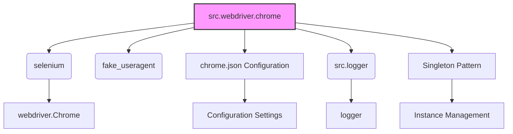

### **Системные инструкции для обработки кода проекта `hypotez`**

=========================================================================================

Описание функциональности и правил для генерации, анализа и улучшения кода. Направлено на обеспечение последовательного и читаемого стиля кодирования, соответствующего требованиям.

---

### **Основные принципы**

#### **1. Общие указания**:
- Соблюдай четкий и понятный стиль кодирования.
- Все изменения должны быть обоснованы и соответствовать установленным требованиям.

#### **2. Комментарии**:
- Используй `#` для внутренних комментариев.
- Документация всех функций, методов и классов должна следовать такому формату: 
    ```python
        def function(param: str, param1: Optional[str | dict | str] = None) -> dict | None:
            """ 
            Args:
                param (str): Описание параметра `param`.
                param1 (Optional[str | dict | str], optional): Описание параметра `param1`. По умолчанию `None`.
    
            Returns:
                dict | None: Описание возвращаемого значения. Возвращает словарь или `None`.
    
            Raises:
                SomeError: Описание ситуации, в которой возникает исключение `SomeError`.

            Ехаmple:
                >>> function('param', 'param1')
                {'param': 'param1'}
            """
    ```
- Комментарии и документация должны быть четкими, лаконичными и точными.

#### **3. Форматирование кода**:
- Используй одинарные кавычки. `a:str = 'value'`, `print('Hello World!')`;
- Добавляй пробелы вокруг операторов. Например, `x = 5`;
- Все параметры должны быть аннотированы типами. `def function(param: str, param1: Optional[str | dict | str] = None) -> dict | None:`;
- Не используй `Union`. Вместо этого используй `|`.

#### **4. Логирование**:
- Для логгирования Всегда Используй модуль `logger` из `src.logger.logger`.
- Ошибки должны логироваться с использованием `logger.error`.
Пример:
    ```python
        try:
            ...
        except Exception as ex:
            logger.error('Error while processing data', ех, exc_info=True)
    ```
#### **5 Не используй `Union[]` в коде. Вместо него используй `|`
Например:
```python
x: str | int ...
```


---

### **Основные требования**:

#### **1. Формат ответов в Markdown**:
- Все ответы должны быть выполнены в формате **Markdown**.

#### **2. Формат комментариев**:
- Используй указанный стиль для комментариев и документации в коде.
- Пример:

```python
from typing import Generator, Optional, List
from pathlib import Path


def read_text_file(
    file_path: str | Path,
    as_list: bool = False,
    extensions: Optional[List[str]] = None,
    chunk_size: int = 8192,
) -> Generator[str, None, None] | str | None:
    """
    Считывает содержимое файла (или файлов из каталога) с использованием генератора для экономии памяти.

    Args:
        file_path (str | Path): Путь к файлу или каталогу.
        as_list (bool): Если `True`, возвращает генератор строк.
        extensions (Optional[List[str]]): Список расширений файлов для чтения из каталога.
        chunk_size (int): Размер чанков для чтения файла в байтах.

    Returns:
        Generator[str, None, None] | str | None: Генератор строк, объединенная строка или `None` в случае ошибки.

    Raises:
        Exception: Если возникает ошибка при чтении файла.

    Example:
        >>> from pathlib import Path
        >>> file_path = Path('example.txt')
        >>> content = read_text_file(file_path)
        >>> if content:
        ...    print(f'File content: {content[:100]}...')
        File content: Example text...
    """
    ...
```
- Всегда делай подробные объяснения в комментариях. Избегай расплывчатых терминов, 
- таких как *«получить»* или *«делать»*
-  . Вместо этого используйте точные термины, такие как *«извлечь»*, *«проверить»*, *«выполнить»*.
- Вместо: *«получаем»*, *«возвращаем»*, *«преобразовываем»* используй имя объекта *«функция получае»*, *«переменная возвращает»*, *«код преобразовывает»* 
- Комментарии должны непосредственно предшествовать описываемому блоку кода и объяснять его назначение.

#### **3. Пробелы вокруг операторов присваивания**:
- Всегда добавляйте пробелы вокруг оператора `=`, чтобы повысить читаемость.
- Примеры:
  - **Неправильно**: `x=5`
  - **Правильно**: `x = 5`

#### **4. Использование `j_loads` или `j_loads_ns`**:
- Для чтения JSON или конфигурационных файлов замените стандартное использование `open` и `json.load` на `j_loads` или `j_loads_ns`.
- Пример:

```python
# Неправильно:
with open('config.json', 'r', encoding='utf-8') as f:
    data = json.load(f)

# Правильно:
data = j_loads('config.json')
```

#### **5. Сохранение комментариев**:
- Все существующие комментарии, начинающиеся с `#`, должны быть сохранены без изменений в разделе «Улучшенный код».
- Если комментарий кажется устаревшим или неясным, не изменяйте его. Вместо этого отметьте его в разделе «Изменения».

#### **6. Обработка `...` в коде**:
- Оставляйте `...` как указатели в коде без изменений.
- Не документируйте строки с `...`.
```

#### **7. Аннотации**
Для всех переменных должны быть определены аннотации типа. 
Для всех функций все входные и выходные параметры аннотириваны
Для все параметров должны быть аннотации типа.


### **8. webdriver**
В коде используется webdriver. Он импртируется из модуля `webdriver` проекта `hypotez`
```python
from src.webdirver import Driver, Chrome, Firefox, Playwright, ...
driver = Driver(Firefox)

Пoсле чего может использоваться как

close_banner = {
  "attribute": null,
  "by": "XPATH",
  "selector": "//button[@id = 'closeXButton']",
  "if_list": "first",
  "use_mouse": false,
  "mandatory": false,
  "timeout": 0,
  "timeout_for_event": "presence_of_element_located",
  "event": "click()",
  "locator_description": "Закрываю pop-up окно, если оно не появилось - не страшно (`mandatory`:`false`)"
}

result = driver.execute_locator(close_banner)
```

## Анализ файла `hypotez/src/webdriver/chrome/README.MD`

Этот файл `README.MD` содержит документацию по использованию кастомного Chrome WebDriver модуля для Selenium в проекте `hypotez`. Он предоставляет информацию о настройке, конфигурации и использовании модуля `Chrome` для управления браузером Chrome в автоматизированных тестах.

### 1. Блок-схема

```mermaid
graph TD
    A[Начало] --> B{Проверка зависимостей (Selenium, Fake User Agent, Chrome WebDriver)};
    B -- Да --> C[Установка зависимостей (pip install selenium fake_useragent)];
    B -- Нет --> C
    C --> D[Конфигурация Chrome WebDriver (chrome.json)];
    D --> E{Чтение параметров из chrome.json};
    E --> F[Инициализация Chrome WebDriver с параметрами из chrome.json];
    F --> G{Применение Singleton паттерна};
    G -- Существует экземпляр --> H[Использовать существующий экземпляр WebDriver];
    G -- Нет экземпляра --> I[Создать новый экземпляр WebDriver];
    I --> J[Выполнение действий в браузере (открытие сайта, взаимодействие с элементами)];
    H --> J
    J --> K[Логирование ошибок и предупреждений];
    K --> L[Закрытие браузера (browser.quit())];
    L --> M[Конец];
```

**Примеры для логических блоков:**

- **B (Проверка зависимостей)**: Проверяется, установлены ли `selenium` и `fake_useragent`.
- **C (Установка зависимостей)**: Если зависимости не установлены, выполняется `pip install selenium fake_useragent`.
- **D (Конфигурация Chrome WebDriver)**: Настройка `chrome.json` файла для управления параметрами Chrome.
- **E (Чтение параметров из chrome.json)**: Чтение значений `log-level`, `disable-dev-shm-usage` и др.
- **F (Инициализация Chrome WebDriver)**: Создание экземпляра `Chrome` с применением опций из `chrome.json`.
- **G (Singleton паттерн)**: Проверка, существует ли уже экземпляр `Chrome`.
- **H (Использовать существующий экземпляр WebDriver)**: Если экземпляр существует, используется он.
- **I (Создать новый экземпляр WebDriver)**: Если экземпляр не существует, создается новый.
- **J (Выполнение действий в браузере)**: Открытие URL (`browser.get("https://www.example.com")`).
- **K (Логирование ошибок и предупреждений)**: Запись ошибок инициализации или конфигурации в лог.
- **L (Закрытие браузера)**: Завершение сессии WebDriver (`browser.quit()`).

### 2. Диаграмма



**Объяснение зависимостей:**

- **src.webdriver.chrome**: Главный модуль, предоставляющий кастомную реализацию Chrome WebDriver.
- **selenium**: Используется для управления браузером Chrome через WebDriver.
- **fake_useragent**: Применяется для подмены User-Agent браузера.
- **chrome.json Configuration**: Файл конфигурации, определяющий параметры запуска Chrome.
- **src.logger**: Модуль логирования для записи информации о работе WebDriver.
- **Singleton Pattern**: Обеспечивает создание только одного экземпляра WebDriver.
- **webdriver.Chrome**: Класс из библиотеки `selenium`, который используется для управления Chrome.
- **logger**: Объект логгера из `src.logger`, используемый для записи логов.
- **Instance Management**: Компонент, управляющий экземпляром WebDriver в соответствии с Singleton паттерном.
- **Configuration Settings**: Параметры конфигурации, загружаемые из `chrome.json`.

### 3. Объяснение

#### Импорты:
- **selenium**: Библиотека для автоматизации действий в веб-браузерах. Используется для создания и управления экземпляром Chrome WebDriver.
- **fake_useragent**: Библиотека для генерации случайных User-Agent строк, что позволяет имитировать различных пользователей и браузеры.
- **chrome.json**: Файл конфигурации, который содержит настройки для запуска Chrome WebDriver, такие как параметры командной строки, пути к бинарным файлам и пользовательские заголовки.
- **src.logger**: Модуль логирования, используемый для записи информации о работе WebDriver, ошибок и предупреждений.

#### Классы:
- **Chrome**: Класс, представляющий кастомный Chrome WebDriver. Он использует библиотеку `selenium` для управления браузером Chrome и загружает настройки из файла `chrome.json`.

#### Функции:
- В предоставленном тексте нет явного описания функций, но подразумевается, что класс `Chrome` имеет методы, такие как `get` (для открытия URL), `quit` (для закрытия браузера) и другие стандартные методы WebDriver.

#### Переменные:
- **options**: Параметры командной строки для запуска Chrome.
- **disabled_options**: Опции, которые явно отключены.
- **profile_directory**: Пути к каталогам профилей пользователя Chrome.
- **binary_location**: Пути к различным бинарным файлам Chrome.
- **headers**: Пользовательские HTTP-заголовки, которые будут отправляться при запросах браузера.
- **proxy_enabled**: Флаг, указывающий, включено ли использование прокси-сервера.

#### Потенциальные ошибки и области для улучшения:

- **Обработка исключений**: Необходимо добавить обработку исключений при чтении файла `chrome.json` и при инициализации WebDriver.
- **Валидация конфигурации**: Следует добавить валидацию параметров, загруженных из `chrome.json`, чтобы убедиться, что они имеют правильный формат и значения.
- **Поддержка различных платформ**: Конфигурационные пути в `chrome.json` могут быть специфичными для Windows. Необходимо предусмотреть поддержку других операционных систем.
- **Динамическое определение пути к ChromeDriver**: Текущая конфигурация предполагает, что путь к ChromeDriver задан статически. Необходимо предусмотреть динамическое определение пути.

#### Взаимосвязи с другими частями проекта:

- **src.logger**: Класс `Chrome` использует модуль `src.logger` для логирования своей работы, что позволяет отслеживать ошибки и предупреждения.
- **chrome.json**: Файл конфигурации `chrome.json` определяет параметры запуска Chrome, что позволяет гибко настраивать поведение браузера для различных сценариев тестирования.
- **Singleton Pattern**: Использование Singleton паттерна гарантирует, что в проекте будет только один экземпляр WebDriver, что упрощает управление браузером и предотвращает конфликты.