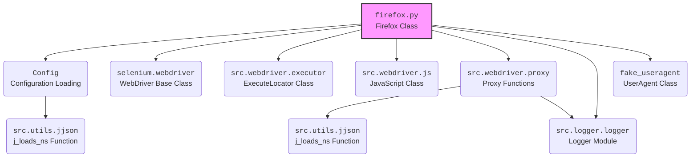

### **Системные инструкции для обработки кода проекта `hypotez`**

=========================================================================================

Описание функциональности и правил для генерации, анализа и улучшения кода. Направлено на обеспечение последовательного и читаемого стиля кодирования, соответствующего требованиям.

---

### **Основные принципы**

#### **1. Общие указания**:
- Соблюдай четкий и понятный стиль кодирования.
- Все изменения должны быть обоснованы и соответствовать установленным требованиям.

#### **2. Комментарии**:
- Используй `#` для внутренних комментариев.
- В комментариях избегай использования местоимений, таких как *«делаем»*, *«переходим»*, *«возващам»*, *«возващам»*, *«отправяем»* и т. д.. Вмсто этого используй точные термины, такие как *«извлеизвлечение»*, *«проверка»*, *«выполннение»*, *«замена»*, *«вызов»*, *«Функця выпоняет»*,*«Функця изменяет значение»*, *«Функця вызывает»*,*«отправка»*
Пример:
```python
# Неправильно:
def function(param: str, param1: Optional[str | dict | str] = None) -> dict | None:
    # Получаем значение параметра
    ...
# Правильно:

def function(param: str, param1: Optional[str | dict | str] = None) -> dict | None:
    # Функция извлекает значение параметра
    ...
# Неправильно:
if not process_directory.exists():
    logger.error(f"Директория не существует: {process_directory}")
    continue  # Переходим к следующей директории, если текущая не существует

if not process_directory.is_dir():
    logger.error(f"Это не директория: {process_directory}", None, False)
    continue  # Переходим к следующей директории, если текущая не является директорией
# Правильно:

if not process_directory.exists():
    logger.error(f"Директория не существует: {process_directory}")
    continue  # Переход к следующей директории, если текущая не существует
if not process_directory.is_dir():
    logger.error(f"Это не директория: {process_directory}", None, False)
    continue  # Переходим к следующей директории, если текущая не является директорией

```
- Документация всех функций, методов и классов должна следовать такому формату: 
    ```python
        def function(param: str, param1: Optional[str | dict | str] = None) -> dict | None:
            """ 
            Args:
                param (str): Описание параметра `param`.
                param1 (Optional[str | dict | str], optional): Описание параметра `param1`. По умолчанию `None`.
    
            Returns:
                dict | None: Описание возващаемого значения. Возвращает словарь или `None`.
    
            Raises:
                SomeError: Описание ситуации, в которой возникает исключение `SomeError`.

            Ехаmple:
                >>> function('param', 'param1')
                {'param': 'param1'}
            """
    ```
- Комментарии и документация должны быть четкими, лаконичными и точными.


### **3. Заголовок файла**:
Обязательно оставляй строки 
```python
## \file path/to/file
# -*- coding: utf-8 -*-
#! .pyenv/bin/python3
```
и
```
"""
...
```rst
 .. module:: src.utils.string.html_simplification
 ```
"""
```
если они есть. Если нет - добавляй.
Пример:
## \file /src/utils/string/html_simplification.py
# -*- coding: utf-8 -*-
#! .pyenv/bin/python3

"""
Модуль для очистки HTML-тегов из текста и упрощения HTML-кода.
===============================================================
Модуль минимизирует HTML-код, удаляет теги и атрибуты, а также обрабатывает
специальные случаи, такие как скрипты, стили и комментарии.
Использует BeautifulSoup для надежного парсинга HTML.

Зависимости:
    - beautifulsoup4 (pip install beautifulsoup4)
    - lxml (опционально, для более быстрого парсинга: pip install lxml)

 .. module:: src.utils.string.html_simplification
"""

#### **4. Форматирование кода**:
- Используй одинарные кавычки. `a:str = 'value'`, `print('Hello World!')`;
- Добавляй пробелы вокруг операторов. Например, `x = 5`;
- Все параметры должны быть аннотированы типами. `def function(param: str, param1: Optional[str | dict | str] = None) -> dict | None:`;
- Не используй `Union`. Вместо этого используй `|`.
- Не используй термин `Product`, только `товар`

#### **5. Логирование**:
- Для логгирования Всегда Используй модуль `logger` из `src.logger.logger`.
- Ошибки должны логироваться с использованием `logger.error`.
Пример:
    ```python
        try:
            ...
        except Exception as ex:
            logger.error('Error while processing data', ех, exc_info=True)
    ```
#### **6. Не используй `Union[]` в коде. Вместо него используй `|`
Например:
```python
x: str | int ...
```

#### **7. Не используй глобальные переменные. Если есть надобность - то поределяй их в классе `Config`.
Пример:

- Неправильно:
```python

state:int = 'global'

def func():
    print(state)

```
- Правильно:
```python

class Config:
    state:int = 'global'

def func():
    print(Config.state)

```

#### **8. Не используй `self` в методах класса. Вместо него используй `cls`.
#### **9. Всегда объявляй переменные вначале функции. Не объявляй их в середине функции.
Пример:
```python
def func():
    # Неправильно
    if condition:
        x = 5
        y = 10
    else:
        x = 20
        y = 30
    # Правильно
    x = None
    y = None
    if condition:
        x = 5
        y = 10
    else:
        x = 20
        y = 30
```
---

### **Основные требования**:

#### **1. Формат ответов в Markdown**:
- Все ответы должны быть выполнены в формате **Markdown**.

#### **2. Формат комментариев**:
- Используй указанный стиль для комментариев и документации в коде.
- Пример:

```python
from typing import Generator, Optional, List
from pathlib import Path


def read_text_file(
    file_path: str | Path,
    as_list: bool = False,
    extensions: Optional[List[str]] = None,
    chunk_size: int = 8192,
) -> Generator[str, None, None] | str | None:
    """
    Считывает содержимое файла (или файлов из каталога) с использованием генератора для экономии памяти.

    Args:
        file_path (str | Path): Путь к файлу или каталогу.
        as_list (bool): Если `True`, возвращает генератор строк.
        extensions (Optional[List[str]]): Список расширений файлов для чтения из каталога.
        chunk_size (int): Размер чанков для чтения файла в байтах.

    Returns:
        Generator[str, None, None] | str | None: Генератор строк, объединенная строка или `None` в случае ошибки.

    Raises:
        Exception: Если возникает ошибка при чтении файла.

    Example:
        >>> from pathlib import Path
        >>> file_path = Path('example.txt')
        >>> content = read_text_file(file_path)
        >>> if content:
        ...    print(f'File content: {content[:100]}...')
        File content: Example text...
    """
    ...
```
- Всегда делай подробные объяснения в комментариях. Избегай расплывчатых терминов, 
- таких как *«получить»* или *«делать»*
-  . Вместо этого используйте точные термины, такие как *«извлечь»*, *«проверить»*, *«выполнить»*.
- Вместо: *«получаем»*, *«возвращаем»*, *«преобразовываем»* используй имя объекта *«функция получае»*, *«переменная возвращает»*, *«код преобразовывает»* 
- Комментарии должны непосредственно предшествовать описываемому блоку кода и объяснять его назначение.

#### **3. Пробелы вокруг операторов присваивания**:
- Всегда добавляйте пробелы вокруг оператора `=`, чтобы повысить читаемость.
- Примеры:
  - **Неправильно**: `x=5`
  - **Правильно**: `x = 5`

#### **4. Использование `j_loads` или `j_loads_ns`**:
- Для чтения JSON или конфигурационных файлов замените стандартное использование `open` и `json.load` на `j_loads` или `j_loads_ns`.
- Пример:

```python
# Неправильно:
with open('config.json', 'r', encoding='utf-8') as f:
    data = json.load(f)

# Правильно:
data = j_loads('config.json')
```

#### **5. Сохранение комментариев**:
- Все существующие комментарии, начинающиеся с `#`, должны быть сохранены без изменений в разделе «Улучшенный код».
- Если комментарий кажется устаревшим или неясным, не изменяйте его. Вместо этого отметьте его в разделе «Изменения».

#### **6. Обработка `...` в коде**:
- Оставляйте `...` как указатели в коде без изменений.
- Не документируйте строки с `...`.
```

#### **7. Аннотации**
Для всех переменных должны быть определены аннотации типа. 
Для всех функций все входные и выходные параметры аннотириваны
Для все параметров должны быть аннотации типа.


### **8. webdriver**
В коде используется webdriver. Он импртируется из модуля `webdriver` проекта `hypotez`
```python
from src.webdirver import Driver, Chrome, Firefox, Playwright, ...
driver = Driver(Firefox)

Пoсле чего может использоваться как

close_banner = {
  "attribute": null,
  "by": "XPATH",
  "selector": "//button[@id = 'closeXButton']",
  "if_list": "first",
  "use_mouse": false,
  "mandatory": false,
  "timeout": 0,
  "timeout_for_event": "presence_of_element_located",
  "event": "click()",
  "locator_description": "Закрываю pop-up окно, если оно не появилось - не страшно (`mandatory`:`false`)"
}

result = driver.execute_locator(close_banner)

#### **9. Не используй `Union[]` в коде. Вместо него используй `|`
Например:
```python
x: str | int ...
```

#### **10. print - это моя встроенная функция.
from src.utils.printer import pprint as print


Вот она:

\file /src/utils/printer.py
-- coding: utf-8 --

#! .pyenv/bin/python3

"""
.. module::  src.utils
:platform: Windows, Unix
:synopsis: Utility functions for pretty printing and text styling.

This module provides functions to print data in a human-readable format with optional text styling, including color, background, and font styles.
"""

import json
import csv
import pandas as pd
from pathlib import Path
from typing import Any
from pprint import pprint as pretty_print

ANSI escape codes

RESET = "\033[0m"

TEXT_COLORS = {
"red": "\033[31m",
"green": "\033[32m",
"blue": "\033[34m",
"yellow": "\033[33m",
"white": "\033[37m",
"cyan": "\033[36m",
"magenta": "\033[35m",
"light_gray": "\033[37m",
"dark_gray": "\033[90m",
"light_red": "\033[91m",
"light_green": "\033[92m",
"light_blue": "\033[94m",
"light_yellow": "\033[93m",
}

Background colors mapping

BG_COLORS = {
"bg_red": "\033[41m",
"bg_green": "\033[42m",
"bg_blue": "\033[44m",
"bg_yellow": "\033[43m",
"bg_white": "\033[47m",
"bg_cyan": "\033[46m",
"bg_magenta": "\033[45m",
"bg_light_gray": "\033[47m",
"bg_dark_gray": "\033[100m",
"bg_light_red": "\033[101m",
"bg_light_green": "\033[102m",
"bg_light_blue": "\033[104m",
"bg_light_yellow": "\033[103m",
}

FONT_STYLES = {
"bold": "\033[1m",
"underline": "\033[4m",
}

def _color_text(text: str, text_color: str = "", bg_color: str = "", font_style: str = "") -> str:
"""Apply color, background, and font styling to the text.

This helper function applies the provided color and font styles to the given text using ANSI escape codes.

:param text: The text to be styled.
:param text_color: The color to apply to the text. Default is an empty string, meaning no color.
:param bg_color: The background color to apply. Default is an empty string, meaning no background color.
:param font_style: The font style to apply to the text. Default is an empty string, meaning no font style.
:return: The styled text as a string.

:example:
    >>> _color_text("Hello, World!", text_color="green", font_style="bold")
    '\033[1m\033[32mHello, World!\033[0m'
"""
return f"{font_style}{text_color}{bg_color}{text}{RESET}"


def pprint(print_data: Any = None, text_color: str = "white", bg_color: str = "", font_style: str = "") -> None:
"""Pretty prints the given data with optional color, background, and font style.

This function formats the input data based on its type and prints it to the console. The data is printed with optional 
text color, background color, and font style based on the specified parameters. The function can handle dictionaries, 
lists, strings, and file paths.

:param print_data: The data to be printed. Can be of type ``None``, ``dict``, ``list``, ``str``, or ``Path``.
:param text_color: The color to apply to the text. Default is 'white'. See :ref:`TEXT_COLORS`.
:param bg_color: The background color to apply to the text. Default is '' (no background color). See :ref:`BG_COLORS`.
:param font_style: The font style to apply to the text. Default is '' (no font style). See :ref:`FONT_STYLES`.
:return: None

:raises: Exception if the data type is unsupported or an error occurs during printing.

:example:
    >>> pprint({"name": "Alice", "age": 30}, text_color="green")
    \033[32m{
        "name": "Alice",
        "age": 30
    }\033[0m

    >>> pprint(["apple", "banana", "cherry"], text_color="blue", font_style="bold")
    \033[34m\033[1mapple\033[0m
    \033[34m\033[1mbanana\033[0m
    \033[34m\033[1mcherry\033[0m

    >>> pprint("text example", text_color="yellow", bg_color="bg_red", font_style="underline")
    \033[4m\033[33m\033[41mtext example\033[0m
"""
if not print_data:
    return
if isinstance(text_color, str):
    text_color = TEXT_COLORS.get(text_color.lower(), TEXT_COLORS["white"])
if isinstance(bg_color, str):
    bg_color = BG_COLORS.get(bg_color.lower(), "")
if isinstance(font_style, str):
    font_style = FONT_STYLES.get(font_style.lower(), "")


try:
    if isinstance(print_data, dict):
        print(_color_text(json.dumps(print_data, indent=4), text_color))
    elif isinstance(print_data, list):
        for item in print_data:
            print(_color_text(str(item), text_color))
    elif isinstance(print_data, (str, Path)) and Path(print_data).is_file():
        ext = Path(print_data).suffix.lower()
        if ext in ['.csv', '.xls']:
            print(_color_text("File reading supported for .csv, .xls only.", text_color))
        else:
            print(_color_text("Unsupported file type.", text_color))
    else:
        print(_color_text(str(print_data), text_color))
except Exception as ex:
    print(_color_text(f"Error: {ex}", text_color=TEXT_COLORS["red"]))
IGNORE_WHEN_COPYING_START
content_copy
download
Use code with caution.
IGNORE_WHEN_COPYING_END

if name == 'main':
pprint({"name": "Alice", "age": 30}, text_color="green")
```
## \file hypotez/src/webdriver/firefox/firefox.py
# -*- coding: utf-8 -*-
#! .pyenv/bin/python3

"""WebDriver Firefox Module.

This module provides the `Firefox` class, extending the standard
`selenium.webdriver.Firefox` with functionalities like custom profile
management, kiosk mode, and proxy settings.

Example:
    ```python
    if __name__ == "__main__":
        browser = Firefox(
            profile_name="custom_profile",
            window_mode="kiosk"
        )
        browser.get("https://www.example.com")
        browser.quit()
    ```
"""

import os
import sys
import random
from pathlib import Path
from typing import Optional, List, Dict, Any

from selenium.webdriver import Firefox as WebDriver
from selenium.webdriver.firefox.options import Options
from selenium.webdriver.firefox.service import Service
from selenium.common.exceptions import WebDriverException

from fake_useragent import UserAgent

from src import gs
from src.webdriver.executor import ExecuteLocator
from src.webdriver.js import JavaScript
from src.webdriver.proxy import get_proxies_dict, check_proxy
from src.utils.jjson import j_loads_ns
from src.logger.logger import logger

from dataclasses import dataclass, field

@dataclass
class Config:
    """Configuration class for Firefox WebDriver."""

    def __init__(self, config_path: Path):
        """
        Initializes the Config object by loading settings from a JSON file.

        Args:
            config_path: Path to the JSON configuration file.
        """
        self._config = j_loads_ns(config_path)
        self.geckodriver_path = str(Path(gs.path.root, self._config.executable_path.geckodriver))
        self.firefox_binary_path = str(Path(gs.path.root, self._config.executable_path.firefox_binary))
        self.profile_directory_default = self._config.profile_directory.default
        self.profile_directory_os = self._config.profile_directory.os
        self.profile_directory_internal = self._config.profile_directory.internal
        self.options: List[str] = getattr(self._config, 'options', [])
        self.headers: Dict[str, Any] = vars(getattr(self._config, 'headers', {})) if hasattr(self._config, 'headers') else {}
        self.proxy_enabled: bool = getattr(self._config, 'proxy_enabled', False)

class Firefox(WebDriver):
    """
    Extends `webdriver.Firefox` with enhanced capabilities.

    Features:
        - Custom Firefox profile support.
        - Kiosk and other window modes.
        - User-agent customization.
        - Proxy settings.

    Args:
        profile_name: Name of the Firefox profile to use. Defaults to None.
        geckodriver_version: GeckoDriver version. Defaults to None.
        firefox_version: Firefox version. Defaults to None.
        user_agent: User agent string. If None, a random user agent is used. Defaults to None.
        proxy_file_path: Path to the proxy file. Defaults to None.
        options: List of Firefox options. Defaults to None.
        window_mode: Browser window mode (e.g., "windowless", "kiosk"). Defaults to None.

    Raises:
        WebDriverException: If the WebDriver fails to start.
        Exception: For other unexpected errors during initialization.
    """

    driver_name = "firefox"

    def __init__(
        self,
        profile_name: Optional[str] = None,
        geckodriver_version: Optional[str] = None,
        firefox_version: Optional[str] = None,
        user_agent: Optional[str] = None,
        proxy_file_path: Optional[str] = None,
        options: Optional[List[str]] = None,
        window_mode: Optional[str] = None,
        *args,
        **kwargs,
    ) -> None:
        """Initializes the Firefox WebDriver with custom settings."""
        logger.info("Starting Firefox WebDriver")

        config = Config(Path(gs.path.src, "webdriver", "firefox", "firefox.json"))

        service = Service(executable_path=config.geckodriver_path)
        options_obj = Options()

        # Load options from config file
        if config.options:
            for option in config.options:
                options_obj.add_argument(option)

        # Set window mode
        if window_mode:
            options_obj.add_argument(f"--{window_mode}")

        # Add options from constructor
        if options:
            for option in options:
                options_obj.add_argument(option)

        # Add headers from config
        if config.headers:
            for key, value in config.headers.items():
                options_obj.add_argument(f"--{key}={value}")

        # Set user agent
        user_agent = user_agent or UserAgent().random
        options_obj.set_preference("general.useragent.override", user_agent)

        # Set proxy if enabled
        if config.proxy_enabled:
            self.set_proxy(options_obj)

        # Configure profile directory
        profile_directory = (
            config.profile_directory_os
            if config.profile_directory_default == "os"
            else str(Path(gs.path.src, config.profile_directory_internal))
        )

        if profile_name:
            profile_directory = str(Path(profile_directory).parent / profile_name)
        if "%LOCALAPPDATA%" in profile_directory:
            profile_directory = Path(
                profile_directory.replace("%LOCALAPPDATA%", os.environ.get("LOCALAPPDATA"))
            )

        # profile = FirefoxProfile(profile_directory=profile_directory) #  <- @debug не грузится профиль

        try:
            super().__init__(service=service, options=options_obj)
            self._payload()
            logger.success(f"Browser started successfully, {window_mode=}")
        except WebDriverException as ex:
            logger.critical(
                """
                ---------------------------------
                    Error starting WebDriver
                    Possible reasons:\
                    - Firefox update
                    - Firefox not installed

                    Перезапусти код.
                ----------------------------------
                """,
                ex,
                False
            )
            sys.exit(1)
        except Exception as ex:
            logger.critical("Firefox WebDriver error:", ex, False)

            return

    def set_proxy(self, options: Options) -> None:
        """Configures proxy settings from a dictionary.

        Args:
            options: Firefox options to add proxy settings to.
        """
        proxies_dict = get_proxies_dict()
        all_proxies = proxies_dict.get("socks4", []) + proxies_dict.get("socks5", [])

        working_proxy = None
        for proxy in random.sample(all_proxies, len(all_proxies)):
            if check_proxy(proxy):
                working_proxy = proxy
                break

        if working_proxy:
            proxy = working_proxy
            protocol = proxy["protocol"]

            if protocol == "http":
                options.set_preference("network.proxy.type", 1)
                options.set_preference("network.proxy.http", proxy["host"])
                options.set_preference("network.proxy.http_port", int(proxy["port"]))
                options.set_preference("network.proxy.ssl", proxy["host"])
                options.set_preference("network.proxy.ssl_port", int(proxy["port"]))
                logger.info(f"Setting HTTP Proxy: http://{proxy['host']}:{proxy['port']}")

            elif protocol == "socks4":
                options.set_preference("network.proxy.type", 1)
                options.set_preference("network.proxy.socks", proxy["host"])
                options.set_preference("network.proxy.socks_port", int(proxy["port"]))
                logger.info(f"Setting SOCKS4 Proxy: {proxy['host']}:{proxy['port']}")

            elif protocol == "socks5":
                options.set_preference("network.proxy.type", 1)
                options.set_preference("network.proxy.socks", proxy["host"])
                options.set_preference("network.proxy.socks_port", int(proxy["port"]))
                logger.info(f"Setting SOCKS5 Proxy: {proxy['host']}:{proxy['port']}")

            else:
                logger.warning(f"Unknown proxy type: {protocol}")
        else:
            logger.warning("No available proxies in the provided file.")

    def _payload(self) -> None:
        """Loads executors for locators and JavaScript scripts."""
        j = JavaScript(self)
        self.get_page_lang = j.get_page_lang
        self.ready_state = j.ready_state
        self.get_referrer = j.ready_state
        self.unhide_DOM_element = j.unhide_DOM_element
        self.window_focus = j.window_focus

        execute_locator = ExecuteLocator(self)
        self.execute_locator = execute_locator.execute_locator
        self.get_webelement_as_screenshot = execute_locator.get_webelement_as_screenshot
        self.get_webelement_by_locator = execute_locator.get_webelement_by_locator
        self.get_attribute_by_locator = execute_locator.get_attribute_by_locator
        self.send_message = self.send_key_to_webelement = execute_locator.send_message


if __name__ == "__main__":
    driver = Firefox()
    driver.get("https://google.com")
```

### **1. Блок-схема**:

```mermaid
graph LR
    A[Начало: Инициализация Firefox] --> B(Инициализация Config: Загрузка настроек из firefox.json);
    B --> C(Инициализация Service: Указание пути к geckodriver);
    C --> D(Инициализация Options: Создание объекта Options);
    D --> E{config.options?};
    E -- Да --> F(Добавление опций из конфига);
    F --> E;
    E -- Нет --> G{window_mode?};
    G -- Да --> H(Установка режима окна);
    H --> I{options from constructor?};
    G -- Нет --> I{options from constructor?};
    I -- Да --> J(Добавление опций из конструктора);
    J --> K{config.headers?};
    I -- Нет --> K{config.headers?};
    K -- Да --> L(Добавление заголовков из конфига);
    L --> M(Установка User-Agent);
    K -- Нет --> M(Установка User-Agent);
    M --> N{config.proxy_enabled?};
    N -- Да --> O(Настройка прокси);
    O --> P(Определение директории профиля);
    N -- Нет --> P(Определение директории профиля);
    P --> Q{profile_name?};
    Q -- Да --> R(Изменение директории профиля с учетом имени профиля);
    R --> S{'%LOCALAPPDATA%' in profile_directory?};
    Q -- Нет --> S{'%LOCALAPPDATA%' in profile_directory?};
    S -- Да --> T(Замена переменной окружения в пути профиля);
    T --> U(Инициализация WebDriver);
    S -- Нет --> U(Инициализация WebDriver);
    U --> V{Успешный старт WebDriver?};
    V -- Да --> W(Вызов _payload: Загрузка executors и JavaScript);
    W --> X(Логирование успеха);
    X --> Y[Конец: WebDriver успешно запущен];
    V -- Нет --> Z{WebDriverException?};
    Z -- Да --> AA(Логирование критической ошибки WebDriverException);
    AA --> AB(Выход из программы);
    Z -- Нет --> AC(Логирование критической ошибки Exception);
    AC --> Конец;
    AB --> Конец;
```



### **2. Диаграмма**:



**Объяснение зависимостей**:

-   `firefox.py`: Основной модуль, расширяющий возможности `selenium.webdriver.Firefox`.
-   `Config`: Класс, предназначенный для загрузки и хранения конфигурационных параметров Firefox, таких как пути к исполняемым файлам, настройки профиля и опции. Зависит от `src.utils.jjson` для загрузки JSON-конфигурации.
-   `selenium.webdriver`: Базовый класс WebDriver из библиотеки Selenium, от которого наследуется класс Firefox.
-   `src.webdriver.executor`: Класс `ExecuteLocator`, используемый для выполнения локаторов элементов на веб-странице и получения скриншотов элементов.
-   `src.webdriver.js`: Класс `JavaScript`, предоставляющий методы для выполнения JavaScript-скриптов в браузере.
-   `src.webdriver.proxy`: Модуль, содержащий функции для работы с прокси-серверами, включая получение списка прокси и проверку их доступности.  Зависит от `src.utils.jjson` для загрузки JSON-конфигурации и `src.logger.logger` для логирования.
-   `src.utils.jjson`: Модуль, содержащий функцию `j_loads_ns` для загрузки JSON-файлов с использованием namespace.
-   `src.logger.logger`: Модуль логирования для записи информации о работе WebDriver.
-   `fake_useragent`: Библиотека для генерации случайных user-agent строк.

### **3. Объяснение**:

#### **Импорты**:

*   `os`, `sys`, `random`: Стандартные модули Python для работы с операционной системой, параметрами среды выполнения и генерации случайных чисел.
*   `pathlib.Path`: Класс для представления путей к файлам и директориям.
*   `typing.Optional, List, Dict, Any`: Модуль для аннотации типов.
*   `selenium.webdriver.Firefox as WebDriver`: Импортирует класс Firefox из Selenium и переименовывает его в WebDriver, что позволяет использовать его как базовый класс для класса Firefox в этом модуле.
*   `selenium.webdriver.firefox.options.Options`: Класс для настройки опций запуска Firefox.
*   `selenium.webdriver.firefox.service.Service`: Класс для управления сервисом GeckoDriver.
*   `selenium.common.exceptions.WebDriverException`: Класс исключения, которое выбрасывается, если WebDriver не может запуститься.
*   `fake_useragent.UserAgent`: Класс для генерации случайных User-Agent.
*   `src.gs`: Предположительно, глобальные настройки проекта.
*   `src.webdriver.executor.ExecuteLocator`: Класс для выполнения поиска элементов на странице.
*   `src.webdriver.js.JavaScript`: Класс для выполнения JavaScript-кода в браузере.