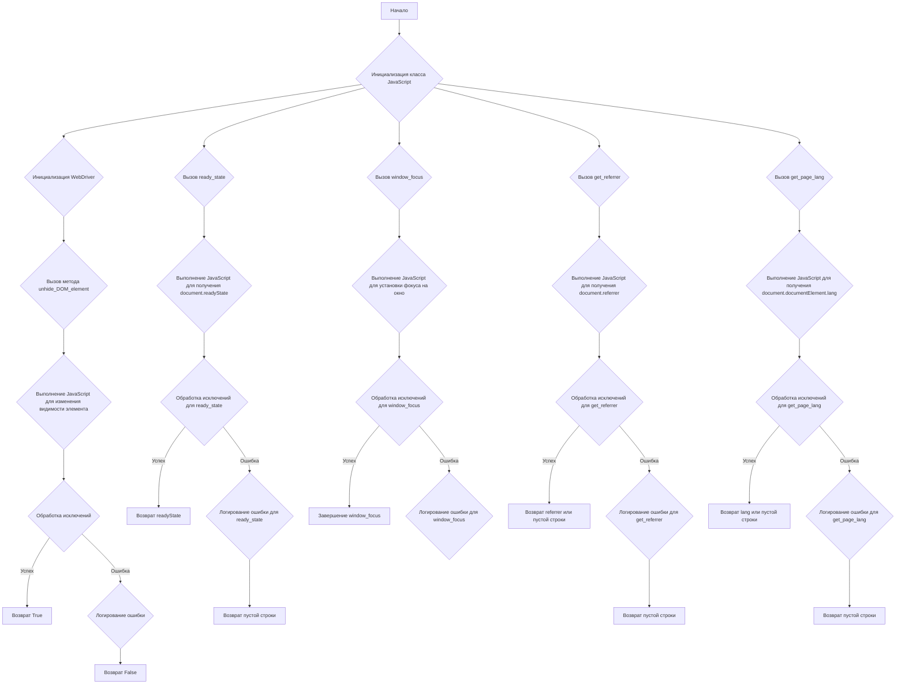
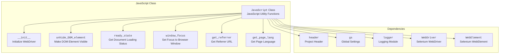
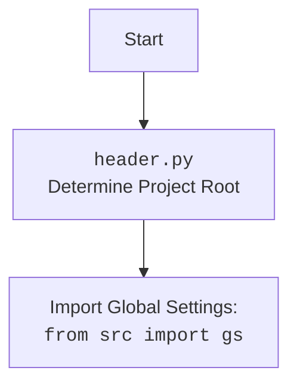

### **Системные инструкции для обработки кода проекта `hypotez`**

=========================================================================================

Описание функциональности и правил для генерации, анализа и улучшения кода. Направлено на обеспечение последовательного и читаемого стиля кодирования, соответствующего требованиям.

---

### **Основные принципы**

#### **1. Общие указания**:
- Соблюдай четкий и понятный стиль кодирования.
- Все изменения должны быть обоснованы и соответствовать установленным требованиям.

#### **2. Комментарии**:
- Используй `#` для внутренних комментариев.
- Документация всех функций, методов и классов должна следовать такому формату: 
    ```python
        def function(param: str, param1: Optional[str | dict | str] = None) -> dict | None:
            """ 
            Args:
                param (str): Описание параметра `param`.
                param1 (Optional[str | dict | str], optional): Описание параметра `param1`. По умолчанию `None`.
    
            Returns:
                dict | None: Описание возвращаемого значения. Возвращает словарь или `None`.
    
            Raises:
                SomeError: Описание ситуации, в которой возникает исключение `SomeError`.

            Ехаmple:
                >>> function('param', 'param1')
                {'param': 'param1'}
            """
    ```
- Комментарии и документация должны быть четкими, лаконичными и точными.

#### **3. Форматирование кода**:
- Используй одинарные кавычки. `a:str = 'value'`, `print('Hello World!')`;
- Добавляй пробелы вокруг операторов. Например, `x = 5`;
- Все параметры должны быть аннотированы типами. `def function(param: str, param1: Optional[str | dict | str] = None) -> dict | None:`;
- Не используй `Union`. Вместо этого используй `|`.

#### **4. Логирование**:
- Для логгирования Всегда Используй модуль `logger` из `src.logger.logger`.
- Ошибки должны логироваться с использованием `logger.error`.
Пример:
    ```python
        try:
            ...
        except Exception as ex:
            logger.error('Error while processing data', ех, exc_info=True)
    ```
#### **5 Не используй `Union[]` в коде. Вместо него используй `|`
Например:
```python
x: str | int ...
```


---

### **Основные требования**:

#### **1. Формат ответов в Markdown**:
- Все ответы должны быть выполнены в формате **Markdown**.

#### **2. Формат комментариев**:
- Используй указанный стиль для комментариев и документации в коде.
- Пример:

```python
from typing import Generator, Optional, List
from pathlib import Path


def read_text_file(
    file_path: str | Path,
    as_list: bool = False,
    extensions: Optional[List[str]] = None,
    chunk_size: int = 8192,
) -> Generator[str, None, None] | str | None:
    """
    Считывает содержимое файла (или файлов из каталога) с использованием генератора для экономии памяти.

    Args:
        file_path (str | Path): Путь к файлу или каталогу.
        as_list (bool): Если `True`, возвращает генератор строк.
        extensions (Optional[List[str]]): Список расширений файлов для чтения из каталога.
        chunk_size (int): Размер чанков для чтения файла в байтах.

    Returns:
        Generator[str, None, None] | str | None: Генератор строк, объединенная строка или `None` в случае ошибки.

    Raises:
        Exception: Если возникает ошибка при чтении файла.

    Example:
        >>> from pathlib import Path
        >>> file_path = Path('example.txt')
        >>> content = read_text_file(file_path)
        >>> if content:
        ...    print(f'File content: {content[:100]}...')
        File content: Example text...
    """
    ...
```
- Всегда делай подробные объяснения в комментариях. Избегай расплывчатых терминов, 
- таких как *«получить»* или *«делать»*
-  . Вместо этого используйте точные термины, такие как *«извлечь»*, *«проверить»*, *«выполнить»*.
- Вместо: *«получаем»*, *«возвращаем»*, *«преобразовываем»* используй имя объекта *«функция получае»*, *«переменная возвращает»*, *«код преобразовывает»* 
- Комментарии должны непосредственно предшествовать описываемому блоку кода и объяснять его назначение.

#### **3. Пробелы вокруг операторов присваивания**:
- Всегда добавляйте пробелы вокруг оператора `=`, чтобы повысить читаемость.
- Примеры:
  - **Неправильно**: `x=5`
  - **Правильно**: `x = 5`

#### **4. Использование `j_loads` или `j_loads_ns`**:
- Для чтения JSON или конфигурационных файлов замените стандартное использование `open` и `json.load` на `j_loads` или `j_loads_ns`.
- Пример:

```python
# Неправильно:
with open('config.json', 'r', encoding='utf-8') as f:
    data = json.load(f)

# Правильно:
data = j_loads('config.json')
```

#### **5. Сохранение комментариев**:
- Все существующие комментарии, начинающиеся с `#`, должны быть сохранены без изменений в разделе «Улучшенный код».
- Если комментарий кажется устаревшим или неясным, не изменяйте его. Вместо этого отметьте его в разделе «Изменения».

#### **6. Обработка `...` в коде**:
- Оставляйте `...` как указатели в коде без изменений.
- Не документируйте строки с `...`.
```

#### **7. Аннотации**
Для всех переменных должны быть определены аннотации типа. 
Для всех функций все входные и выходные параметры аннотириваны
Для все параметров должны быть аннотации типа.


### **8. webdriver**
В коде используется webdriver. Он импртируется из модуля `webdriver` проекта `hypotez`
```python
from src.webdirver import Driver, Chrome, Firefox, Playwright, ...
driver = Driver(Firefox)

Пoсле чего может использоваться как

close_banner = {
  "attribute": null,
  "by": "XPATH",
  "selector": "//button[@id = 'closeXButton']",
  "if_list": "first",
  "use_mouse": false,
  "mandatory": false,
  "timeout": 0,
  "timeout_for_event": "presence_of_element_located",
  "event": "click()",
  "locator_description": "Закрываю pop-up окно, если оно не появилось - не страшно (`mandatory`:`false`)"
}

result = driver.execute_locator(close_banner)
```

## Анализ кода `hypotez/src/webdriver/js.py`

### 1. Блок-схема



### 2. Диаграмма





### 3. Объяснение

#### Импорты:

-   `header`: Предположительно, содержит информацию о заголовке проекта. Используется для общих настроек или информации о проекте.
-   `src.gs`: Глобальные настройки проекта. Может содержать пути, флаги и другие глобальные переменные, используемые в проекте.
-   `src.logger.logger`: Модуль логирования, используемый для записи сообщений об ошибках и отладочной информации.
-   `selenium.webdriver.remote.webdriver.WebDriver`: Класс WebDriver из библиотеки Selenium, который используется для управления браузером.
-   `selenium.webdriver.remote.webelement.WebElement`: Класс WebElement из библиотеки Selenium, представляющий собой HTML-элемент на веб-странице.

#### Класс `JavaScript`:

-   **Роль**: Предоставляет набор JavaScript-утилит для взаимодействия с веб-страницей через Selenium WebDriver.
-   **Атрибуты**:
    -   `driver`: Экземпляр WebDriver, используемый для выполнения JavaScript-кода.
-   **Методы**:
    -   `__init__(self, driver: WebDriver)`: Конструктор класса. Принимает экземпляр WebDriver и сохраняет его в атрибуте `self.driver`.
    -   `unhide_DOM_element(self, element: WebElement) -> bool`: Делает невидимый DOM-элемент видимым, изменяя его стили. Принимает WebElement в качестве аргумента.
        -   Выполняет JavaScript-код, который устанавливает свойства `opacity`, `transform`, `MozTransform`, `WebkitTransform`, `msTransform`, `OTransform` элемента в значения, делающие его видимым.
        -   Прокручивает элемент в область видимости.
        -   Возвращает `True` в случае успеха и `False` в случае ошибки.
        -   Пример использования:

            ```python
            element = driver.find_element(By.ID, 'hiddenElement')
            js = JavaScript(driver)
            if js.unhide_DOM_element(element):
                print('Element is now visible')
            else:
                print('Failed to unhide element')
            ```
    -   `ready_state(self) -> str`: Возвращает состояние загрузки документа (`loading` или `complete`).
        -   Выполняет JavaScript-код, который возвращает значение `document.readyState`.
        -   Возвращает строку, представляющую состояние загрузки.
        -   Пример использования:

            ```python
            js = JavaScript(driver)
            state = js.ready_state
            print(f'Document ready state: {state}')
            ```
    -   `window_focus(self) -> None`: Устанавливает фокус на окно браузера.
        -   Выполняет JavaScript-код, который вызывает метод `window.focus()`.
        -   Пример использования:

            ```python
            js = JavaScript(driver)
            js.window_focus()
            print('Window focused')
            ```
    -   `get_referrer(self) -> str`: Возвращает URL-адрес страницы, с которой перешли на текущую страницу.
        -   Выполняет JavaScript-код, который возвращает значение `document.referrer`.
        -   Возвращает строку, представляющую URL-адрес referrer.
        -   Пример использования:

            ```python
            js = JavaScript(driver)
            referrer = js.get_referrer()
            print(f'Referrer URL: {referrer}')
            ```
    -   `get_page_lang(self) -> str`: Возвращает язык текущей страницы.
        -   Выполняет JavaScript-код, который возвращает значение `document.documentElement.lang`.
        -   Возвращает строку, представляющую язык страницы.
        -   Пример использования:

            ```python
            js = JavaScript(driver)
            lang = js.get_page_lang()
            print(f'Page language: {lang}')
            ```

#### Переменные:

-   `driver`: Экземпляр WebDriver, используемый для выполнения JavaScript-кода. Тип: `selenium.webdriver.remote.webdriver.WebDriver`.
-   `element`: WebElement, представляющий собой HTML-элемент на веб-странице. Тип: `selenium.webdriver.remote.webelement.WebElement`.
-   `script`: Строка, содержащая JavaScript-код для выполнения.
-   `ex`: Переменная исключения, используемая в блоках `try...except` для обработки ошибок.

#### Потенциальные ошибки и области для улучшения:

-   Обработка исключений: Во всех методах используется `try...except` для обработки исключений, но обработка сводится к логированию ошибки и возврату значения по умолчанию (например, `False` или пустая строка).  Было бы полезно рассмотреть возможность повторной генерации исключений в определенных случаях или предоставления более подробной информации об ошибке.
-   Улучшение логирования: Логирование ошибок выполняется с использованием `logger.error`, но можно добавить больше контекстной информации, например, URL текущей страницы или идентификатор элемента, с которым возникла проблема.
-   В методе `unhide_DOM_element` можно добавить проверку, был ли элемент изначально видим. Если элемент уже видим, можно избежать выполнения JavaScript-кода.

#### Взаимосвязь с другими частями проекта:

-   Этот модуль используется для выполнения JavaScript-кода в контексте Selenium WebDriver. Он может быть использован в других частях проекта, где требуется взаимодействие с веб-страницей через JavaScript. Например, он может быть использован для заполнения форм, нажатия на кнопки, изменения стилей элементов и т.д.
-   Модуль `src.logger.logger` используется для логирования ошибок, что позволяет отслеживать проблемы, возникающие при выполнении JavaScript-кода.
-   Модуль `header` содержит общую информацию о проекте, возможно, используемую для определения версии или других метаданных.
-   Модуль `gs` содержит глобальные настройки, которые могут влиять на поведение JavaScript-кода (например, таймауты).