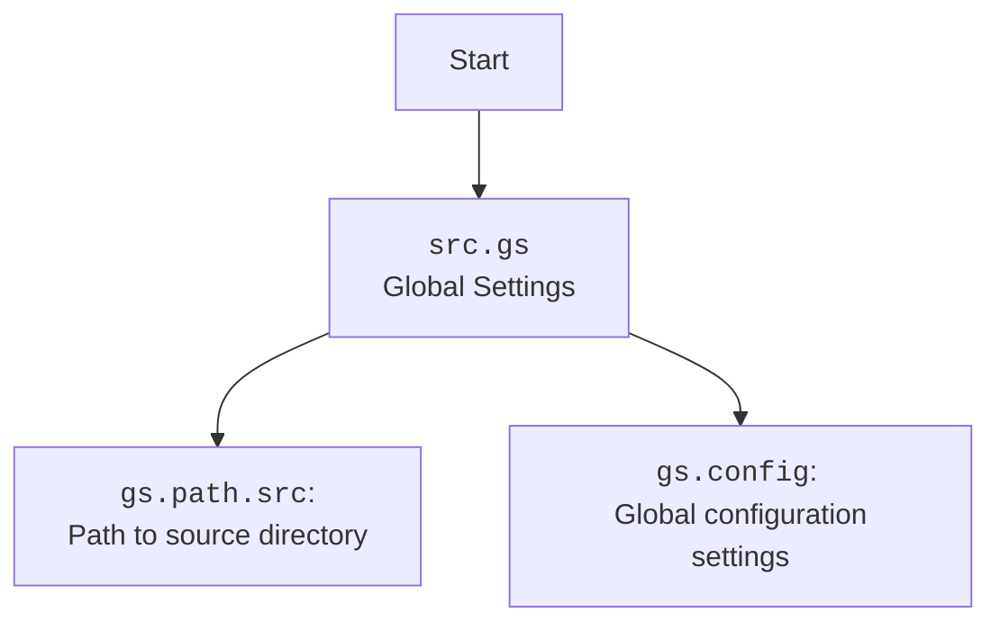

### **Системные инструкции для обработки кода проекта `hypotez`**

=========================================================================================

Описание функциональности и правил для генерации, анализа и улучшения кода. Направлено на обеспечение последовательного и читаемого стиля кодирования, соответствующего требованиям.

---

### **Основные принципы**

#### **1. Общие указания**:
- Соблюдай четкий и понятный стиль кодирования.
- Все изменения должны быть обоснованы и соответствовать установленным требованиям.

#### **2. Комментарии**:
- Используй `#` для внутренних комментариев.
- Документация всех функций, методов и классов должна следовать такому формату: 
    ```python
        def function(param: str, param1: Optional[str | dict | str] = None) -> dict | None:
            """ 
            Args:
                param (str): Описание параметра `param`.
                param1 (Optional[str | dict | str], optional): Описание параметра `param1`. По умолчанию `None`.
    
            Returns:
                dict | None: Описание возвращаемого значения. Возвращает словарь или `None`.
    
            Raises:
                SomeError: Описание ситуации, в которой возникает исключение `SomeError`.

            Ехаmple:
                >>> function('param', 'param1')
                {'param': 'param1'}
            """
    ```
- Комментарии и документация должны быть четкими, лаконичными и точными.

#### **3. Форматирование кода**:
- Используй одинарные кавычки. `a:str = 'value'`, `print('Hello World!')`;
- Добавляй пробелы вокруг операторов. Например, `x = 5`;
- Все параметры должны быть аннотированы типами. `def function(param: str, param1: Optional[str | dict | str] = None) -> dict | None:`;
- Не используй `Union`. Вместо этого используй `|`.

#### **4. Логирование**:
- Для логгирования Всегда Используй модуль `logger` из `src.logger.logger`.
- Ошибки должны логироваться с использованием `logger.error`.
Пример:
    ```python
        try:
            ...
        except Exception as ex:
            logger.error('Error while processing data', ех, exc_info=True)
    ```
#### **5 Не используй `Union[]` в коде. Вместо него используй `|`
Например:
```python
x: str | int ...
```


---

### **Основные требования**:

#### **1. Формат ответов в Markdown**:
- Все ответы должны быть выполнены в формате **Markdown**.

#### **2. Формат комментариев**:
- Используй указанный стиль для комментариев и документации в коде.
- Пример:

```python
from typing import Generator, Optional, List
from pathlib import Path


def read_text_file(
    file_path: str | Path,
    as_list: bool = False,
    extensions: Optional[List[str]] = None,
    chunk_size: int = 8192,
) -> Generator[str, None, None] | str | None:
    """
    Считывает содержимое файла (или файлов из каталога) с использованием генератора для экономии памяти.

    Args:
        file_path (str | Path): Путь к файлу или каталогу.
        as_list (bool): Если `True`, возвращает генератор строк.
        extensions (Optional[List[str]]): Список расширений файлов для чтения из каталога.
        chunk_size (int): Размер чанков для чтения файла в байтах.

    Returns:
        Generator[str, None, None] | str | None: Генератор строк, объединенная строка или `None` в случае ошибки.

    Raises:
        Exception: Если возникает ошибка при чтении файла.

    Example:
        >>> from pathlib import Path
        >>> file_path = Path('example.txt')
        >>> content = read_text_file(file_path)
        >>> if content:
        ...    print(f'File content: {content[:100]}...')
        File content: Example text...
    """
    ...
```
- Всегда делай подробные объяснения в комментариях. Избегай расплывчатых терминов, 
- таких как *«получить»* или *«делать»*
-  . Вместо этого используйте точные термины, такие как *«извлечь»*, *«проверить»*, *«выполнить»*.
- Вместо: *«получаем»*, *«возвращаем»*, *«преобразовываем»* используй имя объекта *«функция получае»*, *«переменная возвращает»*, *«код преобразовывает»* 
- Комментарии должны непосредственно предшествовать описываемому блоку кода и объяснять его назначение.

#### **3. Пробелы вокруг операторов присваивания**:
- Всегда добавляйте пробелы вокруг оператора `=`, чтобы повысить читаемость.
- Примеры:
  - **Неправильно**: `x=5`
  - **Правильно**: `x = 5`

#### **4. Использование `j_loads` или `j_loads_ns`**:
- Для чтения JSON или конфигурационных файлов замените стандартное использование `open` и `json.load` на `j_loads` или `j_loads_ns`.
- Пример:

```python
# Неправильно:
with open('config.json', 'r', encoding='utf-8') as f:
    data = json.load(f)

# Правильно:
data = j_loads('config.json')
```

#### **5. Сохранение комментариев**:
- Все существующие комментарии, начинающиеся с `#`, должны быть сохранены без изменений в разделе «Улучшенный код».
- Если комментарий кажется устаревшим или неясным, не изменяйте его. Вместо этого отметьте его в разделе «Изменения».

#### **6. Обработка `...` в коде**:
- Оставляйте `...` как указатели в коде без изменений.
- Не документируйте строки с `...`.
```

#### **7. Аннотации**
Для всех переменных должны быть определены аннотации типа. 
Для всех функций все входные и выходные параметры аннотириваны
Для все параметров должны быть аннотации типа.


### **8. webdriver**
В коде используется webdriver. Он импртируется из модуля `webdriver` проекта `hypotez`
```python
from src.webdirver import Driver, Chrome, Firefox, Playwright, ...
driver = Driver(Firefox)

Пoсле чего может использоваться как

close_banner = {
  "attribute": null,
  "by": "XPATH",
  "selector": "//button[@id = 'closeXButton']",
  "if_list": "first",
  "use_mouse": false,
  "mandatory": false,
  "timeout": 0,
  "timeout_for_event": "presence_of_element_located",
  "event": "click()",
  "locator_description": "Закрываю pop-up окно, если оно не появилось - не страшно (`mandatory`:`false`)"
}

result = driver.execute_locator(close_banner)
```

### **Анализ кода `hypotez/src/webdriver/playwright/executor.py`**

#### **1. Блок-схема**

```mermaid
graph TD
    A[Начало: PlaywrightExecutor.execute_locator] --> B{Тип locator - dict?};
    B -- Да --> C[Преобразование в SimpleNamespace];
    B -- Нет --> D{locator.attribute и locator.selector не None?};
    D -- Нет --> E[logger.debug("Empty locator provided.")];
    E --> F[Возврат None];
    D -- Да --> G[Вызов _parse_locator];
    G --> H{locator.event и locator.attribute, но нет locator.mandatory?};
    H -- Да --> I[logger.debug("Locator with event and attribute but missing mandatory flag. Skipping.")];
    I --> J[Возврат None];
    H -- Нет --> K{locator.attribute и locator.by - str?};
    K -- Нет --> R[locator.selector и locator.by - list?];
    K -- Да --> L{locator.attribute?};
    L -- Да --> M[evaluate_locator(locator.attribute)];
    M --> N{locator.by == "VALUE"?};
    N -- Да --> O[Возврат locator.attribute];
    N -- Нет --> P{locator.event?};
    P -- Да --> Q[execute_event(locator, message, typing_speed)];
    Q --> Z[Конец];
    P -- Нет --> AA{locator.attribute?};
    AA -- Да --> BB[get_attribute_by_locator(locator)];
    BB --> Z;
    AA -- Нет --> CC[get_webelement_by_locator(locator)];
    CC --> Z;
    R -- Да --> DD{locator.sorted == "pairs"?};
    DD -- Да --> EE[Обработка списков атрибутов/селекторов];
    EE --> FF[Возврат zipped_pairs];
    DD -- Нет --> GG[logger.warning("Locator does not contain 'selector' and 'by' lists or invalid 'sorted' value.")];
    GG --> Z;
    Z[Конец: Возврат результата];
```

**Примеры для каждого логического блока:**

- **A (Начало):** `executor.execute_locator(locator={'by': 'id', 'selector': 'some_id', 'event': 'click()'})`
- **B (Тип locator - dict?):** Если `locator` это словарь (например, `{'by': 'id', 'selector': 'some_id'}`), он преобразуется в `SimpleNamespace`.
- **C (Преобразование в SimpleNamespace):**  `locator` становится `SimpleNamespace(by='id', selector='some_id')`.
- **D (locator.attribute и locator.selector не None?):** Проверяется, что у `locator` есть атрибуты `attribute` или `selector`.
- **E (logger.debug("Empty locator provided.")):** Если `locator` пустой, записывается отладочное сообщение.
- **F (Возврат None):** Возвращается `None`, если `locator` пустой.
- **G (Вызов _parse_locator):** Вызывается внутренняя функция `_parse_locator` для обработки `locator`.
- **H (locator.event и locator.attribute, но нет locator.mandatory?):** Проверяется наличие `event` и `attribute` при отсутствии `mandatory`.
- **I (logger.debug("Locator with event and attribute but missing mandatory flag. Skipping.")):** Записывается отладочное сообщение, если отсутствует `mandatory`.
- **J (Возврат None):** Возвращается `None`, если отсутствует `mandatory`.
- **K (locator.attribute и locator.by - str?):** Проверяется, что `attribute` и `by` являются строками.
- **L (locator.attribute?):** Проверяется, что `locator.attribute` не пустой.
- **M (evaluate_locator(locator.attribute)):** Вызывается функция `evaluate_locator` для обработки атрибута.
- **N (locator.by == "VALUE"?):** Проверяется, что `locator.by` равно "VALUE".
- **O (Возврат locator.attribute):** Возвращается значение атрибута.
- **P (locator.event?):** Проверяется наличие события `event`.
- **Q (execute_event(locator, message, typing_speed)):** Вызывается функция `execute_event` для выполнения события.
- **AA (locator.attribute?):** Проверяется, что `locator.attribute` не пустой.
- **BB (get_attribute_by_locator(locator)):** Вызывается функция `get_attribute_by_locator` для получения атрибута.
- **CC (get_webelement_by_locator(locator)):** Вызывается функция `get_webelement_by_locator` для получения веб-элемента.
- **R (locator.selector и locator.by - list?):** Проверяется, что `selector` и `by` являются списками.
- **DD (locator.sorted == "pairs"?):** Проверяется, что атрибут `sorted` равен "pairs".
- **EE (Обработка списков атрибутов/селекторов):** Обрабатываются списки атрибутов и селекторов.
- **FF (Возврат zipped_pairs):** Возвращается список пар элементов.
- **GG (logger.warning("Locator does not contain 'selector' and 'by' lists or invalid 'sorted' value.")):** Записывается предупреждение о неверном формате `locator`.
- **Z (Конец):** Возвращается результат выполнения.

#### **2. Диаграмма**

```mermaid
flowchart TD
    subgraph PlaywrightExecutor
        A[__init__] --> B(start)
        B --> C(stop)
        C --> D(execute_locator)
        D --> E{locator is dict?}
        E -- Yes --> F(SimpleNamespace(**locator))
        E -- No --> G{locator.attribute and locator.selector?}
        G -- Yes --> H(_parse_locator)
        G -- No --> I[logger.debug("Empty locator provided.")]
        H --> J{locator.event and locator.attribute and not locator.mandatory?}
        J -- Yes --> K[logger.debug("Locator with event and attribute but missing mandatory flag. Skipping.")]
        J -- No --> L{locator.attribute and locator.by are str?}
        L -- Yes --> M{locator.attribute?}
        M -- Yes --> N(evaluate_locator(locator.attribute))
        N --> O{locator.by == "VALUE"?}
        O -- Yes --> P[return locator.attribute]
        O -- No --> Q{locator.event?}
        Q -- Yes --> R(execute_event(locator, message, typing_speed))
        Q -- No --> S{locator.attribute?}
        S -- Yes --> T(get_attribute_by_locator(locator))
        S -- No --> U(get_webelement_by_locator(locator))
        L -- No --> V{locator.selector and locator.by are list?}
        V -- Yes --> W{locator.sorted == "pairs"?}
        W -- Yes --> X[Process lists]
        W -- No --> Y[logger.warning("Locator does not contain 'selector' and 'by' lists or invalid 'sorted' value.")]
        R --> Z[return result]
        T --> Z
        U --> Z
        X --> Z
        I --> Z
        K --> Z
        Y --> Z
    end

    style PlaywrightExecutor fill:#f9f,stroke:#333,stroke-width:2px
```

**Объяснение зависимостей:**

- **`asyncio`**: Используется для асинхронного выполнения операций, что важно для неблокирующего взаимодействия с веб-страницами.
- **`re`**: Используется для работы с регулярными выражениями, например, для извлечения данных из строк событий.
- **`typing`**: Используется для аннотации типов, что улучшает читаемость и помогает в отладке кода.
- **`pathlib`**: Используется для работы с путями к файлам и каталогам.
- **`playwright.async_api`**: Основной модуль для взаимодействия с Playwright, включающий асинхронные API для управления браузером, страницами и элементами.
- **`types.SimpleNamespace`**: Используется для создания простых объектов, к которым можно обращаться по атрибутам.
- **`src.gs`**: Глобальные настройки проекта, содержащие пути и параметры конфигурации.
- **`src.logger.logger`**: Модуль логирования для записи информации о работе кода и ошибок.
- **`src.utils.jjson`**: Модуль для работы с JSON, используется для загрузки конфигурационных файлов.



#### **3. Объяснение**

**Импорты:**

- **`asyncio`**: Асинхронное программирование для неблокирующих операций.
- **`re`**: Работа с регулярными выражениями (например, для парсинга событий).
- **`typing`**: Аннотации типов (например, `Optional`, `List`, `Union`).
- **`pathlib`**: Работа с путями к файлам и каталогам.
- **`playwright.async_api`**: Асинхронный API Playwright для управления браузером.
- **`types.SimpleNamespace`**: Удобный способ создания объектов с атрибутами.
- **`src.gs`**: Глобальные настройки проекта (пути, конфигурация).
- **`src.logger.logger`**: Модуль логирования.
- **`src.utils.jjson`**: Модуль для работы с JSON (загрузка конфигурации).

**Класс `PlaywrightExecutor`:**

- **Роль**: Управляет взаимодействием с веб-элементами через Playwright.
- **Атрибуты**:
  - `driver`: Экземпляр Playwright.
  - `browser_type`: Тип браузера (chromium, firefox, webkit).
  - `page`: Текущая страница браузера.
  - `config`: Конфигурация из `playwrid.json`.
- **Методы**:
  - `__init__`: Инициализация экземпляра `PlaywrightExecutor`. Загружает конфигурацию из `playwrid.json` используя `j_loads_ns`.
  - `start`: Запускает Playwright и браузер.
  - `stop`: Останавливает Playwright и закрывает браузер.
  - `execute_locator`: Выполняет действия с веб-элементом на основе локатора.
  - `evaluate_locator`: Оценивает атрибуты локатора.
  - `get_attribute_by_locator`: Получает атрибут веб-элемента.
  - `get_webelement_by_locator`: Получает веб-элемент по локатору.
  - `get_webelement_as_screenshot`: Делает скриншот веб-элемента.
  - `execute_event`: Выполняет событие, связанное с локатором.
  - `send_message`: Отправляет сообщение веб-элементу.
  - `goto`: Переходит по указанному URL.

**Функции:**

- `__init__(self, browser_type: str = 'chromium', **kwargs)`:
  - **Аргументы**:
    - `browser_type (str)`: Тип браузера для запуска (по умолчанию 'chromium').
    - `**kwargs`: Дополнительные аргументы.
  - **Назначение**: Инициализирует экземпляр класса, загружает конфигурацию браузера.
  - **Пример**:
    ```python
    executor = PlaywrightExecutor(browser_type='firefox')
    ```

- `start(self) -> None`:
  - **Аргументы**: Отсутствуют.
  - **Назначение**: Запускает браузер Playwright.
  - **Пример**:
    ```python
    await executor.start()
    ```

- `stop(self) -> None`:
  - **Аргументы**: Отсутствуют.
  - **Назначение**: Останавливает браузер Playwright.
  - **Пример**:
    ```python
    await executor.stop()
    ```

- `execute_locator(self, locator: Union[dict, SimpleNamespace], message: Optional[str] = None, typing_speed: float = 0, timeout: Optional[float] = 0, timeout_for_event: Optional[str] = 'presence_of_element_located') -> Union[str, list, dict, Locator, bool, None]`:
  - **Аргументы**:
    - `locator (Union[dict, SimpleNamespace])`: Информация о локаторе элемента.
    - `message (Optional[str])`: Сообщение для отправки элементу.
    - `typing_speed (float)`: Скорость печати (для `send_keys`).
    - `timeout (float)`: Время ожидания элемента.
    - `timeout_for_event (str)`: Условие ожидания элемента.
  - **Назначение**: Выполняет действие с элементом на основе локатора.
  - **Пример**:
    ```python
    result = await executor.execute_locator(locator={'by': 'id', 'selector': 'my_id', 'event': 'click()'})
    ```

- `evaluate_locator(self, attribute: str | List[str] | dict) -> Optional[str | List[str] | dict]`:
    - **Аргументы**:
        - `attribute (str | List[str] | dict)`: Атрибут для оценки.
    - **Назначение**: Оценивает атрибут локатора.
    - **Пример**:
    ```python
    attribute = await executor.evaluate_locator('some_attribute')
    ```

- `get_attribute_by_locator(self, locator: dict | SimpleNamespace) -> Optional[str | List[str] | dict]`:
    - **Аргументы**:
        - `locator (dict | SimpleNamespace)`: Локатор элемента.
    - **Назначение**: Получает атрибут элемента по локатору.
    - **Пример**:
    ```python
    attribute = await executor.get_attribute_by_locator({'by': 'id', 'selector': 'my_id', 'attribute': 'value'})
    ```

- `get_webelement_by_locator(self, locator: dict | SimpleNamespace) -> Optional[Locator | List[Locator]]`:
    - **Аргументы**:
        - `locator (dict | SimpleNamespace)`: Локатор элемента.
    - **Назначение**: Получает веб-элемент по локатору.
    - **Пример**:
    ```python
    element = await executor.get_webelement_by_locator({'by': 'id', 'selector': 'my_id'})
    ```

- `get_webelement_as_screenshot(self, locator: dict | SimpleNamespace, webelement: Optional[Locator] = None) -> Optional[bytes]`:
    - **Аргументы**:
        - `locator (dict | SimpleNamespace)`: Локатор элемента.
        - `webelement (Optional[Locator])`: Веб-элемент (если уже найден).
    - **Назначение**: Делает скриншот элемента.
    - **Пример**:
    ```python
    screenshot = await executor.get_webelement_as_screenshot({'by': 'id', 'selector': 'my_id'})
    ```

- `execute_event(self, locator: dict | SimpleNamespace, message: Optional[str] = None, typing_speed: float = 0) -> Union[str, List[str], bytes, List[bytes], bool]`:
    - **Аргументы**:
        - `locator (dict | SimpleNamespace)`: Локатор элемента.
        - `message (Optional[str])`: Сообщение (например, для `upload_media`).
        - `typing_speed (float)`: Скорость печати.
    - **Назначение**: Выполняет событие (click, send_keys, и т.д.).
    - **Пример**:
    ```python
    result = await executor.execute_event({'by': 'id', 'selector': 'my_id', 'event': 'click()'})
    ```

- `send_message(self, locator: dict | SimpleNamespace, message: str = None, typing_speed: float = 0) -> bool`:
    - **Аргументы**:
        - `locator (dict | SimpleNamespace)`: Локатор элемента.
        - `message (str)`: Сообщение для отправки.
        - `typing_speed (float)`: Скорость печати.
    - **Назначение**: Отправляет сообщение элементу.
    - **Пример**:
    ```python
    result = await executor.send_message({'by': 'id', 'selector': 'my_id'}, 'Hello!')
    ```

- `goto(self, url: str) -> None`:
    - **Аргументы**:
        - `url (str)`: URL для перехода.
    - **Назначение**: Переходит по указанному URL.
    - **Пример**:
    ```python
    await executor.goto('https://www.example.com')
    ```

**Переменные:**

- `self.driver`: Экземпляр Playwright async driver, используемый для управления браузером.
- `self.browser_type`: Тип используемого браузера (например, 'chromium', 'firefox').
- `self.page`: Текущая страница, с которой происходит взаимодействие.
- `self.config`: Конфигурация, загруженная из файла `playwrid.json`.

**Потенциальные ошибки и области для улучшения:**

- Обработка исключений: В некоторых местах обработка исключений может быть улучшена, чтобы предоставлять более конкретные сообщения об ошибках.
- Валидация данных: Можно добавить валидацию данных для локаторов, чтобы убедиться, что они содержат необходимые поля.
- Обработка таймаутов: Можно сделать таймауты более гибкими, чтобы их можно было настраивать для каждого действия.

**Взаимосвязи с другими частями проекта:**

- `src.gs`: Используется для получения путей к файлам конфигурации и другим глобальным настройкам.
- `src.logger.logger`: Используется для логирования событий и ошибок, что помогает в отладке и мониторинге работы кода.
- `src.utils.jjson`: Используется для загрузки конфигурационных файлов в формате JSON.

Этот модуль является важной частью системы автоматизации тестирования, предоставляя API для взаимодействия с веб-элементами через Playwright. Он использует глобальные настройки и логирование для обеспечения гибкости и информативности.