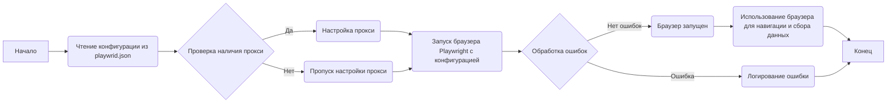
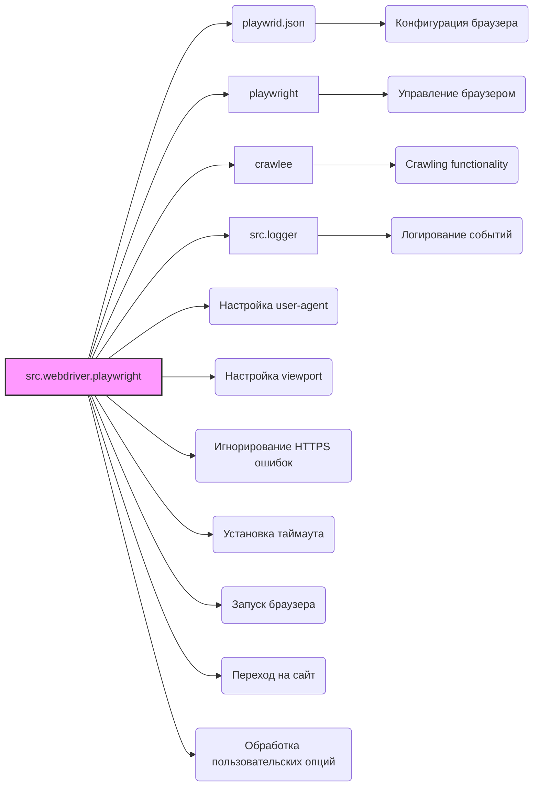

### **Системные инструкции для обработки кода проекта `hypotez`**

=========================================================================================

Описание функциональности и правил для генерации, анализа и улучшения кода. Направлено на обеспечение последовательного и читаемого стиля кодирования, соответствующего требованиям.

---

### **Основные принципы**

#### **1. Общие указания**:
- Соблюдай четкий и понятный стиль кодирования.
- Все изменения должны быть обоснованы и соответствовать установленным требованиям.

#### **2. Комментарии**:
- Используй `#` для внутренних комментариев.
- Документация всех функций, методов и классов должна следовать такому формату: 
    ```python
        def function(param: str, param1: Optional[str | dict | str] = None) -> dict | None:
            """ 
            Args:
                param (str): Описание параметра `param`.
                param1 (Optional[str | dict | str], optional): Описание параметра `param1`. По умолчанию `None`.
    
            Returns:
                dict | None: Описание возвращаемого значения. Возвращает словарь или `None`.
    
            Raises:
                SomeError: Описание ситуации, в которой возникает исключение `SomeError`.

            Ехаmple:
                >>> function('param', 'param1')
                {'param': 'param1'}
            """
    ```
- Комментарии и документация должны быть четкими, лаконичными и точными.

#### **3. Форматирование кода**:
- Используй одинарные кавычки. `a:str = 'value'`, `print('Hello World!')`;
- Добавляй пробелы вокруг операторов. Например, `x = 5`;
- Все параметры должны быть аннотированы типами. `def function(param: str, param1: Optional[str | dict | str] = None) -> dict | None:`;
- Не используй `Union`. Вместо этого используй `|`.

#### **4. Логирование**:
- Для логгирования Всегда Используй модуль `logger` из `src.logger.logger`.
- Ошибки должны логироваться с использованием `logger.error`.
Пример:
    ```python
        try:
            ...
        except Exception as ex:
            logger.error('Error while processing data', ех, exc_info=True)
    ```
#### **5 Не используй `Union[]` в коде. Вместо него используй `|`
Например:
```python
x: str | int ...
```


---

### **Основные требования**:

#### **1. Формат ответов в Markdown**:
- Все ответы должны быть выполнены в формате **Markdown**.

#### **2. Формат комментариев**:
- Используй указанный стиль для комментариев и документации в коде.
- Пример:

```python
from typing import Generator, Optional, List
from pathlib import Path


def read_text_file(
    file_path: str | Path,
    as_list: bool = False,
    extensions: Optional[List[str]] = None,
    chunk_size: int = 8192,
) -> Generator[str, None, None] | str | None:
    """
    Считывает содержимое файла (или файлов из каталога) с использованием генератора для экономии памяти.

    Args:
        file_path (str | Path): Путь к файлу или каталогу.
        as_list (bool): Если `True`, возвращает генератор строк.
        extensions (Optional[List[str]]): Список расширений файлов для чтения из каталога.
        chunk_size (int): Размер чанков для чтения файла в байтах.

    Returns:
        Generator[str, None, None] | str | None: Генератор строк, объединенная строка или `None` в случае ошибки.

    Raises:
        Exception: Если возникает ошибка при чтении файла.

    Example:
        >>> from pathlib import Path
        >>> file_path = Path('example.txt')
        >>> content = read_text_file(file_path)
        >>> if content:
        ...    print(f'File content: {content[:100]}...')
        File content: Example text...
    """
    ...
```
- Всегда делай подробные объяснения в комментариях. Избегай расплывчатых терминов, 
- таких как *«получить»* или *«делать»*. Вместо этого используйте точные термины, такие как *«извлечь»*, *«проверить»*, *«выполнить»*.
- Вместо: *«получаем»*, *«возвращаем»*, *«преобразовываем»* используй имя объекта *«функция получае»*, *«переменная возвращает»*, *«код преобразовывает»* 
- Комментарии должны непосредственно предшествовать описываемому блоку кода и объяснять его назначение.

#### **3. Пробелы вокруг операторов присваивания**:
- Всегда добавляйте пробелы вокруг оператора `=`, чтобы повысить читаемость.
- Примеры:
  - **Неправильно**: `x=5`
  - **Правильно**: `x = 5`

#### **4. Использование `j_loads` или `j_loads_ns`**:
- Для чтения JSON или конфигурационных файлов замените стандартное использование `open` и `json.load` на `j_loads` или `j_loads_ns`.
- Пример:

```python
# Неправильно:
with open('config.json', 'r', encoding='utf-8') as f:
    data = json.load(f)

# Правильно:
data = j_loads('config.json')
```

#### **5. Сохранение комментариев**:
- Все существующие комментарии, начинающиеся с `#`, должны быть сохранены без изменений в разделе «Улучшенный код».
- Если комментарий кажется устаревшим или неясным, не изменяйте его. Вместо этого отметьте его в разделе «Изменения».

#### **6. Обработка `...` в коде**:
- Оставляйте `...` как указатели в коде без изменений.
- Не документируйте строки с `...`.
```

#### **7. Аннотации**
Для всех переменных должны быть определены аннотации типа. 
Для всех функций все входные и выходные параметры аннотириваны
Для все параметров должны быть аннотации типа.


### **8. webdriver**
В коде используется webdriver. Он импртируется из модуля `webdriver` проекта `hypotez`
```python
from src.webdirver import Driver, Chrome, Firefox, Playwright, ...
driver = Driver(Firefox)

Пoсле чего может использоваться как

close_banner = {
  "attribute": null,
  "by": "XPATH",
  "selector": "//button[@id = 'closeXButton']",
  "if_list": "first",
  "use_mouse": false,
  "mandatory": false,
  "timeout": 0,
  "timeout_for_event": "presence_of_element_located",
  "event": "click()",
  "locator_description": "Закрываю pop-up окно, если оно не появилось - не страшно (`mandatory`:`false`)"
}

result = driver.execute_locator(close_banner)
```

## Анализ кода `hypotez/src/webdriver/playwright/readme.ru.md`

### 1. Блок-схема



**Примеры для каждого логического блока:**

-   **A (Начало)**: Начало процесса инициализации Playwright Crawler.
-   **B (Чтение конфигурации из playwrid.json)**: `j_loads('playwrid.json')` возвращает словарь с настройками.
-   **C (Проверка наличия прокси)**: `if config.get('proxy') and config['proxy'].get('enabled'):`
-   **D (Настройка прокси)**: Установка параметров прокси для Playwright.
-   **E (Пропуск настройки прокси)**: Если прокси не настроен, этот шаг пропускается.
-   **F (Запуск браузера Playwright с конфигурацией)**: Инициализация браузера Playwright с заданными параметрами.
-   **G (Обработка ошибок)**: `try...except` блоки для отлова исключений.
-   **H (Логирование ошибки)**: `logger.error('Сообщение об ошибке', exc_info=True)`
-   **I (Браузер запущен)**: Успешная инициализация браузера.
-   **J (Использование браузера для навигации и сбора данных)**: Выполнение операций на страницах с использованием Playwright.
-   **K (Конец)**: Завершение работы Playwright Crawler.

### 2. Диаграмма зависимостей



**Объяснение зависимостей:**

-   `src.webdriver.playwright`: Главный модуль, который использует другие компоненты для реализации Playwright Crawler.
-   `playwrid.json`: Файл конфигурации, содержащий настройки для браузера, прокси и другие параметры.
-   `playwright`: Библиотека для управления браузером.
-   `crawlee`: Библиотека для организации web crawling.
-   `src.logger`: Модуль логирования для записи ошибок и отладочной информации.
-    Настройка `user-agent`: Установка `user-agent` для запросов браузера.
-    Настройка `viewport`: Определение размеров окна браузера.
-   `Игнорирование HTTPS ошибок`: Опция для игнорирования ошибок HTTPS.
-    Установка `таймаута`: Определение максимального времени ожидания для операций.
-    Запуск `браузера`: Инициализация и запуск браузера Playwright.
-   `Переход на сайт`: Открытие указанного сайта в браузере.
-   `Обработка пользовательских опций`: Применение дополнительных опций, переданных пользователем.

### 3. Объяснение

#### Импорты:

В предоставленном тексте не указаны импорты, но подразумеваются следующие, исходя из описания функциональности:

-   `playwright`: Библиотека для автоматизации браузера. Позволяет управлять Chromium, Firefox и WebKit с помощью единого API.
-   `crawlee`: Библиотека для создания web crawlers. Предоставляет инструменты для управления очередью запросов, хранения данных и обработки страниц.
-   `src.logger`: Кастомный модуль логирования для проекта `hypotez`. Используется для записи информации о работе модуля, ошибок и предупреждений.
- `json`: Используется для чтения конфигурации из файла `playwrid.json`.

#### Классы:

-   `Playwrid`: (предположительно) Основной класс модуля, который реализует Playwright Crawler.

    -   **Атрибуты:**
        -   `browser_type`: Тип браузера (chromium, firefox, webkit).
        -   `headless`: Режим запуска браузера (с графическим интерфейсом или без).
        -   `options`: Список опций командной строки для браузера.
        -   `user_agent`: Строка User-Agent.
        -   `proxy`: Настройки прокси-сервера.
        -   `viewport`: Размеры окна браузера.
        -   `timeout`: Максимальное время ожидания для операций.
        -   `ignore_https_errors`: Флаг для игнорирования ошибок HTTPS.
    -   **Методы:**
        -   `__init__`: Конструктор класса, инициализирует Playwright Crawler, загружает конфигурацию из файла `playwrid.json` и применяет пользовательские опции.
        -   `start`: Запускает браузер и переходит на указанный URL.
        -   *Другие методы для взаимодействия с браузером и выполнения операций crawling.*

#### Функции:

В предоставленном тексте не указаны функции, но подразумеваются следующие:

-   `__init__`: Конструктор класса `Playwrid`, который инициализирует объект, загружает конфигурацию и настраивает браузер.
-   `start(url: str)`: Метод класса `Playwrid`, который запускает браузер и переходит по указанному URL.

#### Переменные:

-   `config`: Словарь, содержащий конфигурацию из файла `playwrid.json`.
-   `browser`: Объект браузера Playwright, используемый для управления браузером.
-   `logger`: Объект логгера из модуля `src.logger`.

#### Потенциальные ошибки и области для улучшения:

-   Отсутствие обработки исключений при чтении файла конфигурации `playwrid.json`.
-   Отсутствие валидации данных в файле конфигурации.
-   Недостаточно подробное логирование.
-   Не реализованы методы для выполнения операций crawling.
-   Не указаны типы данных для атрибутов класса и параметров методов.

#### Цепочка взаимосвязей с другими частями проекта:

-   `src.webdriver.playwright` использует `src.logger` для логирования, что позволяет централизованно управлять логированием во всем проекте.
-   Модуль использует файл `playwrid.json`, что позволяет легко конфигурировать параметры браузера без изменения кода.
-   `Playwrid` может быть использован в других модулях проекта для автоматизации браузера и сбора данных.