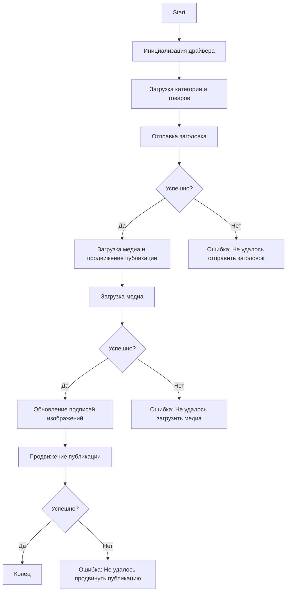

## \file hypotez/src/endpoints/advertisement/facebook/scenarios/post_message_async.md
# -*- coding: utf-8 -*-
#! .pyenv/bin/python3

"""
.. module:: src.endpoints.advertisement.facebook.post_message_async
:platform: Windows, Unix
:synopsis:  Scenario for asynchronously posting messages on Facebook.

[Русский]()

##  Асинхронный сценарий публикации сообщений в Facebook

### Обзор

Этот сценарий находится в каталоге `hypotez/src/endpoints/advertisement/facebook/scenarios` и предназначен для автоматизации процесса публикации сообщений в Facebook. Сценарий взаимодействует с Facebook-страницей, используя локаторы для выполнения различных действий, таких как отправка сообщений, загрузка медиафайлов и обновление подписей.


### Ключевые возможности

1. **Отправка заголовка и описания**: Отправляет заголовок и описание кампании в поле сообщения Facebook.
2. **Загрузка медиафайлов**: Загружает медиафайлы (изображения и видео) в публикацию Facebook и обновляет их подписи.
3. **Продвижение публикации**: Управляет всем процессом продвижения публикации с заголовком, описанием и медиафайлами.


### Структура модуля




### Легенда

1. **Start**: Начало выполнения сценария.
2. **InitDriver**: Создание экземпляра класса `Driver`.
3. **LoadCategoryAndProducts**: Загрузка данных о категории и товарах.
4. **SendTitle**: Вызов функции `post_title` для отправки заголовка.
5. **CheckTitleSuccess**: Проверка успешной отправки заголовка.
   - **Да**: Продолжить загрузку медиа и продвижение публикации.
   - **Нет**: Вывести ошибку "Не удалось отправить заголовок".
6. **UploadMediaAndPromotePost**: Вызов функции `promote_post`.
7. **UploadMedia**: Вызов функции `upload_media` для загрузки медиафайлов.
8. **CheckMediaSuccess**: Проверка успешной загрузки медиа.
   - **Да**: Продолжить обновление подписей изображений.
   - **Нет**: Вывести ошибку "Не удалось загрузить медиа".
9. **UpdateCaptions**: Вызов функции `update_images_captions` для обновления подписей.
10. **PromotePost**: Завершение процесса продвижения публикации.
11. **CheckPromoteSuccess**: Проверка успешного продвижения публикации.
    - **Да**: Конец выполнения сценария.
    - **Нет**: Вывести ошибку "Не удалось продвинуть публикацию".


-----------------------

#### Функции

- **`post_title(d: Driver, category: SimpleNamespace) -> bool`**:
  - **Цель**: Отправляет заголовок и описание кампании в поле сообщения Facebook.
  - **Параметры**:
    - `d`: Экземпляр класса `Driver`, используемый для взаимодействия с веб-страницей.
    - `category`: Категория, содержащая заголовок и описание для отправки.
  - **Возвращает**: `True`, если заголовок и описание были успешно отправлены, в противном случае `None`.

- **`upload_media(d: Driver, products: List[SimpleNamespace], no_video: bool = False) -> bool`**:
  - **Цель**: Загружает медиафайлы в публикацию Facebook и обновляет их подписи.
  - **Параметры**:
    - `d`: Экземпляр класса `Driver`, используемый для взаимодействия с веб-страницей.
    - `products`: Список товаров, содержащих пути к медиафайлам.
    - `no_video`: Флаг, указывающий, следует ли пропускать загрузку видео.
  - **Возвращает**: `True`, если медиафайлы были успешно загружены, в противном случае `None`.

- **`update_images_captions(d: Driver, products: List[SimpleNamespace], textarea_list: List[WebElement]) -> None`**:
  - **Цель**: Асинхронно добавляет описания к загруженным медиафайлам.
  - **Параметры**:
    - `d`: Экземпляр класса `Driver`, используемый для взаимодействия с веб-страницей.
    - `products`: Список товаров с деталями для обновления.
    - `textarea_list`: Список текстовых полей, в которые добавляются подписи.

- **`promote_post(d: Driver, category: SimpleNamespace, products: List[SimpleNamespace], no_video: bool = False) -> bool`**:
  - **Цель**: Управляет процессом продвижения публикации с заголовком, описанием и медиафайлами.
  - **Параметры**:
    - `d`: Экземпляр класса `Driver`, используемый для взаимодействия с веб-страницей.
    - `category`: Детали категории, используемые для заголовка и описания публикации.
    - `products`: Список товаров, содержащих медиа и детали для публикации.
    - `no_video`: Флаг, указывающий, следует ли пропускать загрузку видео.
  - **Возвращает**: `True`, если публикация была успешно продвинута, в противном случае `None`.


### Использование

Чтобы использовать этот сценарий, выполните следующие шаги:

1. **Инициализация драйвера**: Создайте экземпляр класса `Driver`.
2. **Загрузка локаторов**: Загрузите локаторы из JSON-файла.
3. **Вызов функций**: Используйте предоставленные функции для отправки заголовка, загрузки медиа и продвижения публикации.


#### Пример

```python
from src.webdriver.driver import Driver
from types import SimpleNamespace

# Инициализация драйвера
driver = Driver(...)

# Загрузка категории и товаров
category = SimpleNamespace(title="Название кампании", description="Описание кампании")
products = [SimpleNamespace(local_image_path='path/to/image.jpg', ...)]

# Отправка заголовка
post_title(driver, category)

# Загрузка медиа и продвижение публикации
await promote_post(driver, category, products)
```


### Зависимости

- `selenium`: Для веб-автоматизации.
- `asyncio`: Для асинхронных операций.
- `pathlib`: Для работы с путями к файлам.
- `types`: Для создания простых пространств имен.
- `typing`: Для аннотаций типов.


### Обработка ошибок

Сценарий включает в себя надежную обработку ошибок, чтобы гарантировать, что выполнение продолжается даже если некоторые элементы не найдены или если есть проблемы с веб-страницей. Это особенно полезно для обработки динамических или нестабильных веб-страниц.


### Внесение вклада

Внесение вклада в этот сценарий приветствуется. Пожалуйста, убедитесь, что любые изменения хорошо документированы и включают соответствующие тесты.


### Лицензия

Этот сценарий лицензирован под лицензией MIT. Подробнее см. в файле `LICENSE`.