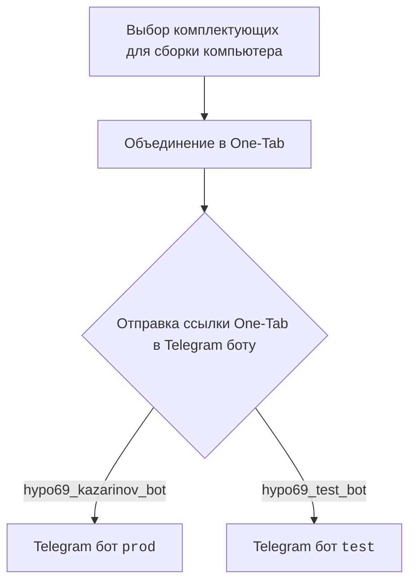
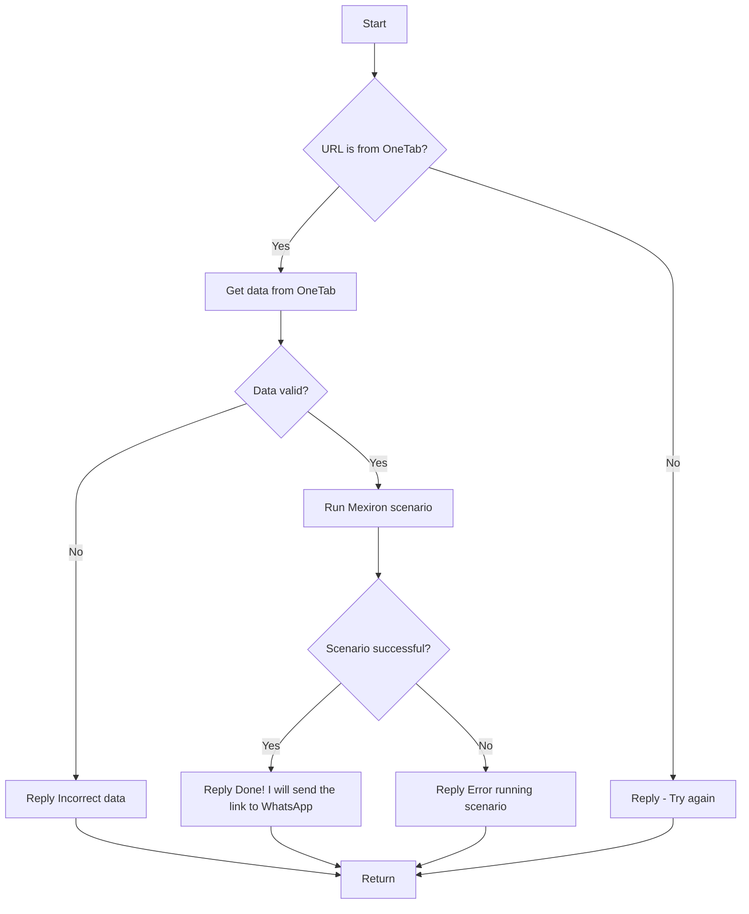

## Как использовать этот блок кода
=========================================================================================

Описание
-------------------------
Этот блок кода используется для добавления документации к модулю Kazarinov в проекте Hypotez. 

Шаги выполнения
-------------------------
1. **Добавление директивы `.. module::`**: Эта директива используется для указания имени модуля, к которому относится документация. 
2. **Добавление краткого описания**: Директива `.. synopsys::` используется для краткого описания функциональности модуля.
3. **Форматирование документации**: Используется `TABLE` для создания таблицы, в которой размещается информация о документации, 
   например, ссылки на главную страницу документации (`README`) и на версию документации на русском языке.
4. **Описание функциональности**: Текстовый блок с описанием функциональности `KazarinovTelegramBot`.
5. **Диаграмма взаимодействия**: Используется язык `mermaid` для создания диаграмм, демонстрирующих взаимодействие между клиентом (Kazarinov), ботом (hypo69_kazarinov_bot) и серверной частью приложения. 
6. **Диаграмма обработки данных**: Еще одна диаграмма `mermaid`, описывающая логику обработки данных в Kazarinov.
7. **Ссылки на следующую документацию**: В конце блока кода добавляются ссылки на следующую документацию, например, на `Kazarinov bot` и `Scenario Execution`.

Пример использования
-------------------------

```python
                ```rst
.. module:: src.endpoints.kazarinov
    .. synopsys: Kazarinov. PDF Mexiron Creator 
```

<TABLE >
<TR>
<TD>
<A HREF = 'https://github.com/hypo69/hypotez/blob/master/readme.ru.md'>[Root ↑]</A>
</TD>
<TD>
<A HREF = 'https://github.com/hypo69/hypotez/blob/master/src/endpoints/kazarinov/readme.ru.md'>Русский</A>
</TD>
</TR>
</TABLE>

`KazarinovTelegramBot`
- https://one-tab.co.il
- https://morlevi.co.il
- https://grandavance.co.il
- https://ivory.co.il
- https://ksp.co.il 
-------- 
`BotHandler` 

Client side (Kazarinov): 

------------

Code side: 



Next
========
<A HREF = 'https://github.com/hypo69/hypotez/blob/master/src/endpoints/kazarinov/kazarinov_bot.md'>Kazarinov bot</A>
<br>
<A HREF = 'https://github.com/hypo69/hypotez/blob/master/src/endpoints/kazarinov/scenarios/README.MD'>Scenario Execution</A>