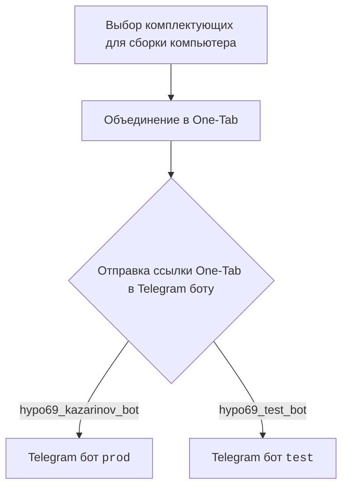
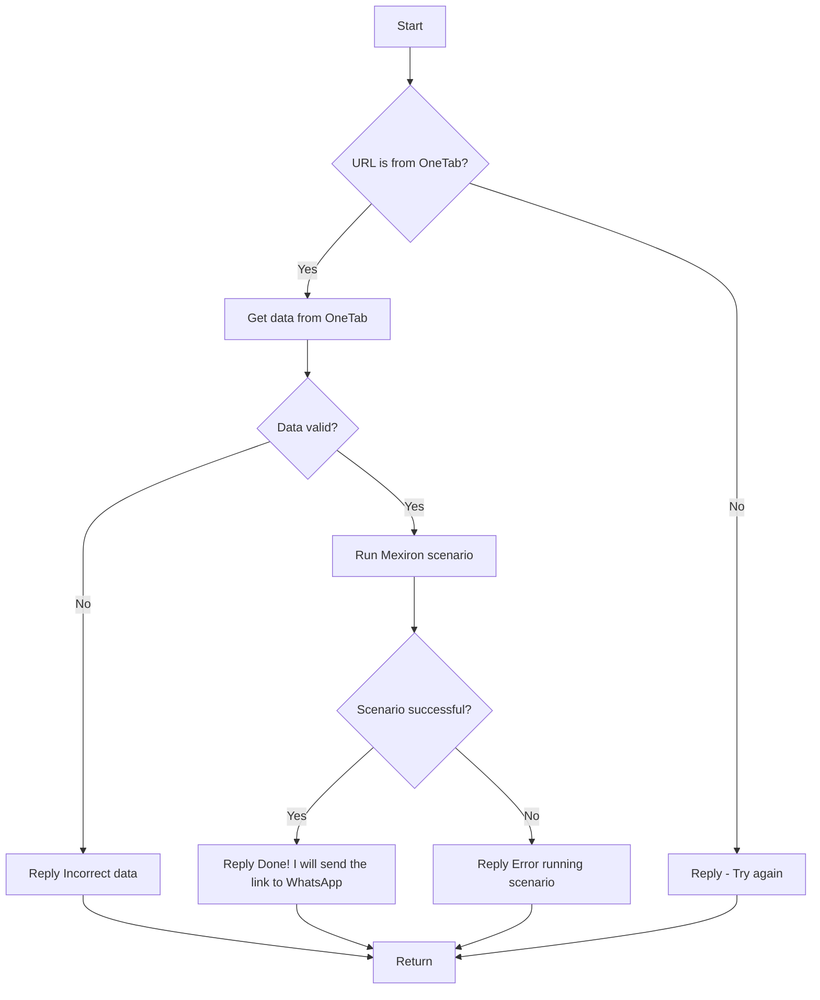

## \file hypotez/src/endpoints/kazarinov/readme.ru.md
# -*- coding: utf-8 -*-
#! .pyenv/bin/python3

"""
Документация по созданию прайслиста для Казаринова.
====================================================
В этом файле содержится информация о работе Telegram-ботов
`KazarinovTelegramBot`, интеграции с One-Tab и сценариях обработки данных.

 .. module:: src.endpoints.kazarinov
\t.. synopsys: Казаринов. Мехирон в pdf
"""

<TABLE >
<TR>
<TD>
<A HREF = 'https://github.com/hypo69/hypotez/blob/master/README.MD'>[Root ↑]</A>
</TD>
<TD>
<A HREF = 'https://github.com/hypo69/hypotez/blob/master/src/endpoints/kazarinov/README.MD'>English</A>
</TD>
</TR>
</TABLE>

Создание прайслиста для Казаринова
========================================

`KazarinovTelegramBot`
- https://one-tab.co.il
- https://morlevi.co.il
- https://grandavance.co.il
- https://ivory.co.il
- https://ksp.co.il
--------
`BotHandler`

На стороне клиента:

На стороне кода:

 - `kazarinov_bot.handle_message()` -> `kazarinov.scenarios.run_scenario()`:



Далее
=========
<A HREF = 'https://github.com/hypo69/hypotez/blob/master/src/endpoints/kazarinov/kazarinov_bot.ru.md'>Казарионв бот</A>
<br>
<A HREF = 'https://github.com/hypo69/hypotez/blob/master/src/endpoints/kazarinov/scenarios/readme.ru.md'>Испоолнение сценария</A>

Как использовать этот блок кода
=========================================================================================

Описание
-------------------------
Этот документ описывает процесс создания прайслиста для компании Казаринова с использованием Telegram-ботов.
Он включает в себя взаимодействие клиента с ботом, обработку данных из One-Tab и запуск сценариев для генерации прайслиста.

Шаги выполнения
-------------------------
1. **Клиент выбирает комплектующие для сборки компьютера.**
2. **Клиент объединяет выбранные комплектующие в One-Tab.**
3. **Клиент отправляет ссылку One-Tab в Telegram-бота (`prod` или `test`).**
4. **Бот `kazarinov_bot` принимает сообщение и запускает сценарий `run_scenario`.**
5. **Сценарий проверяет, является ли URL ссылкой One-Tab.**
6. **Если URL из One-Tab, извлекаются данные.**
7. **Проверяется валидность полученных данных.**
8. **Если данные валидны, запускается Mexiron сценарий.**
9. **В случае успешного выполнения сценария, бот отправляет уведомление и ссылку в WhatsApp.**
10. **В случае ошибки на любом этапе, бот отправляет сообщение об ошибке.**

Пример использования
-------------------------

```python
# Пример обработки сообщения от пользователя в Telegram-боте
from src.endpoints.kazarinov import kazarinov_bot
from telegram import Update
from telegram.ext import CallbackContext

def handle_message(update: Update, context: CallbackContext):
    """
    Функция обрабатывает входящие сообщения от пользователей.
    """
    message_text = update.message.text
    chat_id = update.message.chat_id

    # Проверяем, что сообщение содержит ссылку One-Tab
    if "one-tab.co.il" in message_text:
        # Запускаем сценарий обработки ссылки One-Tab
        result = kazarinov_bot.handle_message(message_text)

        if result["success"]:
            # Отправляем подтверждение пользователю
            context.bot.send_message(
                chat_id=chat_id,
                text="Done! I will send the link to WhatsApp."
            )
        else:
            # Отправляем сообщение об ошибке
            context.bot.send_message(
                chat_id=chat_id,
                text=f"Error running scenario: {result['error']}"
            )
    else:
        # Отправляем сообщение с просьбой повторить ввод
        context.bot.send_message(
            chat_id=chat_id,
            text="Please send a valid One-Tab URL."
        )

# Пример запуска обработчика сообщений
# В реальном коде это будет частью логики Telegram-бота
# handle_message(update, context)