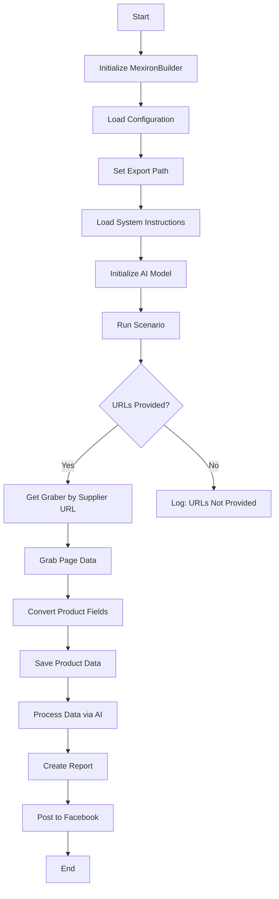

### **Инструкции по созданию "мехирона" Сергея Казаринова**

=========================================================================================

#### Обзор

Этот скрипт является частью директории `hypotez/src/endpoints/kazarinov/scenarios` и предназначен для автоматизации процесса создания "мехирона" для Сергея Казаринова. Скрипт извлекает, анализирует и обрабатывает данные о товарах от различных поставщиков, подготавливает данные, обрабатывает их с помощью искусственного интеллекта и интегрируется с Facebook для публикации товаров.

#### Основные характеристики

1.  **Извлечение и анализ данных**: Извлекает и анализирует данные о товарах от различных поставщиков.
2.  **Обработка данных с помощью ИИ**: Обрабатывает извлеченные данные с помощью модели Google Generative AI.
3.  **Хранение данных**: Сохраняет обработанные данные в файлы.
4.  **Создание отчетов**: Создает HTML и PDF отчеты на основе обработанных данных.
5.  **Публикация в Facebook**: Публикует обработанные данные в Facebook.

#### Схема работы модуля



#### Обозначения

1.  **Start**: Начало выполнения скрипта.
2.  **InitMexironBuilder**: Инициализация класса `MexironBuilder`.
3.  **LoadConfig**: Загрузка конфигурации из JSON файла.
4.  **SetExportPath**: Установка пути для экспорта данных.
5.  **LoadSystemInstruction**: Загрузка системных инструкций для модели ИИ.
6.  **InitModel**: Инициализация модели Google Generative AI.
7.  **RunScenario**: Выполнение основного сценария.
8.  **CheckURLs**: Проверка, предоставлены ли URL для анализа.
9.  **GetGraber**: Получение соответствующего грабера для URL поставщика.
10. **GrabPage**: Извлечение данных со страницы с использованием грабера.
11. **ConvertFields**: Преобразование полей товара в словарь.
12. **SaveData**: Сохранение данных о товаре в файл.
13. **ProcessAI**: Обработка данных о товаре с помощью модели ИИ.
14. **CreateReport**: Создание HTML и PDF отчетов на основе обработанных данных.
15. **PostFacebook**: Публикация обработанных данных в Facebook.
16. **End**: Завершение выполнения скрипта.

-----------------------

#### Класс: `MexironBuilder`

-   **Атрибуты**:
    -   `driver`: Экземпляр Selenium WebDriver.
    -   `export_path`: Путь для экспорта данных.
    -   `mexiron_name`: Пользовательское имя для процесса мехирона.
    -   `price`: Цена для обработки.
    -   `timestamp`: Временная метка для процесса.
    -   `products_list`: Список обработанных данных о товарах.
    -   `model`: Модель Google Generative AI.
    -   `config`: Конфигурация, загруженная из JSON.

-   **Методы**:
    -   **`__init__(self, driver: Driver, mexiron_name: Optional[str] = None)`**:
        -   **Назначение**: Инициализирует класс `MexironBuilder` необходимыми компонентами.
        -   **Параметры**:
            -   `driver`: Экземпляр Selenium WebDriver.
            -   `mexiron_name`: Пользовательское имя для процесса мехирона.
            ----
    -   **`run_scenario(self, system_instruction: Optional[str] = None, price: Optional[str] = None, mexiron_name: Optional[str] = None, urls: Optional[str | List[str]] = None, bot = None) -> bool`**:
        -   **Назначение**: Выполняет сценарий: анализирует товары, обрабатывает их с помощью ИИ и сохраняет данные.
        -   **Параметры**:
            -   `system_instruction`: Системные инструкции для модели ИИ.
            -   `price`: Цена для обработки.
            -   `mexiron_name`: Пользовательское имя мехирона.
            -   `urls`: URL страниц товаров.
        -   **Возвращает**: `True`, если сценарий выполнен успешно, иначе `False`.

    -   **Flowchart**:

        ```mermaid
        flowchart TD
        Start[Start] --> IsOneTab{URL is from OneTab?}
        IsOneTab -->|Yes| GetDataFromOneTab[Get data from OneTab]
        IsOneTab -->|No| ReplyTryAgain[Reply - Try again]
        GetDataFromOneTab --> IsDataValid{Data valid?}
        IsDataValid -->|No| ReplyIncorrectData[Reply Incorrect data]
        IsDataValid -->|Yes| RunMexironScenario[Run Mexiron scenario]
        RunMexironScenario --> IsGraberFound{Graber found?}
        IsGraberFound -->|Yes| StartParsing[Start parsing: <code>url</code>]
        IsGraberFound -->|No| LogNoGraber[Log: No graber for <code>url</code>]
        StartParsing --> IsParsingSuccessful{Parsing successful?}
        IsParsingSuccessful -->|Yes| ConvertProductFields[Convert product fields]
        IsParsingSuccessful -->|No| LogParsingFailed[Log: Failed to parse product fields]
        ConvertProductFields --> IsConversionSuccessful{Conversion successful?}
        IsConversionSuccessful -->|Yes| SaveProductData[Save product data]
        IsConversionSuccessful -->|No| LogConversionFailed[Log: Failed to convert product fields]
        SaveProductData --> IsDataSaved{Data saved?}
        IsDataSaved -->|Yes| AppendToProductsList[Append to products_list]
        IsDataSaved -->|No| LogDataNotSaved[Log: Data not saved]
        AppendToProductsList --> ProcessAIHe[AI processing lang = he]
        ProcessAIHe --> ProcessAIRu[AI processing lang = ru]
        ProcessAIRu --> SaveHeJSON{Save JSON for he?}
        SaveHeJSON -->|Yes| SaveRuJSON[Save JSON for ru]
        SaveHeJSON -->|No| LogHeJSONError[Log: Error saving he JSON]
        SaveRuJSON --> IsRuJSONSaved{Save JSON for ru?}
        IsRuJSONSaved -->|Yes| GenerateReports[Generate reports]
        IsRuJSONSaved -->|No| LogRuJSONError[Log: Error saving ru JSON]
        GenerateReports --> IsReportGenerationSuccessful{Report generation successful?}
        IsReportGenerationSuccessful -->|Yes| SendPDF[Send PDF via Telegram]
        IsReportGenerationSuccessful -->|No| LogPDFError[Log: Error creating PDF]
        SendPDF --> ReturnTrue[Return True]
        LogPDFError --> ReturnTrue[Return True]
        ReplyIncorrectData --> ReturnTrue[Return True]
        ReplyTryAgain --> ReturnTrue[Return True]
        LogNoGraber --> ReturnTrue[Return True]
        LogParsingFailed --> ReturnTrue[Return True]
        LogConversionFailed --> ReturnTrue[Return True]
        LogDataNotSaved --> ReturnTrue[Return True]
        LogHeJSONError --> ReturnTrue[Return True]
        LogRuJSONError --> ReturnTrue[Return True]
        ```

    -   **Обозначения**

        1.  **Start**: Сценарий начинает выполнение.

        2.  **URL Source Check (IsOneTab)**:

            *   Если URL из OneTab, данные извлекаются из OneTab.
            *   Если URL не из OneTab, пользователю отправляется сообщение "Попробуйте еще раз".

        3.  **Data Validity Check (IsDataValid)**:

            *   Если данные недействительны, пользователю отправляется сообщение "Неверные данные".
            *   Если данные действительны, запускается сценарий Mexiron.

        4.  **Grabber Search (IsGraberFound)**:

            *   Если граббер найден, начинается анализ страницы.
            *   Если граббер не найден, создается сообщение журнала, указывающее, что для данного URL нет граббера.

        5.  **Page Parsing (StartParsing)**:

            *   Если анализ выполнен успешно, данные преобразуются в требуемый формат.
            *   Если анализ не удался, регистрируется ошибка.

        6.  **Data Conversion (ConvertProductFields)**:

            *   Если преобразование выполнено успешно, данные сохраняются.
            *   Если преобразование не удалось, регистрируется ошибка.

        7.  **Data Saving (SaveProductData)**:

            *   Если данные сохранены, они добавляются в список товаров.
            *   Если данные не сохранены, регистрируется ошибка.

        8.  **AI Processing (ProcessAIHe, ProcessAIRu)**:

            *   Данные обрабатываются ИИ для языков `he` (иврит) и `ru` (русский).

        9.  **JSON Saving (SaveHeJSON, SaveRuJSON)**:

            *   Результаты обработки сохраняются в формате JSON для каждого языка.
            *   Если сохранение не удается, регистрируется ошибка.

        10. **Report Generation (GenerateReports)**:

            *   HTML и PDF отчеты создаются для каждого языка.
            *   Если создание отчета не удается, регистрируется ошибка.

        11. **PDF Sending via Telegram (SendPDF)**:

            *   PDF-файлы отправляются через Telegram.
            *   Если отправка не удается, регистрируется ошибка.

        12. **Completion (ReturnTrue)**:

            *   Сценарий завершается возвратом `True`.

        #### **Error Logging**:

        *   На каждом этапе, где могут возникнуть ошибки, включены узлы для регистрации ошибок (например, `LogNoGraber`, `LogParsingFailed`, `LogHeJSONError` и т. д.).

        ----
    -   **`get_graber_by_supplier_url(self, url: str)`**:
        -   **Назначение**: Возвращает соответствующий грабер для данного URL поставщика.
        -   **Параметры**:
            -   `url`: URL страницы поставщика.
        -   **Возвращает**: Экземпляр грабера, если найден, иначе `None`.
            ----
    -   **`convert_product_fields(self, f: ProductFields) -> dict`**:
        -   **Назначение**: Преобразует поля товара в словарь.
        -   **Параметры**:
            -   `f`: Объект, содержащий проанализированные данные о товаре.
        -   **Возвращает**: Отформатированный словарь данных о товаре.
            ----
    -   **`save_product_data(self, product_data: dict)`**:
        -   **Назначение**: Сохраняет данные о товаре в файл.
        -   **Параметры**:
            -   `product_data`: Отформатированные данные о товаре.
            ----
    -   **`process_llm(self, products_list: List[str], lang: str, attempts: int = 3) -> tuple | bool`**:
        -   **Назначение**: Обрабатывает список товаров с помощью модели ИИ.
        -   **Параметры**:
            -   `products_list`: Список словарей данных о товарах в виде строк.
            -   `attempts`: Количество попыток повтора в случае неудачи.
        -   **Возвращает**: Обработанный ответ в форматах `ru` и `he`.
            ----
    -   **`post_facebook(self, mexiron: SimpleNamespace) -> bool`**:
        -   **Назначение**: Выполняет сценарий публикации в Facebook.
        -   **Параметры**:
            -   `mexiron`: Обработанные данные для публикации.
        -   **Возвращает**: `True`, если публикация выполнена успешно, иначе `False`.
            ----
    -   **`create_report(self, data: dict, html_file: Path, pdf_file: Path)`**:
        -   **Назначение**: Создает HTML и PDF отчеты на основе обработанных данных.
        -   **Параметры**:
            -   `data`: Обработанные данные.
            -   `html_file`: Путь для сохранения HTML отчета.
            -   `pdf_file`: Путь для сохранения PDF отчета.

#### Использование

Для использования этого скрипта выполните следующие шаги:

1.  **Инициализация драйвера**: Создайте экземпляр класса `Driver`.
2.  **Инициализация MexironBuilder**: Создайте экземпляр класса `MexironBuilder` с драйвером.
3.  **Запуск сценария**: Вызовите метод `run_scenario` с необходимыми параметрами.

#### Пример

```python
from src.webdriver.driver import Driver
from src.endpoints.kazarinov.scenarios.scenario_pricelist import MexironBuilder

# Инициализация драйвера
driver = Driver(...)

# Инициализация MexironBuilder
mexiron_builder = MexironBuilder(driver)

# Запуск сценария
urls = ['https://example.com/product1', 'https://example.com/product2']
mexiron_builder.run_scenario(urls=urls)
```

### Зависимости

*   `selenium`: Для автоматизации веб-страниц.
*   `asyncio`: Для асинхронных операций.
*   `pathlib`: Для работы с путями к файлам.
*   `types`: Для создания простых пространств имен.
*   `typing`: Для аннотаций типов.
*   `src.ai.gemini`: Для обработки данных с использованием ИИ.
*   `src.suppliers.*.graber`: Для извлечения данных от различных поставщиков.
*   `src.endpoints.advertisement.facebook.scenarios`: Для публикации в Facebook.

### Обработка ошибок

Скрипт включает надежную обработку ошибок для обеспечения непрерывного выполнения, даже если некоторые элементы не найдены или есть проблемы с веб-страницей. Это особенно полезно для обработки динамических или нестабильных веб-страниц.

### Вклад

Вклад в этот скрипт приветствуется. Пожалуйста, убедитесь, что любые изменения хорошо документированы и включают соответствующие тесты.

### Лицензия

Этот скрипт распространяется под лицензией MIT. Подробности см. в файле `LICENSE`.

Как использовать этот блок кода
=========================================================================================

Описание
-------------------------

Данный код представляет собой сценарий для автоматизации процесса создания "мехирона" для Сергея Казаринова, включающий извлечение данных о товарах, их обработку с помощью ИИ и публикацию в Facebook.

Шаги выполнения
-------------------------

1.  Инициализируется класс `MexironBuilder` с экземпляром драйвера Selenium для управления браузером.
2.  Загружается конфигурация из JSON файла для настройки параметров работы скрипта.
3.  Устанавливается путь для сохранения результатов обработки данных.
4.  Загружаются системные инструкции для модели ИИ, используемой для обработки данных о товарах.
5.  Инициализируется модель Google Generative AI для обработки данных.
6.  Выполняется основной сценарий, который включает проверку наличия URL для анализа, извлечение данных с веб-страниц, преобразование данных в нужный формат, их сохранение и обработку с помощью ИИ.
7.  Создаются HTML и PDF отчеты на основе обработанных данных.
8.  Выполняется публикация данных в Facebook.

Пример использования
-------------------------

```python
from src.webdriver.driver import Driver
from src.endpoints.kazarinov.scenarios.scenario_pricelist import MexironBuilder

# Инициализация драйвера
driver = Driver(browser_name="chrome")  # Здесь можно указать нужный браузер

# Инициализация MexironBuilder
mexiron_builder = MexironBuilder(driver)

# Запуск сценария
urls = ['https://example.com/product1', 'https://example.com/product2']  # Замените на реальные URL
mexiron_builder.run_scenario(urls=urls)
```