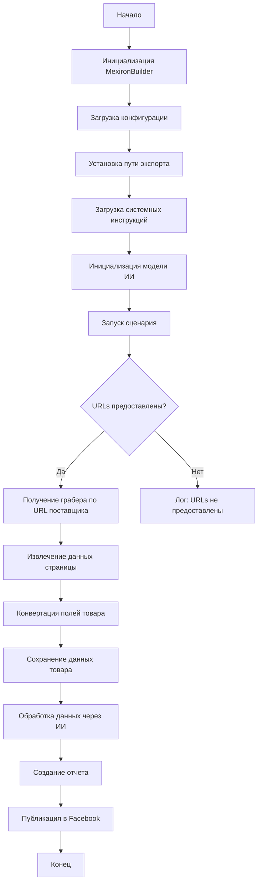

## Сценарий создания мехирона для Сергея Казаринова

### Обзор

Этот скрипт, расположенный в директории `hypotez/src/endpoints/kazarinov/scenarios`, автоматизирует процесс создания "мехирона" для Сергея Казаринова. Скрипт выполняет извлечение, парсинг и обработку данных о товарах от различных поставщиков, подготавливает данные, обрабатывает их с использованием ИИ и интегрируется с Facebook для публикации товаров.

### Основные возможности

1. **Извлечение и парсинг данных**: Скрипт извлекает и парсит данные о товарах от различных поставщиков.
2. **Обработка данных через ИИ**: Обрабатывает извлеченные данные с использованием модели Google Generative AI.
3. **Хранение данных**: Сохраняет обработанные данные в файлы.
4. **Генерация отчетов**: Генерирует HTML и PDF отчеты на основе обработанных данных.
5. **Публикация в Facebook**: Публикует обработанные данные в Facebook.

### Блок-схема модуля



### Легенда

1. **Start**: Начало выполнения скрипта.
2. **InitMexironBuilder**: Инициализация класса `MexironBuilder`.
3. **LoadConfig**: Загрузка конфигурации из JSON файла.
4. **SetExportPath**: Установка пути для экспорта данных.
5. **LoadSystemInstruction**: Загрузка системных инструкций для модели ИИ.
6. **InitModel**: Инициализация модели Google Generative AI.
7. **RunScenario**: Выполнение основного сценария.
8. **CheckURLs**: Проверка наличия предоставленных URL для парсинга.
9. **GetGraber**: Получение соответствующего грабера для URL поставщика.
10. **GrabPage**: Извлечение данных страницы с использованием грабера.
11. **ConvertFields**: Конвертация полей товара в словарь.
12. **SaveData**: Сохранение данных товара в файл.
13. **ProcessAI**: Обработка данных товара с использованием модели ИИ.
14. **CreateReport**: Создание HTML и PDF отчетов на основе обработанных данных.
15. **PostFacebook**: Публикация обработанных данных в Facebook.
16. **End**: Конец выполнения скрипта.

-----------------------

#### Класс: `MexironBuilder`

- **Атрибуты**:
  - `driver`: Экземпляр Selenium WebDriver.
  - `export_path`: Путь для экспорта данных.
  - `mexiron_name`: Пользовательское имя для процесса мехирона.
  - `price`: Цена для обработки.
  - `timestamp`: Метка времени для процесса.
  - `products_list`: Список обработанных данных о товарах.
  - `model`: Модель Google Generative AI.
  - `config`: Конфигурация, загруженная из JSON.

- **Методы**:
  - **`__init__(self, driver: Driver, mexiron_name: Optional[str] = None)`**:
    - **Назначение**: Инициализирует класс `MexironBuilder` с необходимыми компонентами.
    - **Параметры**:
      - `driver`: Экземпляр Selenium WebDriver.
      - `mexiron_name`: Пользовательское имя для процесса мехирона.
    ----
  - **`run_scenario(self, system_instruction: Optional[str] = None, price: Optional[str] = None, mexiron_name: Optional[str] = None, urls: Optional[str | List[str]] = None, bot = None) -> bool`**:
    - **Назначение**: Выполняет сценарий: парсит товары, обрабатывает их через ИИ и сохраняет данные.
    - **Параметры**:
      - `system_instruction`: Системные инструкции для модели ИИ.
      - `price`: Цена для обработки.
      - `mexiron_name`: Пользовательское имя мехирона.
      - `urls`: URL страниц товаров.
    - **Возвращает**: `True`, если сценарий выполнен успешно, иначе `False`.
    - **Блок-схема**:
        ```mermaid
        flowchart TD
        Start[Start] --> IsOneTab{URL is from OneTab?}
        IsOneTab -->|Yes| GetDataFromOneTab[Get data from OneTab]
        IsOneTab -->|No| ReplyTryAgain[Reply - Try again]
        GetDataFromOneTab --> IsDataValid{Data valid?}
        IsDataValid -->|No| ReplyIncorrectData[Reply Incorrect data]
        IsDataValid -->|Yes| RunMexironScenario[Run Mexiron scenario]
        RunMexironScenario --> IsGraberFound{Graber found?}
        IsGraberFound -->|Yes| StartParsing[Start parsing: <code>url</code>]
        IsGraberFound -->|No| LogNoGraber[Log: No graber for <code>url</code>]
        StartParsing --> IsParsingSuccessful{Parsing successful?}
        IsParsingSuccessful -->|Yes| ConvertProductFields[Convert product fields]
        IsParsingSuccessful -->|No| LogParsingFailed[Log: Failed to parse product fields]
        ConvertProductFields --> IsConversionSuccessful{Conversion successful?}
        IsConversionSuccessful -->|Yes| SaveProductData[Save product data]
        IsConversionSuccessful -->|No| LogConversionFailed[Log: Failed to convert product fields]
        SaveProductData --> IsDataSaved{Data saved?}
        IsDataSaved -->|Yes| AppendToProductsList[Append to products_list]
        IsDataSaved -->|No| LogDataNotSaved[Log: Data not saved]
        AppendToProductsList --> ProcessAIHe[AI processing lang = he]
        ProcessAIHe --> ProcessAIRu[AI processing lang = ru]
        ProcessAIRu --> SaveHeJSON{Save JSON for he?}
        SaveHeJSON -->|Yes| SaveRuJSON[Save JSON for ru]
        SaveHeJSON -->|No| LogHeJSONError[Log: Error saving he JSON]
        SaveRuJSON --> IsRuJSONSaved{Save JSON for ru?}
        IsRuJSONSaved -->|Yes| GenerateReports[Generate reports]
        IsRuJSONSaved -->|No| LogRuJSONError[Log: Error saving ru JSON]
        GenerateReports --> IsReportGenerationSuccessful{Report generation successful?}
        IsReportGenerationSuccessful -->|Yes| SendPDF[Send PDF via Telegram]
        IsReportGenerationSuccessful -->|No| LogPDFError[Log: Error creating PDF]
        SendPDF --> ReturnTrue[Return True]
        LogPDFError --> ReturnTrue[Return True]
        ReplyIncorrectData --> ReturnTrue[Return True]
        ReplyTryAgain --> ReturnTrue[Return True]
        LogNoGraber --> ReturnTrue[Return True]
        LogParsingFailed --> ReturnTrue[Return True]
        LogConversionFailed --> ReturnTrue[Return True]
        LogDataNotSaved --> ReturnTrue[Return True]
        LogHeJSONError --> ReturnTrue[Return True]
        LogRuJSONError --> ReturnTrue[Return True]
        ```

        - **Легенда**:
        1. **Начало (Start)**: Сценарий начинает выполнение.

        2. **Проверка источника URL (IsOneTab)**:
           - Если URL из OneTab, данные извлекаются из OneTab.
           - Если URL не из OneTab, пользователю отправляется сообщение "Try again".
        3. **Проверка валидности данных (IsDataValid)**:
           - Если данные не валидны, пользователю отправляется сообщение "Incorrect data".
           - Если данные валидны, запускается сценарий Mexiron.
        4. **Поиск грабера (IsGraberFound)**:
           - Если грабер найден, начинается парсинг страницы.
           - Если грабер не найден, логируется сообщение о том, что грабер отсутствует для данного URL.
        5. **Парсинг страницы (StartParsing)**:
           - Если парсинг успешен, данные преобразуются в нужный формат.
           - Если парсинг не удался, логируется ошибка.
        6. **Преобразование данных (ConvertProductFields)**:
           - Если преобразование успешно, данные сохраняются.
           - Если преобразование не удалось, логируется ошибка.
        7. **Сохранение данных (SaveProductData)**:
           - Если данные сохранены, они добавляются в список товаров.
           - Если данные не сохранены, логируется ошибка.
        8. **Обработка через AI (ProcessAIHe, ProcessAIRu)**:
           - Данные обрабатываются AI для языков `he` (иврит) и `ru` (русский).
        9. **Сохранение JSON (SaveHeJSON, SaveRuJSON)**:
           - Результаты обработки сохраняются в формате JSON для каждого языка.
           - Если сохранение не удалось, логируется ошибка.
        10. **Генерация отчетов (GenerateReports)**:
            - Создаются HTML и PDF отчеты для каждого языка.
            - Если создание отчета не удалось, логируется ошибка.
        11. **Отправка PDF через Telegram (SendPDF)**:
            - PDF-файлы отправляются через Telegram.
            - Если отправка не удалась, логируется ошибка.
        12. **Завершение (ReturnTrue)**:
            - Сценарий завершается, возвращая `True`.

    #### **Логи ошибок**:
    - На каждом этапе, где возможны ошибки, добавлены узлы для логирования ошибок (например, `LogNoGraber`, `LogParsingFailed`, `LogHeJSONError` и т.д.).

    ----
  - **`get_graber_by_supplier_url(self, url: str)`**:
    - **Назначение**: Возвращает соответствующий грабер для данного URL поставщика.
    - **Параметры**:
      - `url`: URL страницы поставщика.
    - **Возвращает**: Экземпляр грабера, если найден, иначе `None`.
    ----
  - **`convert_product_fields(self, f: ProductFields) -> dict`**:
    - **Назначение**: Конвертирует поля товара в словарь.
    - **Параметры**:
      - `f`: Объект, содержащий парсированные данные о товаре.
    - **Возвращает**: Форматированный словарь данных о товаре.
    ----
  - **`save_product_data(self, product_data: dict)`**:
    - **Назначение**: Сохраняет данные о товаре в файл.
    - **Параметры**:
      - `product_data`: Форматированные данные о товаре.
    ----
  - **`process_llm(self, products_list: List[str], lang: str, attempts: int = 3) -> tuple | bool`**:
    - **Назначение**: Обрабатывает список товаров через модель ИИ.
    - **Параметры**:
      - `products_list`: Список словарей данных о товарах в виде строки.
      - `lang`: Язык, на котором необходимо обработать данные (`ru` или `he`).
      - `attempts`: Количество попыток повторного запроса в случае неудачи.
    - **Возвращает**: Обработанный ответ в форматах `ru` и `he`.
    ----
  - **`post_facebook(self, mexiron: SimpleNamespace) -> bool`**:
    - **Назначение**: Выполняет сценарий публикации в Facebook.
    - **Параметры**:
      - `mexiron`: Обработанные данные для публикации.
    - **Возвращает**: `True`, если публикация успешна, иначе `False`.
    ----
  - **`create_report(self, data: dict, html_file: Path, pdf_file: Path)`**:
    - **Назначение**: Генерирует HTML и PDF отчеты на основе обработанных данных.
    - **Параметры**:
      - `data`: Обработанные данные.
      - `html_file`: Путь для сохранения HTML отчета.
      - `pdf_file`: Путь для сохранения PDF отчета.

### Использование

Для использования этого скрипта выполните следующие шаги:

1. **Инициализация Driver**: Создайте экземпляр класса `Driver`.
2. **Инициализация MexironBuilder**: Создайте экземпляр класса `MexironBuilder` с драйвером.
3. **Запуск сценария**: Вызовите метод `run_scenario` с необходимыми параметрами.

#### Пример

```python
from src.webdriver.driver import Driver
from src.endpoints.kazarinov.scenarios.scenario_pricelist import MexironBuilder

# Инициализация Driver
driver = Driver(...)

# Инициализация MexironBuilder
mexiron_builder = MexironBuilder(driver)

# Запуск сценария
urls = ['https://example.com/product1', 'https://example.com/product2']
mexiron_builder.run_scenario(urls=urls)
```

### Зависимости

- `selenium`: Для веб-автоматизации.
- `asyncio`: Для асинхронных операций.
- `pathlib`: Для обработки путей к файлам.
- `types`: Для создания простых пространств имен.
- `typing`: Для аннотаций типов.
- `src.ai.gemini`: Для обработки данных через ИИ.
- `src.suppliers.*.graber`: Для извлечения данных от различных поставщиков.
- `src.endpoints.advertisement.facebook.scenarios`: Для публикации в Facebook.

### Обработка ошибок

Скрипт включает надежную обработку ошибок, чтобы обеспечить продолжение выполнения даже в случае, если некоторые элементы не найдены или если возникли проблемы с веб-страницей. Это особенно полезно для обработки динамических или нестабильных веб-страниц.

### Вклад

Вклад в этот скрипт приветствуется. Пожалуйста, убедитесь, что любые изменения хорошо документированы и включают соответствующие тесты.

### Лицензия

Этот скрипт лицензирован под MIT License. Подробности смотрите в файле `LICENSE`.
```

Как использовать метод `run_scenario` класса `MexironBuilder`
=========================================================================================

Описание
-------------------------

Метод `run_scenario` выполняет основной сценарий: парсит продукты, обрабатывает их через ИИ и сохраняет данные.

Шаги выполнения
-------------------------

1. Проверяет, предоставлены ли URLs для обработки (параметр `urls`).
2. Если URLs предоставлены:
   - Для каждого URL определяет соответствующий грабер (метод `get_graber_by_supplier_url`).
   - С помощью грабера извлекает данные страницы (метод `grab_page`).
   - Преобразует поля продукта в словарь (метод `convert_product_fields`).
   - Сохраняет данные продукта в файл (метод `save_product_data`).
   - Обрабатывает данные продукта через модель ИИ (метод `process_llm`).
   - Генерирует HTML и PDF отчеты (метод `create_report`).
   - Публикует обработанные данные в Facebook (метод `post_facebook`).
3. Если URLs не предоставлены, логирует соответствующее сообщение.

Пример использования
-------------------------

```python
from src.webdriver.driver import Driver
from src.endpoints.kazarinov.scenarios.scenario_pricelist import MexironBuilder

# Инициализация Driver
driver = Driver(...)

# Инициализация MexironBuilder
mexiron_builder = MexironBuilder(driver)

# Параметры для запуска сценария
system_instruction = "Опиши продукт кратко и привлекательно."
price = "99.99"
mexiron_name = "СуперМехирон"
urls = ['https://example.com/product1', 'https://example.com/product2']

# Запуск сценария
success = mexiron_builder.run_scenario(
    system_instruction=system_instruction,
    price=price,
    mexiron_name=mexiron_name,
    urls=urls
)

if success:
    print("Сценарий выполнен успешно!")
else:
    print("Сценарий выполнен с ошибками.")
```
```
Как использовать метод `get_graber_by_supplier_url` класса `MexironBuilder`
=========================================================================================

Описание
-------------------------

Метод `get_graber_by_supplier_url` возвращает соответствующий грабер для данного URL поставщика. Грабер - это модуль, который извлекает данные со страницы определенного поставщика.

Шаги выполнения
-------------------------

1. Метод принимает URL страницы поставщика в качестве параметра `url`.
2. Внутри метода проверяется домен URL и определяется соответствующий грабер.
3. Если для данного домена найден грабер, возвращается экземпляр этого грабера.
4. Если грабер не найден, возвращается `None`.

Пример использования
-------------------------

```python
from src.webdriver.driver import Driver
from src.endpoints.kazarinov.scenarios.scenario_pricelist import MexironBuilder

# Инициализация Driver
driver = Driver(...)

# Инициализация MexironBuilder
mexiron_builder = MexironBuilder(driver)

# URL страницы поставщика
supplier_url = "https://example.com/product"

# Получение грабера по URL
graber = mexiron_builder.get_graber_by_supplier_url(supplier_url)

if graber:
    print(f"Грабер найден: {graber.__class__.__name__}")
    # Здесь можно использовать грабер для извлечения данных со страницы
else:
    print("Грабер не найден для данного URL.")
```
```
Как использовать метод `convert_product_fields` класса `MexironBuilder`
=========================================================================================

Описание
-------------------------

Метод `convert_product_fields` преобразует поля товара, полученные грабером, в стандартный формат словаря. Это необходимо для унификации данных от разных поставщиков перед их дальнейшей обработкой.

Шаги выполнения
-------------------------

1. Метод принимает объект `ProductFields` (или аналогичный) с парсированными данными о товаре в качестве параметра `f`.
2. Из объекта `f` извлекаются необходимые поля (название, описание, цена и т.д.).
3. Эти поля преобразуются и упаковываются в словарь.
4. Возвращается форматированный словарь данных о товаре.

Пример использования
-------------------------

```python
from src.webdriver.driver import Driver
from src.endpoints.kazarinov.scenarios.scenario_pricelist import MexironBuilder
from src.suppliers.example_supplier.graber import ProductFields  # Пример импорта

# Инициализация Driver
driver = Driver(...)

# Инициализация MexironBuilder
mexiron_builder = MexironBuilder(driver)

# Пример объекта ProductFields с данными о товаре
product_fields = ProductFields(
    title="Название товара",
    description="Описание товара",
    price="100",
    image_url="https://example.com/image.jpg"
)

# Конвертация полей товара в словарь
product_data = mexiron_builder.convert_product_fields(product_fields)

# Вывод полученного словаря
print(product_data)
```
```
Как использовать метод `save_product_data` класса `MexironBuilder`
=========================================================================================

Описание
-------------------------

Метод `save_product_data` сохраняет данные о товаре в файл. Данные должны быть представлены в формате словаря.

Шаги выполнения
-------------------------

1. Метод принимает словарь `product_data` с данными о товаре.
2. Определяется путь к файлу для сохранения данных. Путь может зависеть от конфигурации или других параметров.
3. Данные записываются в файл в формате JSON.
4. Если запись прошла успешно, возвращается `True`, иначе `False`.

Пример использования
-------------------------

```python
from src.webdriver.driver import Driver
from src.endpoints.kazarinov.scenarios.scenario_pricelist import MexironBuilder

# Инициализация Driver
driver = Driver(...)

# Инициализация MexironBuilder
mexiron_builder = MexironBuilder(driver)

# Пример словаря с данными о товаре
product_data = {
    "title": "Название товара",
    "description": "Описание товара",
    "price": "100",
    "image_url": "https://example.com/image.jpg"
}

# Сохранение данных о товаре
mexiron_builder.save_product_data(product_data)
```
```
Как использовать метод `process_llm` класса `MexironBuilder`
=========================================================================================

Описание
-------------------------

Метод `process_llm` обрабатывает список товаров через модель ИИ (LLM - Large Language Model) для генерации описаний или других данных на нужном языке.

Шаги выполнения
-------------------------

1. Метод принимает список товаров `products_list` (в виде строки), язык `lang` (например, 'ru' для русского или 'he' для иврита) и количество попыток `attempts`.
2. Отправляет запрос в модель ИИ с данными о товарах и инструкциями.
3. Модель ИИ генерирует новые данные (например, описания товаров).
4. Возвращает обработанный ответ в формате tuple (для `ru` и `he`) или `False`, если обработка не удалась после нескольких попыток.

Пример использования
-------------------------

```python
from src.webdriver.driver import Driver
from src.endpoints.kazarinov.scenarios.scenario_pricelist import MexironBuilder

# Инициализация Driver
driver = Driver(...)

# Инициализация MexironBuilder
mexiron_builder = MexironBuilder(driver)

# Пример списка товаров в виде строки
products_list = '[{"title": "Название товара 1", "description": "Описание товара 1"}, {"title": "Название товара 2", "description": "Описание товара 2"}]'

# Обработка списка товаров через модель ИИ на русском языке
result = mexiron_builder.process_llm(products_list, lang='ru')

if result:
    print("Данные успешно обработаны через ИИ.")
    print(result)
else:
    print("Не удалось обработать данные через ИИ.")
```
```
Как использовать метод `post_facebook` класса `MexironBuilder`
=========================================================================================

Описание
-------------------------

Метод `post_facebook` публикует данные о товаре в Facebook. Он принимает объект, содержащий всю необходимую информацию для публикации.

Шаги выполнения
-------------------------

1. Метод принимает объект `mexiron` (SimpleNamespace или dict) с данными для публикации. Этот объект должен содержать поля, необходимые для публикации в Facebook (например, описание, цену, ссылку на изображение и т.д.).
2. Метод вызывает соответствующие функции или API для публикации данных в Facebook.
3. Если публикация прошла успешно, возвращается `True`, иначе `False`.

Пример использования
-------------------------

```python
from src.webdriver.driver import Driver
from src.endpoints.kazarinov.scenarios.scenario_pricelist import MexironBuilder
from types import SimpleNamespace

# Инициализация Driver
driver = Driver(...)

# Инициализация MexironBuilder
mexiron_builder = MexironBuilder(driver)

# Пример объекта с данными для публикации
mexiron_data = SimpleNamespace(
    title="Название товара",
    description="Описание товара",
    price="100",
    image_url="https://example.com/image.jpg"
)

# Публикация данных в Facebook
success = mexiron_builder.post_facebook(mexiron_data)

if success:
    print("Данные успешно опубликованы в Facebook.")
else:
    print("Не удалось опубликовать данные в Facebook.")
```
```
Как использовать метод `create_report` класса `MexironBuilder`
=========================================================================================

Описание
-------------------------

Метод `create_report` генерирует HTML и PDF отчеты на основе обработанных данных о товарах.

Шаги выполнения
-------------------------

1. Метод принимает словарь `data` с обработанными данными о товарах, а также пути для сохранения HTML (`html_file`) и PDF (`pdf_file`) отчетов.
2. Создает HTML отчет на основе данных и сохраняет его по указанному пути.
3. Конвертирует HTML отчет в PDF формат и сохраняет его по указанному пути.
4. В случае успеха, возвращает `True`. В случае ошибки на любом этапе, возвращает `False`.

Пример использования
-------------------------

```python
from src.webdriver.driver import Driver
from src.endpoints.kazarinov.scenarios.scenario_pricelist import MexironBuilder
from pathlib import Path

# Инициализация Driver
driver = Driver(...)

# Инициализация MexironBuilder
mexiron_builder = MexironBuilder(driver)

# Пример данных для отчета
report_data = {
    "title": "Отчет о товарах",
    "products": [
        {"title": "Название товара 1", "description": "Описание товара 1", "price": "100"},
        {"title": "Название товара 2", "description": "Описание товара 2", "price": "200"}
    ]
}

# Пути для сохранения отчетов
html_file = Path("report.html")
pdf_file = Path("report.pdf")

# Создание отчетов
success = mexiron_builder.create_report(report_data, html_file, pdf_file)

if success:
    print("Отчеты успешно созданы.")
else:
    print("Не удалось создать отчеты.")