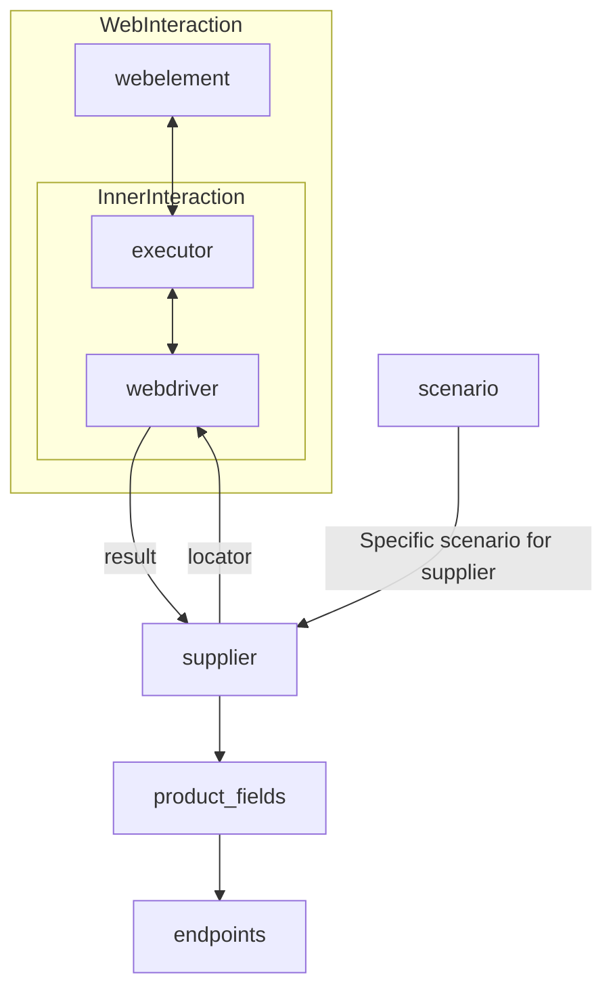

[Русский](https://github.com/hypo69/hypotez/blob/master/README.RU.MD)

# **Класс** `Supplier`

### **Базовый класс для всех поставщиков**

*В контексте кода, `Supplier` представляет поставщика информации.*
*Поставщик может быть производителем товаров, данных или информации.*
*Источники поставщика включают целевую страницу веб-сайта, документ, базу данных или таблицу.*
*Этот класс объединяет разных поставщиков под стандартизированным набором операций.*
*Каждый поставщик имеет уникальный префикс. ([Подробности о префиксах](prefixes.md))*

Класс `Supplier` служит основой для управления взаимодействиями с поставщиками.
Он обрабатывает инициализацию, конфигурацию, аутентификацию и выполнение рабочих процессов для различных источников данных, таких как `amazon.com`, `walmart.com`, `mouser.com` и `digikey.com`. Клиенты также могут определять дополнительных поставщиков.

---

## Список реализованных поставщиков:

[aliexpress](aliexpress) - Реализован с двумя рабочими процессами: `webdriver` и `api`

[amazon](amazon) - `webdriver`

[bangood](bangood) - `webdriver`

[cdata](cdata) - `webdriver`

[chat_gpt](chat_gpt) - Взаимодействует с интерфейсом ChatGPT (НЕ С МОДЕЛЬЮ!)

[ebay](ebay) - `webdriver`

[etzmaleh](etzmaleh) - `webdriver`

[gearbest](gearbest) - `webdriver`

[grandadvance](grandadvance) - `webdriver`

[hb](hb) - `webdriver`

[ivory](ivory) - `webdriver`

[ksp](ksp) - `webdriver`

[kualastyle](kualastyle) `webdriver`

[morlevi](morlevi) `webdriver`

[visualdg](visualdg) `webdriver`

[wallashop](wallashop) `webdriver`

[wallmart](wallmart) `webdriver`

[Подробности о WebDriver :class: `Driver`](../webdriver)
[Подробности о рабочих процессах :class: `Scenario`](../scenarios)

---



Как использовать этот блок кода
=========================================================================================

Описание
-------------------------
`Supplier` - это базовый класс, который определяет структуру взаимодействия с поставщиками данных. Он предоставляет основу для унификации различных источников данных, таких как веб-сайты, базы данных и API, и позволяет стандартизировать операции, выполняемые с этими источниками.

Шаги выполнения
-------------------------
1. **Инициализация**: Создается экземпляр класса `Supplier` для конкретного поставщика, например, `Amazon`.
2. **Конфигурация**: Настраиваются параметры подключения и аутентификации для доступа к источнику данных.
3. **Выполнение рабочих процессов**: Запускается определенный сценарий (workflow) для извлечения данных с использованием `webdriver` или `api`.
4. **Стандартизация данных**: Данные, полученные от поставщика, преобразуются в унифицированный формат для дальнейшей обработки.

Пример использования
-------------------------

```python
from src.suppliers.supplier import Supplier
from src.webdriver import Driver
from src.scenarios import Scenario

class AmazonSupplier(Supplier):
    def __init__(self, driver: Driver, scenario: Scenario):
        super().__init__(driver, scenario)
        self.prefix = "amazon"

    def get_data(self):
        # Функция извлекает данные с сайта Amazon с использованием webdriver и сценария
        data = self.driver.execute_scenario(self.scenario)
        return data

# Пример создания и использования класса AmazonSupplier
driver = Driver("chrome") # Создание экземпляра webdriver
scenario = Scenario("amazon_product_page") # Создание экземпляра сценария
amazon_supplier = AmazonSupplier(driver, scenario) # Создание экземпляра AmazonSupplier
product_data = amazon_supplier.get_data() # Получение данных о товаре
print(product_data)