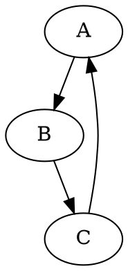

### Как использовать этот блок кода
=========================================================================================

Описание
-------------------------
Этот код предназначен для преобразования файлов в формате DOT (Graphviz) в изображения PNG. Он использует библиотеку Graphviz для рендеринга графов, описанных в DOT-файлах, в графический формат PNG.

Шаги выполнения
-------------------------
1. **Чтение DOT-файла**: Функция `dot2png` принимает путь к DOT-файлу (`dot_file`) в качестве входных данных. Сначала она пытается открыть и прочитать содержимое этого файла.
2. **Создание объекта Source**: После прочтения содержимого DOT-файла, код создает объект `Source` из библиотеки Graphviz, используя прочитанное содержимое.
3. **Рендеринг в PNG**: Затем устанавливается формат вывода как PNG и вызывается метод `render` для создания PNG-изображения. `render` также выполняет очистку временных файлов после завершения.
4. **Обработка ошибок**: Если DOT-файл не найден, выбрасывается исключение `FileNotFoundError`. Если во время конвертации происходит любая другая ошибка, выбрасывается общее исключение `Exception`.
5. **Запуск из командной строки**: Если скрипт запускается напрямую (как главный модуль), он проверяет, переданы ли правильные аргументы командной строки (путь к входному DOT-файлу и путь к выходному PNG-файлу). Если аргументы верны, вызывается функция `dot2png` для выполнения конвертации.

Пример использования
-------------------------

```python
    from src.utils.convertors.dot import dot2png

    # Пример использования функции dot2png
    try:
        dot2png('example.dot', 'output.png')
        print("DOT file успешно преобразован в PNG!")
    except FileNotFoundError as e:
        print(f"Ошибка: Файл не найден - {e}")
    except Exception as e:
        print(f"Произошла ошибка при преобразовании: {e}")
```

В этом примере:
- Импортируется функция `dot2png` из модуля `src.utils.convertors.dot`.
- Функция вызывается с указанием входного DOT-файла (`example.dot`) и желаемого имени выходного PNG-файла (`output.png`).
- Блок `try...except` обрабатывает возможные исключения, такие как отсутствие входного файла или другие ошибки, возникшие во время преобразования.

Создайте файл `example.dot` с содержимым, описывающим граф в формате DOT, например:



Затем запустите скрипт, и он создаст файл `output.png` с визуализацией графа.