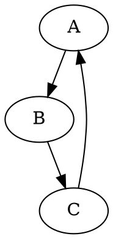

## Как использовать этот блок кода
=========================================================================================

Описание
-------------------------
Блок кода конвертирует файлы DOT в изображения PNG с использованием библиотеки Graphviz.

Шаги выполнения
-------------------------
1. **Чтение файла DOT:** Функция `dot2png` открывает файл DOT с помощью `open` и считывает его содержимое в переменную `dot_content`.
2. **Создание объекта Source:**  Из прочитанного содержимого файла DOT создается объект `Source` с помощью `Source(dot_content)`.
3. **Указание формата вывода:** Объекту `source` задается формат вывода `png` с помощью `source.format = 'png'`.
4. **Рендеринг в PNG:** Функция `source.render(png_file, cleanup=True)` рендерит объект `source` в файл PNG с заданным именем `png_file`. 
   - Параметр `cleanup=True` удаляет временные файлы, созданные во время процесса рендеринга.
5. **Обработка ошибок:** 
   - Если файл DOT не найден, вызывается исключение `FileNotFoundError`.
   - Если во время конверсии возникают другие ошибки, вызывается исключение `Exception`.

Пример использования
-------------------------

```python
    dot2png('example.dot', 'output.png')
```

Этот код конвертирует файл DOT с именем `example.dot` в изображение PNG с именем `output.png`.

**Пример содержимого файла DOT `example.dot`:**



**Запуск скрипта из командной строки:**

```bash
python dot2png.py example.dot output.png
```

Эта команда создаст файл PNG с именем `output.png` из графа, определенного в `example.dot`.