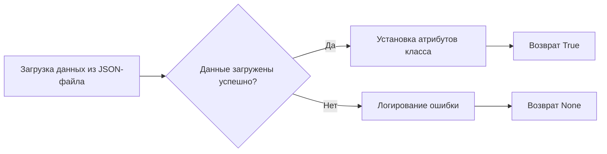

# Модуль для работы с полями Facebook

## Обзор

Модуль `facebook_fields.py` предназначен для загрузки и хранения полей, используемых в рекламных объявлениях и событиях Facebook. Он обеспечивает доступ к этим полям через атрибуты класса `FacebookFields`.

## Подробнее

Этот модуль является частью подсистемы для работы с рекламными кампаниями в Facebook. Он загружает данные о полях из JSON-файла и делает их доступными для использования в других частях системы, связанных с созданием и управлением рекламными объявлениями.

## Классы

### `FacebookFields`

**Описание**: Класс для хранения полей, используемых в рекламных объявлениях и событиях Facebook.

**Принцип работы**:
1.  При инициализации класса вызывается метод `_payload`, который загружает данные из JSON-файла `facebook_feilds.json`.
2.  Загруженные данные преобразуются в атрибуты класса, что позволяет удобно обращаться к ним.
3.  В случае ошибки при загрузке данных, в лог записывается сообщение об ошибке.

**Атрибуты**:
*   Отсутствуют явно объявленные атрибуты, так как они создаются динамически на основе данных из JSON-файла.

**Методы**:

*   `__init__()`: Метод инициализации класса.
*   `_payload()`: Метод для загрузки данных из JSON-файла и установки атрибутов класса.

## Методы

### `__init__`

```python
def __init__(self):
    """"""
    ...
    self._payload()
```

**Назначение**: Инициализирует класс `FacebookFields` и вызывает метод `_payload` для загрузки данных о полях.

**Параметры**:
-   Отсутствуют.

**Возвращает**:
-   Отсутствует.

**Вызывает исключения**:
-   Отсутствуют.

**Как работает функция**:
1.  Метод инициализации класса.
2.  Вызывает метод `_payload` для загрузки данных о полях Facebook из JSON-файла.

### `_payload`

```python
def _payload(self):
    """"""
    ...
    data = j_loads (Path (gs.path.src, 'advertisement', 'facebok', 'facebook_feilds.json'))
    if not data:
        logger.debug(f"Ошибка загрузки полей из файла {gs.path.src}/advertisement/facebok/facebook_feilds.json")
        return 
    for name, value in data.items():
        setattr(self, f'{name}', value)
    return True
```

**Назначение**: Загружает данные о полях Facebook из JSON-файла и устанавливает их как атрибуты класса.

**Параметры**:
-   Отсутствуют.

**Возвращает**:
-   `True` в случае успешной загрузки и установки атрибутов.
-   `None` в случае ошибки при загрузке данных.

**Вызывает исключения**:
-   Отсутствуют.

**Как работает функция**:

1.  **Загрузка данных из файла**: Загружает данные из JSON-файла `facebook_feilds.json` с использованием функции `j_loads`. Путь к файлу формируется на основе констант, определенных в модуле `gs`.

2.  **Проверка загруженных данных**: Проверяет, были ли успешно загружены данные. Если данные не загружены (например, файл не найден или имеет неверный формат), в лог записывается сообщение об ошибке, и функция завершается.

3.  **Установка атрибутов класса**: Перебирает элементы загруженного словаря `data` и для каждого элемента устанавливает атрибут класса с именем, соответствующим ключу элемента, и значением, соответствующим значению элемента. Для установки атрибутов используется функция `setattr`.

4.  **Завершение функции**: Если данные успешно загружены и атрибуты установлены, функция возвращает `True`.



**Примеры**:

```python
from src.endpoints.advertisement.facebook.facebook_fields import FacebookFields

# Создание экземпляра класса FacebookFields
fb_fields = FacebookFields()

# Попытка доступа к одному из полей (предполагается, что поле 'ad_name' существует в facebook_feilds.json)
try:
    ad_name = fb_fields.ad_name
    print(f"Значение поля ad_name: {ad_name}")
except AttributeError as ex:
    print(f"Поле ad_name не найдено: {ex}")