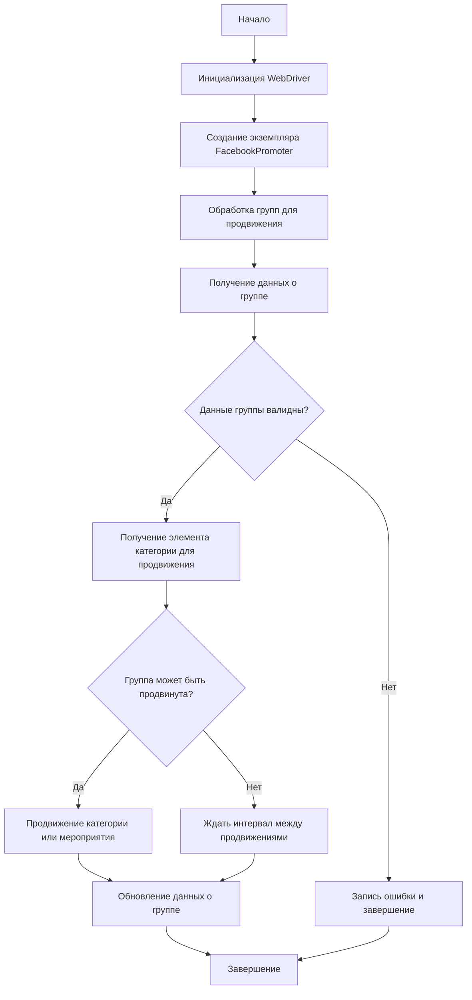

# Документация модуля Facebook Promoter

## Обзор

Модуль **Facebook Promoter** автоматизирует продвижение товаров и мероприятий AliExpress в группах Facebook. Модуль управляет публикациями рекламных материалов на Facebook, избегая дублирования. Для эффективного продвижения используется WebDriver для автоматизации браузера.

## Подробнее

Модуль предназначен для автоматизации процесса продвижения товаров и мероприятий из AliExpress в группах Facebook. Он предотвращает дублирование публикаций и использует WebDriver для автоматизации действий в браузере. Модуль позволяет продвигать категории товаров и мероприятия, а также поддерживает настройку данных групп через файлы конфигурации. Также предусмотрена возможность отключения загрузки видео в публикациях.

## Классы

### `FacebookPromoter`

**Описание**: Этот класс управляет процессом продвижения товаров и мероприятий AliExpress в группах Facebook.

**Принцип работы**: Класс инициализируется с экземпляром WebDriver, именем промоутера и путями к файлам с данными групп. Он содержит методы для продвижения товаров и мероприятий в группах, обновления данных о продвижении и проверки интервалов между продвижениями.



**Методы**:

- `__init__`: Инициализирует промоутер для Facebook с необходимыми конфигурациями.
- `promote`: Продвигает категорию или мероприятие в указанной группе Facebook.
- `log_promotion_error`: Записывает ошибку, если продвижение не удалось.
- `update_group_promotion_data`: Обновляет данные группы после продвижения, добавляя продвигаемый элемент в список продвигаемых категорий или мероприятий.
- `process_groups`: Обрабатывает группы для текущей кампании или продвижения мероприятия.
- `get_category_item`: Получает элемент категории для продвижения в зависимости от кампании и промоутера.
- `check_interval`: Проверяет, прошло ли достаточно времени, чтобы снова продвигать эту группу.
- `validate_group`: Проверяет данные группы, чтобы убедиться в их корректности.

#### `__init__(self, d: Driver, promoter: str, group_file_paths: Optional[list[str | Path] | str | Path] = None, no_video: bool = False)`

**Описание**: Инициализирует промоутер для Facebook с необходимыми конфигурациями.

**Параметры**:

- `d` (Driver): Экземпляр WebDriver для автоматизации.
- `promoter` (str): Имя промоутера (например, "aliexpress").
- `group_file_paths` (Optional[list[str | Path] | str | Path]): Пути к файлам с данными групп.
- `no_video` (bool): Флаг для отключения видео в публикациях. По умолчанию `False`.

#### `promote(self, group: SimpleNamespace, item: SimpleNamespace, is_event: bool = False, language: str = None, currency: str = None) -> bool`

**Описание**: Продвигает категорию или мероприятие в указанной группе Facebook.

**Параметры**:

- `group` (SimpleNamespace): Данные группы.
- `item` (SimpleNamespace): Категория или мероприятие для продвижения.
- `is_event` (bool): Является ли элемент мероприятием.
- `language` (str): Язык публикации.
- `currency` (str): Валюта для продвижения.

**Возвращает**:

- `bool`: Успешно ли прошло продвижение.

#### `log_promotion_error(self, is_event: bool, item_name: str)`

**Описание**: Записывает ошибку, если продвижение не удалось.

**Параметры**:

- `is_event` (bool): Является ли элемент мероприятием.
- `item_name` (str): Название элемента.

#### `update_group_promotion_data(self, group: SimpleNamespace, item_name: str, is_event: bool = False)`

**Описание**: Обновляет данные группы после продвижения, добавляя продвигаемый элемент в список продвигаемых категорий или мероприятий.

**Параметры**:

- `group` (SimpleNamespace): Данные группы.
- `item_name` (str): Название продвигаемого элемента.
- `is_event` (bool): Является ли элемент мероприятием.

#### `process_groups(self, campaign_name: str = None, events: list[SimpleNamespace] = None, is_event: bool = False, group_file_paths: list[str] = None, group_categories_to_adv: list[str] = ['sales'], language: str = None, currency: str = None)`

**Описание**: Обрабатывает группы для текущей кампании или продвижения мероприятия.

**Параметры**:

- `campaign_name` (str): Название кампании.
- `events` (list[SimpleNamespace]): Список мероприятий для продвижения.
- `is_event` (bool): Является ли продвижение мероприятий или категорий.
- `group_file_paths` (list[str]): Пути к файлам с данными групп.
- `group_categories_to_adv` (list[str]): Категории для продвижения.
- `language` (str): Язык публикации.
- `currency` (str): Валюта для продвижения.

#### `get_category_item(self, campaign_name: str, group: SimpleNamespace, language: str, currency: str) -> SimpleNamespace`

**Описание**: Получает элемент категории для продвижения в зависимости от кампании и промоутера.

**Параметры**:

- `campaign_name` (str): Название кампании.
- `group` (SimpleNamespace): Данные группы.
- `language` (str): Язык для публикации.
- `currency` (str): Валюта для публикации.

**Возвращает**:

- `SimpleNamespace`: Элемент категории для продвижения.

#### `check_interval(self, group: SimpleNamespace) -> bool`

**Описание**: Проверяет, прошло ли достаточно времени, чтобы снова продвигать эту группу.

**Параметры**:

- `group` (SimpleNamespace): Данные группы.

**Возвращает**:

- `bool`: Можно ли снова продвигать группу.

#### `validate_group(self, group: SimpleNamespace) -> bool`

**Описание**: Проверяет данные группы, чтобы убедиться в их корректности.

**Параметры**:

- `group` (SimpleNamespace): Данные группы.

**Возвращает**:

- `bool`: Корректны ли данные группы.

**Примеры**:

```python
from src.endpoints.advertisement.facebook.promoter import FacebookPromoter
from src.webdriver.driver import Driver
from src.utils.jjson import j_loads_ns

# Настройка экземпляра WebDriver (замените на реальный WebDriver)
d = Driver()

# Создание экземпляра FacebookPromoter
promoter = FacebookPromoter(
    d=d, 
    promoter="aliexpress", 
    group_file_paths=["path/to/group/file1.json", "path/to/group/file2.json"]
)

# Начало продвижения товаров или мероприятий
promoter.process_groups(
    campaign_name="Campaign1",
    events=[], 
    group_categories_to_adv=["sales"],
    language="en",
    currency="USD"
)
```

## Лицензия

Модуль является частью пакета **Facebook Promoter** и лицензируется по лицензии MIT.