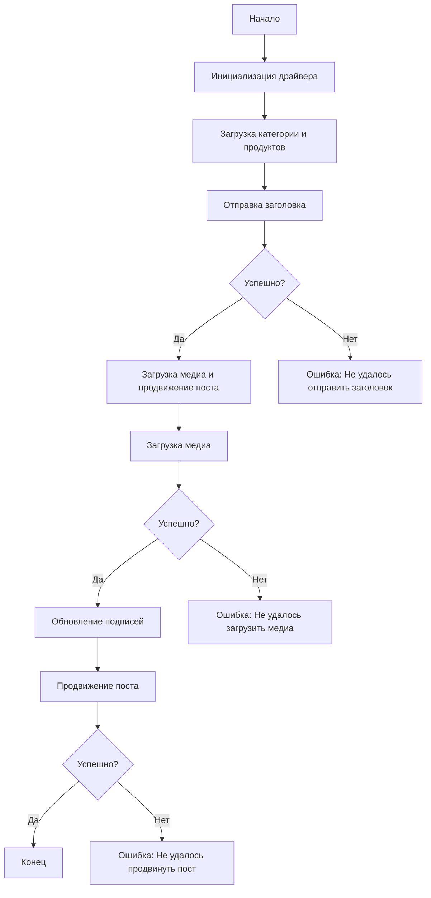

# Документация модуля `post_message_async`

## Обзор

Этот модуль, расположенный в директории `hypotez/src/endpoints/advertisement/facebook/scenarios`, предназначен для автоматизации процесса публикации сообщений в Facebook. Скрипт взаимодействует со страницей Facebook, используя локаторы для выполнения различных действий, таких как отправка сообщений, загрузка медиафайлов и обновление подписей.

## Подробнее

Модуль `post_message_async` является частью процесса автоматизации рекламы в Facebook. Он включает в себя отправку заголовка и описания рекламной кампании, загрузку медиафайлов (изображений и видео) и продвижение поста. Скрипт разработан для работы в асинхронном режиме, что позволяет эффективно управлять временем выполнения задач.

## Структура модуля



### Легенда

1.  **Начало**: Начало выполнения скрипта.
2.  **Инициализация драйвера**: Создание экземпляра класса `Driver`.
3.  **Загрузка категории и продуктов**: Загрузка данных о категории и продуктах.
4.  **Отправка заголовка**: Вызов функции `post_title` для отправки заголовка.
5.  **Успешно?**: Проверка успешности отправки заголовка.
    *   **Да**: Переход к загрузке медиа и продвижению поста.
    *   **Нет**: Вывод ошибки "Не удалось отправить заголовок".
6.  **Загрузка медиа и продвижение поста**: Вызов функции `promote_post`.
7.  **Загрузка медиа**: Вызов функции `upload_media` для загрузки медиафайлов.
8.  **Успешно?**: Проверка успешности загрузки медиа.
    *   **Да**: Переход к обновлению подписей изображений.
    *   **Нет**: Вывод ошибки "Не удалось загрузить медиа".
9.  **Обновление подписей**: Вызов функции `update_images_captions` для обновления подписей.
10. **Продвижение поста**: Завершение процесса продвижения поста.
11. **Успешно?**: Проверка успешности продвижения поста.
    *   **Да**: Завершение выполнения скрипта.
    *   **Нет**: Вывод ошибки "Не удалось продвинуть пост".

## Функции

### `post_title`

```python
def post_title(d: Driver, category: SimpleNamespace) -> bool:
    """
    Отправляет заголовок и описание кампании в поле сообщения Facebook.

    Args:
        d (Driver): Экземпляр `Driver`, используемый для взаимодействия с веб-страницей.
        category (SimpleNamespace): Объект, содержащий заголовок и описание для отправки.

    Returns:
        bool: `True`, если заголовок и описание были успешно отправлены, иначе `None`.
    """
    ...
```

**Назначение**: Отправляет заголовок и описание кампании в поле сообщения Facebook.

**Параметры**:

*   `d` (Driver): Экземпляр `Driver`, используемый для взаимодействия с веб-страницей.
*   `category` (SimpleNamespace): Объект, содержащий заголовок и описание для отправки.

**Возвращает**:

*   `bool`: `True`, если заголовок и описание были успешно отправлены, иначе `None`.

**Как работает функция**:

1.  Функция `post_title` принимает экземпляр `Driver` и объект `category`, содержащий заголовок и описание кампании.
2.  Используя методы `Driver`, функция находит элементы веб-страницы, соответствующие полям ввода заголовка и описания.
3.  Затем функция отправляет заголовок и описание в эти поля.
4.  В завершение, функция возвращает `True`, если отправка прошла успешно. В противном случае возвращает `None`.

```
    Начало
    ↓
    → Получение полей ввода заголовка и описания (web_elements)
    ↓
    Отправка заголовка и описания в поля ввода
    ↓
    Конец
```

**Примеры**:

```python
from src.webdriver.driver import Driver
from types import SimpleNamespace

# Инициализация драйвера
driver = Driver(...)

# Создание объекта category
category = SimpleNamespace(title="Заголовок кампании", description="Описание кампании")

# Отправка заголовка
post_title(driver, category)
```

### `upload_media`

```python
def upload_media(d: Driver, products: List[SimpleNamespace], no_video: bool = False) -> bool:
    """
    Загружает медиафайлы в пост Facebook и обновляет их подписи.

    Args:
        d (Driver): Экземпляр `Driver`, используемый для взаимодействия с веб-страницей.
        products (List[SimpleNamespace]): Список продуктов, содержащих пути к медиафайлам.
        no_video (bool): Флаг, указывающий, следует ли пропускать загрузку видео. По умолчанию `False`.

    Returns:
        bool: `True`, если медиафайлы были успешно загружены, иначе `None`.
    """
    ...
```

**Назначение**: Загружает медиафайлы в пост Facebook и обновляет их подписи.

**Параметры**:

*   `d` (Driver): Экземпляр `Driver`, используемый для взаимодействия с веб-страницей.
*   `products` (List[SimpleNamespace]): Список продуктов, содержащих пути к медиафайлам.
*   `no_video` (bool): Флаг, указывающий, следует ли пропускать загрузку видео. По умолчанию `False`.

**Возвращает**:

*   `bool`: `True`, если медиафайлы были успешно загружены, иначе `None`.

**Как работает функция**:

1.  Функция `upload_media` принимает экземпляр `Driver`, список `products` и флаг `no_video`.
2.  Она перебирает список продуктов и загружает медиафайлы (изображения и видео) для каждого продукта.
3.  Если флаг `no_video` установлен в `True`, загрузка видео пропускается.
4.  Функция использует методы `Driver` для взаимодействия с элементами веб-страницы, отвечающими за загрузку медиафайлов.
5.  В завершение, функция возвращает `True`, если загрузка прошла успешно. В противном случае возвращает `None`.

```
    Начало
    ↓
    → Перебор списка продуктов
    ↓
    → Загрузка медиафайлов (изображений и видео)
    ↓
    Конец
```

**Примеры**:

```python
from src.webdriver.driver import Driver
from types import SimpleNamespace

# Инициализация драйвера
driver = Driver(...)

# Создание списка продуктов
products = [SimpleNamespace(local_image_path='path/to/image.jpg', local_video_path='path/to/video.mp4')]

# Загрузка медиафайлов
upload_media(driver, products)

# Загрузка только изображений
upload_media(driver, products, no_video=True)
```

### `update_images_captions`

```python
def update_images_captions(d: Driver, products: List[SimpleNamespace], textarea_list: List[WebElement]) -> None:
    """
    Асинхронно добавляет описания к загруженным медиафайлам.

    Args:
        d (Driver): Экземпляр `Driver`, используемый для взаимодействия с веб-страницей.
        products (List[SimpleNamespace]): Список продуктов с деталями для обновления.
        textarea_list (List[WebElement]): Список текстовых областей, где добавляются подписи.
    """
    ...
```

**Назначение**: Асинхронно добавляет описания к загруженным медиафайлам.

**Параметры**:

*   `d` (Driver): Экземпляр `Driver`, используемый для взаимодействия с веб-страницей.
*   `products` (List[SimpleNamespace]): Список продуктов с деталями для обновления.
*   `textarea_list` (List[WebElement]): Список текстовых областей, где добавляются подписи.

**Как работает функция**:

1.  Функция `update_images_captions` принимает экземпляр `Driver`, список `products` и список `textarea_list`.
2.  Она перебирает список продуктов и добавляет описание к каждому медиафайлу, используя соответствующие текстовые области.
3.  Функция использует методы `Driver` для взаимодействия с элементами веб-страницы, отвечающими за добавление подписей.
4.  Функция выполняется асинхронно, что позволяет не блокировать основной поток выполнения.

```
    Начало
    ↓
    → Перебор списка продуктов
    ↓
    → Добавление описания к каждому медиафайлу
    ↓
    Конец
```

**Примеры**:

```python
from src.webdriver.driver import Driver
from types import SimpleNamespace
from selenium.webdriver.remote.webelement import WebElement

# Инициализация драйвера
driver = Driver(...)

# Создание списка продуктов
products = [SimpleNamespace(description='Описание изображения 1'), SimpleNamespace(description='Описание изображения 2')]

# Создание списка текстовых областей
textarea_list = [WebElement(...), WebElement(...)]

# Обновление подписей
update_images_captions(driver, products, textarea_list)
```

### `promote_post`

```python
def promote_post(d: Driver, category: SimpleNamespace, products: List[SimpleNamespace], no_video: bool = False) -> bool:
    """
    Управляет процессом продвижения поста с заголовком, описанием и медиафайлами.

    Args:
        d (Driver): Экземпляр `Driver`, используемый для взаимодействия с веб-страницей.
        category (SimpleNamespace): Детали категории, используемые для заголовка и описания поста.
        products (List[SimpleNamespace]): Список продуктов, содержащих медиа и детали для публикации.
        no_video (bool): Флаг, указывающий, следует ли пропускать загрузку видео. По умолчанию `False`.

    Returns:
        bool: `True`, если пост был успешно продвинут, иначе `None`.
    """
    ...
```

**Назначение**: Управляет процессом продвижения поста с заголовком, описанием и медиафайлами.

**Параметры**:

*   `d` (Driver): Экземпляр `Driver`, используемый для взаимодействия с веб-страницей.
*   `category` (SimpleNamespace): Детали категории, используемые для заголовка и описания поста.
*   `products` (List[SimpleNamespace]): Список продуктов, содержащих медиа и детали для публикации.
*   `no_video` (bool): Флаг, указывающий, следует ли пропускать загрузку видео. По умолчанию `False`.

**Возвращает**:

*   `bool`: `True`, если пост был успешно продвинут, иначе `None`.

**Как работает функция**:

1.  Функция `promote_post` принимает экземпляр `Driver`, объект `category`, список `products` и флаг `no_video`.
2.  Она вызывает функции `post_title` для отправки заголовка и описания, `upload_media` для загрузки медиафайлов и `update_images_captions` для обновления подписей.
3.  Функция использует методы `Driver` для взаимодействия с элементами веб-страницы, отвечающими за процесс продвижения поста.
4.  В завершение, функция возвращает `True`, если продвижение прошло успешно. В противном случае возвращает `None`.

```
    Начало
    ↓
    → Вызов функции post_title для отправки заголовка и описания
    ↓
    → Вызов функции upload_media для загрузки медиафайлов
    ↓
    → Вызов функции update_images_captions для обновления подписей
    ↓
    Конец
```

**Примеры**:

```python
from src.webdriver.driver import Driver
from types import SimpleNamespace

# Инициализация драйвера
driver = Driver(...)

# Создание объекта category
category = SimpleNamespace(title="Заголовок кампании", description="Описание кампании")

# Создание списка продуктов
products = [SimpleNamespace(local_image_path='path/to/image.jpg', local_video_path='path/to/video.mp4')]

# Продвижение поста
promote_post(driver, category, products)

# Продвижение поста только с изображениями
promote_post(driver, category, products, no_video=True)
```

## Использование

Чтобы использовать этот скрипт, выполните следующие действия:

1.  **Инициализация драйвера**: Создайте экземпляр класса `Driver`.
2.  **Загрузка локаторов**: Загрузите локаторы из JSON-файла.
3.  **Вызов функций**: Используйте предоставленные функции для отправки заголовка, загрузки медиа и продвижения поста.

## Зависимости

*   `selenium`: Для автоматизации веб-страниц.
*   `asyncio`: Для асинхронных операций.
*   `pathlib`: Для работы с путями к файлам.
*   `types`: Для создания простых пространств имен.
*   `typing`: Для аннотаций типов.

## Обработка ошибок

Скрипт включает надежную обработку ошибок, чтобы гарантировать, что выполнение продолжается, даже если определенные элементы не найдены или возникают проблемы с веб-страницей. Это особенно полезно для работы с динамическими или нестабильными веб-страницами.