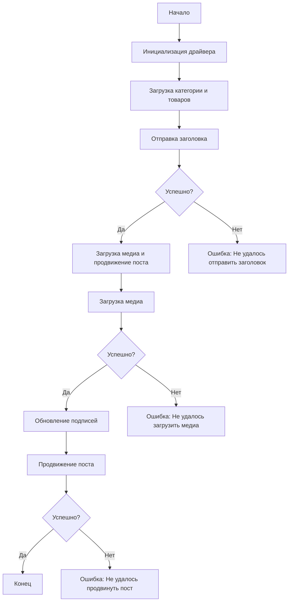

# Документация модуля `post_message_async`

## Обзор

Этот модуль, расположенный в директории `hypotez/src/endpoints/advertisement/facebook/scenarios`, предназначен для автоматизации процесса публикации сообщений в Facebook. Скрипт взаимодействует со страницей Facebook, используя локаторы для выполнения различных действий, таких как отправка сообщений, загрузка медиафайлов и обновление подписей.

## Подробнее

Модуль `post_message_async` автоматизирует процесс публикации рекламных постов на Facebook, включая отправку заголовков и описаний, загрузку медиафайлов (изображений и видео) и продвижение поста.

## Основные возможности

1.  **Отправка заголовка и описания**: Отправляет заголовок и описание рекламной кампании в поле сообщения Facebook.
2.  **Загрузка медиафайлов**: Загружает медиафайлы (изображения и видео) в пост Facebook и обновляет их подписи.
3.  **Продвижение поста**: Управляет полным процессом продвижения поста с заголовком, описанием и медиафайлами.

## Структура модуля



### Легенда

1.  **Начало**: Начало выполнения скрипта.
2.  **Инициализация драйвера**: Создание экземпляра класса `Driver`.
3.  **Загрузка категории и товаров**: Загрузка данных категории и товаров.
4.  **Отправка заголовка**: Вызов функции `post_title` для отправки заголовка.
5.  **Проверка успеха отправки заголовка**: Проверка, был ли заголовок успешно отправлен.
    *   **Да**: Переход к загрузке медиа и продвижению поста.
    *   **Нет**: Вывод ошибки "Не удалось отправить заголовок".
6.  **Загрузка медиа и продвижение поста**: Вызов функции `promote_post`.
7.  **Загрузка медиа**: Вызов функции `upload_media` для загрузки медиафайлов.
8.  **Проверка успеха загрузки медиа**: Проверка, были ли медиафайлы успешно загружены.
    *   **Да**: Переход к обновлению подписей изображений.
    *   **Нет**: Вывод ошибки "Не удалось загрузить медиа".
9.  **Обновление подписей**: Вызов функции `update_images_captions` для добавления подписей.
10. **Продвижение поста**: Завершение процесса продвижения поста.
11. **Проверка успеха продвижения поста**: Проверка, был ли пост успешно продвинут.
    *   **Да**: Конец выполнения скрипта.
    *   **Нет**: Вывод ошибки "Не удалось продвинуть пост".

## Функции

### `post_title(d: Driver, category: SimpleNamespace) -> bool`

**Назначение**: Отправляет заголовок и описание кампании в поле сообщения Facebook.

**Параметры**:

*   `d` (Driver): Экземпляр `Driver`, используемый для взаимодействия с веб-страницей.
*   `category` (SimpleNamespace): Объект, содержащий заголовок и описание для отправки.

**Возвращает**:

*   `bool`: `True`, если заголовок и описание были успешно отправлены, иначе `None`.

**Как работает функция**:

Функция `post_title` отправляет заголовок и описание, полученные из объекта `category`, в поле сообщения Facebook. Использует драйвер `d` для взаимодействия с веб-элементами, находящимися по соответствующим локаторам.

**Примеры**:

```python
from src.webdriver.driver import Driver
from types import SimpleNamespace

# Инициализация драйвера
driver = Driver(...)

# Загрузка категории
category = SimpleNamespace(title="Заголовок кампании", description="Описание кампании")

# Отправка заголовка
post_title(driver, category)
```

### `upload_media(d: Driver, products: List[SimpleNamespace], no_video: bool = False) -> bool`

**Назначение**: Загружает медиафайлы в пост Facebook и обновляет их подписи.

**Параметры**:

*   `d` (Driver): Экземпляр `Driver`, используемый для взаимодействия с веб-страницей.
*   `products` (List[SimpleNamespace]): Список объектов, содержащих пути к медиафайлам.
*   `no_video` (bool): Флаг, указывающий, следует ли пропускать загрузку видео. По умолчанию `False`.

**Возвращает**:

*   `bool`: `True`, если медиафайлы были успешно загружены, иначе `None`.

**Как работает функция**:

Функция `upload_media` загружает медиафайлы (изображения и видео), пути к которым содержатся в списке `products`, в пост Facebook. Использует драйвер `d` для взаимодействия с веб-элементами. Если `no_video` установлен в `True`, загрузка видео пропускается.

**Примеры**:

```python
from src.webdriver.driver import Driver
from types import SimpleNamespace

# Инициализация драйвера
driver = Driver(...)

# Загрузка товаров
products = [SimpleNamespace(local_image_path='путь/к/изображению.jpg'), SimpleNamespace(local_video_path='путь/к/видео.mp4')]

# Загрузка медиафайлов
upload_media(driver, products)

# Загрузка только изображений (пропуск видео)
upload_media(driver, products, no_video=True)
```

### `update_images_captions(d: Driver, products: List[SimpleNamespace], textarea_list: List[WebElement]) -> None`

**Назначение**: Асинхронно добавляет описания к загруженным медиафайлам.

**Параметры**:

*   `d` (Driver): Экземпляр `Driver`, используемый для взаимодействия с веб-страницей.
*   `products` (List[SimpleNamespace]): Список объектов с деталями для обновления.
*   `textarea_list` (List[WebElement]): Список текстовых полей, куда добавляются подписи.

**Возвращает**:

*   `None`

**Как работает функция**:

Функция `update_images_captions` добавляет описания к загруженным медиафайлам, используя список текстовых полей `textarea_list` и данные из списка `products`.

**Примеры**:

```python
from src.webdriver.driver import Driver
from selenium.webdriver.remote.webelement import WebElement
from types import SimpleNamespace

# Инициализация драйвера
driver = Driver(...)

# Загрузка товаров
products = [SimpleNamespace(description='Описание изображения 1'), SimpleNamespace(description='Описание изображения 2')]

# Список текстовых полей (пример)
textarea_list = [WebElement(...), WebElement(...)]

# Обновление подписей
update_images_captions(driver, products, textarea_list)
```

### `promote_post(d: Driver, category: SimpleNamespace, products: List[SimpleNamespace], no_video: bool = False) -> bool`

**Назначение**: Управляет процессом продвижения поста с заголовком, описанием и медиафайлами.

**Параметры**:

*   `d` (Driver): Экземпляр `Driver`, используемый для взаимодействия с веб-страницей.
*   `category` (SimpleNamespace): Объект с деталями категории, используемыми для заголовка и описания поста.
*   `products` (List[SimpleNamespace]): Список объектов, содержащих медиафайлы и детали для публикации.
*   `no_video` (bool): Флаг, указывающий, следует ли пропускать загрузку видео. По умолчанию `False`.

**Возвращает**:

*   `bool`: `True`, если пост был успешно продвинут, иначе `None`.

**Как работает функция**:

Функция `promote_post` управляет процессом продвижения поста на Facebook, включая отправку заголовка и описания (из объекта `category`), загрузку медиафайлов (из списка `products`) и обновление подписей.

**Примеры**:

```python
from src.webdriver.driver import Driver
from types import SimpleNamespace

# Инициализация драйвера
driver = Driver(...)

# Загрузка категории и товаров
category = SimpleNamespace(title="Заголовок кампании", description="Описание кампании")
products = [SimpleNamespace(local_image_path='путь/к/изображению.jpg', description='Описание изображения')]

# Продвижение поста
promote_post(driver, category, products)

# Продвижение поста без видео
promote_post(driver, category, products, no_video=True)
```

## Использование

Для использования этого скрипта выполните следующие шаги:

1.  **Инициализация драйвера**: Создайте экземпляр класса `Driver`.
2.  **Загрузка локаторов**: Загрузите локаторы из JSON-файла.
3.  **Вызов функций**: Используйте предоставленные функции для отправки заголовка, загрузки медиа и продвижения поста.

## Пример

```python
from src.webdriver.driver import Driver
from types import SimpleNamespace

# Инициализация драйвера
driver = Driver(...)

# Загрузка категории и товаров
category = SimpleNamespace(title="Заголовок кампании", description="Описание кампании")
products = [SimpleNamespace(local_image_path='путь/к/изображению.jpg', description='Описание изображения')]

# Отправка заголовка
post_title(driver, category)

# Загрузка медиа и продвижение поста
await promote_post(driver, category, products)
```

## Зависимости

*   `selenium`: Для автоматизации веб-страниц.
*   `asyncio`: Для асинхронных операций.
*   `pathlib`: Для работы с путями к файлам.
*   `types`: Для создания простых пространств имен.
*   `typing`: Для аннотаций типов.

## Обработка ошибок

Скрипт включает надежную обработку ошибок, чтобы гарантировать, что выполнение продолжается, даже если определенные элементы не найдены или если есть проблемы с веб-страницей. Это особенно полезно для обработки динамических или нестабильных веб-страниц.

## Вклад

Вклад в этот скрипт приветствуется. Пожалуйста, убедитесь, что любые изменения хорошо документированы и включают соответствующие тесты.

## Лицензия

Этот скрипт лицензирован в соответствии с MIT License. Подробности см. в файле `LICENSE`.