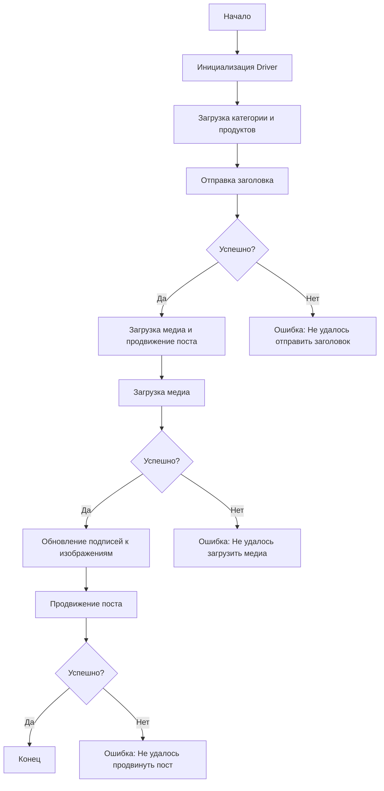

# Документация модуля `src.endpoints.advertisement.facebook.post_message_async`

## Обзор

Этот модуль предназначен для автоматизации процесса публикации сообщений на Facebook, включая отправку заголовков, загрузку медиафайлов и управление продвижением поста.

## Подробней

Модуль автоматизирует процесс создания и продвижения рекламных постов на Facebook. Он выполняет следующие шаги:
1.  Инициализирует драйвер для управления браузером.
2.  Загружает данные о категории и продуктах.
3.  Отправляет заголовок и описание поста.
4.  Загружает медиафайлы (изображения и видео).
5.  Обновляет подписи к изображениям.
6.  Запускает процесс продвижения поста.

Модуль также включает обработку ошибок для обеспечения стабильности работы скрипта.

## Структура модуля

### Схема работы модуля



### Легенда к схеме

1.  **Start**: Начало выполнения скрипта.
2.  **InitDriver**: Создание экземпляра класса `Driver`.
3.  **LoadCategoryAndProducts**: Загрузка данных категории и продуктов.
4.  **SendTitle**: Вызов функции `post_title` для отправки заголовка.
5.  **CheckTitleSuccess**: Проверка успешности отправки заголовка.

    *   **Да**: Переход к загрузке медиа и продвижению поста.
    *   **Нет**: Вывод ошибки "Не удалось отправить заголовок".
6.  **UploadMediaAndPromotePost**: Вызов функции `promote_post`.
7.  **UploadMedia**: Вызов функции `upload_media` для загрузки медиафайлов.
8.  **CheckMediaSuccess**: Проверка успешности загрузки медиа.

    *   **Да**: Переход к обновлению подписей к изображениям.
    *   **Нет**: Вывод ошибки "Не удалось загрузить медиа".
9.  **UpdateCaptions**: Вызов функции `update_images_captions` для обновления подписей.
10. **PromotePost**: Завершение процесса продвижения поста.
11. **CheckPromoteSuccess**: Проверка успешности продвижения поста.

    *   **Да**: Конец выполнения скрипта.
    *   **Нет**: Вывод ошибки "Не удалось продвинуть пост".

## Функции

### `post_title`

```python
def post_title(d: Driver, category: SimpleNamespace) -> bool:
    """
    Отправляет заголовок и описание кампании в поле сообщения на Facebook.

    Args:
        d (Driver): Экземпляр `Driver` для взаимодействия с веб-страницей.
        category (SimpleNamespace): Категория, содержащая заголовок и описание для отправки.

    Returns:
        bool: `True`, если заголовок и описание были успешно отправлены, иначе `None`.
    """
    ...
```

**Назначение**: Отправляет заголовок и описание рекламной кампании в поле для ввода сообщения на Facebook.

**Параметры**:

*   `d` (Driver): Экземпляр класса `Driver`, используемый для взаимодействия с веб-страницей Facebook. Этот объект предоставляет методы для поиска элементов и выполнения действий на странице.
*   `category` (SimpleNamespace): Объект, содержащий атрибуты `title` (заголовок) и `description` (описание), которые будут отправлены в поле сообщения.

**Возвращает**:

*   `bool`: Возвращает `True`, если отправка заголовка и описания прошла успешно, иначе возвращает `None`.

**Как работает функция**:

1.  Функция `post_title` получает экземпляр драйвера `d` и объект `category`, содержащий заголовок и описание.
2.  Используя драйвер, функция находит поле для ввода сообщения на странице Facebook.
3.  Заголовок и описание из объекта `category` отправляются в это поле.
4.  Функция проверяет, была ли отправка успешной.

**ASCII flowchart функции**:

```
A: Получение драйвера и категории
|
B: Поиск поля для ввода сообщения
|
C: Отправка заголовка и описания
|
D: Проверка успешности отправки
|
E: Возврат True или None
```

Где:

*   `A`: Получение необходимых параметров: экземпляр драйвера `d` и объект `category` с заголовком и описанием.
*   `B`: Поиск на веб-странице Facebook поля для ввода сообщения, используя методы драйвера.
*   `C`: Отправка данных: заголовок и описание из объекта `category` отправляются в найденное поле для ввода сообщения.
*   `D`: Проверка успешности: функция проверяет, успешно ли прошла отправка данных, анализируя состояние веб-страницы.
*   `E`: Возврат результата: функция возвращает `True`, если отправка прошла успешно, и `None` в противном случае.

**Примеры**:

```python
from src.webdriver.driver import Driver
from types import SimpleNamespace

# Пример инициализации драйвера (замените на вашу реальную инициализацию)
driver = Driver(Chrome)

# Пример создания объекта category
category = SimpleNamespace(title="Заголовок кампании", description="Описание кампании")

# Вызов функции
result = post_title(driver, category)
if result:
    print("Заголовок и описание успешно отправлены")
else:
    print("Не удалось отправить заголовок и описание")
```

### `upload_media`

```python
def upload_media(d: Driver, products: List[SimpleNamespace], no_video: bool = False) -> bool:
    """
    Загружает медиафайлы на пост Facebook и обновляет их подписи.

    Args:
        d (Driver): Экземпляр `Driver` для взаимодействия с веб-страницей.
        products (List[SimpleNamespace]): Список продуктов, содержащих пути к медиафайлам.
        no_video (bool, optional): Флаг, указывающий, следует ли пропустить загрузку видео. По умолчанию `False`.

    Returns:
        bool: `True`, если медиафайлы были успешно загружены, иначе `None`.
    """
    ...
```

**Назначение**: Загружает медиафайлы (изображения и видео) на пост Facebook.

**Параметры**:

*   `d` (Driver): Экземпляр класса `Driver`, используемый для взаимодействия с веб-страницей Facebook.
*   `products` (List[SimpleNamespace]): Список объектов, содержащих информацию о продуктах, включая пути к медиафайлам.
*   `no_video` (bool, optional): Флаг, указывающий, нужно ли пропускать загрузку видео. По умолчанию `False`.

**Возвращает**:

*   `bool`: Возвращает `True`, если загрузка медиафайлов прошла успешно, иначе возвращает `None`.

**Как работает функция**:

1.  Функция `upload_media` получает экземпляр драйвера `d`, список продуктов `products` и флаг `no_video`.
2.  Для каждого продукта в списке функция загружает медиафайлы (изображения и видео) на страницу Facebook.
3.  Если установлен флаг `no_video`, загрузка видео пропускается.
4.  Функция проверяет, была ли загрузка успешной.

**ASCII flowchart функции**:

```
A: Получение драйвера, списка продуктов и флага no_video
|
B: Для каждого продукта в списке:
|
C: Загрузка медиафайлов (изображений и видео)
|
D: Проверка флага no_video
|
E: Если no_video == True: пропуск загрузки видео
|
F: Проверка успешности загрузки
|
G: Возврат True или None
```

Где:

*   `A`: Получение экземпляра драйвера `d`, списка объектов `products`, содержащих информацию о медиафайлах, и флага `no_video`.
*   `B`: Начало цикла по списку продуктов для загрузки медиафайлов каждого продукта.
*   `C`: Загрузка медиафайлов: функция загружает медиафайлы (изображения и видео) на страницу Facebook.
*   `D`: Проверка флага `no_video`: проверка, установлен ли флаг, указывающий на необходимость пропуска загрузки видео.
*   `E`: Пропуск загрузки видео, если флаг `no_video` установлен в `True`.
*   `F`: Проверка успешности: функция проверяет, успешно ли прошла загрузка медиафайлов, анализируя состояние веб-страницы.
*   `G`: Возврат результата: функция возвращает `True`, если загрузка прошла успешно, и `None` в противном случае.

**Примеры**:

```python
from src.webdriver.driver import Driver
from types import SimpleNamespace

# Пример инициализации драйвера (замените на вашу реальную инициализацию)
driver = Driver(Chrome)

# Пример создания списка продуктов
products = [
    SimpleNamespace(local_image_path="путь/к/изображению1.jpg"),
    SimpleNamespace(local_image_path="путь/к/изображению2.jpg"),
    SimpleNamespace(local_video_path="путь/к/видео.mp4"),
]

# Вызов функции с загрузкой видео
result = upload_media(driver, products)
if result:
    print("Медиафайлы успешно загружены")
else:
    print("Не удалось загрузить медиафайлы")

# Вызов функции без загрузки видео
result = upload_media(driver, products, no_video=True)
if result:
    print("Медиафайлы успешно загружены (без видео)")
else:
    print("Не удалось загрузить медиафайлы")
```

### `update_images_captions`

```python
def update_images_captions(d: Driver, products: List[SimpleNamespace], textarea_list: List[WebElement]) -> None:
    """
    Асинхронно добавляет описания к загруженным медиафайлам.

    Args:
        d (Driver): Экземпляр `Driver` для взаимодействия с веб-страницей.
        products (List[SimpleNamespace]): Список продуктов с деталями для обновления.
        textarea_list (List[WebElement]): Список текстовых полей, куда добавляются подписи.
    """
    ...
```

**Назначение**: Добавляет подписи к загруженным медиафайлам на Facebook.

**Параметры**:

*   `d` (Driver): Экземпляр класса `Driver`, используемый для взаимодействия с веб-страницей Facebook.
*   `products` (List[SimpleNamespace]): Список объектов, содержащих информацию о продуктах и их описания для подписей.
*   `textarea_list` (List[WebElement]): Список текстовых полей, в которые будут добавлены подписи к изображениям.

**Возвращает**:

*   `None`: Функция не возвращает значение.

**Как работает функция**:

1.  Функция `update_images_captions` получает экземпляр драйвера `d`, список продуктов `products` и список текстовых полей `textarea_list`.
2.  Для каждого продукта в списке функция добавляет описание продукта в соответствующее текстовое поле (подпись) на странице Facebook.

**ASCII flowchart функции**:

```
A: Получение драйвера, списка продуктов и списка текстовых полей
|
B: Для каждого продукта в списке:
|
C: Добавление описания продукта в текстовое поле
```

Где:

*   `A`: Получение экземпляра драйвера `d`, списка объектов `products`, содержащих информацию о продуктах и их описания, и списка текстовых полей `textarea_list`.
*   `B`: Начало цикла по списку продуктов для добавления описания каждого продукта в соответствующее текстовое поле.
*   `C`: Добавление описания продукта в текстовое поле на странице Facebook.

**Примеры**:

```python
from src.webdriver.driver import Driver
from selenium.webdriver.remote.webelement import WebElement
from types import SimpleNamespace

# Пример инициализации драйвера (замените на вашу реальную инициализацию)
driver = Driver(Chrome)

# Пример создания списка продуктов
products = [
    SimpleNamespace(description="Описание продукта 1"),
    SimpleNamespace(description="Описание продукта 2"),
]

# Пример создания списка текстовых полей (замените на реальные элементы)
textarea_list = [
    WebElement(...),  # Замените на реальный WebElement
    WebElement(...),  # Замените на реальный WebElement
]

# Вызов функции
update_images_captions(driver, products, textarea_list)
print("Подписи к изображениям успешно обновлены")
```

### `promote_post`

```python
def promote_post(d: Driver, category: SimpleNamespace, products: List[SimpleNamespace], no_video: bool = False) -> bool:
    """
    Управляет процессом продвижения поста с заголовком, описанием и медиафайлами.

    Args:
        d (Driver): Экземпляр `Driver` для взаимодействия с веб-страницей.
        category (SimpleNamespace): Детали категории, используемые для заголовка и описания поста.
        products (List[SimpleNamespace]): Список продуктов, содержащих медиа и детали для публикации.
        no_video (bool, optional): Флаг, указывающий, следует ли пропустить загрузку видео. По умолчанию `False`.

    Returns:
        bool: `True`, если пост был успешно продвинут, иначе `None`.
    """
    ...
```

**Назначение**: Управляет процессом продвижения поста на Facebook, включая отправку заголовка, загрузку медиафайлов и обновление подписей.

**Параметры**:

*   `d` (Driver): Экземпляр класса `Driver`, используемый для взаимодействия с веб-страницей Facebook.
*   `category` (SimpleNamespace): Объект, содержащий информацию о категории поста (например, заголовок и описание).
*   `products` (List[SimpleNamespace]): Список объектов, содержащих информацию о продуктах, включая медиафайлы и их описания.
*   `no_video` (bool, optional): Флаг, указывающий, нужно ли пропускать загрузку видео. По умолчанию `False`.

**Возвращает**:

*   `bool`: Возвращает `True`, если пост был успешно продвинут, иначе возвращает `None`.

**Как работает функция**:

1.  Функция `promote_post` получает экземпляр драйвера `d`, объект `category`, список продуктов `products` и флаг `no_video`.
2.  Вызывает функцию `post_title` для отправки заголовка и описания поста.
3.  Вызывает функцию `upload_media` для загрузки медиафайлов.
4.  Вызывает функцию `update_images_captions` для добавления подписей к изображениям.
5.  Завершает процесс продвижения поста.
6.  Функция проверяет, был ли пост успешно продвинут.

**ASCII flowchart функции**:

```
A: Получение драйвера, категории, списка продуктов и флага no_video
|
B: Вызов функции post_title для отправки заголовка и описания
|
C: Вызов функции upload_media для загрузки медиафайлов
|
D: Вызов функции update_images_captions для добавления подписей
|
E: Завершение процесса продвижения поста
|
F: Проверка успешности продвижения
|
G: Возврат True или None
```

Где:

*   `A`: Получение экземпляра драйвера `d`, объекта `category`, списка объектов `products` и флага `no_video`.
*   `B`: Вызов функции `post_title` для отправки заголовка и описания поста на Facebook.
*   `C`: Вызов функции `upload_media` для загрузки медиафайлов (изображений и видео) на страницу Facebook.
*   `D`: Вызов функции `update_images_captions` для добавления подписей к загруженным медиафайлам.
*   `E`: Завершение процесса продвижения поста на Facebook.
*   `F`: Проверка успешности: функция проверяет, успешно ли прошел процесс продвижения поста, анализируя состояние веб-страницы.
*   `G`: Возврат результата: функция возвращает `True`, если продвижение поста прошло успешно, и `None` в противном случае.

**Примеры**:

```python
from src.webdriver.driver import Driver
from types import SimpleNamespace

# Пример инициализации драйвера (замените на вашу реальную инициализацию)
driver = Driver(Chrome)

# Пример создания объекта category
category = SimpleNamespace(title="Заголовок кампании", description="Описание кампании")

# Пример создания списка продуктов
products = [
    SimpleNamespace(local_image_path="путь/к/изображению1.jpg", description="Описание продукта 1"),
    SimpleNamespace(local_image_path="путь/к/изображению2.jpg", description="Описание продукта 2"),
]

# Вызов функции
result = promote_post(driver, category, products)
if result:
    print("Пост успешно продвинут")
else:
    print("Не удалось продвинуть пост")
```

## Использование

Для использования этого скрипта выполните следующие шаги:

1.  **Инициализация Driver**: Создайте экземпляр класса `Driver`.
2.  **Загрузка локаторов**: Загрузите локаторы из JSON-файла.
3.  **Вызов функций**: Используйте предоставленные функции для отправки заголовка, загрузки медиа и продвижения поста.

## Зависимости

*   `selenium`: Для веб-автоматизации.
*   `asyncio`: Для асинхронных операций.
*   `pathlib`: Для обработки путей к файлам.
*   `types`: Для создания простых пространств имен.
*   `typing`: Для аннотаций типов.

## Обработка ошибок

Скрипт включает надежную обработку ошибок, чтобы обеспечить продолжение выполнения даже в случае, если некоторые элементы не найдены или если возникли проблемы с веб-страницей. Это особенно полезно для обработки динамических или нестабильных веб-страниц.

## Вклад

Вклад в этот скрипт приветствуется. Пожалуйста, убедитесь, что любые изменения хорошо документированы и включают соответствующие тесты.

## Лицензия

Этот скрипт лицензирован под MIT License. Подробности смотрите в файле `LICENSE`.