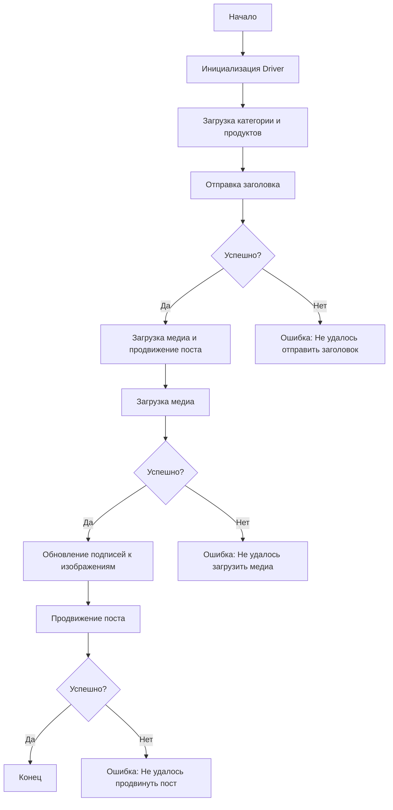

# Сценарий асинхронной публикации сообщения на Facebook

## Обзор

Этот скрипт, расположенный в директории `hypotez/src/endpoints/advertisement/facebook/scenarios`, предназначен для автоматизации процесса публикации сообщений на Facebook. Он взаимодействует со страницей Facebook, используя локаторы для выполнения различных действий, таких как отправка сообщений, загрузка медиафайлов и обновление подписей.

## Подробней

Сценарий предназначен для автоматизации процесса создания и продвижения рекламных постов на Facebook. Он включает в себя загрузку необходимых данных, отправку заголовка и описания, загрузку медиафайлов (изображений и видео), обновление подписей к медиафайлам и, наконец, продвижение самого поста. Скрипт разработан с использованием асинхронного подхода для повышения эффективности и отзывчивости.

## Оглавление

- [Основные возможности](#основные-возможности)
- [Структура модуля](#структура-модуля)
- [Функции](#функции)
  - [`post_title`](#post_title)
  - [`upload_media`](#upload_media)
  - [`update_images_captions`](#update_images_captions)
  - [`promote_post`](#promote_post)
- [Использование](#использование)
- [Зависимости](#зависимости)
- [Обработка ошибок](#обработка-ошибок)
- [Вклад](#вклад)
- [Лицензия](#лицензия)

## Основные возможности

1. **Отправка заголовка и описания**: Отправляет заголовок и описание кампании в поле сообщения на Facebook.
2. **Загрузка медиафайлов**: Загружает медиафайлы (изображения и видео) на пост Facebook и обновляет их подписи.
3. **Продвижение поста**: Управляет всем процессом продвижения поста с заголовком, описанием и медиафайлами.

## Структура модуля



### Легенда

1. **Start**: Начало выполнения скрипта.
2. **InitDriver**: Создание экземпляра класса `Driver`.
3. **LoadCategoryAndProducts**: Загрузка данных категории и товаров.
4. **SendTitle**: Вызов функции `post_title` для отправки заголовка.
5. **CheckTitleSuccess**: Проверка успешности отправки заголовка.
   - **Да**: Переход к загрузке медиа и продвижению поста.
   - **Нет**: Вывод ошибки "Не удалось отправить заголовок".
6. **UploadMediaAndPromotePost**: Вызов функции `promote_post`.
7. **UploadMedia**: Вызов функции `upload_media` для загрузки медиафайлов.
8. **CheckMediaSuccess**: Проверка успешности загрузки медиа.
   - **Да**: Переход к обновлению подписей к изображениям.
   - **Нет**: Вывод ошибки "Не удалось загрузить медиа".
9. **UpdateCaptions**: Вызов функции `update_images_captions` для обновления подписей.
10. **PromotePost**: Завершение процесса продвижения поста.
11. **CheckPromoteSuccess**: Проверка успешности продвижения поста.
    - **Да**: Конец выполнения скрипта.
    - **Нет**: Вывод ошибки "Не удалось продвинуть пост".

## Функции

### `post_title`

```python
def post_title(d: Driver, category: SimpleNamespace) -> bool:
    """
    Отправляет заголовок и описание кампании в поле сообщения на Facebook.

    Args:
        d (Driver): Экземпляр класса `Driver` для взаимодействия с веб-страницей.
        category (SimpleNamespace): Объект, содержащий заголовок и описание для публикации.

    Returns:
        bool: `True`, если заголовок и описание успешно отправлены, иначе `None`.

    """
```

**Назначение**: Функция `post_title` отвечает за отправку заголовка и описания рекламной кампании в поле для ввода сообщения на странице Facebook.

**Параметры**:
- `d` (Driver): Экземпляр класса `Driver`, используемый для управления браузером и взаимодействия с веб-страницей Facebook.
- `category` (SimpleNamespace): Объект, содержащий атрибуты `title` (заголовок) и `description` (описание), которые необходимо отправить в поле сообщения.

**Возвращает**:
- `bool`: Возвращает `True`, если отправка заголовка и описания прошла успешно, и `None` в противном случае.

**Принцип работы**:
1. Функция принимает экземпляр `Driver` и объект `category` с данными для публикации.
2. Используя методы объекта `Driver`, функция находит элементы на веб-странице, соответствующие полям для ввода заголовка и описания.
3. Функция отправляет заголовок и описание в соответствующие поля.
4. Возвращает `True`, если все операции прошли успешно.

**Примеры**:
```python
from src.webdriver.driver import Driver
from types import SimpleNamespace

# Пример использования
driver = Driver(driver_type='Chrome')
category_data = SimpleNamespace(title="Летняя распродажа", description="Скидки до 50% на все товары!")
result = post_title(driver, category_data)
print(f"Результат отправки заголовка: {result}")
```

### `upload_media`

```python
def upload_media(d: Driver, products: List[SimpleNamespace], no_video: bool = False) -> bool:
    """
    Загружает медиафайлы на пост Facebook и обновляет их подписи.

    Args:
        d (Driver): Экземпляр класса `Driver` для взаимодействия с веб-страницей.
        products (List[SimpleNamespace]): Список объектов, содержащих пути к медиафайлам.
        no_video (bool, optional): Флаг, указывающий, следует ли пропустить загрузку видео. По умолчанию `False`.

    Returns:
        bool: `True`, если медиафайлы были успешно загружены, иначе `None`.

    """
```

**Назначение**: Функция `upload_media` предназначена для загрузки медиафайлов (изображений и видео) на страницу создания поста в Facebook.

**Параметры**:
- `d` (Driver): Экземпляр класса `Driver`, используемый для управления браузером и взаимодействия с веб-страницей Facebook.
- `products` (List[SimpleNamespace]): Список объектов, содержащих информацию о продуктах, включая пути к медиафайлам, которые необходимо загрузить.
- `no_video` (bool, optional): Флаг, указывающий, нужно ли пропускать загрузку видео. По умолчанию `False`.

**Возвращает**:
- `bool`: Возвращает `True`, если все медиафайлы были успешно загружены, и `None` в случае неудачи.

**Принцип работы**:
1. Функция принимает экземпляр `Driver` и список объектов `products` с информацией о медиафайлах.
2. Функция итерируется по списку `products` и загружает каждый медиафайл на страницу Facebook.
3. Если `no_video` установлен в `True`, функция пропускает загрузку видеофайлов.
4. Возвращает `True`, если все медиафайлы были успешно загружены.

**Примеры**:
```python
from src.webdriver.driver import Driver
from types import SimpleNamespace

# Пример использования
driver = Driver(driver_type='Chrome')
product_data = [
    SimpleNamespace(local_image_path="путь/к/изображению1.jpg"),
    SimpleNamespace(local_video_path="путь/к/видео1.mp4")
]
result = upload_media(driver, product_data, no_video=True)
print(f"Результат загрузки медиа: {result}")
```

### `update_images_captions`

```python
def update_images_captions(d: Driver, products: List[SimpleNamespace], textarea_list: List[WebElement]) -> None:
    """
    Асинхронно добавляет описания к загруженным медиафайлам.

    Args:
        d (Driver): Экземпляр класса `Driver` для взаимодействия с веб-страницей.
        products (List[SimpleNamespace]): Список объектов, содержащих информацию о продуктах, включая описания.
        textarea_list (List[WebElement]): Список текстовых полей (WebElement), в которые необходимо добавить описания.

    """
```

**Назначение**: Функция `update_images_captions` предназначена для асинхронного добавления описаний к загруженным медиафайлам на странице Facebook.

**Параметры**:
- `d` (Driver): Экземпляр класса `Driver`, используемый для управления браузером и взаимодействия с веб-страницей Facebook.
- `products` (List[SimpleNamespace]): Список объектов, содержащих информацию о продуктах, включая описания, которые необходимо добавить к медиафайлам.
- `textarea_list` (List[WebElement]): Список элементов `WebElement`, представляющих текстовые поля, в которые будут добавлены описания.

**Принцип работы**:
1. Функция принимает экземпляр `Driver`, список объектов `products` и список текстовых полей `textarea_list`.
2. Функция асинхронно итерируется по спискам `products` и `textarea_list`.
3. Для каждого продукта функция добавляет соответствующее описание в текстовое поле.

**Примеры**:
```python
from src.webdriver.driver import Driver
from selenium.webdriver.remote.webelement import WebElement
from types import SimpleNamespace

# Пример использования
driver = Driver(driver_type='Chrome')
product_data = [
    SimpleNamespace(description="Описание для изображения 1"),
    SimpleNamespace(description="Описание для изображения 2")
]
textarea_elements = [WebElement, WebElement]  # Замените на реальные WebElement
update_images_captions(driver, product_data, textarea_elements)
```

### `promote_post`

```python
def promote_post(d: Driver, category: SimpleNamespace, products: List[SimpleNamespace], no_video: bool = False) -> bool:
    """
    Управляет процессом продвижения поста с заголовком, описанием и медиафайлами.

    Args:
        d (Driver): Экземпляр класса `Driver` для взаимодействия с веб-страницей.
        category (SimpleNamespace): Объект, содержащий детали категории, используемые для заголовка и описания поста.
        products (List[SimpleNamespace]): Список объектов, содержащих медиа и детали для публикации.
        no_video (bool, optional): Флаг, указывающий, следует ли пропустить загрузку видео. По умолчанию `False`.

    Returns:
        bool: `True`, если пост был успешно продвинут, иначе `None`.

    """
```

**Назначение**: Функция `promote_post` управляет полным процессом продвижения поста на Facebook, включая отправку заголовка и описания, загрузку медиафайлов и настройку параметров продвижения.

**Параметры**:
- `d` (Driver): Экземпляр класса `Driver`, используемый для управления браузером и взаимодействия с веб-страницей Facebook.
- `category` (SimpleNamespace): Объект, содержащий детали категории, используемые для формирования заголовка и описания поста.
- `products` (List[SimpleNamespace]): Список объектов, содержащих информацию о медиафайлах и других деталях, необходимых для публикации.
- `no_video` (bool, optional): Флаг, указывающий, следует ли пропустить загрузку видеофайлов. По умолчанию `False`.

**Возвращает**:
- `bool`: Возвращает `True`, если пост был успешно продвинут, и `None` в случае неудачи.

**Принцип работы**:
1. Функция принимает экземпляр `Driver`, объекты `category` и `products`, а также флаг `no_video`.
2. Функция вызывает `post_title` для отправки заголовка и описания.
3. Функция вызывает `upload_media` для загрузки медиафайлов.
4. Функция настраивает параметры продвижения поста.
5. Возвращает `True`, если все операции прошли успешно.

**Примеры**:
```python
from src.webdriver.driver import Driver
from types import SimpleNamespace

# Пример использования
driver = Driver(driver_type='Chrome')
category_data = SimpleNamespace(title="Новая коллекция", description="Ознакомьтесь с нашей новой коллекцией!")
product_data = [
    SimpleNamespace(local_image_path="путь/к/изображению1.jpg"),
    SimpleNamespace(local_video_path="путь/к/видео1.mp4")
]
result = promote_post(driver, category_data, product_data, no_video=True)
print(f"Результат продвижения поста: {result}")
```

## Использование

Для использования этого скрипта выполните следующие шаги:

1. **Инициализация Driver**: Создайте экземпляр класса `Driver`.
2. **Загрузка локаторов**: Загрузите локаторы из JSON-файла.
3. **Вызов функций**: Используйте предоставленные функции для отправки заголовка, загрузки медиа и продвижения поста.

#### Пример

```python
from src.webdriver.driver import Driver
from types import SimpleNamespace

# Инициализация Driver
driver = Driver(...)

# Загрузка категории и товаров
category = SimpleNamespace(title="Заголовок кампании", description="Описание кампании")
products = [SimpleNamespace(local_image_path='путь/к/изображению.jpg', ...)]

# Отправка заголовка
post_title(driver, category)

# Загрузка медиа и продвижение поста
await promote_post(driver, category, products)
```

## Зависимости

- `selenium`: Для веб-автоматизации.
- `asyncio`: Для асинхронных операций.
- `pathlib`: Для обработки путей к файлам.
- `types`: Для создания простых пространств имен.
- `typing`: Для аннотаций типов.

## Обработка ошибок

Скрипт включает надежную обработку ошибок, чтобы обеспечить продолжение выполнения даже в случае, если некоторые элементы не найдены или если возникли проблемы с веб-страницей. Это особенно полезно для обработки динамических или нестабильных веб-страниц.

## Вклад

Вклад в этот скрипт приветствуется. Пожалуйста, убедитесь, что любые изменения хорошо документированы и включают соответствующие тесты.

## Лицензия

Этот скрипт лицензирован под MIT License. Подробности смотрите в файле `LICENSE`.