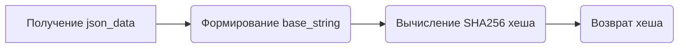
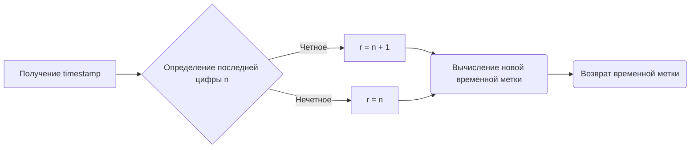
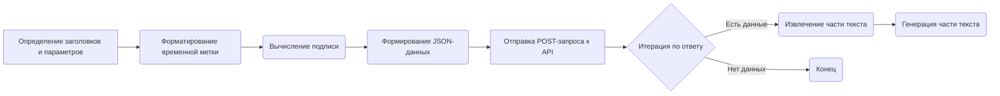

# Модуль `Ails.py`

## Обзор

Модуль предоставляет класс для взаимодействия с провайдером Ails. Он содержит функции для создания запросов к API Ails и обработки ответов.
Этот модуль является частью проекта `hypotez` и предназначен для использования с другими компонентами, требующими доступа к провайдеру Ails.

## Подробней

Модуль `Ails.py` содержит функции для взаимодействия с API Ails. Он включает в себя функции для форматирования запросов, вычисления хешей и отправки запросов к API.
Основная цель модуля - обеспечить удобный и надежный способ взаимодействия с провайдером Ails для получения ответов на запросы.

## Функции

### `Utils.hash`

```python
def hash(json_data: Dict[str, str]) -> sha256:
    """
    Вычисляет SHA256 хеш на основе предоставленных данных JSON.

    Args:
        json_data (Dict[str, str]): Словарь, содержащий данные для хеширования.

    Returns:
        sha256: SHA256 хеш предоставленных данных.

    Как работает функция:
    1. Определяет секретный ключ (`secretKey`) в виде массива байтов.
    2. Формирует строку (`base_string`) из значений ключей 't' и 'm' в `json_data`, а также фиксированной строки и длины значения 'm'.
    3. Вычисляет SHA256 хеш строки `base_string` с использованием кодировки UTF-8.
    4. Возвращает полученный хеш в шестнадцатеричном формате.
    """
```

**Как работает функция `Utils.hash`**:



**Примеры**:

```python
json_data1 = {'t': '1678886400', 'm': 'test message'}
hash1 = Utils.hash(json_data1)
print(hash1)

json_data2 = {'t': '1678886460', 'm': 'another test message'}
hash2 = Utils.hash(json_data2)
print(hash2)
```

### `Utils.format_timestamp`

```python
def format_timestamp(timestamp: int) -> str:
    """
    Форматирует временную метку, изменяя последнюю цифру в соответствии с условием.

    Args:
        timestamp (int): Временная метка в виде целого числа.

    Returns:
        str: Отформатированная временная метка в виде строки.

    Как работает функция:
    1. Получает последнюю цифру временной метки (`n`).
    2. Если `n` четное, то `r` присваивается `n + 1`, иначе `n`.
    3. Вычитает `n` из исходной временной метки и добавляет `r`.
    4. Преобразует результат в строку и возвращает.
    """
```

**Как работает функция `Utils.format_timestamp`**:



**Примеры**:

```python
timestamp1 = 1678886402
formatted_timestamp1 = Utils.format_timestamp(timestamp1)
print(formatted_timestamp1)

timestamp2 = 1678886405
formatted_timestamp2 = Utils.format_timestamp(timestamp2)
print(formatted_timestamp2)
```

### `_create_completion`

```python
def _create_completion(model: str, messages: list, temperature: float = 0.6, stream: bool = False, **kwargs):
    """
    Создает запрос на завершение текста к API.

    Args:
        model (str): Идентификатор используемой модели.
        messages (list): Список сообщений для отправки в API.
        temperature (float, optional): Температура для генерации текста. По умолчанию 0.6.
        stream (bool, optional): Флаг потоковой передачи. По умолчанию False.
        **kwargs: Дополнительные параметры.

    Yields:
        str: Часть завершенного текста.

    Как работает функция:
    1. Определяет заголовки (`headers`) для HTTP-запроса.
    2. Определяет параметры (`params`) для запроса.
    3. Форматирует временную метку с использованием `Utils.format_timestamp`.
    4. Вычисляет подпись (`sig`) с использованием `Utils.hash`.
    5. Формирует JSON-данные (`json_data`) для отправки в теле запроса.
    6. Отправляет POST-запрос к API (`https://api.caipacity.com/v1/chat/completions`).
    7. Итерируется по ответу и извлекает части завершенного текста.
    8. Генерирует извлеченные части текста.

    Внутренние функции:
        - Отсутствуют.
    """
```

**Как работает функция `_create_completion`**:



**Примеры**:

```python
messages = [{"role": "user", "content": "Напиши короткий стих о зиме."}]
completion = _create_completion(model="gpt-3.5-turbo", messages=messages, temperature=0.7, stream=True)
for token in completion:
    print(token, end="")

messages = [{"role": "user", "content": "Расскажи о столице Франции."}]
completion = _create_completion(model="gpt-3.5-turbo", messages=messages, temperature=0.5, stream=True)
for token in completion:
    print(token, end="")
```

## Переменные

### `url`

```python
url: str = 'https://ai.ls'
```

URL-адрес API.

### `model`

```python
model: str = 'gpt-3.5-turbo'
```

Используемая модель.

### `supports_stream`

```python
supports_stream = True
```

Указывает, поддерживает ли провайдер потоковую передачу.

### `needs_auth`

```python
needs_auth = False
```

Указывает, требуется ли провайдеру аутентификация.

### `params`

```python
params = f'g4f.Providers.{os.path.basename(__file__)[:-3]} supports: ' + \
    '(%s)' % ', '.join([f"{name}: {get_type_hints(_create_completion)[name].__name__}" for name in _create_completion.__code__.co_varnames[:_create_completion.__code__.co_argcount]])
```

Строка, содержащая информацию о поддерживаемых параметрах функции `_create_completion`.