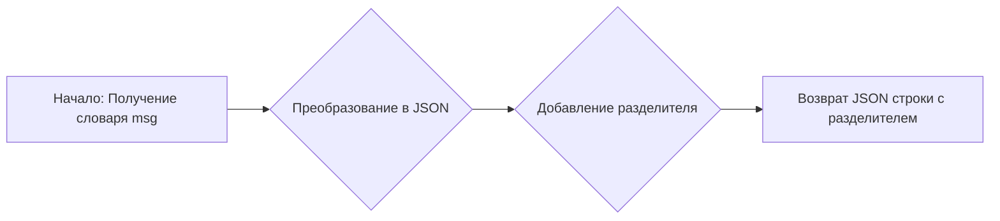
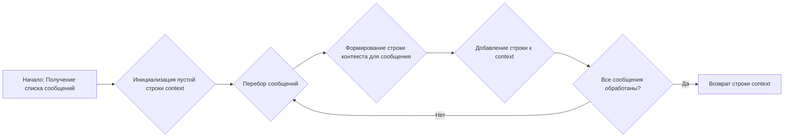

# Модуль Bing.py

## Обзор

Модуль `Bing.py` предоставляет интерфейс для взаимодействия с чат-ботом Bing AI. Он включает в себя функции для создания диалога, отправки запросов и получения ответов в режиме стриминга. Модуль поддерживает как обычные текстовые запросы, так и запросы с контекстом, используя jailbreak для расширения возможностей.

## Подробней

Этот модуль используется для интеграции с Bing AI, обеспечивая возможность генерации текста на основе введенных пользователем запросов. Он обрабатывает создание и поддержание диалога, а также форматирование запросов и ответов для обеспечения совместимости с API Bing.

## Классы

### `optionsSets`

Описание набора параметров для настройки поведения Bing AI.

**Атрибуты**:
- `optionSet` (dict): Словарь, определяющий структуру набора параметров.
    - `tone` (str): Тип данных для параметра "tone" (строка).
    - `optionsSets` (list): Тип данных для параметра "optionsSets" (список).
- `jailbreak` (dict): Набор параметров, используемых для "jailbreak" Bing AI.
    - `optionsSets` (list): Список строк, представляющих различные опции для "jailbreak".

### `Defaults`

Содержит значения по умолчанию и статические параметры, необходимые для взаимодействия с API Bing.

**Атрибуты**:
- `delimiter` (str): Разделитель, используемый для разделения сообщений при обмене данными (значение: '\x1e').
- `ip_address` (str): IP-адрес, используемый в заголовках запросов (формируется случайным образом).
- `allowedMessageTypes` (list): Список разрешенных типов сообщений.
- `sliceIds` (list): Список идентификаторов "slice", используемых в запросах.
- `location` (dict): Информация о местоположении, используемая в запросах.

## Функции

### `_format`

```python
def _format(msg: dict) -> str:
    """
    Преобразует словарь `msg` в строку JSON и добавляет разделитель `Defaults.delimiter` в конце.

    Args:
        msg (dict): Словарь, который необходимо преобразовать в JSON.

    Returns:
        str: JSON-представление словаря с добавленным разделителем.
    """
```

**Назначение**: Форматирует сообщение в JSON-формате с добавлением разделителя в конце, для последующей передачи в API Bing.

**Параметры**:
- `msg` (dict): Словарь, представляющий сообщение.

**Возвращает**:
- `str`: Строка в формате JSON с добавленным разделителем.

**Как работает функция**:

1.  Преобразует входящий словарь `msg` в JSON-строку, используя `json.dumps` и отключая экранирование символов Unicode (`ensure_ascii=False`).
2.  Добавляет разделитель `Defaults.delimiter` в конец JSON-строки.
3.  Возвращает полученную строку.



**Примеры**:

```python
message = {"text": "Hello, world!"}
formatted_message = _format(message)
print(formatted_message)
```

### `create_conversation`

```python
async def create_conversation():
    """
    Создает новый разговор с Bing AI, получая conversationId, clientId и conversationSignature.

    Returns:
        tuple[str, str, str]: conversationId, clientId и conversationSignature.

    Raises:
        Exception: Если не удается создать разговор после нескольких попыток.
    """
```

**Назначение**: Создает новый диалог с Bing AI и возвращает идентификаторы, необходимые для последующего взаимодействия.

**Возвращает**:
- `tuple[str, str, str]`: Кортеж, содержащий `conversationId`, `clientId` и `conversationSignature`.

**Вызывает исключения**:
- `Exception`: Если не удается создать диалог после 5 попыток.

**Как работает функция**:

1.  Выполняет до 5 попыток запроса к API Bing для создания нового диалога.
2.  При каждой попытке отправляет GET-запрос к `https://www.bing.com/turing/conversation/create` с определенными заголовками, включая случайный IP-адрес.
3.  Анализирует JSON-ответ, чтобы извлечь `conversationId`, `clientId` и `conversationSignature`.
4.  Если все три идентификатора получены успешно, возвращает их.
5.  Если после 5 попыток не удается получить все идентификаторы, вызывает исключение `Exception`.

```mermaid
graph LR
A[Начало: Попытка создания диалога (до 5 раз)] --> B{Запрос к API Bing};
B --> C{Анализ JSON-ответа};
C -- Успех --> D[Возврат conversationId, clientId, conversationSignature];
C -- Неудача --> E{Повторить (до 5 раз)?};
E -- Да --> B;
E -- Нет --> F[Выброс исключения Exception];
```

**Примеры**:

```python
conversation_id, client_id, conversation_signature = await create_conversation()
print(f"Conversation ID: {conversation_id}")
print(f"Client ID: {client_id}")
print(f"Conversation Signature: {conversation_signature}")
```

### `stream_generate`

```python
async def stream_generate(prompt: str, mode: optionsSets.optionSet = optionsSets.jailbreak, context: bool | str = False):
    """
    Генерирует текст в режиме стриминга с использованием Bing AI.

    Args:
        prompt (str): Текст запроса.
        mode (optionsSets.optionSet, optional): Набор параметров для запроса. По умолчанию optionsSets.jailbreak.
        context (bool | str, optional): Контекст для запроса. По умолчанию False.

    Yields:
        str: Части сгенерированного текста.

    Raises:
        Exception: Если произошла ошибка при генерации текста.
    """
```

**Назначение**: Генерирует текст в режиме стриминга, используя Bing AI, и возвращает его частями.

**Параметры**:
- `prompt` (str): Текст запроса.
- `mode` (optionsSets.optionSet, optional): Набор параметров для запроса. По умолчанию `optionsSets.jailbreak`.
- `context` (bool | str, optional): Контекст для запроса. По умолчанию `False`.

**Yields**:
- `str`: Части сгенерированного текста.

**Вызывает исключения**:
- `Exception`: Если произошла ошибка при генерации текста.

**Как работает функция**:

1.  Устанавливает таймаут для HTTP-клиента.
2.  Создает сессию `aiohttp.ClientSession` для выполнения асинхронных запросов.
3.  Получает `conversationId`, `clientId` и `conversationSignature` с помощью `create_conversation`.
4.  Устанавливает WebSocket-соединение с сервером Bing AI (`wss://sydney.bing.com/sydney/ChatHub`).
5.  Отправляет начальное сообщение для установки протокола (`{\'protocol\': \'json\', \'version\': 1}`).
6.  Формирует структуру сообщения с запросом, включая текст запроса, параметры режима и контекст (если предоставлен).
7.  Отправляет сообщение через WebSocket.
8.  Получает ответы от сервера и обрабатывает их, извлекая части сгенерированного текста.
9.  Возвращает части текста с помощью `yield`.
10. Закрывает WebSocket-соединение и сессию после завершения генерации.

```mermaid
graph LR
A[Начало: Получение параметров запроса] --> B{Создание сессии aiohttp};
B --> C{Получение conversationId, clientId, conversationSignature};
C --> D{Установка WebSocket-соединения};
D --> E{Отправка начального сообщения протокола};
E --> F{Формирование структуры сообщения с запросом};
F --> G{Отправка сообщения через WebSocket};
G --> H{Получение ответов от сервера};
H --> I{Извлечение частей сгенерированного текста};
I --> J{Возврат части текста (yield)};
J --> K{Завершение генерации?};
K -- Нет --> H;
K -- Да --> L{Закрытие WebSocket и сессии};
L --> M[Конец];
```

**Примеры**:

```python
async for part in stream_generate("Tell me a joke."):
    print(part, end="")
```

### `run`

```python
def run(generator):
    """
    Запускает асинхронный генератор и возвращает его значения синхронно.

    Args:
        generator (AsyncGenerator): Асинхронный генератор.

    Yields:
        Any: Значения, возвращаемые генератором.
    """
```

**Назначение**: Запускает асинхронный генератор и возвращает его значения синхронно.

**Параметры**:
- `generator` (AsyncGenerator): Асинхронный генератор.

**Yields**:
- `Any`: Значения, возвращаемые генератором.

**Как работает функция**:

1.  Получает текущий event loop.
2.  Преобразует асинхронный генератор в асинхронный итератор.
3.  В цикле вызывает `__anext__()` на итераторе, используя `loop.run_until_complete()` для ожидания результата.
4.  Возвращает полученные значения с помощью `yield`.
5.  Завершает работу при возникновении исключения `StopAsyncIteration`.

```mermaid
graph LR
A[Начало: Получение асинхронного генератора] --> B{Получение текущего event loop};
B --> C{Преобразование в асинхронный итератор};
C --> D{Вызов __anext__() в цикле};
D --> E{Ожидание результата с loop.run_until_complete()};
E --> F{Возврат значения (yield)};
F --> G{StopAsyncIteration?};
G -- Нет --> D;
G -- Да --> H[Конец];
```

**Примеры**:

```python
async def my_generator():
    yield "Hello"
    yield "World"

for value in run(my_generator()):
    print(value)
```

### `convert`

```python
def convert(messages):
    """
    Преобразует список сообщений в строку контекста для запроса к Bing AI.

    Args:
        messages (list): Список сообщений.

    Returns:
        str: Строка контекста.
    """
```

**Назначение**: Преобразует список сообщений в строку контекста для запроса к Bing AI.

**Параметры**:
- `messages` (list): Список сообщений, где каждое сообщение представляет собой словарь с ключами `role` и `content`.

**Возвращает**:
- `str`: Строка контекста, сформированная из сообщений.

**Как работает функция**:

1.  Инициализирует пустую строку `context`.
2.  Перебирает сообщения в списке `messages`.
3.  Для каждого сообщения формирует строку вида `[role](#message)\ncontent\n\n`, где `role` - роль автора сообщения, а `content` - содержимое сообщения.
4.  Добавляет сформированную строку к строке `context`.
5.  Возвращает строку `context`.



**Примеры**:

```python
messages = [
    {"role": "user", "content": "Hello"},
    {"role": "bot", "content": "Hi"}
]
context = convert(messages)
print(context)
```

### `_create_completion`

```python
def _create_completion(model: str, messages: list, stream: bool, **kwargs):
    """
    Создает запрос к Bing AI и возвращает результат в виде генератора.

    Args:
        model (str): Модель для генерации текста.
        messages (list): Список сообщений для контекста.
        stream (bool): Флаг, указывающий, использовать ли потоковый режим.
        **kwargs: Дополнительные параметры.

    Yields:
        str: Части сгенерированного текста.
    """
```

**Назначение**: Создает запрос к Bing AI и возвращает результат в виде генератора.

**Параметры**:
- `model` (str): Модель для генерации текста.
- `messages` (list): Список сообщений для контекста.
- `stream` (bool): Флаг, указывающий, использовать ли потоковый режим.
- `**kwargs`: Дополнительные параметры.

**Yields**:
- `str`: Части сгенерированного текста.

**Как работает функция**:

1.  Определяет текст запроса и контекст в зависимости от количества сообщений.
2.  Если сообщений меньше двух, текст запроса берется из первого сообщения, а контекст устанавливается в `False`.
3.  Если сообщений два и более, текст запроса берется из последнего сообщения, а контекст формируется из предыдущих сообщений с помощью функции `convert`.
4.  Вызывает функцию `stream_generate` для получения ответа от Bing AI в потоковом режиме.
5.  Возвращает части сгенерированного текста с помощью `yield`.

```mermaid
graph LR
A[Начало: Получение параметров] --> B{Проверка количества сообщений};
B -- Меньше 2 --> C{Текст запроса = первое сообщение, контекст = False};
B -- 2 и более --> D{Текст запроса = последнее сообщение, контекст = convert(предыдущие сообщения)};
C --> E{Вызов stream_generate};
D --> E;
E --> F{Перебор результатов stream_generate};
F --> G{Возврат части текста (yield)};
G --> H{Все результаты обработаны?};
H -- Нет --> F;
H -- Да --> I[Конец];
```

**Примеры**:

```python
messages = [
    {"role": "user", "content": "Hello"},
    {"role": "bot", "content": "Hi"},
    {"role": "user", "content": "Tell me a joke"}
]
for token in _create_completion("gpt-4", messages, True):
    print(token, end="")
```

### `params`

Строка, содержащая информацию о поддерживаемых параметрах функции `_create_completion`.

```python
params = f'g4f.Providers.{os.path.basename(__file__)[:-3]} supports: ' + \
    ' (%s)' % ', '.join(
        [f"{name}: {get_type_hints(_create_completion)[name].__name__}" for name in _create_completion.__code__.co_varnames[:_create_completion.__code__.co_argcount]])
```

**Назначение**: Предоставляет информацию о поддерживаемых параметрах функции `_create_completion`.

**Как работает**:

1.  Формирует строку, содержащую имя текущего файла (без расширения `.py`) и список поддерживаемых параметров функции `_create_completion`.
2.  Для каждого параметра извлекает его имя и тип из аннотаций типов функции `_create_completion`.
3.  Объединяет информацию о параметрах в строку в формате `'name: type'`.
4.  Добавляет полученную строку к основной строке с информацией о поддерживаемых параметрах.

```mermaid
graph LR
A[Начало: Получение имени файла] --> B{Получение списка параметров _create_completion};
B --> C{Извлечение имени и типа каждого параметра};
C --> D{Формирование строки 'name: type'};
D --> E{Объединение строк в общий список};
E --> F{Создание итоговой строки};
F --> G[Конец: Строка с информацией о параметрах];