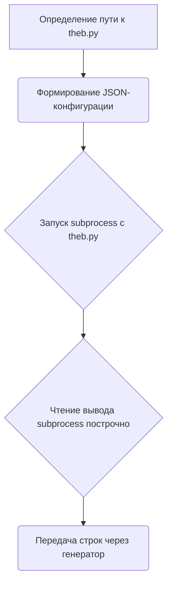

# Модуль для работы с провайдером Theb.ai

## Обзор

Модуль предоставляет класс для взаимодействия с провайдером Theb.ai, который использует модель `gpt-3.5-turbo`. Он позволяет отправлять запросы к модели через subprocess и получать ответы.

## Подробней

Этот модуль предназначен для интеграции с Theb.ai, позволяя отправлять запросы к их API и получать ответы. Он использует subprocess для запуска скрипта `theb.py`, который обрабатывает запросы к Theb.ai.

## Функции

### `_create_completion`

```python
def _create_completion(model: str, messages: list, stream: bool, **kwargs):
    """
    Создает запрос к Theb.ai с использованием subprocess.

    Args:
        model (str): Имя модели для использования.
        messages (list): Список сообщений для отправки.
        stream (bool): Флаг потоковой передачи данных.
        **kwargs: Дополнительные аргументы.

    Returns:
        Generator[str, None, None]: Генератор строк, представляющих собой ответ от Theb.ai.

    Raises:
        Exception: Если возникает ошибка при выполнении subprocess.
    """
    ...
```

**Как работает функция**:

1.  **Определение пути**: Определяет путь к текущему файлу и использует его для формирования пути к скрипту `theb.py`.
2.  **Конфигурация запроса**: Формирует JSON-строку с параметрами запроса, включая сообщения и модель.
3.  **Запуск subprocess**: Запускает скрипт `theb.py` в отдельном процессе с передачей конфигурации через командную строку.
4.  **Обработка ответа**: Читает вывод subprocess построчно и передает его через генератор.



**Примеры**:

```python
# Пример вызова функции _create_completion
result = _create_completion(model='gpt-3.5-turbo', messages=[{'role': 'user', 'content': 'Hello'}], stream=True)
for line in result:
    print(line)
```

## Переменные

-   `url (str)`: URL провайдера Theb.ai (`https://theb.ai`).
-   `model (list)`: Список поддерживаемых моделей ( `['gpt-3.5-turbo']`).
-   `supports_stream (bool)`: Поддержка потоковой передачи данных (`True`).
-   `needs_auth (bool)`: Требуется ли аутентификация (`False`).
-   `params (str)`: Строка с информацией о поддерживаемых типах параметров функции `_create_completion`.