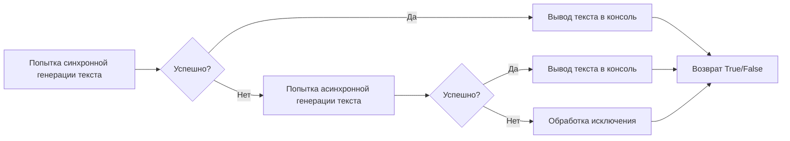

# Модуль для тестирования моделей g4f
## Обзор

Модуль предназначен для тестирования работоспособности различных моделей, предоставляемых библиотекой `g4f` (gpt4free). Он проверяет, могут ли модели успешно генерировать текст на основе заданного запроса. Тестирование проводится как в синхронном, так и в асинхронном режимах, чтобы охватить разные способы использования моделей.

## Подробнее

Данный модуль используется для автоматической проверки доступности и корректной работы моделей `g4f`. Это позволяет быстро выявлять проблемы с конкретными моделями и обеспечивает возможность оперативного реагирования на изменения в API или инфраструктуре `g4f`. Расположение модуля в подкаталоге `testing` указывает на его роль в системе автоматизированного тестирования проекта `hypotez`.
Модуль содержит функцию `test`, которая отправляет запрос к модели и выводит сгенерированный текст.  Если модель не работает, функция выводит сообщение об ошибке.
Функция `start_test` запускает тестирование для списка моделей и выводит список работающих моделей.

## Функции

### `test`
```python
async def test(model: g4f.Model) -> bool:
    """ Проверяет работоспособность заданной модели g4f.

    Args:
        model (g4f.Model): Модель для тестирования.

    Returns:
        bool: `True`, если модель работает, `False` в противном случае.

    Raises:
        Exception: Если возникает ошибка при обращении к модели.
    """
```

**Как работает функция**:

1.  **Попытка генерации текста в синхронном режиме**: Функция пытается сгенерировать текст, используя модель `g4f.ChatCompletion.create` в синхронном режиме.
2.  **Обработка ответа в потоке**: Если генерация успешна, функция перебирает ответы в потоке и выводит их в консоль.
3.  **Попытка генерации текста в асинхронном режиме**: Если синхронный режим завершился с ошибкой, функция пытается сгенерировать текст в асинхронном режиме, используя `g4f.ChatCompletion.create_async`.
4.  **Обработка ответа в асинхронном режиме**: Если асинхронная генерация успешна, функция перебирает ответы в асинхронном потоке и выводит их в консоль.
5.  **Обработка исключений**: Если в процессе генерации возникает исключение, функция выводит сообщение об ошибке, содержащее имя модели и информацию об исключении, а также информацию о трассировке.
6.  **Возврат значения**: Функция возвращает `True`, если модель работает, и `False`, если произошла ошибка.



**Примеры**:

```python
import g4f
import asyncio
async def test_model():
    model = g4f.models.gpt_35_turbo
    result = await test(model)
    print(f"Model {model.name} is working: {result}")

asyncio.run(test_model())
```

### `start_test`
```python
async def start_test() -> None:
    """ Запускает тестирование для списка моделей и выводит список работающих моделей.
    """
```

**Как работает функция**:

1.  **Определение списка моделей для тестирования**: Функция создает список моделей, которые будут протестированы.
2.  **Итерация по списку моделей**: Функция перебирает модели в списке.
3.  **Вызов функции `test` для каждой модели**: Для каждой модели вызывается функция `test`, которая проверяет работоспособность модели.
4.  **Формирование списка работающих моделей**: Если функция `test` возвращает `True`, имя модели добавляется в список `models_working`.
5.  **Вывод списка работающих моделей**: После завершения тестирования всех моделей функция выводит список работающих моделей в консоль.

```mermaid
graph LR
    A[Определение списка моделей] --> B{Перебор моделей};
    B --> C{Вызов функции test(model)};
    C --> D{Результат test(model) == True?};
    D -- Да --> E[Добавление модели в список работающих];
    D -- Нет --> F[Пропуск];
    E --> B;
    F --> B;
    B -- Конец списка --> G[Вывод списка работающих моделей];
    G --> H[Конец];
```

**Примеры**:

```python
import asyncio
async def run_tests():
    await start_test()

asyncio.run(run_tests())