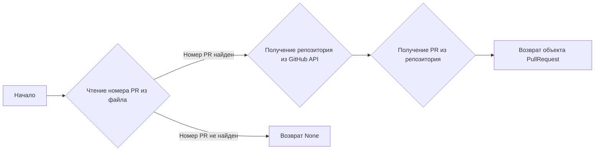
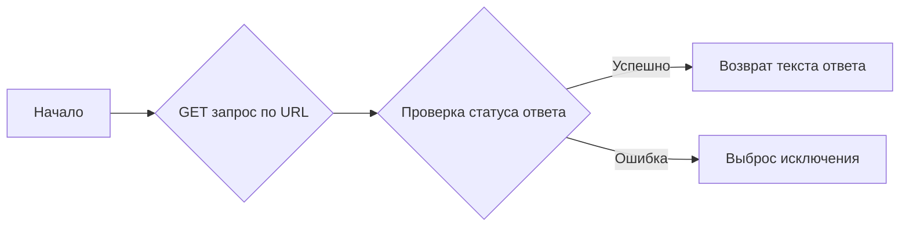
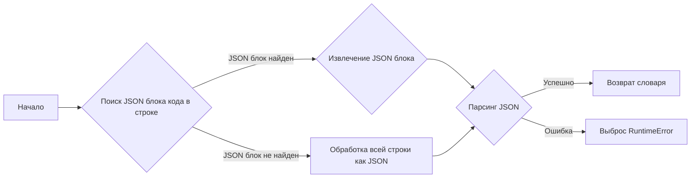
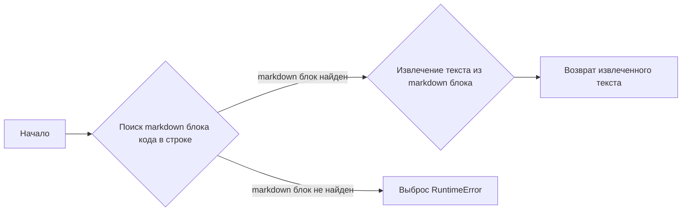
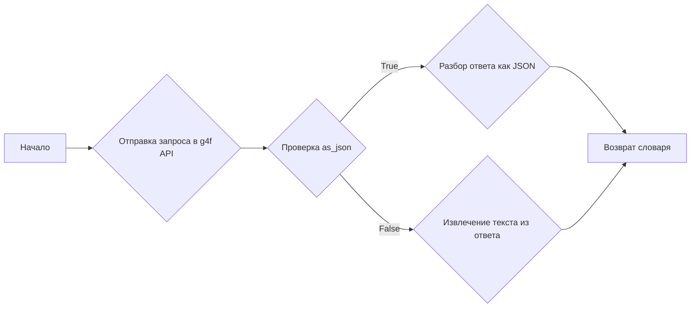
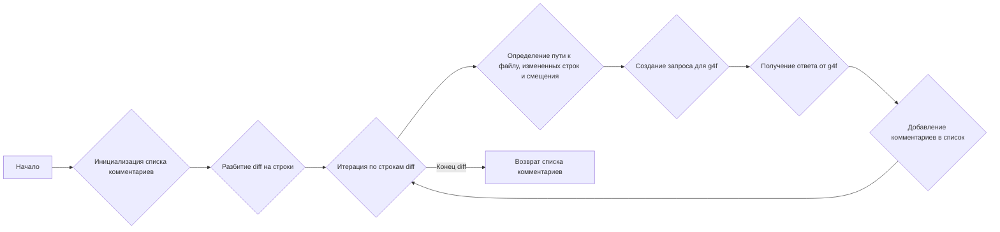
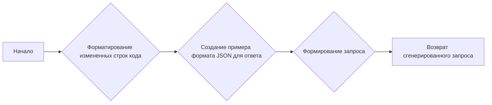
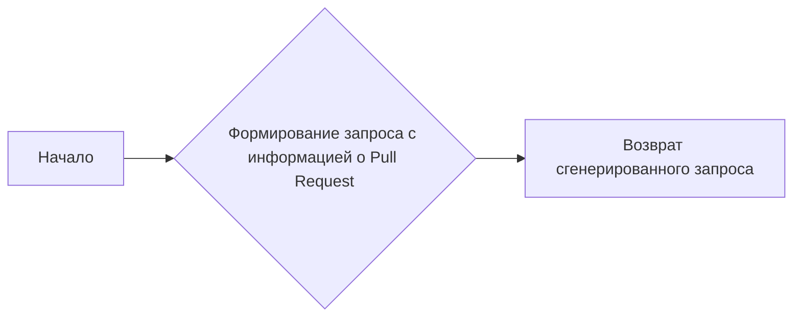

# Модуль для автоматической проверки кода в Pull Request с использованием g4f
========================================================================

Модуль предназначен для анализа изменений в Pull Request на GitHub с использованием моделей g4f (GPT-4 Free) для автоматической проверки кода и генерации комментариев.

## Обзор

Этот модуль автоматизирует процесс проверки кода в Pull Request, используя возможности моделей g4f для анализа изменений и предоставления рекомендаций. Он интегрируется с GitHub API для получения информации о Pull Request, анализа изменений и создания комментариев с предложениями по улучшению кода.

## Подробнее

Модуль получает информацию о Pull Request, анализирует изменения в коде с использованием g4f, и создает комментарии в Pull Request с предложениями по улучшению кода. Он также поддерживает создание общего обзора Pull Request.

## Функции

### `get_pr_details`

```python
def get_pr_details(github: Github) -> PullRequest:
    """
    Извлекает детали Pull Request из GitHub.

    Args:
        github (Github): Объект Github для взаимодействия с GitHub API.

    Returns:
        PullRequest: Объект, представляющий Pull Request.
    """
```

**Назначение**: Извлечение деталей Pull Request из GitHub.

**Параметры**:
- `github` (Github): Объект Github для взаимодействия с GitHub API.

**Возвращает**:
- `PullRequest`: Объект, представляющий Pull Request.

**Как работает функция**:
1.  Читает номер Pull Request из файла `./pr_number`.
2.  Если номер Pull Request не найден, возвращает `None`.
3.  Получает репозиторий и Pull Request из GitHub API.
4.  Возвращает объект `PullRequest`.



### `get_diff`

```python
def get_diff(diff_url: str) -> str:
    """
    Получает diff Pull Request по заданному URL.

    Args:
        diff_url (str): URL diff Pull Request.

    Returns:
        str: Diff Pull Request.
    """
```

**Назначение**: Получение diff Pull Request по заданному URL.

**Параметры**:
- `diff_url` (str): URL diff Pull Request.

**Возвращает**:
- `str`: Diff Pull Request.

**Как работает функция**:
1.  Отправляет GET-запрос по указанному URL.
2.  Проверяет статус ответа.
3.  Возвращает текст ответа, содержащий diff Pull Request.



### `read_json`

```python
def read_json(text: str) -> dict:
    """
    Разбирает блок кода JSON из строки.

    Args:
        text (str): Строка, содержащая блок кода JSON.

    Returns:
        dict: Словарь, полученный из блока кода JSON.
    """
```

**Назначение**: Разбор блока кода JSON из строки.

**Параметры**:
- `text` (str): Строка, содержащая блок кода JSON.

**Возвращает**:
- `dict`: Словарь, полученный из блока кода JSON.

**Вызывает исключения**:
- `RuntimeError`: Если JSON недействителен.

**Как работает функция**:
1.  Ищет блок кода JSON в строке с использованием регулярного выражения.
2.  Если блок кода JSON найден, извлекает его.
3.  Парсит JSON и возвращает словарь.
4.  Если JSON недействителен, выбрасывает исключение `RuntimeError`.



### `read_text`

```python
def read_text(text: str) -> str:
    """
    Извлекает текст из блока кода markdown.

    Args:
        text (str): Строка, содержащая блок кода markdown.

    Returns:
        str: Извлеченный текст.
    """
```

**Назначение**: Извлечение текста из блока кода markdown.

**Параметры**:
- `text` (str): Строка, содержащая блок кода markdown.

**Возвращает**:
- `str`: Извлеченный текст.

**Вызывает исключения**:
- `RuntimeError`: Если markdown недействителен.

**Как работает функция**:
1.  Ищет блок кода markdown в строке с использованием регулярного выражения.
2.  Если блок кода markdown найден, извлекает текст.
3.  Возвращает извлеченный текст.
4.  Если блок кода markdown не найден, выбрасывает исключение `RuntimeError`.



### `get_ai_response`

```python
def get_ai_response(prompt: str, as_json: bool = True) -> Union[dict, str]:
    """
    Получает ответ от g4f API на основе запроса.

    Args:
        prompt (str): Запрос для отправки в g4f.
        as_json (bool): Определяет, следует ли анализировать ответ как JSON.

    Returns:
        Union[dict, str]: Проанализированный ответ от g4f, либо как словарь, либо как строка.
    """
```

**Назначение**: Получение ответа от g4f API на основе запроса.

**Параметры**:
- `prompt` (str): Запрос для отправки в g4f.
- `as_json` (bool): Определяет, следует ли анализировать ответ как JSON.

**Возвращает**:
- `dict | str`: Проанализированный ответ от g4f, либо как словарь, либо как строка.

**Как работает функция**:
1.  Отправляет запрос в g4f API.
2.  Если `as_json` равно `True`, пытается разобрать ответ как JSON.
3.  Если `as_json` равно `False`, извлекает текст из ответа.
4.  Возвращает результат.



### `analyze_code`

```python
def analyze_code(pull: PullRequest, diff: str)-> list[dict]:
    """
    Анализирует изменения кода в Pull Request.

    Args:
        pull (PullRequest): Объект Pull Request.
        diff (str): Diff Pull Request.

    Returns:
        list[dict]: Список комментариев, сгенерированных анализом.
    """
```

**Назначение**: Анализ изменений кода в Pull Request.

**Параметры**:
- `pull` (PullRequest): Объект Pull Request.
- `diff` (str): Diff Pull Request.

**Возвращает**:
- `list[dict]`: Список комментариев, сгенерированных анализом.

**Как работает функция**:
1.  Инициализирует пустой список комментариев.
2.  Разбивает diff на строки.
3.  Итерируется по строкам diff.
4.  Определяет путь к файлу, измененные строки и смещение.
5.  Создает запрос для g4f на основе измененных строк.
6.  Получает ответ от g4f и добавляет комментарии в список.
7.  Возвращает список комментариев.



### `create_analyze_prompt`

```python
def create_analyze_prompt(changed_lines: list[str], pull: PullRequest, file_path: str):
    """
    Создает запрос для модели g4f.

    Args:
        changed_lines (list[str]): Строки кода, которые были изменены.
        pull (PullRequest): Объект Pull Request.
        file_path (str): Путь к файлу, который проверяется.

    Returns:
        str: Сгенерированный запрос.
    """
```

**Назначение**: Создание запроса для модели g4f.

**Параметры**:
- `changed_lines` (list[str]): Строки кода, которые были изменены.
- `pull` (PullRequest): Объект Pull Request.
- `file_path` (str): Путь к файлу, который проверяется.

**Возвращает**:
- `str`: Сгенерированный запрос.

**Как работает функция**:
1.  Форматирует измененные строки кода в строку.
2.  Создает пример формата JSON для ответа.
3.  Формирует запрос, включающий инструкции, информацию о Pull Request и измененный код.
4.  Возвращает сгенерированный запрос.



### `create_review_prompt`

```python
def create_review_prompt(pull: PullRequest, diff: str):
    """
    Создает запрос для создания комментария с обзором.

    Args:
        pull (PullRequest): Объект Pull Request.
        diff (str): Diff Pull Request.

    Returns:
        str: Сгенерированный запрос для обзора.
    """
```

**Назначение**: Создание запроса для создания комментария с обзором.

**Параметры**:
- `pull` (PullRequest): Объект Pull Request.
- `diff` (str): Diff Pull Request.

**Возвращает**:
- `str`: Сгенерированный запрос для обзора.

**Как работает функция**:
1.  Формирует запрос, включающий инструкции, информацию об авторе Pull Request, заголовке, описании и diff.
2.  Возвращает сгенерированный запрос.



### `main`

```python
def main():
    """
    Основная функция для запуска анализа Pull Request.
    """
```

**Назначение**: Основная функция для запуска анализа Pull Request.

**Как работает функция**:
1.  Инициализирует объект Github.
2.  Получает детали Pull Request.
3.  Получает diff Pull Request.
4.  Создает запрос для обзора Pull Request.
5.  Получает ответ от g4f и создает комментарий с обзором.
6.  Анализирует код и создает комментарии с предложениями по улучшению кода.
7.  Создает обзор Pull Request с комментариями.

```mermaid
graph LR
A[Начало] --> B{Инициализация Github};
B --> C{Получение деталей Pull Request};
C --> D{Получение diff Pull Request};
D --> E{Создание запроса для обзора};
E --> F{Получение ответа от g4f};
F --> G{Создание комментария с обзором};
G --> H{Анализ кода};
H --> I{Создание комментариев с предложениями};
I --> J{Создание обзора Pull Request};