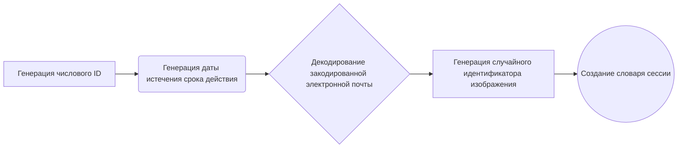
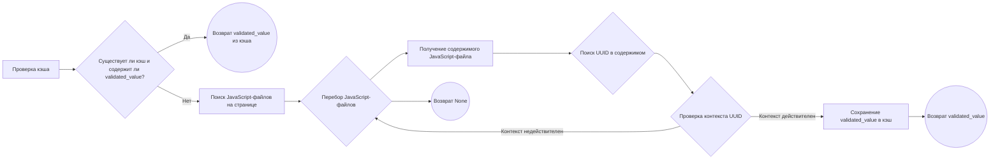
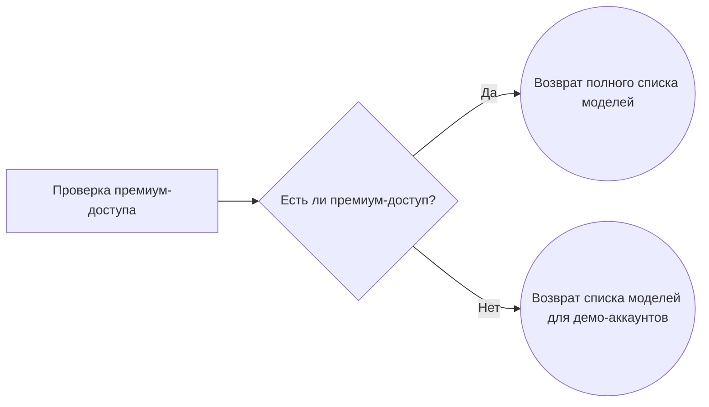

# Модуль Blackbox

## Обзор

Модуль `Blackbox` предоставляет интерфейс для взаимодействия с сервисом Blackbox AI, позволяя генерировать текст и изображения с использованием различных моделей. Он поддерживает как потоковую передачу данных, так и работу с историей сообщений. Модуль включает в себя функциональность для управления сессиями, получения списка доступных моделей и обработки медиа-контента.

## Подробней

Модуль `Blackbox` предназначен для интеграции с сервисом Blackbox AI. Он предоставляет следующие возможности:

1.  **Поддержка различных моделей**: Модуль поддерживает широкий спектр моделей, включая `blackboxai`, `gpt-4o`, `Claude-sonnet-3.7`, `DeepSeek-V3` и другие, а также модели для генерации изображений, такие как `flux`.
2.  **Управление сессиями**: Модуль позволяет генерировать и использовать сессии для авторизованных пользователей, что обеспечивает доступ к полному списку моделей.
3.  **Работа с медиа-контентом**: Модуль поддерживает отправку изображений в запросах и обработку ответов, содержащих изображения.
4.  **Потоковая передача данных**: Модуль поддерживает потоковую передачу данных, что позволяет получать ответы от сервиса Blackbox AI по частям.
5.  **Кэширование**: Модуль кэширует `validated_value` для повышения производительности.

Модуль использует следующие основные компоненты:

*   `aiohttp.ClientSession`: Для выполнения асинхронных HTTP-запросов.
*   `json`: Для работы с данными в формате JSON.
*   `random` и `string`: Для генерации случайных идентификаторов.
*   `base64`: Для кодирования и декодирования данных.
*   `datetime` и `timedelta`: Для работы с датами и временем.
*   `src.logger.logger`: Для логирования событий и ошибок.

## Классы

### `Conversation`

**Описание**: Класс `Conversation` представляет собой структуру данных для хранения информации о текущем разговоре с Blackbox AI.

**Наследует**:

*   `JsonConversation`: Расширяет класс `JsonConversation`, добавляя специфичные для Blackbox AI атрибуты.

**Атрибуты**:

*   `validated_value` (str | None): Значение, используемое для валидации сессии.
*   `chat_id` (str | None): Идентификатор чата.
*   `message_history` (Messages): История сообщений в чате.
*   `model` (str): Модель, используемая в разговоре.

**Методы**:

*   `__init__(self, model: str)`: Инициализирует новый объект `Conversation`.

### `Blackbox`

**Описание**: Класс `Blackbox` предоставляет методы для взаимодействия с API Blackbox AI, включая генерацию текста и изображений, управление сессиями и получение списка доступных моделей.

**Наследует**:

*   `AsyncGeneratorProvider`: Обеспечивает поддержку асинхронной генерации.
*   `ProviderModelMixin`: Предоставляет методы для работы с моделями.

**Атрибуты**:

*   `label` (str): Метка провайдера ("Blackbox AI").
*   `url` (str): URL сервиса Blackbox AI ("https://www.blackbox.ai").
*   `api_endpoint` (str): URL API Blackbox AI ("https://www.blackbox.ai/api/chat").
*   `working` (bool): Указывает, работает ли провайдер (True).
*   `supports_stream` (bool): Указывает, поддерживает ли провайдер потоковую передачу данных (True).
*   `supports_system_message` (bool): Указывает, поддерживает ли провайдер системные сообщения (True).
*   `supports_message_history` (bool): Указывает, поддерживает ли провайдер историю сообщений (True).
*   `default_model` (str): Модель, используемая по умолчанию ("blackboxai").
*   `default_vision_model` (str): Модель для обработки изображений по умолчанию.
*   `default_image_model` (str): Модель для генерации изображений по умолчанию ('flux').
*   `fallback_models` (list): Список моделей, доступных для неавторизованных пользователей.
*   `image_models` (list): Список моделей, поддерживающих генерацию изображений.
*   `vision_models` (list): Список моделей, поддерживающих обработку изображений.
*   `userSelectedModel` (list): Список моделей, выбранных пользователем.
*   `agentMode` (dict): Конфигурация режимов агента для различных моделей.
*   `trendingAgentMode` (dict): Конфигурация популярных режимов агента.
*   `_all_models` (list): Полный список всех моделей (для авторизованных пользователей).
*   `models` (list): Список доступных моделей (инициализируется `fallback_models`).
*   `model_aliases` (dict): Словарь псевдонимов моделей.

**Методы**:

*   `generate_session(cls, id_length: int = 21, days_ahead: int = 365) -> dict`: Генерирует динамическую сессию с заданным ID и сроком действия.
*   `fetch_validated(cls, url: str = "https://www.blackbox.ai", force_refresh: bool = False) -> str | None`: Извлекает валидированное значение из кэша или с веб-страницы.
*   `generate_id(cls, length: int = 7) -> str`: Генерирует случайный идентификатор заданной длины.
*   `get_models(cls) -> list`: Возвращает список доступных моделей в зависимости от статуса авторизации пользователя.
*   `_check_premium_access(cls) -> bool`: Проверяет наличие авторизованной сессии в HAR-файлах.
*   `create_async_generator(cls, model: str, messages: Messages, prompt: str = None, proxy: str = None, media: MediaListType = None, top_p: float = None, temperature: float = None, max_tokens: int = None, conversation: Conversation = None, return_conversation: bool = False, **kwargs) -> AsyncResult`: Создает асинхронный генератор для взаимодействия с API Blackbox AI.

## Функции

### `generate_session`

```python
    @classmethod
    def generate_session(cls, id_length: int = 21, days_ahead: int = 365) -> dict:
        """
        Generate a dynamic session with proper ID and expiry format.
        
        Args:
            id_length: Length of the numeric ID (default: 21)
            days_ahead: Number of days ahead for expiry (default: 365)
        
        Returns:
            dict: A session dictionary with user information and expiry
        """
        # Generate numeric ID
        numeric_id = ''.join(random.choice('0123456789') for _ in range(id_length))
        
        # Generate future expiry date
        future_date = datetime.now() + timedelta(days=days_ahead)
        expiry = future_date.strftime('%Y-%m-%dT%H:%M:%S.%f')[:-3] + 'Z'
        
        # Decode the encoded email
        encoded_email = "Z2lzZWxlQGJsYWNrYm94LmFp"  # Base64 encoded email
        email = base64.b64decode(encoded_email).decode('utf-8')
        
        # Generate random image ID for the new URL format
        chars = string.ascii_letters + string.digits + "-"
        random_img_id = ''.join(random.choice(chars) for _ in range(48))
        image_url = f"https://lh3.googleusercontent.com/a/ACg8oc{random_img_id}=s96-c"
        
        return {
            "user": {
                "name": "BLACKBOX AI", 
                "email": email, 
                "image": image_url, 
                "id": numeric_id
            }, 
            "expires": expiry
        }
```

**Назначение**: Генерация динамической сессии с правильным форматом ID и сроком действия.

**Параметры**:

*   `id_length` (int): Длина числового ID (по умолчанию: 21).
*   `days_ahead` (int): Количество дней до истечения срока действия (по умолчанию: 365).

**Возвращает**:

*   `dict`: Словарь сессии с информацией о пользователе и сроке действия.

**Как работает функция**:

1.  **Генерация числового ID**: Функция генерирует случайный числовой ID заданной длины.
2.  **Генерация даты истечения срока действия**: Функция генерирует дату истечения срока действия, отстоящую от текущей даты на заданное количество дней.
3.  **Декодирование закодированной электронной почты**: Функция декодирует закодированный адрес электронной почты.
4.  **Генерация случайного идентификатора изображения**: Функция генерирует случайный идентификатор изображения для нового формата URL.
5.  **Создание словаря сессии**: Функция создает словарь сессии, содержащий информацию о пользователе (имя, электронная почта, URL изображения, ID) и срок действия.



**Примеры**:

```python
session = Blackbox.generate_session()
print(session)
# {'user': {'name': 'BLACKBOX AI', 'email': 'gisele@blackbox.ai', 'image': 'https://lh3.googleusercontent.com/a/ACg8oc...=s96-c', 'id': '...'}, 'expires': '...'}

session = Blackbox.generate_session(id_length=10, days_ahead=100)
print(session)
# {'user': {'name': 'BLACKBOX AI', 'email': 'gisele@blackbox.ai', 'image': 'https://lh3.googleusercontent.com/a/ACg8oc...=s96-c', 'id': '...'}, 'expires': '...'}
```

### `fetch_validated`

```python
    @classmethod
    async def fetch_validated(cls, url: str = "https://www.blackbox.ai", force_refresh: bool = False) -> Optional[str]:
        cache_file = Path(get_cookies_dir()) / 'blackbox.json'
        
        if not force_refresh and cache_file.exists():
            try:
                with open(cache_file, 'r') as f:
                    data = json.load(f)
                    if data.get('validated_value'):
                        return data['validated_value']
            except Exception as e:
                debug.log(f"Blackbox: Error reading cache: {e}")
        
        js_file_pattern = r'static/chunks/\d{4}-[a-fA-F0-9]+\.js'
        uuid_pattern = r'["\']([0-9a-fA-F]{8}-[0-9a-fA-F]{4}-[0-9a-fA-F]{4}-[0-9a-fA-F]{4}-[0-9a-fA-F]{12})["\']'

        def is_valid_context(text: str) -> bool:
            return any(char + '=' in text for char in 'abcdefghijklmnopqrstuvwxyz')

        async with ClientSession() as session:
            try:
                async with session.get(url) as response:
                    if response.status != 200:
                        return None

                    page_content = await response.text()
                    js_files = re.findall(js_file_pattern, page_content)

                for js_file in js_files:
                    js_url = f"{url}/_next/{js_file}"
                    async with session.get(js_url) as js_response:
                        if js_response.status == 200:
                            js_content = await js_response.text()
                            for match in re.finditer(uuid_pattern, js_content):
                                start = max(0, match.start() - 10)
                                end = min(len(js_content), match.end() + 10)
                                context = js_content[start:end]

                                if is_valid_context(context):
                                    validated_value = match.group(1)
                                    
                                    cache_file.parent.mkdir(exist_ok=True)
                                    try:
                                        with open(cache_file, 'w') as f:
                                            json.dump({'validated_value': validated_value}, f)
                                    except Exception as e:
                                        debug.log(f"Blackbox: Error writing cache: {e}")
                                        
                                    return validated_value

            except Exception as e:
                debug.log(f"Blackbox: Error retrieving validated_value: {e}")

        return None
```

**Назначение**: Извлечение валидированного значения из кэша или с веб-страницы.

**Параметры**:

*   `url` (str): URL для получения `validated_value` (по умолчанию: "https://www.blackbox.ai").
*   `force_refresh` (bool): Принудительное обновление, игнорируя кэш (по умолчанию: `False`).

**Возвращает**:

*   `Optional[str]`: Валидированное значение или `None` в случае ошибки.

**Как работает функция**:

1.  **Проверка кэша**: Функция проверяет, существует ли файл кэша и содержит ли он валидированное значение. Если да, то возвращает его.
2.  **Поиск JavaScript-файлов**: Функция извлекает JavaScript-файлы из содержимого веб-страницы.
3.  **Поиск UUID**: Функция ищет UUID в содержимом JavaScript-файлов.
4.  **Проверка контекста**: Функция проверяет контекст UUID на наличие валидных символов.
5.  **Кэширование значения**: Если валидированное значение найдено, оно сохраняется в кэше.

Внутренние функции:

*   `is_valid_context(text: str) -> bool`: Проверяет, является ли контекст действительным.
    *   **Параметры**:
        *   `text` (str): Текст для проверки.
    *   **Возвращает**:
        *   `bool`: `True`, если контекст действителен, `False` в противном случае.



**Примеры**:

```python
validated_value = await Blackbox.fetch_validated()
if validated_value:
    print(f"Validated value: {validated_value}")
else:
    print("Failed to fetch validated value.")

validated_value = await Blackbox.fetch_validated(force_refresh=True)
```

### `generate_id`

```python
    @classmethod
    def generate_id(cls, length: int = 7) -> str:
        chars = string.ascii_letters + string.digits
        return ''.join(random.choice(chars) for _ in range(length))
```

**Назначение**: Генерация случайного идентификатора заданной длины.

**Параметры**:

*   `length` (int): Длина идентификатора (по умолчанию: 7).

**Возвращает**:

*   `str`: Случайный идентификатор.

**Как работает функция**:

1.  **Определение набора символов**: Функция определяет набор символов, из которых будет состоять идентификатор (буквы и цифры).
2.  **Генерация идентификатора**: Функция генерирует случайный идентификатор заданной длины, выбирая случайные символы из определенного набора.

```mermaid
graph LR
    A[Определение набора символов (буквы и цифры)] --> B(Генерация случайного идентификатора заданной длины)
    B --> C((Возврат идентификатора))
```

**Примеры**:

```python
id = Blackbox.generate_id()
print(id)  # Например: "aB3cD5e"

id = Blackbox.generate_id(length=10)
print(id)  # Например: "1xY5z8aW2b"
```

### `get_models`

```python
    @classmethod
    def get_models(cls) -> list:
        """
        Returns a list of available models based on authorization status.
        Authorized users get the full list of models.
        Unauthorized users only get fallback_models.
        """
        # Check if there are valid session data in HAR files
        has_premium_access = cls._check_premium_access()
        
        if has_premium_access:
            # For authorized users - all models
            debug.log(f"Blackbox: Returning full model list with {len(cls._all_models)} models")
            return cls._all_models
        else:
            # For demo accounts - only free models
            debug.log(f"Blackbox: Returning free model list with {len(cls.fallback_models)} models")
            return cls.fallback_models
```

**Назначение**: Возвращает список доступных моделей в зависимости от статуса авторизации пользователя.

**Возвращает**:

*   `list`: Список доступных моделей.

**Как работает функция**:

1.  **Проверка доступа**: Функция проверяет, имеет ли пользователь премиум-доступ, проверяя HAR-файлы.
2.  **Возврат списка моделей**: Если у пользователя есть премиум-доступ, функция возвращает полный список моделей (`cls._all_models`). В противном случае функция возвращает список моделей для демо-аккаунтов (`cls.fallback_models`).



**Примеры**:

```python
models = Blackbox.get_models()
print(models)
# ['blackboxai', 'gpt-4o-mini', 'GPT-4o', ...]  # Для демо-аккаунта

# или

# ['blackboxai', 'GPT-4o', 'o1', ...]  # Для премиум-аккаунта
```

### `_check_premium_access`

```python
    @classmethod
    def _check_premium_access(cls) -> bool:
        """
        Checks for an authorized session in HAR files.
        Returns True if a valid session is found that differs from the demo.
        """
        try:
            har_dir = get_cookies_dir()
            if not os.access(har_dir, os.R_OK):
                return False
                
            for root, _, files in os.walk(har_dir):
                for file in files:
                    if file.endswith(".har"):
                        try:
                            with open(os.path.join(root, file), 'rb') as f:
                                har_data = json.load(f)
                                
                            for entry in har_data['log']['entries']