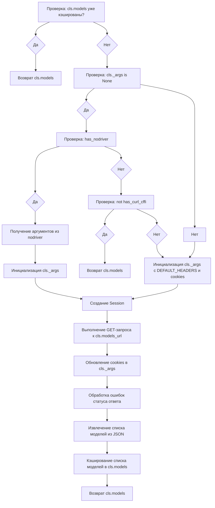

# Модуль Cloudflare

## Обзор

Модуль `Cloudflare` предоставляет асинхронный интерфейс для взаимодействия с AI-моделями, размещенными на платформе Cloudflare AI Playground. Он поддерживает стриминг ответов, использование системных сообщений и ведение истории сообщений. Модуль использует `nodriver` или `curl_cffi` для выполнения HTTP-запросов.

## Подробнее

Модуль предназначен для асинхронного взаимодействия с сервисом Cloudflare AI. Он позволяет отправлять запросы к различным моделям, поддерживаемым Cloudflare, и получать ответы в режиме реального времени. Модуль также обеспечивает поддержку прокси, управление cookies и кэширование аргументов для повторного использования. Расположение модуля в структуре проекта `hypotez` указывает на его роль как одного из провайдеров для доступа к AI-моделям.

## Классы

### `Cloudflare`

**Описание**: Класс `Cloudflare` является асинхронным провайдером, который реализует взаимодействие с AI-моделями Cloudflare.

**Наследует**:
- `AsyncGeneratorProvider`: Обеспечивает базовую функциональность для асинхронных провайдеров, генерирующих ответы.
- `ProviderModelMixin`: Добавляет поддержку выбора и управления моделями.
- `AuthFileMixin`: Обеспечивает функциональность для аутентификации через файлы.

**Атрибуты**:
- `label` (str): Метка провайдера (значение: `"Cloudflare AI"`).
- `url` (str): URL AI Playground (значение: `"https://playground.ai.cloudflare.com"`).
- `working` (bool): Указывает, что провайдер в рабочем состоянии (значение: `True`).
- `use_nodriver` (bool): Указывает на использование `nodriver` для запросов (значение: `True`).
- `api_endpoint` (str): URL API для отправки запросов (значение: `"https://playground.ai.cloudflare.com/api/inference"`).
- `models_url` (str): URL для получения списка моделей (значение: `"https://playground.ai.cloudflare.com/api/models"`).
- `supports_stream` (bool): Поддержка стриминга ответов (значение: `True`).
- `supports_system_message` (bool): Поддержка системных сообщений (значение: `True`).
- `supports_message_history` (bool): Поддержка истории сообщений (значение: `True`).
- `default_model` (str): Модель по умолчанию (значение: `"@cf/meta/llama-3.3-70b-instruct-fp8-fast"`).
- `model_aliases` (dict): Словарь псевдонимов моделей.
- `_args` (dict): Кэшированные аргументы для HTTP-запросов.

**Методы**:
- `get_models()`: Получает список доступных моделей.
- `create_async_generator()`: Создает асинхронный генератор для получения ответов от модели.

## Функции

### `get_models`

```python
@classmethod
def get_models(cls) -> str:
    """Получает список доступных моделей от Cloudflare AI.

    Args:
        cls (Cloudflare): Ссылка на класс Cloudflare.

    Returns:
        str: Список доступных моделей.

    Raises:
        ResponseStatusError: Если возникает ошибка при получении списка моделей.

    Как работает функция:
    1. Проверяет, если список моделей уже кэширован. Если да, возвращает кэшированный список.
    2. Если `cls._args` не инициализирован:
       - Проверяет доступность `nodriver`. Если доступен, получает аргументы из `nodriver`.
       - Если `nodriver` недоступен, проверяет доступность `curl_cffi`. Если недоступен, возвращает кэшированный список.
       - Если `curl_cffi` доступен, инициализирует `cls._args` со стандартными заголовками и пустыми cookies.
    3. Использует `Session` для выполнения GET-запроса к `cls.models_url`.
    4. Обновляет cookies в `cls._args`.
    5. Обрабатывает возможные ошибки статуса ответа.
    6. Извлекает список моделей из JSON-ответа.
    7. Кэширует список моделей в `cls.models`.
    8. Возвращает список моделей.

    Пример:
        >>> Cloudflare.get_models()
        ['@cf/meta/llama-3.3-70b-instruct-fp8-fast', '@cf/meta/llama-2-7b-chat-fp16', ...]
    """
```

**Как работает функция**:



### `create_async_generator`

```python
@classmethod
async def create_async_generator(
    cls,
    model: str,
    messages: Messages,
    proxy: str = None,
    max_tokens: int = 2048,
    cookies: Cookies = None,
    timeout: int = 300,
    **kwargs
) -> AsyncResult:
    """Создает асинхронный генератор для получения ответов от модели Cloudflare AI.

    Args:
        cls (Cloudflare): Ссылка на класс Cloudflare.
        model (str): Имя модели для использования.
        messages (Messages): Список сообщений для отправки.
        proxy (str, optional): URL прокси-сервера. По умолчанию None.
        max_tokens (int, optional): Максимальное количество токенов в ответе. По умолчанию 2048.
        cookies (Cookies, optional): Cookies для отправки с запросом. По умолчанию None.
        timeout (int, optional): Время ожидания ответа в секундах. По умолчанию 300.
        **kwargs: Дополнительные аргументы.

    Returns:
        AsyncResult: Асинхронный генератор, возвращающий ответы от модели.

    Raises:
        ResponseStatusError: Если возникает ошибка при отправке запроса.

    Как работает функция:
    1. Получает путь к файлу кэша.
    2. Если `cls._args` не инициализирован:
       - Проверяет наличие файла кэша. Если есть, загружает аргументы из файла.
       - Если файла кэша нет, использует `nodriver` для получения аргументов.
       - Если `nodriver` недоступен, инициализирует `cls._args` со стандартными заголовками и пустыми cookies.
    3. Преобразует имя модели, используя псевдонимы.
    4. Формирует данные запроса в формате JSON.
    5. Использует `StreamSession` для выполнения POST-запроса к `cls.api_endpoint`.
    6. Обновляет cookies в `cls._args`.
    7. Обрабатывает возможные ошибки статуса ответа.
    8. Итерируется по строкам ответа, извлекая полезные данные и генерируя их.
    9. Сохраняет аргументы в файл кэша.

    Пример:
        >>> async for response in Cloudflare.create_async_generator(model='@cf/meta/llama-3.3-70b-instruct-fp8-fast', messages=[{'role': 'user', 'content': 'Hello'}]):
        ...     print(response)
        ...
        {'token': 'Hello', 'logprobs': None, 'top_logprobs': None}
        Usage(completion_tokens=1, prompt_tokens=1, total_tokens=2)
        FinishReason.stop
    """
```

**Как работает функция**:

```mermaid
graph TD
    A[Получение пути к файлу кэша];
    A --> B[Проверка: cls._args is None];
    B --> C{Да};
    B --> DD{Нет};
    C --> D[Проверка: наличие файла кэша];
    D --> E{Да};
    D --> F{Нет};
    E --> G[Загрузка аргументов из файла кэша];
    F --> H[Использование nodriver для получения аргументов];
    H --> II[Если nodriver недоступен, инициализация cls._args с DEFAULT_HEADERS и cookies];
    II --> L[Преобразование имени модели, используя псевдонимы];
    G --> L
    DD --> L
    L --> M[Формирование данных запроса в формате JSON];
    M --> N[Использование StreamSession для выполнения POST-запроса к cls.api_endpoint];
    N --> O[Обновление cookies в cls._args];
    O --> P[Обработка возможных ошибок статуса ответа];
    P --> Q[Итерация по строкам ответа, извлечение полезных данных и генерация их];
    Q --> R[Сохранение аргументов в файл кэша];