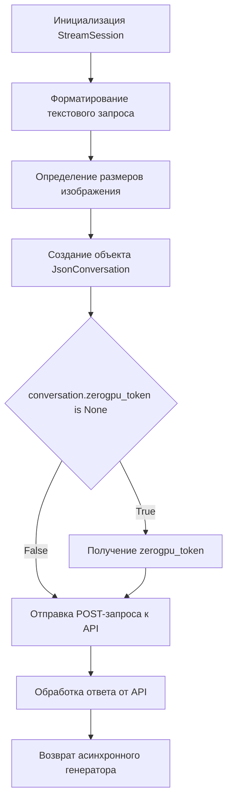

# Модуль BlackForestLabs_Flux1Dev

## Обзор

Модуль `BlackForestLabs_Flux1Dev` предоставляет асинхронный генератор для создания изображений с использованием модели BlackForestLabs Flux-1-Dev. Он взаимодействует с API Black Forest Labs через StreamSession, отправляет запросы и обрабатывает ответы для получения изображений.

## Подробней

Модуль предназначен для интеграции с другими частями проекта, где требуется генерация изображений на основе текстовых запросов. Он использует API Black Forest Labs для генерации изображений и предоставляет интерфейс для управления процессом генерации, включая выбор модели, задание параметров изображения и обработку промежуточных результатов.

## Классы

### `BlackForestLabs_Flux1Dev`

**Описание**: Класс `BlackForestLabs_Flux1Dev` является провайдером для генерации изображений с использованием модели BlackForestLabs Flux-1-Dev.

**Наследует**:
- `AsyncGeneratorProvider`: Обеспечивает асинхронную генерацию данных.
- `ProviderModelMixin`: Предоставляет общие методы для работы с моделями провайдера.

**Атрибуты**:
- `label` (str): Метка провайдера ("BlackForestLabs Flux-1-Dev").
- `url` (str): URL API Black Forest Labs ("https://black-forest-labs-flux-1-dev.hf.space").
- `space` (str): Пространство Hugging Face Space ("black-forest-labs/FLUX.1-dev").
- `referer` (str): Referer для HTTP-запросов (f"{url}/?__theme=light").
- `working` (bool): Указывает, работает ли провайдер (True).
- `default_model` (str): Модель по умолчанию ('black-forest-labs-flux-1-dev').
- `default_image_model` (str): Модель изображения по умолчанию (совпадает с `default_model`).
- `model_aliases` (dict): Алиасы моделей ({"flux-dev": default_image_model, "flux": default_image_model}).
- `image_models` (list): Список моделей изображений (из `model_aliases.keys()`).
- `models` (list): Список моделей (совпадает с `image_models`).

**Методы**:
- `run`: Отправляет HTTP-запросы к API Black Forest Labs.
- `create_async_generator`: Создает асинхронный генератор для генерации изображений.

### `run`

```python
@classmethod
def run(cls, method: str, session: StreamSession, conversation: JsonConversation, data: list = None):
    """
    Отправляет HTTP-запросы к API Black Forest Labs.

    Args:
        method (str): HTTP-метод ("post" или "get").
        session (StreamSession): Асинхровая сессия для отправки запросов.
        conversation (JsonConversation): Объект, содержащий информацию о сессии (zerogpu_token, zerogpu_uuid, session_hash).
        data (list, optional): Данные для отправки в теле запроса. По умолчанию None.

    Returns:
        StreamSession.response: Ответ от API.

    Raises:
        ResponseError: В случае ошибки при отправке запроса.

    Как работает функция:
    1. Формирует заголовки запроса, включая `accept`, `content-type`, `x-zerogpu-token`, `x-zerogpu-uuid` и `referer`.
    2. Если метод `post`, отправляет POST-запрос к API для присоединения к очереди.
    3. Если метод `get`, отправляет GET-запрос к API для получения данных о событии.
    """
    ...
```
**Как работает функция**:

```mermaid
graph TD
    A[Формирование заголовков HTTP-запроса] --> B{method == "post"};
    B -- True --> C[Отправка POST-запроса к API];
    B -- False --> D[Отправка GET-запроса к API];
    C --> E[Возврат ответа от API];
    D --> E;
```

**Примеры**:
```python
# Пример вызова функции run
# (Этот код не может быть выполнен, так как StreamSession и JsonConversation требуют реальной реализации)
# async with StreamSession(impersonate="chrome", proxy=proxy) as session:
#     conversation = JsonConversation(zerogpu_token=api_key, zerogpu_uuid=zerogpu_uuid, session_hash=uuid.uuid4().hex)
#     data = ["prompt", 0, True, 512, 512, 3.5, 28]
#     response = await BlackForestLabs_Flux1Dev.run("post", session, conversation, data)
```

### `create_async_generator`

```python
    @classmethod
    async def create_async_generator(
        cls, 
        model: str, 
        messages: Messages,
        prompt: str = None,
        proxy: str = None,
        aspect_ratio: str = "1:1",
        width: int = None,
        height: int = None,
        guidance_scale: float = 3.5,
        num_inference_steps: int = 28,
        seed: int = 0,
        randomize_seed: bool = True,
        cookies: dict = None,
        api_key: str = None,
        zerogpu_uuid: str = "[object Object]",
        **kwargs
    ) -> AsyncResult:
        """
        Создает асинхронный генератор для генерации изображений.

        Args:
            model (str): Модель для генерации изображений.
            messages (Messages): Список сообщений для формирования запроса.
            prompt (str, optional): Текстовый запрос. По умолчанию None.
            proxy (str, optional): Прокси-сервер. По умолчанию None.
            aspect_ratio (str, optional): Соотношение сторон изображения. По умолчанию "1:1".
            width (int, optional): Ширина изображения. По умолчанию None.
            height (int, optional): Высота изображения. По умолчанию None.
            guidance_scale (float, optional): Масштаб соответствия запросу. По умолчанию 3.5.
            num_inference_steps (int, optional): Количество шагов для генерации изображения. По умолчанию 28.
            seed (int, optional): Зерно для генерации случайных чисел. По умолчанию 0.
            randomize_seed (bool, optional): Флаг для рандомизации зерна. По умолчанию True.
            cookies (dict, optional): Cookies для HTTP-запросов. По умолчанию None.
            api_key (str, optional): API ключ. По умолчанию None.
            zerogpu_uuid (str, optional): UUID для zerogpu. По умолчанию "[object Object]".
            **kwargs: Дополнительные параметры.

        Returns:
            AsyncResult: Асинхронный генератор, возвращающий изображения.

        Raises:
            RuntimeError: Если не удается распарсить сообщение.
            ResponseError: При возникновении ошибки ответа от API.
        """
        ...
```

**Как работает функция**:



**Примеры**:

```python
# Пример вызова функции create_async_generator
# (Этот код не может быть выполнен, так как Messages требует реальной реализации)
# model = "black-forest-labs-flux-1-dev"
# messages = [{"role": "user", "content": "A cat"}]
# async for result in BlackForestLabs_Flux1Dev.create_async_generator(model=model, messages=messages):
#     print(result)