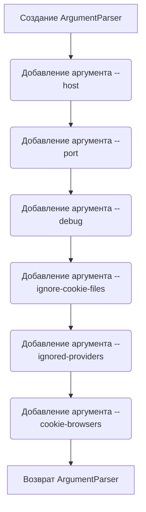

# Модуль для создания парсера аргументов командной строки для GUI
=============================================================

Модуль содержит функцию `gui_parser`, которая создает и настраивает парсер аргументов командной строки, используемый для запуска графического интерфейса (GUI).

## Обзор

Модуль `gui_parser` предоставляет функцию для создания парсера аргументов командной строки, который используется для настройки и запуска GUI приложения. Он определяет аргументы, такие как хост, порт, режим отладки, игнорирование файлов cookie и список игнорируемых провайдеров и браузеров для получения cookie.

## Подробней

Этот код используется для определения параметров командной строки, которые можно передать при запуске GUI. Это позволяет пользователям настраивать различные аспекты работы GUI, такие как адрес хоста, порт, включение режима отладки и управление файлами cookie. Файл содержит функцию `gui_parser`, которая настраивает `ArgumentParser` для обработки этих аргументов.

## Функции

### `gui_parser`

```python
def gui_parser() -> ArgumentParser:
    """Создает парсер аргументов командной строки для GUI.

    Returns:
        ArgumentParser: Объект парсера аргументов.
    """
```

**Назначение**: Создает и настраивает парсер аргументов командной строки для GUI.

**Возвращает**:

- `ArgumentParser`: Объект парсера аргументов, настроенный для обработки аргументов командной строки, специфичных для GUI.

**Как работает функция**:

1.  **Создание парсера**: Инициализируется объект `ArgumentParser` с описанием "Run the GUI".
2.  **Добавление аргументов**: Добавляются аргументы, такие как `--host`, `--port`, `--debug`, `--ignore-cookie-files`, `--ignored-providers` и `--cookie-browsers`.
3.  **Настройка аргументов**: Для каждого аргумента указывается тип, значение по умолчанию, помощь и возможные варианты выбора (например, для провайдеров и браузеров).
4.  **Возврат парсера**: Возвращается настроенный объект `ArgumentParser`.



**Примеры**:

```python
from argparse import ArgumentParser

# Пример вызова функции
parser = gui_parser()
# Разбор аргументов командной строки (в данном случае пустых)
args = parser.parse_args([])
print(args)
# > Namespace(host='0.0.0.0', port=8080, debug=False, ignore_cookie_files=False, ignored_providers=[], cookie_browsers=[])

# Пример вызова функции с аргументами
parser = gui_parser()
args = parser.parse_args(['--port', '9000', '--debug'])
print(args)
# > Namespace(host='0.0.0.0', port=9000, debug=True, ignore_cookie_files=False, ignored_providers=[], cookie_browsers=[])