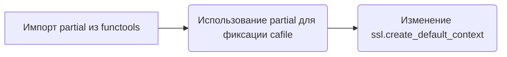
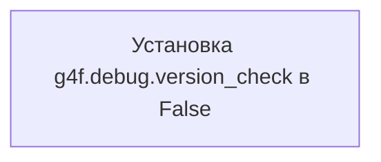

# Модуль инициализации GUI g4f

## Обзор

Данный модуль отвечает за инициализацию и запуск графического интерфейса (GUI) для проекта g4f. Он использует библиотеку `g4f` для настройки и запуска GUI с заданными аргументами.

## Подробнее

Модуль выполняет следующие основные функции:

1.  Настройка SSL для использования сертификатов `certifi`. Это необходимо для обеспечения безопасного соединения при работе с внешними ресурсами.
2.  Отключение проверки версии и установка версии для отладки `g4f`.
3.  Инициализация и запуск GUI с использованием аргументов командной строки.

## Функции

### `partial`

```python
from functools import partial
```

Модуль `functools` предоставляет функцию `partial`, которая используется для создания частичной функции. В данном коде `partial` применяется для фиксации аргумента `cafile=certifi.where()` при создании SSL-контекста по умолчанию.

**Как работает функция**:

1.  Импортируется `partial` из модуля `functools`.
2.  Функция `ssl.create_default_context` изменяется так, чтобы всегда использовать сертификаты из `certifi.where()`.



### `ssl.default_ca_certs`

```python
ssl.default_ca_certs = certifi.where()
```

**Назначение**: Устанавливает путь к сертификатам CA по умолчанию, используя `certifi`.

**Как работает**:

1.  Вызывается `certifi.where()` для получения пути к файлу с сертификатами.
2.  Путь к файлу устанавливается как `ssl.default_ca_certs`.

```mermaid
graph LR
A[Вызов certifi.where()] --> B(Получение пути к сертификатам);
B --> C(Установка ssl.default_ca_certs);
```

### `ssl.create_default_context`

```python
ssl.create_default_context = partial(
    ssl.create_default_context,
    cafile=certifi.where()
)
```

**Назначение**: Переопределяет функцию `ssl.create_default_context` так, чтобы она всегда использовала сертификаты из `certifi`.

**Параметры**:

-   `ssl.create_default_context`: Исходная функция для создания SSL-контекста.
-   `cafile`: Путь к файлу с сертификатами CA, полученный из `certifi.where()`.

**Как работает**:

1.  Вызывается `certifi.where()` для получения пути к файлу с сертификатами.
2.  Функция `ssl.create_default_context` изменяется с использованием `partial`, чтобы всегда использовать сертификаты из `certifi`.

```mermaid
graph LR
A[Вызов certifi.where()] --> B(Получение пути к сертификатам);
B --> C(Использование partial для изменения ssl.create_default_context);
```

### `g4f.debug.version_check`

```python
g4f.debug.version_check = False
```

**Назначение**: Отключает проверку версии для отладки.

**Как работает**:

1.  Устанавливается значение `False` для `g4f.debug.version_check`.



### `g4f.debug.version`

```python
g4f.debug.version = "0.3.1.7"
```

**Назначение**: Устанавливает конкретную версию для отладки.

**Как работает**:

1.  Устанавливается значение `"0.3.1.7"` для `g4f.debug.version`.

```mermaid
graph LR
A[Установка g4f.debug.version в "0.3.1.7"];
```

### `gui_parser`

```python
parser = gui_parser()
```

**Назначение**: Создает парсер аргументов командной строки для GUI.

**Как работает**:

1.  Вызывается функция `gui_parser()` для создания экземпляра парсера.

```mermaid
graph LR
A[Вызов gui_parser()] --> B(Создание парсера аргументов командной строки);
```

### `parser.parse_args`

```python
args = parser.parse_args()
```

**Назначение**: Обрабатывает аргументы командной строки.

**Как работает**:

1.  Вызывается метод `parse_args()` парсера для обработки аргументов командной строки и сохранения их в переменной `args`.

```mermaid
graph LR
A[Вызов parser.parse_args()] --> B(Обработка аргументов командной строки);
B --> C(Сохранение аргументов в переменной args);
```

### `run_gui_args`

```python
run_gui_args(args)
```

**Назначение**: Запускает GUI с заданными аргументами.

**Параметры**:

-   `args`: Аргументы командной строки, полученные с помощью `parser.parse_args()`.

**Как работает**:

1.  Вызывается функция `run_gui_args()` с аргументами командной строки для запуска GUI.

```mermaid
graph LR
A[Вызов run_gui_args(args)] --> B(Запуск GUI с заданными аргументами);
```

## Пример использования

```python
import ssl
import certifi
from functools import partial

ssl.default_ca_certs = certifi.where()
ssl.create_default_context = partial(
    ssl.create_default_context,
    cafile=certifi.where()
)

from g4f.gui.run import run_gui_args, gui_parser
import g4f.debug
g4f.debug.version_check = False
g4f.debug.version = "0.3.1.7"

if __name__ == "__main__":
    parser = gui_parser()
    args = parser.parse_args()
    run_gui_args(args)