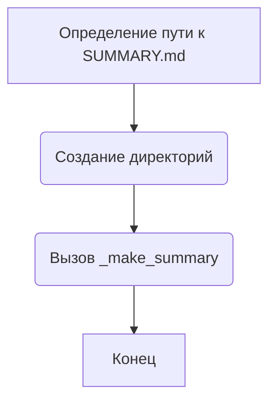
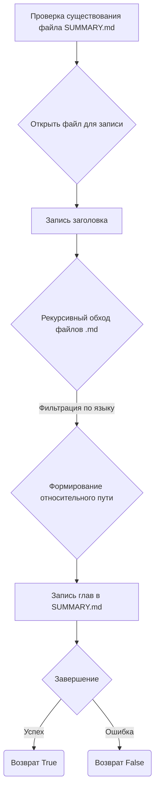
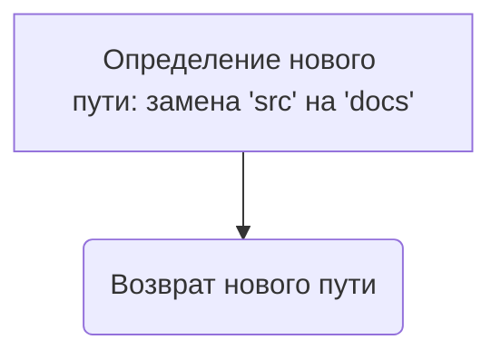

# Модуль для создания файла `SUMMARY.md`

## Обзор

Модуль `src.endpoints.hypo69.code_assistant.make_summary` предназначен для автоматического создания файла `SUMMARY.md`, используемого для навигации и структурирования документации, генерируемой с помощью `mdbook`. Он рекурсивно обходит указанную директорию (`src`), фильтрует файлы по языку (русский или английский) и генерирует структуру оглавления в формате Markdown.

## Подробней

Модуль позволяет автоматизировать процесс создания оглавления для документации, что особенно полезно при работе с большими проектами, где необходимо поддерживать актуальную структуру. Он также предоставляет возможность фильтрации файлов по языку, что позволяет создавать отдельные версии документации для разных языковых аудиторий.

## Функции

### `make_summary`

```python
def make_summary(docs_dir: Path, lang: str = 'en') -> None:
    """
    Создает файл SUMMARY.md, рекурсивно обходя папку.

    Args:
        docs_dir (Path): Путь к исходной директории 'src'.
        lang (str): Язык фильтрации файлов. Возможные значения: 'ru' или 'en'.
    """
    ...
```

**Назначение**: Создает файл `SUMMARY.md` в указанной директории, рекурсивно обходя ее содержимое.

**Параметры**:

-   `docs_dir` (Path): Путь к исходной директории `'src'`.
-   `lang` (str): Язык фильтрации файлов. Допустимые значения: `'ru'` (русский) или `'en'` (английский). По умолчанию `'en'`.

**Возвращает**:

-   `None`: Функция ничего не возвращает.

**Как работает функция**:

1.  Определяет путь к файлу `SUMMARY.md` с помощью функции `prepare_summary_path`.
2.  Создает родительские директории для файла `SUMMARY.md`, если они не существуют.
3.  Вызывает функцию `_make_summary` для рекурсивного обхода директории и создания содержимого файла `SUMMARY.md`.



**Примеры**:

```python
from pathlib import Path
from src.endpoints.hypo69.code_assistant.make_summary import make_summary

# Пример вызова функции для создания SUMMARY.md в директории 'src' на английском языке
docs_dir = Path('./src')
make_summary(docs_dir, lang='en')

# Пример вызова функции для создания SUMMARY.md в директории 'src' на русском языке
make_summary(docs_dir, lang='ru')
```

### `_make_summary`

```python
def _make_summary(src_dir: Path, summary_file: Path, lang: str = 'en') -> bool:
    """
    Рекурсивно обходит папку и создает файл SUMMARY.md с главами на основе .md файлов.

    Args:
        src_dir (Path): Путь к папке с исходниками .md.
        summary_file (Path): Путь для сохранения файла SUMMARY.md.
        lang (str): Язык фильтрации файлов. Возможные значения: 'ru' или 'en'.
    """
    ...
```

**Назначение**: Рекурсивно обходит указанную директорию и создает файл `SUMMARY.md` с перечислением глав на основе найденных `.md` файлов.

**Параметры**:

-   `src_dir` (Path): Путь к папке с исходными файлами `.md`.
-   `summary_file` (Path): Путь к файлу `SUMMARY.md`, в который будет сохранено оглавление.
-   `lang` (str): Язык фильтрации файлов. Допустимые значения: `'ru'` (русский) или `'en'` (английский). По умолчанию `'en'`.

**Возвращает**:

-   `bool`: `True`, если файл `SUMMARY.md` был успешно создан или перезаписан, `False` в случае ошибки.

**Как работает функция**:

1.  Проверяет, существует ли файл `SUMMARY.md`, и выводит сообщение, если он будет перезаписан.
2.  Открывает файл `SUMMARY.md` для записи в кодировке UTF-8.
3.  Записывает заголовок `# Summary\n\n` в файл.
4.  Рекурсивно обходит все `.md` файлы в указанной директории.
5.  Фильтрует файлы по языку в соответствии с параметром `lang`.
6.  Формирует относительный путь к каждому файлу относительно родительской директории `src_dir`.
7.  Записывает строку в формате Markdown для каждой главы в файл `SUMMARY.md`.
8.  Возвращает `True` в случае успешного завершения или `False` в случае ошибки.



**Примеры**:

```python
from pathlib import Path
from src.endpoints.hypo69.code_assistant.make_summary import _make_summary

# Пример вызова функции для создания SUMMARY.md в директории 'src' на английском языке
src_dir = Path('./src')
summary_file = Path('./docs/SUMMARY.md')
_make_summary(src_dir, summary_file, lang='en')

# Пример вызова функции для создания SUMMARY.md в директории 'src' на русском языке
_make_summary(src_dir, summary_file, lang='ru')
```

### `prepare_summary_path`

```python
def prepare_summary_path(src_dir: Path, file_name: str = 'SUMMARY.md') -> Path:
    """
    Формирует путь к файлу, заменяя часть пути 'src' на 'docs' и добавляя имя файла.

    Args:
        src_dir (Path): Исходный путь с 'src'.
        file_name (str): Имя файла, который нужно создать. По умолчанию 'SUMMARY.md'.

    Returns:
        Path: Новый путь к файлу.
    """
    ...
```

**Назначение**: Формирует путь к файлу `SUMMARY.md`, заменяя часть пути `'src'` на `'docs'` и добавляя имя файла.

**Параметры**:

-   `src_dir` (Path): Исходный путь к директории `'src'`.
-   `file_name` (str): Имя файла, который нужно создать. По умолчанию `'SUMMARY.md'`.

**Возвращает**:

-   `Path`: Новый путь к файлу `SUMMARY.md`.

**Как работает функция**:

1.  Определяет новый путь к файлу, заменяя часть пути `'src'` на `'docs'` и добавляя имя файла.



**Примеры**:

```python
from pathlib import Path
from src.endpoints.hypo69.code_assistant.make_summary import prepare_summary_path

# Пример вызова функции для формирования пути к SUMMARY.md
src_dir = Path('./src')
summary_file = prepare_summary_path(src_dir)
print(summary_file)  # Вывод: ./docs/SUMMARY.md

# Пример вызова функции для формирования пути к другому файлу
other_file = prepare_summary_path(src_dir, file_name='главы.md')
print(other_file)  # Вывод: ./docs/главы.md