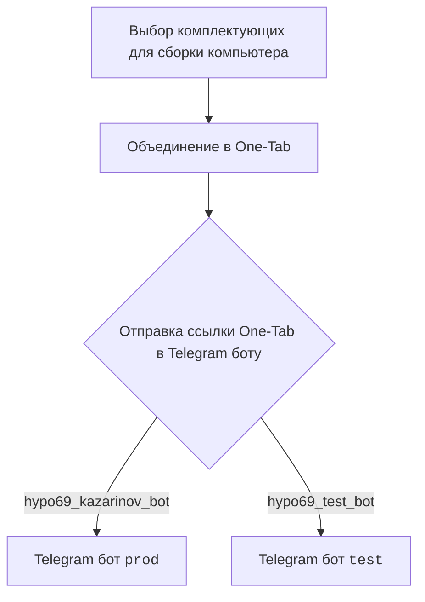
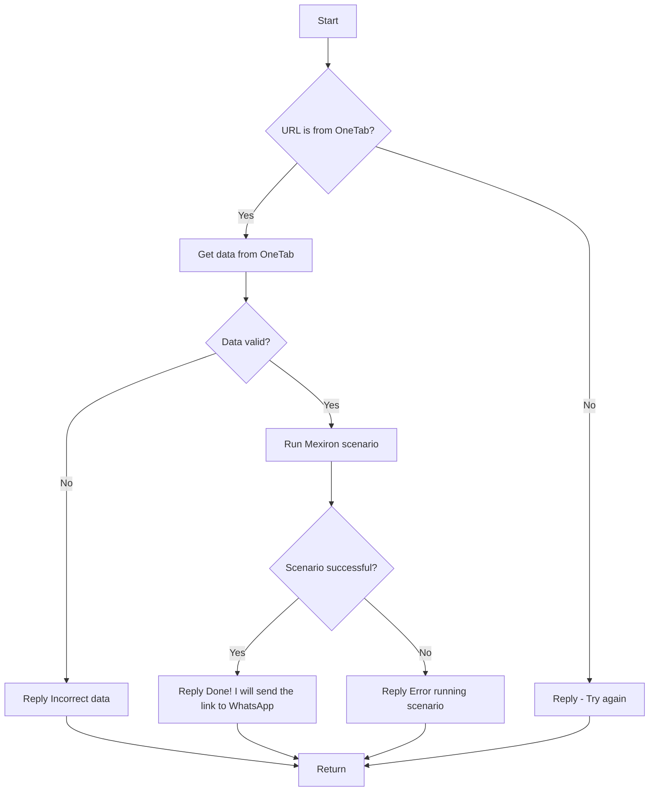

# Документация для модуля `src.endpoints.kazarinov`

## Обзор

Документация описывает создание прайслиста для Казаринова, включая диаграммы взаимодействия и описание основных компонентов.

## Подробнее

Этот раздел описывает общую структуру и компоненты, участвующие в процессе создания прайслиста для Казаринова. Включает ссылки на внешние ресурсы и диаграммы, иллюстрирующие взаимодействие между клиентом и ботом.

## Разделы

- [KazarinovTelegramBot](#kazarinovtelegrambot)
- [BotHandler](#bothandler)
- [Схема взаимодействия](#схема-взаимодействия)
- [Схема обработки сообщений](#схема-обработки-сообщений)
- [Далее](#далее)

## KazarinovTelegramBot

Список ресурсов, используемых для создания комплектующих для сборки компьютера:

- https://one-tab.co.il
- https://morlevi.co.il
- https://grandavance.co.il
- https://ivory.co.il
- https://ksp.co.il

## BotHandler

Описание обработки взаимодействий с ботом.

## Схема взаимодействия

### На стороне клиента

Эта диаграмма показывает процесс взаимодействия на стороне клиента, начиная с выбора комплектующих, объединения их в One-Tab, и отправки ссылки в Telegram бот (`prod` или `test`).

### На стороне кода

- `kazarinov_bot.handle_message()` -> `kazarinov.scenarios.run_scenario()`:

Эта диаграмма описывает логику обработки сообщений на стороне кода, начиная с проверки URL, получения данных из One-Tab, проверки данных, запуска сценария Mexiron и отправки ответа.

## Далее

Ссылки на связанные документы:

- [Казаринов бот](https://github.com/hypo69/hypotez/blob/master/src/endpoints/kazarinov/kazarinov_bot.ru.md)
- [Исполнение сценария](https://github.com/hypo69/hypotez/blob/master/src/endpoints/kazarinov/scenarios/readme.ru.md)