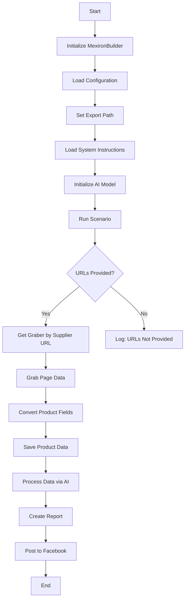

# Модуль для автоматизации создания "мехирона"

## Обзор

Этот скрипт является частью каталога `hypotez/src/endpoints/kazarinov/scenarios` и предназначен для автоматизации процесса создания "мехирона" для Сергея Казаринова. Скрипт извлекает, разбирает и обрабатывает данные о продуктах от различных поставщиков, подготавливает данные, обрабатывает их с помощью ИИ и интегрируется с Facebook для публикации продуктов.

## Подробней

Этот скрипт автоматизирует процесс создания "мехирона", извлекая и обрабатывая данные о продуктах от различных поставщиков, используя AI для обработки данных и публикуя их на Facebook.

## Основные возможности

1.  **Извлечение и разбор данных**: Извлекает и разбирает данные о продуктах от различных поставщиков.
2.  **Обработка данных ИИ**: Обрабатывает извлеченные данные с помощью модели Google Generative AI.
3.  **Хранение данных**: Сохраняет обработанные данные в файлы.
4.  **Генерация отчетов**: Генерирует отчеты HTML и PDF на основе обработанных данных.
5.  **Публикация в Facebook**: Публикует обработанные данные в Facebook.

## Блок-схема модуля



## Легенда

1.  **Start**: Начало выполнения скрипта.
2.  **InitMexironBuilder**: Инициализация класса `MexironBuilder`.
3.  **LoadConfig**: Загружает конфигурацию из JSON-файла.
4.  **SetExportPath**: Устанавливает путь для экспорта данных.
5.  **LoadSystemInstruction**: Загружает системные инструкции для модели ИИ.
6.  **InitModel**: Инициализирует модель Google Generative AI.
7.  **RunScenario**: Выполняет основной сценарий.
8.  **CheckURLs**: Проверяет, предоставлены ли URL-адреса для разбора.
9.  **GetGraber**: Получает соответствующий грабер для URL-адреса поставщика.
10. **GrabPage**: Извлекает данные страницы с помощью грабера.
11. **ConvertFields**: Преобразует поля продукта в словарь.
12. **SaveData**: Сохраняет данные продукта в файл.
13. **ProcessAI**: Обрабатывает данные продукта с помощью модели ИИ.
14. **CreateReport**: Создает отчеты HTML и PDF на основе обработанных данных.
15. **PostFacebook**: Публикует обработанные данные в Facebook.
16. **End**: Завершение выполнения скрипта.

## Классы

### `MexironBuilder`

**Описание**: Класс для создания "мехирона", который автоматизирует процесс извлечения, обработки и публикации данных о продуктах.

**Принцип работы**:
Класс `MexironBuilder` предназначен для автоматизации процесса создания "мехирона". Он выполняет следующие шаги:

1.  **Инициализация**: Инициализируется драйвером Selenium, именем мехирона и другими необходимыми параметрами.
2.  **Загрузка конфигурации**: Загружает конфигурацию из JSON-файла, содержащую настройки для работы скрипта.
3.  **Запуск сценария**: Запускает основной сценарий, который включает в себя:
    *   Извлечение данных о продуктах из предоставленных URL-адресов.
    *   Обработку данных с помощью AI-модели Google Gemini.
    *   Сохранение обработанных данных в файлы.
    *   Генерацию HTML и PDF отчетов на основе данных.
    *   Публикацию данных в Facebook.
4.  **Обработка ошибок**: Включает обработку ошибок на каждом этапе, чтобы обеспечить непрерывное выполнение скрипта даже при возникновении проблем.
5.  **Логирование**: Логирует все важные события и ошибки для отслеживания и анализа работы скрипта.

**Аттрибуты**:

*   `driver`: Экземпляр Selenium WebDriver.
*   `export_path`: Путь для экспорта данных.
*   `mexiron_name`: Пользовательское имя для процесса "мехирон".
*   `price`: Цена для обработки.
*   `timestamp`: Временная метка для процесса.
*   `products_list`: Список обработанных данных о продуктах.
*   `model`: Модель Google Generative AI.
*   `config`: Конфигурация, загруженная из JSON.

**Методы**:

*   `__init__(self, driver: Driver, mexiron_name: Optional[str] = None)`:
    *   **Назначение**: Инициализирует класс `MexironBuilder` с необходимыми компонентами.
    *   **Параметры**:
        *   `driver` (Driver): Экземпляр Selenium WebDriver.
        *   `mexiron_name` (Optional[str], optional): Пользовательское имя для процесса "мехирон". По умолчанию `None`.

*   `run_scenario(self, system_instruction: Optional[str] = None, price: Optional[str] = None, mexiron_name: Optional[str] = None, urls: Optional[str | List[str]] = None, bot = None) -> bool`:
    *   **Назначение**: Выполняет сценарий: разбирает продукты, обрабатывает их через AI и сохраняет данные.
    *   **Параметры**:
        *   `system_instruction` (Optional[str], optional): Системные инструкции для модели AI. По умолчанию `None`.
        *   `price` (Optional[str], optional): Цена для обработки. По умолчанию `None`.
        *   `mexiron_name` (Optional[str], optional): Пользовательское имя "мехирона". По умолчанию `None`.
        *   `urls` (Optional[str | List[str]], optional): URL-адреса страниц продуктов. По умолчанию `None`.
        *   `bot`: Объект бота (тип не указан).
    *   **Возвращает**:
        *   `bool`: `True`, если сценарий выполнен успешно, иначе `False`.

    *   **Как работает функция**:

        1.  Проверяет, является ли URL-адрес OneTab. Если да, извлекает данные из OneTab. В противном случае возвращает сообщение с просьбой повторить попытку.
        2.  Проверяет валидность данных. Если данные невалидны, возвращает сообщение об ошибке.
        3.  Инициализирует сценарий Mexiron.
        4.  Ищет граббер для URL-адреса поставщика. Если граббер найден, начинает разбор данных страницы.
        5.  Преобразует поля продукта в нужный формат.
        6.  Сохраняет данные продукта в файл.
        7.  Обрабатывает данные с помощью AI для языков `he` (иврит) и `ru` (русский).
        8.  Сохраняет результаты обработки в формате JSON для каждого языка.
        9.  Генерирует HTML и PDF отчеты для каждого языка.
        10. Отправляет PDF-файлы через Telegram.

    *   **Блок-схема**:

        ```mermaid
        flowchart TD
        Start[Start] --> IsOneTab{URL is from OneTab?}
        IsOneTab -->|Yes| GetDataFromOneTab[Get data from OneTab]
        IsOneTab -->|No| ReplyTryAgain[Reply - Try again]
        GetDataFromOneTab --> IsDataValid{Data valid?}
        IsDataValid -->|No| ReplyIncorrectData[Reply Incorrect data]
        IsDataValid -->|Yes| RunMexironScenario[Run Mexiron scenario]
        RunMexironScenario --> IsGraberFound{Graber found?}
        IsGraberFound -->|Yes| StartParsing[Start parsing: <code>url</code>]
        IsGraberFound -->|No| LogNoGraber[Log: No graber for <code>url</code>]
        StartParsing --> IsParsingSuccessful{Parsing successful?}
        IsParsingSuccessful -->|Yes| ConvertProductFields[Convert product fields]
        IsParsingSuccessful -->|No| LogParsingFailed[Log: Failed to parse product fields]
        ConvertProductFields --> IsConversionSuccessful{Conversion successful?}
        IsConversionSuccessful -->|Yes| SaveProductData[Save product data]
        IsConversionSuccessful -->|No| LogConversionFailed[Log: Failed to convert product fields]
        SaveProductData --> IsDataSaved{Data saved?}
        IsDataSaved -->|Yes| AppendToProductsList[Append to products_list]
        IsDataSaved -->|No| LogDataNotSaved[Log: Data not saved]
        AppendToProductsList --> ProcessAIHe[AI processing lang = he]
        ProcessAIHe --> ProcessAIRu[AI processing lang = ru]
        ProcessAIRu --> SaveHeJSON{Save JSON for he?}
        SaveHeJSON -->|Yes| SaveRuJSON[Save JSON for ru]
        SaveHeJSON -->|No| LogHeJSONError[Log: Error saving he JSON]
        SaveRuJSON --> IsRuJSONSaved{Save JSON for ru?}
        IsRuJSONSaved -->|Yes| GenerateReports[Generate reports]
        IsRuJSONSaved -->|No| LogRuJSONError[Log: Error saving ru JSON]
        GenerateReports --> IsReportGenerationSuccessful{Report generation successful?}
        IsReportGenerationSuccessful -->|Yes| SendPDF[Send PDF via Telegram]
        IsReportGenerationSuccessful -->|No| LogPDFError[Log: Error creating PDF]
        SendPDF --> ReturnTrue[Return True]
        LogPDFError --> ReturnTrue[Return True]
        ReplyIncorrectData --> ReturnTrue[Return True]
        ReplyTryAgain --> ReturnTrue[Return True]
        LogNoGraber --> ReturnTrue[Return True]
        LogParsingFailed --> ReturnTrue[Return True]
        LogConversionFailed --> ReturnTrue[Return True]
        LogDataNotSaved --> ReturnTrue[Return True]
        LogHeJSONError --> ReturnTrue[Return True]
        LogRuJSONError --> ReturnTrue[Return True]
        ```

        **Легенда**:

        1.  **Start**: Начало выполнения сценария.

        2.  **URL Source Check (IsOneTab)**:

            *   Если URL-адрес из OneTab, данные извлекаются из OneTab.
            *   Если URL-адрес не из OneTab, пользователю отправляется сообщение "Попробуйте снова".

        3.  **Data Validity Check (IsDataValid)**:

            *   Если данные недействительны, пользователю отправляется сообщение "Неверные данные".
            *   Если данные действительны, инициируется сценарий Mexiron.

        4.  **Grabber Search (IsGraberFound)**:

            *   Если граббер найден, начинается разбор страницы.
            *   Если граббер не найден, генерируется сообщение журнала, указывающее, что для данного URL-адреса нет граббера.

        5.  **Page Parsing (StartParsing)**:

            *   Если разбор выполнен успешно, данные преобразуются в требуемый формат.
            *   Если разбор не удался, регистрируется ошибка.

        6.  **Data Conversion (ConvertProductFields)**:

            *   Если преобразование выполнено успешно, данные сохраняются.
            *   Если преобразование не удалось, регистрируется ошибка.

        7.  **Data Saving (SaveProductData)**:

            *   Если данные сохранены, они добавляются в список продуктов.
            *   Если данные не сохранены, регистрируется ошибка.

        8.  **AI Processing (ProcessAIHe, ProcessAIRu)**:

            *   Данные обрабатываются AI для языков `he` (иврит) и `ru` (русский).

        9.  **JSON Saving (SaveHeJSON, SaveRuJSON)**:

            *   Результаты обработки сохраняются в формате JSON для каждого языка.
            *   Если сохранение не удалось, регистрируется ошибка.

        10. **Report Generation (GenerateReports)**:

            *   HTML и PDF отчеты создаются для каждого языка.
            *   Если создание отчета не удалось, регистрируется ошибка.

        11. **PDF Sending via Telegram (SendPDF)**:

            *   PDF-файлы отправляются через Telegram.
            *   Если отправка не удалась, регистрируется ошибка.

        12. **Completion (ReturnTrue)**:

            *   Сценарий завершается возвратом `True`.

    *   **Примеры**:

        ```python
        from src.webdriver.driver import Driver
        from src.endpoints.kazarinov.scenarios.scenario_pricelist import MexironBuilder

        # Инициализация драйвера
        driver = Driver(Chrome)

        # Инициализация MexironBuilder
        mexiron_builder = MexironBuilder(driver)

        # Запуск сценария
        urls = ['https://example.com/product1', 'https://example.com/product2']
        mexiron_builder.run_scenario(urls=urls)
        ```

*   `get_graber_by_supplier_url(self, url: str)`:
    *   **Назначение**: Возвращает соответствующий грабер для заданного URL-адреса поставщика.
    *   **Параметры**:
        *   `url` (str): URL-адрес страницы поставщика.
    *   **Возвращает**:
        *   Граббер (тип не указан): Экземпляр грабера, если найден, иначе `None`.

*   `convert_product_fields(self, f: ProductFields) -> dict`:
    *   **Назначение**: Преобразует поля продукта в словарь.
    *   **Параметры**:
        *   `f` (ProductFields): Объект, содержащий разобранные данные продукта.
    *   **Возвращает**:
        *   `dict`: Отформатированный словарь данных продукта.

*   `save_product_data(self, product_data: dict)`:
    *   **Назначение**: Сохраняет данные продукта в файл.
    *   **Параметры**:
        *   `product_data` (dict): Отформатированные данные продукта.

*   `process_ai(self, products_list: List[str], lang: str, attempts: int = 3) -> tuple | bool`:
    *   **Назначение**: Обрабатывает список продуктов через модель AI.
    *   **Параметры**:
        *   `products_list` (List[str]): Список словарей данных продукта в виде строк.
        *   `lang` (str): Язык для обработки (`ru` или `he`).
        *   `attempts` (int): Количество попыток повтора в случае сбоя. По умолчанию 3.
    *   **Возвращает**:
        *   `tuple | bool`: Обработанный ответ в форматах `ru` и `he` или `False` в случае неудачи.

*   `post_facebook(self, mexiron: SimpleNamespace) -> bool`:
    *   **Назначение**: Выполняет сценарий публикации в Facebook.
    *   **Параметры**:
        *   `mexiron` (SimpleNamespace): Обработанные данные для публикации.
    *   **Возвращает**:
        *   `bool`: `True`, если публикация выполнена успешно, иначе `False`.

*   `create_report(self, data: dict, html_file: Path, pdf_file: Path)`:
    *   **Назначение**: Генерирует отчеты HTML и PDF на основе обработанных данных.
    *   **Параметры**:
        *   `data` (dict): Обработанные данные.
        *   `html_file` (Path): Путь для сохранения HTML-отчета.
        *   `pdf_file` (Path): Путь для сохранения PDF-отчета.

## Использование

Для использования этого скрипта выполните следующие действия:

1.  **Инициализация драйвера**: Создайте экземпляр класса `Driver`.
2.  **Инициализация MexironBuilder**: Создайте экземпляр класса `MexironBuilder` с драйвером.
3.  **Запуск сценария**: Вызовите метод `run_scenario` с необходимыми параметрами.

## Зависимости

*   `selenium`: Для автоматизации веб-интерфейса.
*   `asyncio`: Для асинхронных операций.
*   `pathlib`: Для работы с путями к файлам.
*   `types`: Для создания простых пространств имен.
*   `typing`: Для аннотаций типов.
*   `src.ai.gemini`: Для обработки данных AI.
*   `src.suppliers.*.graber`: Для извлечения данных от различных поставщиков.
*   `src.endpoints.advertisement.facebook.scenarios`: Для публикации в Facebook.

## Обработка ошибок

Скрипт включает надежную обработку ошибок для обеспечения непрерывного выполнения, даже если некоторые элементы не найдены или возникли проблемы с веб-страницей. Это особенно полезно для работы с динамическими или нестабильными веб-страницами.

## Вклад

Вклад в этот скрипт приветствуется. Убедитесь, что любые изменения хорошо документированы и включают соответствующие тесты.

## Лицензия

Этот скрипт лицензирован в соответствии с лицензией MIT. Подробности см. В файле `LICENSE`.