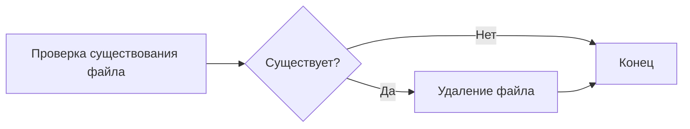
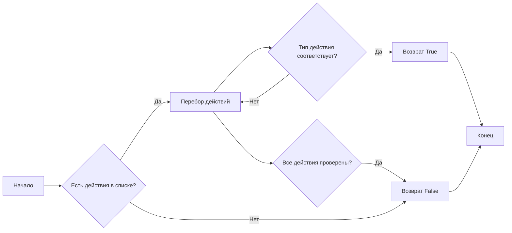
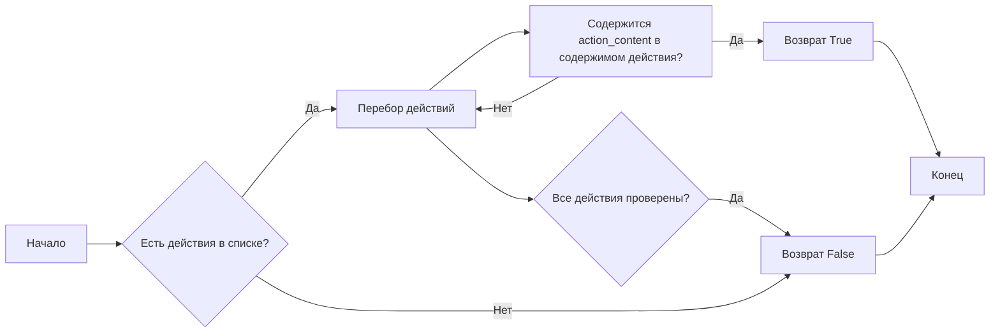
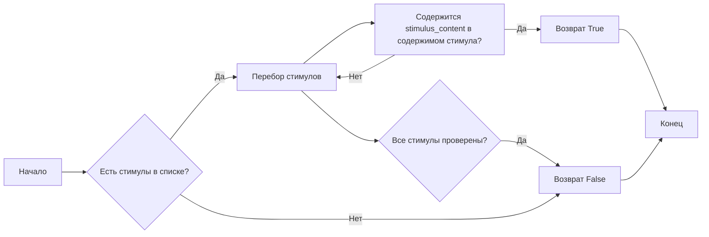
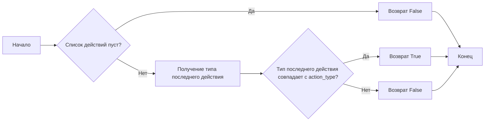
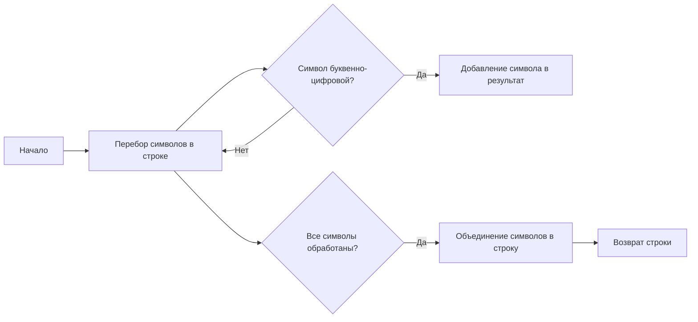
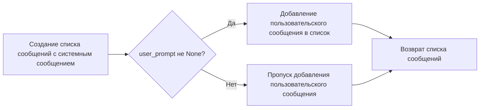

# Модуль `testing_utils`

## Обзор

Модуль `testing_utils` предоставляет набор утилитных функций и фикстур, используемых для облегчения тестирования в проекте `hypotez`. Он включает в себя функции для работы с файловой системой, проверки поведения симуляций, а также вспомогательные функции для работы с агентами и окружением `tinytroupe`.

## Подробней

Этот модуль содержит функции для кэширования результатов API, управления файлами, проверки действий и стимулов в симуляциях, а также для сравнения агентов. Он также предоставляет фикстуры pytest для настройки тестового окружения, такие как `focus_group_world` и `setup`. Эти утилиты помогают упростить и стандартизировать процессы тестирования, делая тесты более читаемыми и поддерживаемыми.
## Функции

### `remove_file_if_exists`

```python
def remove_file_if_exists(file_path: str) -> None:
    """
    Удаляет файл по указанному пути, если он существует.

    Args:
        file_path (str): Путь к файлу, который необходимо удалить.

    Returns:
        None

    Raises:
        OSError: Если возникла ошибка при удалении файла.
    """
    ...
```

**Как работает функция**:

1.  **Проверка существования файла**: Функция проверяет, существует ли файл по указанному пути `file_path` с использованием `os.path.exists(file_path)`.
2.  **Удаление файла**: Если файл существует, функция удаляет его с помощью `os.remove(file_path)`.



**Примеры**:

```python
remove_file_if_exists('temp.txt')
```

### `contains_action_type`

```python
def contains_action_type(actions: list, action_type: str) -> bool:
    """
    Проверяет, содержит ли заданный список действий действие указанного типа.

    Args:
        actions (list): Список действий, которые необходимо проверить.
        action_type (str): Тип действия, которое нужно найти.

    Returns:
        bool: `True`, если список содержит действие указанного типа, иначе `False`.
    """
    ...
```

**Как работает функция**:

1.  **Итерация по списку действий**: Функция перебирает каждое действие в списке `actions`.
2.  **Проверка типа действия**: Для каждого действия проверяется, совпадает ли его тип (`action["action"]["type"]`) с заданным типом `action_type`.
3.  **Возврат результата**: Если найдено действие с соответствующим типом, функция возвращает `True`. Если после проверки всех действий совпадений не обнаружено, функция возвращает `False`.



**Примеры**:

```python
actions = [{"action": {"type": "move", "content": "..."}}, {"action": {"type": "eat", "content": "..."}}]
contains_action_type(actions, "eat")  # Возвращает True
```

### `contains_action_content`

```python
def contains_action_content(actions: list, action_content: str) -> bool:
    """
    Проверяет, содержит ли заданный список действий действие с указанным содержимым.

    Args:
        actions (list): Список действий для проверки.
        action_content (str): Содержимое, которое нужно найти в действиях.

    Returns:
        bool: `True`, если список содержит действие с указанным содержимым, иначе `False`.
    """
    ...
```

**Как работает функция**:

1.  **Итерация по списку действий**: Функция перебирает каждое действие в списке `actions`.
2.  **Проверка содержимого действия**: Для каждого действия проверяется, содержится ли `action_content` (приведённое к нижнему регистру) в содержимом действия (`action["action"]["content"]`, также приведённом к нижнему регистру).
3.  **Возврат результата**: Если найдено действие с соответствующим содержимым, функция возвращает `True`. Если после проверки всех действий совпадений не обнаружено, функция возвращает `False`.



**Примеры**:

```python
actions = [{"action": {"type": "move", "content": "Go to the forest"}}, {"action": {"type": "eat", "content": "Eat an apple"}}]
contains_action_content(actions, "forest")  # Возвращает True
```

### `contains_stimulus_type`

```python
def contains_stimulus_type(stimuli: list, stimulus_type: str) -> bool:
    """
    Проверяет, содержит ли заданный список стимулов стимул указанного типа.

    Args:
        stimuli (list): Список стимулов для проверки.
        stimulus_type (str): Тип стимула, который нужно найти.

    Returns:
        bool: `True`, если список содержит стимул указанного типа, иначе `False`.
    """
    ...
```

**Как работает функция**:

1.  **Итерация по списку стимулов**: Функция перебирает каждый стимул в списке `stimuli`.
2.  **Проверка типа стимула**: Для каждого стимула проверяется, совпадает ли его тип (`stimulus["type"]`) с заданным типом `stimulus_type`.
3.  **Возврат результата**: Если найден стимул с соответствующим типом, функция возвращает `True`. Если после проверки всех стимулов совпадений не обнаружено, функция возвращает `False`.


**Примеры**:

```python
stimuli = [{"type": "sound", "content": "..."}}, {"type": "vision", "content": "..."}}]
contains_stimulus_type(stimuli, "vision")  # Возвращает True
```

### `contains_stimulus_content`

```python
def contains_stimulus_content(stimuli: list, stimulus_content: str) -> bool:
    """
    Проверяет, содержит ли заданный список стимулов стимул с указанным содержимым.

    Args:
        stimuli (list): Список стимулов для проверки.
        stimulus_content (str): Содержимое, которое нужно найти в стимулах.

    Returns:
        bool: `True`, если список содержит стимул с указанным содержимым, иначе `False`.
    """
    ...
```

**Как работает функция**:

1.  **Итерация по списку стимулов**: Функция перебирает каждый стимул в списке `stimuli`.
2.  **Проверка содержимого стимула**: Для каждого стимула проверяется, содержится ли `stimulus_content` (приведённое к нижнему регистру) в содержимом стимула (`stimulus["content"]`, также приведённом к нижнему регистру).
3.  **Возврат результата**: Если найден стимул с соответствующим содержимым, функция возвращает `True`. Если после проверки всех стимулов совпадений не обнаружено, функция возвращает `False`.



**Примеры**:

```python
stimuli = [{"type": "sound", "content": "Loud noise"}}, {"type": "vision", "content": "Bright light"}}]
contains_stimulus_content(stimuli, "noise")  # Возвращает True
```

### `terminates_with_action_type`

```python
def terminates_with_action_type(actions: list, action_type: str) -> bool:
    """
    Проверяет, завершается ли заданный список действий действием указанного типа.

    Args:
        actions (list): Список действий для проверки.
        action_type (str): Тип действия, которым должен завершаться список.

    Returns:
        bool: `True`, если список завершается действием указанного типа, иначе `False`.
    """
    ...
```

**Как работает функция**:

1.  **Проверка длины списка**: Функция сначала проверяет, не пуст ли список `actions`. Если список пуст, функция возвращает `False`.
2.  **Проверка последнего действия**: Если список не пуст, функция проверяет, совпадает ли тип последнего действия в списке (`actions[-1]["action"]["type"]`) с заданным типом `action_type`.
3.  **Возврат результата**: Функция возвращает `True`, если тип последнего действия совпадает с `action_type`, и `False` в противном случае.



**Примеры**:

```python
actions = [{"action": {"type": "move", "content": "..."}}, {"action": {"type": "eat", "content": "..."}}]
terminates_with_action_type(actions, "eat")  # Возвращает True
```

### `proposition_holds`

```python
def proposition_holds(proposition: str) -> bool:
    """
    Проверяет, является ли заданное утверждение истинным с помощью вызова LLM.
    Это можно использовать для проверки текстовых свойств, которые трудно
    проверить механически, например, "текст содержит несколько идей для продукта".

    Args:
        proposition (str): Утверждение для проверки.

    Returns:
        bool: `True`, если LLM считает утверждение истинным, иначе `False`.

    Raises:
        Exception: Если LLM возвращает неожиданный результат.
    """
    ...
```

**Как работает функция**:

1.  **Формирование запроса к LLM**: Функция формирует системное и пользовательское сообщение для LLM. Системное сообщение указывает LLM проверить, является ли утверждение истинным или ложным. Пользовательское сообщение содержит само утверждение.
2.  **Вызов LLM**: Функция вызывает LLM с помощью `openai_utils.client().send_message(messages)` и получает ответ.
3.  **Обработка ответа LLM**: Функция очищает ответ LLM, удаляя все не-буквенно-цифровые символы, и проверяет, начинается ли очищенное сообщение с "true" или "false".
4.  **Возврат результата**: Функция возвращает `True`, если очищенное сообщение начинается с "true", `False`, если оно начинается с "false", и вызывает исключение, если возвращается неожиданный результат.

```mermaid
graph LR
A[Формирование запроса к LLM] --> B[Вызов LLM];
B --> C[Обработка ответа LLM];
C --> D{Ответ начинается с "true"?};
D -- Да --> E[Возврат True];
D -- Нет --> F{Ответ начинается с "false"?};
F -- Да --> G[Возврат False];
F -- Нет --> H[Вызов исключения];
E --> I[Конец];
G --> I;
H --> I;
```

**Примеры**:

```python
proposition_holds("The text contains some ideas for a product")
```

### `only_alphanumeric`

```python
def only_alphanumeric(string: str) -> str:
    """
    Возвращает строку, содержащую только буквенно-цифровые символы.

    Args:
        string (str): Строка, из которой нужно извлечь буквенно-цифровые символы.

    Returns:
        str: Строка, содержащая только буквенно-цифровые символы.
    """
    ...
```

**Как работает функция**:

1.  **Фильтрация символов**: Функция использует генератор списков для перебора каждого символа в строке `string` и оставляет только те символы, для которых `c.isalnum()` возвращает `True` (то есть, символы являются буквенно-цифровыми).
2.  **Объединение символов**: Отфильтрованные символы объединяются в новую строку с помощью `''.join()`.



**Примеры**:

```python
only_alphanumeric("Hello, World!")  # Возвращает "HelloWorld"
```

### `create_test_system_user_message`

```python
def create_test_system_user_message(user_prompt: str, system_prompt: str = "You are a helpful AI assistant.") -> list:
    """
    Создает список, содержащий одно системное сообщение и одно пользовательское сообщение.

    Args:
        user_prompt (str): Сообщение от пользователя.
        system_prompt (str, optional): Системное сообщение. По умолчанию "You are a helpful AI assistant.".

    Returns:
        list: Список, содержащий системное и пользовательское сообщения в формате, подходящем для отправки в LLM.
    """
    ...
```

**Как работает функция**:

1.  **Создание списка сообщений**: Функция начинает с создания списка `messages`, содержащего словарь с системным сообщением.
2.  **Добавление пользовательского сообщения**: Если `user_prompt` не `None`, функция добавляет в список `messages` словарь с пользовательским сообщением.
3.  **Возврат списка сообщений**: Функция возвращает список `messages`, который содержит системное и, возможно, пользовательское сообщение.



**Примеры**:

```python
create_test_system_user_message("What is the capital of France?")  # Возвращает [{"role": "system", "content": "You are a helpful AI assistant."}, {"role": "user", "content": "What is the capital of France?"}]
```

### `agents_personas_are_equal`

```python
def agents_personas_are_equal(agent1: TinyPerson, agent2: TinyPerson, ignore_name: bool = False) -> bool:
    """
    Проверяет, идентичны ли конфигурации двух агентов.

    Args:
        agent1 (TinyPerson): Первый агент для сравнения.
        agent2 (TinyPerson): Второй агент для сравнения.
        ignore_name (bool, optional): Игнорировать ли имя агента при сравнении. По умолчанию `False`.

    Returns:
        bool: `True`, если конфигурации агентов идентичны, иначе `False`.
    """
    ...
```

**Как работает функция**:

1.  **Определение игнорируемых ключей**: Функция определяет список `ignore_keys`, который содержит ключи, которые нужно игнорировать при сравнении. Если `ignore_name` равно `True`, в список добавляется ключ `"name"`.
2.  **Перебор ключей в `_persona` первого агента**: Функция перебирает все ключи в словаре `_persona` первого агента (`agent1`).
3.  **Проверка ключей на игнорирование**: Для каждого ключа проверяется, находится ли он в списке `ignore_keys`. Если ключ находится в списке, он пропускается.
4.  **Сравнение значений**: Если ключ не находится в списке игнорируемых, функция сравнивает значение этого ключа в `_persona` первого агента со значением этого же ключа в `_persona` второго агента (`agent2`). Если значения не равны, функция возвращает `False`.
5.  **Возврат `True`**: Если после перебора всех ключей не было обнаружено различий, функция возвращает `True`.

```mermaid
graph LR
A[Начало] --> B{ignore_name is True?};
B -- True --> C[Добавление "name" в ignore_keys];
B -- False --> D[Пропуск добавления];
C --> E[Перебор ключей в _persona agent1];
D --> E;
E --> F{Ключ в ignore_keys?};
F -- True --> E;
F -- False --> G{Значение ключа в agent1._persona равно значению в agent2._persona?};
G -- True --> E;
G -- False --> H[Возврат False];
E --> I{Все ключи проверены?};
I -- True --> J[Возврат True];
H --> K[Конец];
J --> K;
```

**Примеры**:

```python
agent1 = TinyPerson(name="Alice", persona={"age": 25, "occupation": "Engineer"})
agent2 = TinyPerson(name="Bob", persona={"age": 25, "occupation": "Engineer"})
agents_personas_are_equal(agent1, agent2, ignore_name=True)  # Возвращает True
```

### `agent_first_name`

```python
def agent_first_name(agent: TinyPerson) -> str:
    """
    Возвращает имя агента.

    Args:
        agent (TinyPerson): Агент, чье имя нужно получить.

    Returns:
        str: Имя агента.
    """
    ...
```

**Как работает функция**:

1.  **Получение имени агента**: Функция получает полное имя агента из атрибута `name` объекта `agent`.
2.  **Разделение имени на слова**: Функция разделяет полное имя на отдельные слова с помощью метода `split()`.
3.  **Возврат первого слова**: Функция возвращает первое слово из списка разделенных слов, которое считается именем агента.


**Примеры**:

```python
agent = TinyPerson(name="Alice Smith")
agent_first_name(agent)  # Возвращает "Alice"
```

### `get_relative_to_test_path`

```python
def get_relative_to_test_path(path_suffix: str) -> str:
    """
    Возвращает путь к тестовому файлу с указанным суффиксом.

    Args:
        path_suffix (str): Суффикс пути к тестовому файлу.

    Returns:
        str: Полный путь к тестовому файлу.
    """
    ...
```

**Как работает функция**:

1.  **Получение директории текущего файла**: Функция получает директорию, в которой находится текущий файл (`__file__`), с помощью `os.path.dirname(__file__)`.
2.  **Объединение пути и суффикса**: Функция объединяет полученную директорию с переданным суффиксом `path_suffix` с помощью `os.path.join()`.
3.  **Возврат полного пути**: Функция возвращает полный путь к файлу, полученный в результате объединения.


**Примеры**:

```python
get_relative_to_test_path("data/test.txt")  # Возвращает "/path/to/current/file/data/test.txt"
```

## Фикстуры

### `focus_group_world`

```python
@pytest.fixture(scope="function")
def focus_group_world() -> TinyWorld:
    """
    Создает и возвращает экземпляр TinyWorld, представляющий фокус-группу.

    Returns:
        TinyWorld: Экземпляр TinyWorld, содержащий Лизу, Оскара и Маркоса.
    """
    ...
```

**Как работает фикстура**:

1.  **Импорт модуля `tinytroupe.examples`**: Фикстура импортирует модуль `tinytroupe.examples`, который содержит функции для создания примеров агентов.
2.  **Создание экземпляра `TinyWorld`**: Фикстура создает экземпляр класса `TinyWorld` с именем "Focus group" и списком агентов, созданных с помощью функций `examples.create_lisa_the_data_scientist()`, `examples.create_oscar_the_architect()` и `examples.create_marcos_the_physician()`.
3.  **Возврат экземпляра `TinyWorld`**: Фикстура возвращает созданный экземпляр `TinyWorld`.

**Примеры**:

```python
def test_focus_group(focus_group_world):
    assert isinstance(focus_group_world, TinyWorld)
    assert len(focus_group_world.agents) == 3
```

### `setup`

```python
@pytest.fixture(scope="function")
def setup() -> Generator[None, None, None]:
    """
    Выполняет настройку перед каждым тестом, очищая агентов и окружения.
    Использует `yield`, чтобы позволить тесту выполниться между этапами настройки и завершения.

    Yields:
        None: Ничего не возвращает, используется для указания начала и конца тестового контекста.
    """
    ...
```

**Как работает фикстура**:

1.  **Очистка агентов**: Фикстура вызывает метод `TinyPerson.clear_agents()` для очистки всех созданных ранее агентов.
2.  **Очистка окружений**: Фикстура вызывает метод `TinyWorld.clear_environments()` для очистки всех созданных ранее окружений.
3.  **`yield`**: Ключевое слово `yield` используется для приостановки выполнения фикстуры и передачи управления тесту. После завершения теста выполнение фикстуры продолжится (в данном случае, ничего не происходит после `yield`).

**Примеры**:

```python
def test_something(setup):
    # Здесь выполняется тест после очистки агентов и окружений
    pass