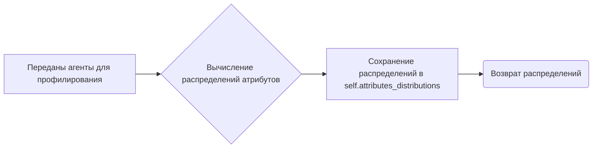
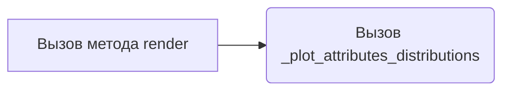
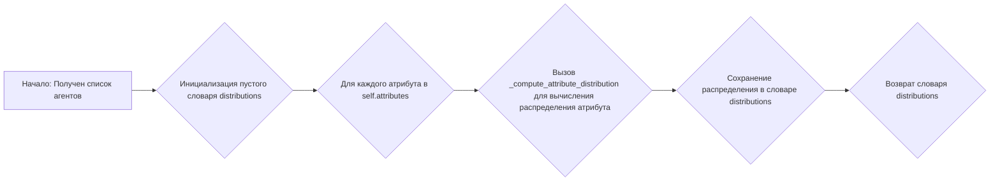
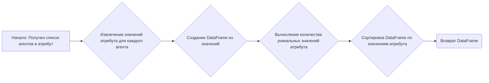
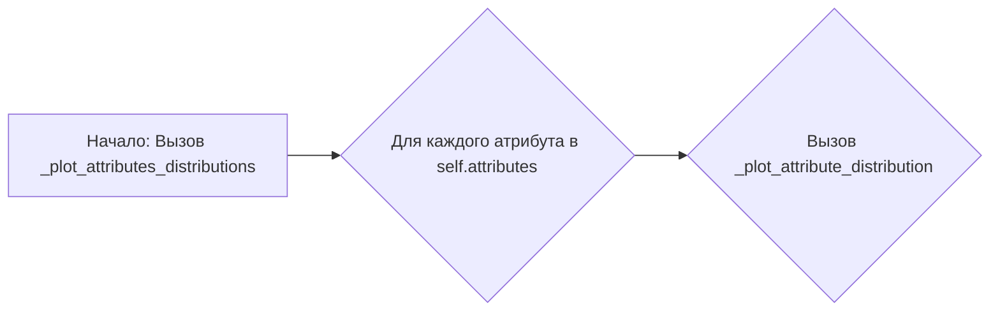
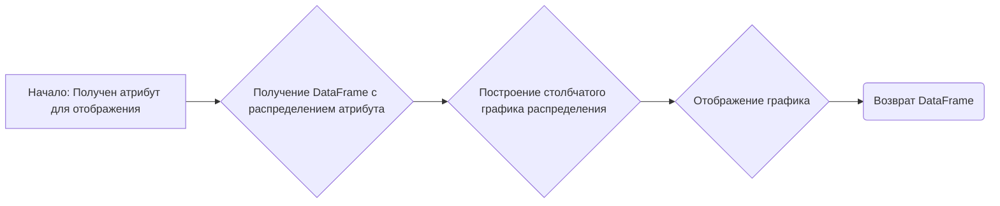

# Модуль profiling.py

## Обзор

Модуль `profiling.py` предназначен для анализа и понимания характеристик популяций агентов, таких как их возрастное распределение, типичные интересы и т.д. Он предоставляет механизмы для создания профилей агентов на основе заданных атрибутов и визуализации этих профилей с использованием графиков. Модуль содержит класс `Profiler`, который выполняет основные операции профилирования и визуализации.

## Подробнее

Этот модуль позволяет анализировать группы агентов (например, людей) на основе их атрибутов, таких как возраст, род занятий и национальность. Основная цель - понять распределение этих атрибутов среди популяции агентов и визуализировать их для лучшего понимания.

## Классы

### `Profiler`

**Описание**: Класс `Profiler` предоставляет методы для профилирования агентов на основе заданных атрибутов и визуализации этих профилей.

**Принцип работы**:
1.  При инициализации класса задается список атрибутов для профилирования.
2.  Метод `profile` вычисляет распределения атрибутов для заданных агентов.
3.  Метод `render` отображает профили агентов в виде графиков.

**Атрибуты**:

*   `attributes` (List\[str]): Список атрибутов для профилирования (по умолчанию `["age", "occupation", "nationality"]`).
*   `attributes_distributions` (dict): Словарь, содержащий распределения атрибутов в виде Pandas DataFrame (ключ - атрибут, значение - DataFrame).

**Методы**:

*   `__init__(self, attributes: List[str]=["age", "occupation", "nationality"]) -> None`: Инициализирует экземпляр класса `Profiler` со списком атрибутов для профилирования.
*   `profile(self, agents: List[dict]) -> dict`: Профилирует заданных агентов и возвращает словарь с распределениями атрибутов.
*   `render(self) -> None`: Отображает профили агентов.
*   `_compute_attributes_distributions(self, agents: list) -> dict`: Вычисляет распределения атрибутов для заданных агентов.
*   `_compute_attribute_distribution(self, agents: list, attribute: str) -> pd.DataFrame`: Вычисляет распределение заданного атрибута для агентов.
*   `_plot_attributes_distributions(self) -> None`: Отображает распределения атрибутов для агентов.
*   `_plot_attribute_distribution(self, attribute: str) -> pd.DataFrame`: Отображает распределение заданного атрибута для агентов.

### `__init__(self, attributes: List[str]=["age", "occupation", "nationality"]) -> None`

**Назначение**: Инициализирует класс `Profiler` и устанавливает атрибуты для профилирования.

**Параметры**:

*   `attributes` (List\[str], optional): Список атрибутов, которые будут использоваться для профилирования агентов. По умолчанию `["age", "occupation", "nationality"]`.

**Как работает функция**:

1.  Устанавливает атрибут `self.attributes` равным переданному списку атрибутов.
2.  Инициализирует пустой словарь `self.attributes_distributions` для хранения распределений атрибутов.

### `profile(self, agents: List[dict]) -> dict`

**Назначение**: Профилирует заданных агентов и возвращает словарь с распределениями атрибутов.

**Параметры**:

*   `agents` (List\[dict]): Список агентов для профилирования. Каждый агент представлен в виде словаря, содержащего значения атрибутов.

**Возвращает**:

*   `dict`: Словарь, содержащий распределения атрибутов для заданных агентов.

**Как работает функция**:

1.  Вызывает метод `_compute_attributes_distributions` для вычисления распределений атрибутов для заданных агентов.
2.  Сохраняет вычисленные распределения в атрибуте `self.attributes_distributions`.
3.  Возвращает словарь `self.attributes_distributions`.



**Примеры**:

```python
from tinytroupe.profiling import Profiler

agents = [
    {"age": 25, "occupation": "engineer", "nationality": "USA"},
    {"age": 30, "occupation": "doctor", "nationality": "Canada"},
    {"age": 25, "occupation": "engineer", "nationality": "USA"},
]

profiler = Profiler()
distributions = profiler.profile(agents)
print(distributions)
# {'age': 25    2\n30    1\nName: age, dtype: int64, 'occupation': engineer    2\ndoctor      1\nName: occupation, dtype: int64, 'nationality': USA       2\nCanada    1\nName: nationality, dtype: int64}
```

### `render(self) -> None`

**Назначение**: Отображает профили агентов, вызывая метод `_plot_attributes_distributions`.

**Как работает функция**:

1.  Вызывает метод `_plot_attributes_distributions`, который отображает графики распределения атрибутов.



**Примеры**:

```python
from tinytroupe.profiling import Profiler

agents = [
    {"age": 25, "occupation": "engineer", "nationality": "USA"},
    {"age": 30, "occupation": "doctor", "nationality": "Canada"},
    {"age": 25, "occupation": "engineer", "nationality": "USA"},
]

profiler = Profiler()
profiler.profile(agents)
profiler.render()
```

### `_compute_attributes_distributions(self, agents: list) -> dict`

**Назначение**: Вычисляет распределения атрибутов для заданных агентов.

**Параметры**:

*   `agents` (list): Список агентов для анализа.

**Возвращает**:

*   `dict`: Словарь, где ключи - атрибуты, а значения - DataFrame с распределением атрибута.

**Как работает функция**:

1.  Инициализирует пустой словарь `distributions`.
2.  Для каждого атрибута в `self.attributes` вызывает метод `_compute_attribute_distribution` для вычисления распределения атрибута.
3.  Сохраняет полученное распределение в словаре `distributions`.
4.  Возвращает словарь `distributions`.



**Примеры**:

```python
from tinytroupe.profiling import Profiler

agents = [
    {"age": 25, "occupation": "engineer", "nationality": "USA"},
    {"age": 30, "occupation": "doctor", "nationality": "Canada"},
    {"age": 25, "occupation": "engineer", "nationality": "USA"},
]

profiler = Profiler(attributes=["age", "occupation"])
distributions = profiler._compute_attributes_distributions(agents)
print(distributions)
# {'age': 25    2\n30    1\nName: age, dtype: int64, 'occupation': engineer    2\ndoctor      1\nName: occupation, dtype: int64}
```

### `_compute_attribute_distribution(self, agents: list, attribute: str) -> pd.DataFrame`

**Назначение**: Вычисляет распределение заданного атрибута для агентов и возвращает его в виде DataFrame.

**Параметры**:

*   `agents` (list): Список агентов для анализа.
*   `attribute` (str): Атрибут, для которого вычисляется распределение.

**Возвращает**:

*   `pd.DataFrame`: DataFrame, содержащий распределение атрибута.

**Как работает функция**:

1.  Извлекает значения заданного атрибута для каждого агента.
2.  Создает DataFrame из полученных значений.
3.  Вычисляет количество каждого уникального значения атрибута с помощью `value_counts()`.
4.  Сортирует DataFrame по значениям атрибута с помощью `sort_index()`.
5.  Возвращает полученный DataFrame.



**Примеры**:

```python
from tinytroupe.profiling import Profiler
import pandas as pd

agents = [
    {"age": 25, "occupation": "engineer", "nationality": "USA"},
    {"age": 30, "occupation": "doctor", "nationality": "Canada"},
    {"age": 25, "occupation": "engineer", "nationality": "USA"},
]

profiler = Profiler()
attribute = "age"
distribution = profiler._compute_attribute_distribution(agents, attribute)
print(distribution)
# 25    2
# 30    1
# Name: age, dtype: int64
```

### `_plot_attributes_distributions(self) -> None`

**Назначение**: Отображает графики распределения всех атрибутов, указанных в `self.attributes`.

**Как работает функция**:

1.  Для каждого атрибута в списке `self.attributes` вызывает метод `_plot_attribute_distribution`, который отображает график распределения для этого атрибута.



**Примеры**:

```python
from tinytroupe.profiling import Profiler

agents = [
    {"age": 25, "occupation": "engineer", "nationality": "USA"},
    {"age": 30, "occupation": "doctor", "nationality": "Canada"},
    {"age": 25, "occupation": "engineer", "nationality": "USA"},
]

profiler = Profiler(attributes=["age", "occupation"])
profiler.profile(agents)
profiler._plot_attributes_distributions()
```

### `_plot_attribute_distribution(self, attribute: str) -> pd.DataFrame`

**Назначение**: Отображает график распределения заданного атрибута.

**Параметры**:

*   `attribute` (str): Атрибут, для которого нужно отобразить распределение.

**Возвращает**:

*   `pd.DataFrame`: DataFrame, содержащий данные, использованные для построения графика.

**Как работает функция**:

1.  Получает DataFrame с распределением атрибута из `self.attributes_distributions`.
2.  Строит столбчатый график распределения с заголовком, показывающим название атрибута.
3.  Отображает график с помощью `plt.show()`.
4.  Возвращает DataFrame, использованный для построения графика.



**Примеры**:

```python
from tinytroupe.profiling import Profiler
import matplotlib.pyplot as plt

agents = [
    {"age": 25, "occupation": "engineer", "nationality": "USA"},
    {"age": 30, "occupation": "doctor", "nationality": "Canada"},
    {"age": 25, "occupation": "engineer", "nationality": "USA"},
]

profiler = Profiler()
profiler.profile(agents)
attribute = "age"
df = profiler._plot_attribute_distribution(attribute)
plt.close()  # Закрываем график после построения
print(df)
# 25    2
# 30    1
# Name: age, dtype: int64