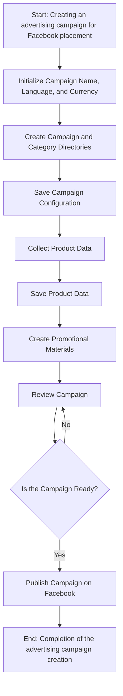
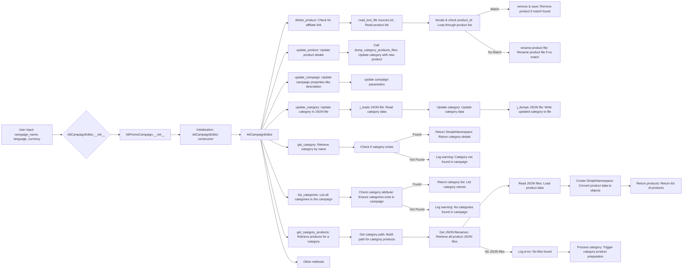

# Модуль `campaign`

## Обзор

Модуль `campaign` предназначен для управления процессом создания и публикации рекламных кампаний на Facebook. Он включает в себя функциональность для инициализации параметров кампании (имя, язык, валюта), создания структуры каталогов, сохранения конфигураций для новой кампании, сбора и сохранения данных о продуктах через `ali` или `html`, генерации рекламных материалов, проверки кампании и публикации ее на Facebook.

## Подробнее

Этот модуль автоматизирует шаги, необходимые для запуска рекламной кампании, от первоначальной настройки до окончательной публикации, обеспечивая структурированный подход к управлению рекламными активами и данными.

## Схема работы модуля



- **Шаг 1**: Начало - процесс начинается.

- **Шаг 2**: Инициализация деталей кампании - определяются имя кампании, язык и валюта. Пример: Имя кампании: "Летняя распродажа", Язык: "Русский", Валюта: "USD".

- **Шаг 3**: Создание каталогов кампании и категорий - создаются необходимые каталоги или файлы для кампании. Пример: Структура папок создается в файловой системе для хранения активов кампании.

- **Шаг 4**: Сохранение конфигурации кампании - сохраняются инициализированные детали кампании. Пример: Данные записываются в базу данных или файл конфигурации.

- **Шаг 5**: Сбор данных о продуктах - собираются данные, относящиеся к продуктам, которые будут продвигаться в рамках кампании. Пример: ID продуктов, описания, изображения и цены извлекаются из системы инвентаризации.

- **Шаг 6**: Сохранение данных о продуктах - сохраняются собранные данные о продуктах. Пример: Данные записываются в таблицу базы данных, предназначенную для продуктов кампании.

- **Шаг 7**: Создание рекламных материалов - генерируются или выбираются графика, баннеры и другие рекламные активы. Пример: Изображения и описания адаптируются для привлечения клиентов.

- **Шаг 8**: Проверка кампании - процесс проверки подтверждает, что компоненты кампании готовы. Пример: Человек или система оценивают качество и полноту всех компонентов кампании.

- **Шаг 9**: Готова ли кампания? - Проверка для определения, завершена ли кампания и готова ли к публикации. Пример: Логический флаг сигнализирует "Да", если все на месте, в противном случае "Нет", инициируя возврат к предыдущему шагу для внесения исправлений.

- **Шаг 10**: Публикация кампании - кампания публикуется на платформе и готова к маркетинговым усилиям. Пример: Выполняются вызовы API для публикации кампании на соответствующей платформе.

- **Шаг 11**: Конец - процесс создания кампании завершен.

## Схема редактирования кампании



## Схема подготовки кампании

```mermaid
flowchart TD
    A[Start] --> B{Process all campaigns?}
    B -->|Yes| C[Process all campaigns]
    B -->|No| D[Process specific campaign]
    
    C --> E{Language and Currency provided?}
    E -->|Yes| F[Process each campaign with provided language and currency]
    E -->|No| G[Process all locales for each campaign]
    
    D --> H{Categories specified?}
    H -->|Yes| I[Process specific categories for the campaign]
    H -->|No| J[Process entire campaign]
    
    F --> K[Process campaign category]
    G --> L[Process campaign for all locales]
    I --> K
    J --> L
    
    K --> M[Return]
    L --> M